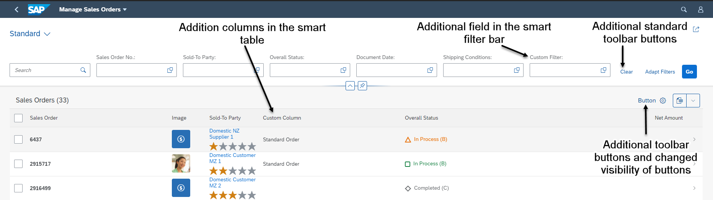
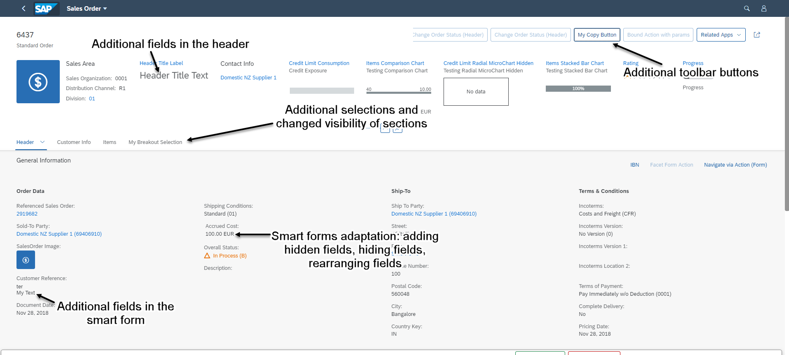

<!-- loio52fc48b479314d0688be24f699778c47 -->

# Extending Delivered Apps Using Adaptation Extensions

You can extend delivered apps based on SAP Fiori elements by using [SAP Fiori tools](https://help.sap.com/viewer/product/SAP_FIORI_tools/Latest/en-US), which is a set of extensions for SAP Business Application Studio and Visual Studio Code.


## Context

> ### Note:  
> This topic is currently only applicable to SAP Fiori elements for OData V2.

You can implement extension functions as part of a UI adaptation project by using the SAP Business Application Studio and Visual Studio Code. The adaptation project references the applications delivered by SAP as base or parent applications.

> ### Note:  
> This procedure is relevant only for list reports, object pages, overview pages, and analytical list pages.
> 
> The flexible column layout is not supported by the SAP Business Application Studio and Visual Studio Code.

You can try the adaptation extensions by creating an adaptation projecs using [Extending an SAP Fiori Application](https://help.sap.com/docs/bas/developing-sap-fiori-app-in-sap-business-application-studio/extending-sap-fiori-application).

You can use adaptation extensions for these extension points:

-   List report and analytical list page

    -   Add additional fields to the smart filter bar

    -   Add additional columns to tables

    -   Add additional table toolbar buttons and extension controller logic. For an example, see [Adaptation Extension Example: Adding a Button to the Table Toolbar in the List Report](adaptation-extension-example-adding-a-button-to-the-table-toolbar-in-the-list-report-a269671.md)

           
          
        **Adaptation Extension Options in the List Report**

          

    -   Override extension functions

        -   `onInitSmartFilterBar`

        -   `provideExtensionAppStateData`

        -   `restoreExtensionAppStateData`

        -   `ensureFieldsForSelect`

        -   `addFilters`


    These extension functions can be consumed as a part of `ControllerExtension`, by overriding the `templateBasedExtension` points.

    > ### Sample Code:  
    > Overriding `addFilters` extension function
    > 
    > ```
    > override: {	
    >                   // 	override public method of the ListReport controller 
    >                   templateBaseExtension: {	
    > 				          addFilters: function(fnAddFilter, sControlId){							
    >                               // custom logic
    >                 				}
    > 		}
    > 
    > ```

-   Object page

    -   Toolbar actions

    -   Additional sections

    -   Add additional fields to the header facet

    -   Add additional fields and field groups to forms

           
          
        **Adaptation Extension Options on the Object Page**

          

    -   Override extension functions

        -   `provideExtensionStateData`

        -   `restoreExtensionStateData`

        -   `ensureFieldsForSelect`

        -   `addFilters`


        These extension functions can be consumed as part of the `ControllerExtension`, by overriding the `templateBasedExtension` points.


    > ### Note:  
    > The extension points mentioned in the [API Reference](https://ui5.sap.com/#/api/sap.suite.ui.generic.template.ListReport.controllerFrameworkExtensions%23overview) cannot be consumed as a part of the adaptation project.

-   Overview page

    -   Add additional fields to the smart filter bar

    -   Add global actions to the filter bar

    -   Add additional extension controller logic

    -   Add cards

    -   Clone cards

    -   Edit cards

    -   Override extension functions

        -   `provideExtensionAppStateData`

        -   `restoreExtensionAppStateData`

        -   `addFilters`

        -   `provideStartupExtension`

        -   `provideExtensionNavigation`

        -   `provideCustomActionPress`

        -   `provideCustomParameter`


**Related Information**  


[Details of Extension Functions for Extending Delivered Apps Using Adaptation Extensions](details-of-extension-functions-used-for-extending-delivered-apps-82630e5.md "In this document, you can find the details of all the extension functions that can be used for extending delivered apps using adaptation extensions.")

