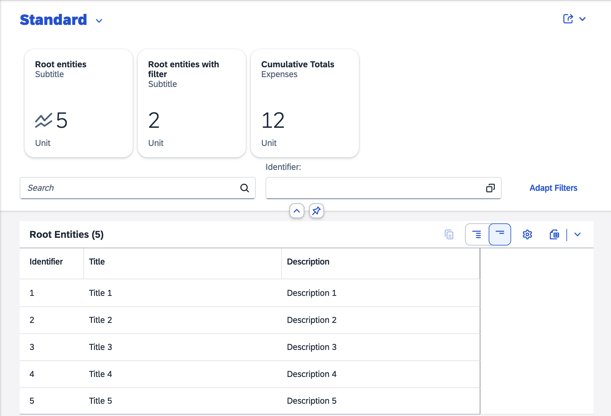
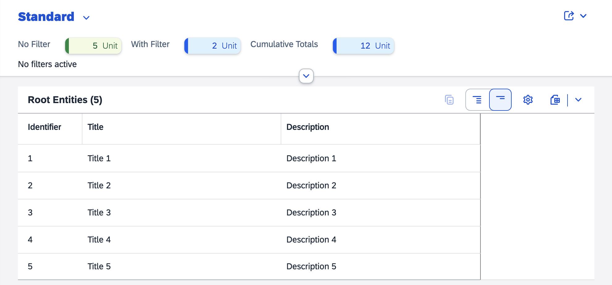

<!-- loio1ab83e62a8804f1eb270f7bc353f3669 -->

# Extension Point for List Report Header

You can use an extension point to add custom content to the header of the list report. Extensions are added above the filter bar.

You can specify separate fragments in the `manifest.json` file for the expanded header and the collapsed header as shown in the following sample code:

> ### Sample Code:  
> `manifest.json`
> 
> ```
> "targets": {
>     "sample": {
>         "type": "Component",
>         "id": "Default",
>         "name": "sap.fe.templates.ListReport",
>         "options": {
>             "settings": {
>                 "contextPath": "/RootEntity",
>                 "variantManagement": "Page",
>                 "initialLoad": true,
>                 "liveMode": true,
>                 "content": {
>                     "header": {
>                         "customHeader": {
>                             "expandedHeaderFragment": "sap.fe.core.fpmExplorer.customListReportHeaderContent.CustomExpandedHeader",
>                             "collapsedHeaderFragment": "sap.fe.core.fpmExplorer.customListReportHeaderContent.CustomCollapsedHeader"
>                         }
>                     }
>                 }
>             }
>         }
>     }
> }
> ```

  
  
**Custom Content in the List Report Header in Expanded Mode**



  
  
**Custom Content in the List Report Header in Collapsed Mode**



You can explore and work with the coding yourself. Check out our live example in the flexible programming model explorer at [Custom List Report Header](https://ui5.sap.com/test-resources/sap/fe/core/fpmExplorer/index.html#/customElements/customListReportHeaderContent).

