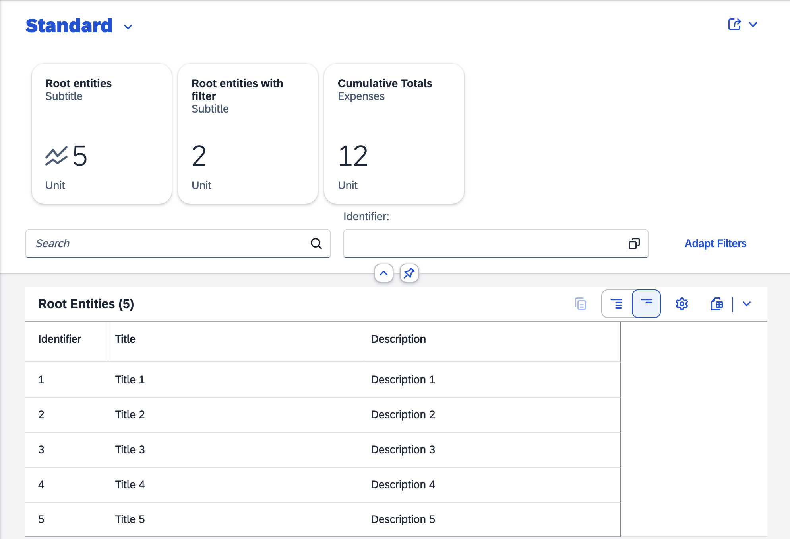
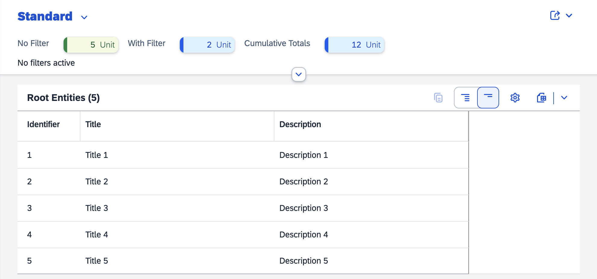

<!-- loioa2533dcfe4d64db1a49bc3739e9bf6e9 -->

# Extension Point for List Report Page Header

You can use an extension point to add custom content to the header of the list report page. Extensions are added above the filter bar.

> ### Note:  
> For information about SAP Fiori elements for OData V4, see [Extension Point for List Report Page Header](extension-point-for-list-report-page-header-1ab83e6.md).

You can specify separate fragments in the `manifest.json` file for the expanded header and the collapsed header as shown in the following sample code:

> ### Sample Code:  
> `manifest.json`
> 
> ```
> 
> "targets": {
>     "sample": {
>         "type": "Component",
>         "id": "Default",
>         "name": "sap.fe.templates.ListReport",
>         "options": {
>             "settings": {
>                 "contextPath": "/RootEntity",
>                 "variantManagement": "Page",
>                 "initialLoad": true,
>                 "liveMode": true,
>                 "content": {
>                     "header": {
>                         "customHeader": {
>                             "expandedHeaderFragment": "sap.fe.core.fpmExplorer.customListReportHeaderContent.CustomExpandedHeader",
>                             "collapsedHeaderFragment": "sap.fe.core.fpmExplorer.customListReportHeaderContent.CustomCollapsedHeader"
>                         }
>                     }
>                 }
>             }
>         }
>     }
> }
> ```

  
  
**Custom Content in the List Report Page Header in Expanded Mode**



  
  
**Custom Content in the List Report Page Header in Collapsed Mode**



