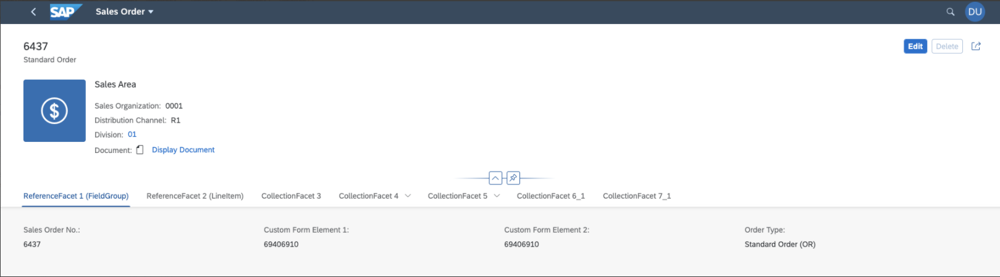

<!-- loio4e49753530ad4a73a44a5f8efac238d6 -->

# Extension Points for Forms on the Object Page

On the object page, you can use extension points to extend forms in sections.

> ### Caution:  
> Use app extensions with caution and only if you cannot produce the required behavior by other means, such as manifest settings or annotations. To correctly integrate your app extension coding with SAP Fiori elements, use only the `extensionAPI` of SAP Fiori elements. For more information, see [Using the extensionAPI](using-the-extensionapi-bd2994b.md).
> 
> After you've created an app extension, its display \(for example, control placement and layout\) and system behavior \(for example, model and binding usage, busy handling\) lies within the application's responsibility. SAP Fiori elements provides support only for the official `extensionAPI` functions. Don't access or manipulate controls, properties, models, or other internal objects created by the SAP Fiori elements framework.


<a name="loio4e49753530ad4a73a44a5f8efac238d6__section_mq3_y5v_p4b"/>

## Additional Features in SAP Fiori Elements for OData V2

Use the `"SmartFormExtension|<entity name>|<fieldgroup annotation>"` key in the manifest entry to add new fields to an existing field group. In the example below, an extension is added to the *General Information* field group.

> ### Sample Code:  
> ```
> 
> "sap.suite.ui.generic.template.ObjectPage.view.Details": {
>     "SmartFormExtension|STTA_C_MP_Product|com.sap.vocabularies.UI.v1.FieldGroup::GeneralInformation": {
>         "className": "sap.ui.core.Fragment",
>         "fragmentName": "STTA_MP.ext.fragments.SmartFormGroupElement",
>         "type": "XML"
>     }
> }
> ```

> ### Note:  
> `SmartForm Extension` supports only `sap.ui.core.Fragment` for the `className`.

For more information, see [Defining and Adapting Sections](defining-and-adapting-sections-facfea0.md).


<a name="loio4e49753530ad4a73a44a5f8efac238d6__section_zwf_cvv_p4b"/>

## Additional Features in SAP Fiori Elements for OData V4

Custom fields, that is, form elements, provide the following features:

-   adding arbitrary fields via an `xmlfragment` definition

-   positioning relative to other fields defined as `FieldGroups` or `Identification`

-   using localized field labels


### Using Custom Fields

The form containing additional custom fields can look like this:

  

1.  Define a fragment for the view extension

    You have to implement two extensions:

    1.  Implement the definition of the custom field

    2.  Implement the content of the custom field


    > ### Sample Code:  
    > CustomFormElement.fragment.xml
    > 
    > ```xml
    > <core:FragmentDefinition xmlns:core="sap.ui.core" xmlns="sap.m">
    >     <Text id="customFieldFormSoldToPartyInputField" text="{SoldToParty}" />
    > </core:FragmentDefinition>
    > ```

2.  Register your view extensions in the `manifest.json` file of your application as follows:

    > ### Sample Code:  
    > manifest.json
    > 
    > ```
    > "sap.ui5": {
    >     "routing": {
    >         "targets": {
    >             "SalesOrderManageObjectPage": {
    >                 "options": {
    >                     "settings": {
    >                         "controlConfiguration": {
    >                             "@com.sap.vocabularies.UI.v1.FieldGroup": {
    >                                 "fields": {
    >                                     "customFormElementAnchor": {
    >                                         "template": "ObjectPageStructure.custom.CustomField",
    >                                          "label": "{i18n>myFieldLabel1}",
    >                                          "position": {
    >                                              "placement": "After",
    >                                              "anchor": "DataField::SalesOrder"
    >                                          }
    >                                      },
    >                                      "customFormElementAnchor2": {
    >                                          "template": "ObjectPageStructure.custom.CustomField",
    >                                          "label": "{i18n>myFieldLabel2}",
    >                                          "position": {
    >                                              "placement": "After",
    >                                              "anchor": "customFormElementAnchor"
    >                                          }
    >                                      }
    >                                  }
    >                              }
    >                          }
    >                      }
    >                  }
    >              }
    >         }
    >     }
    >  }
    > ```


### Settings for Custom Fields in Forms

You can define your custom fields by implementing an `xmlfragment` and using the following properties:

**Properties of a Custom Field in a Form**


<table>
<tr>
<th valign="top">

Property Name


</th>
<th valign="top">

Supported Values


</th>
<th valign="top">

Description


</th>
</tr>
<tr>
<td valign="top">

key


</td>
<td valign="top">

aA-zZ, 0-9, :, \_, -


</td>
<td valign="top">

The key of the custom field is needed as an identifier, which can be used as reference for other fields.


</td>
</tr>
<tr>
<td valign="top">

label


</td>
<td valign="top">

any Unicode string


</td>
<td valign="top">

The label is shown on the form as the label of the field.


</td>
</tr>
<tr>
<td valign="top">

position


</td>
<td valign="top">

 


</td>
<td valign="top">

Defines the position of the field relative to other fields.


</td>
</tr>
<tr>
<td valign="top">

position.placement


</td>
<td valign="top">

"**After**" | "Before"


</td>
<td valign="top">

Defines the placement: either "After" or "Before" the anchor field.


</td>
</tr>
<tr>
<td valign="top">

position.anchor


</td>
<td valign="top">

"<key\_of\_column\>"


</td>
<td valign="top">

The key of another field to be used as the placement anchor.


</td>
</tr>
<tr>
<td valign="top">

template


</td>
<td valign="top">

 


</td>
<td valign="top">

Defining the target fragment follows the syntax of defining a fragment via `Fragment.load`.


</td>
</tr>
</table>

**bold** formatting: default/fallback behavior


### Using the UI Model

You can use the UI model within the fragment to react to changes of the `editMode`:

> ### Sample Code:  
> ```json
> "enabled="{= ${ui>/editMode} === 'Editable'}"
> ```


### Live Example: Custom Form Element with `Field` Building Block

You can explore and work with the coding yourself. Check out our live example in the flexible programming model explorer at [Custom Form Element](https://ui5.sap.com/test-resources/sap/fe/core/fpmExplorer/index.html#/customElements/customElementsOverview/customFormElementContent).

