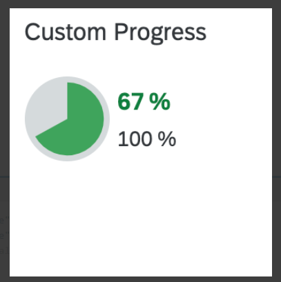
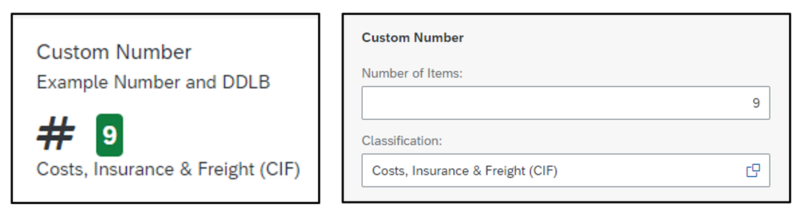
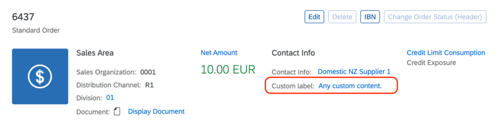

<!-- loio61cf0ee828824903907464c80dd0d88c -->

# Extension Points for Object Page Header Facets

You define application-specific header facets using annotations, but in some cases it might be necessary to integrate components in the front end that are not available with annotations.


<a name="loio61cf0ee828824903907464c80dd0d88c__section_xs5_kq5_rnb"/>

## Additional Features in SAP Fiori Elements for OData V2

> ### Caution:  
> Use app extensions with caution and only if you cannot produce the required behavior by other means, such as manifest settings or annotations. To correctly integrate your app extension coding with SAP Fiori elements, use only the `extensionAPI` of SAP Fiori elements. For more information, see [Using the extensionAPI](using-the-extensionapi-bd2994b.md).
> 
> After you've created an app extension, its display \(for example, control placement and layout\) and system behavior \(for example, model and binding usage, busy handling\) lies within the application's responsibility. SAP Fiori elements provides support only for the official `extensionAPI` functions. Don't access or manipulate controls, properties, models, or other internal objects created by the SAP Fiori elements framework.

On the object page, you can use extension points to add additional header facets in the following places:

-   Before header facet: The extension is inserted before a given facet.

-   Replace header facet: The extension is rendered instead of an existing facet.

-   After header facet: The extension is inserted after a given facet.


You must use a view inside the extension to create a header facet extension. Enter the extension information in the following format in the `manifest.json` of your application:

`<Different_Scenario>|<EntitySet_Name>|headerEditable::<Annotation_Information>`

Specify the extension facet in the form of its annotation path. In addition, you must specify the entity set name, as the same annotation may exist for various entity sets. You also need to define the className, viewName, type and the optional parameter `bVisibleOnEdit`.

> ### Note:  
> You only set this optional parameter to "false" if the entire header extension is to be hidden when the object page is edited.

> ### Sample Code:  
> ```
> "extends": {
>    "extensions": {
>          "sap.ui.viewExtensions": {
>                  "sap.suite.ui.generic.template.ObjectPage.view.Details": {
>                            "BeforeHeaderFacet|STTA_C_MP_Product|headerEditable::com.sap.vocabularies.UI.v1.Chart::SpecificationWidthBulletChart": {
>                                      "className": "sap.ui.core.mvc.View",
>                                      "viewName": "STTA_MP.ext.fragments.HeaderExtensionFacet",
>                                      "type": "XML",
>                                      "bVisibleOnEdit": true
>    }
>                         }
>            }
>      }
> }
> 
> ```

The following extension options are available:

-   Standard object header facet: Before replace, and after scenario:

    -   `"BeforeHeaderFacet|<EntitySet Name>|headerEditable::<Annotation information "`

    -   `"ReplaceHeaderFacet|<EntitySet Name>|headerEditable::<Annotation information>"`

    -   `"AfterHeaderFacet|<EntitySet Name>|headerEditable::<Annotation information>"`


-   Simple object header facet: Before replace, and after scenario:

    `"BeforeSimpleHeaderFacet|<EntitySet Name>|headerEditable::<Annotation information>"` 

    `"ReplaceSimpleHeaderFacet|<EntitySet Name>|headerEditable::<Annotation information>"`

    `"AfterSimpleHeaderFacet|<EntitySet Name>|headerEditable::<Annotation information>"`

-   Replace the complete object page header with an extension. This means that the `UI.HeaderFacet` annotation is not there. If it is there, remove it from the annotations. The manifest entry should look like this:

    `"ReplaceHeaderExtensionFacet|<EntitySet Name>"`

-   Standard object header: If there is no image in the object page header, you can include an extension instead of an image. The manifest entry should look like this:

    `"NoImageExtensionFacet|<EntitySet Name>"`

    > ### Note:  
    > You can only use this scenario if there is no value for the `ImageUrl` or `TypeImageUrl` property of the `UI.HeaderInfo` annotation.

    If there is an image in the object page header, you can enter an extension after the image. The manifest entry should look like this:

    `" AfterImageExtensionFacet|<EntitySet Name>"`

-   Object page header containing only a `DataPoint` annotation: Before replace, and after scenario:

    -   `"BeforeHeaderDataPoint|<EntitySet Name> | <Annotation Information>"`

    -   `"ReplaceHeaderDataPoint|<EntitySet Name> | <Annotation Information>"`

    -   `"AfterHeaderDataPoint|<EntitySet Name> | <Annotation Information>"`


<a name="loio61cf0ee828824903907464c80dd0d88c__section_svv_3r5_rnb"/>

## Additional Features in SAP Fiori Elements for OData V4


### Adding Custom Header Facets

You have 2 options for including custom elements into the header area of an object page:

-   You can include complete header facets next to the existing annotation-based header facets. This option provides flexibility when creating your own XML fragment and the corresponding controller implementation.

-   You can extend an already existing header facet that displays a group of fields with your own custom field.


You can find further details in the sections below.

> ### Note:  
> You can only place 'Custom Header Facets' in the root collection of the header facet definition. You cannot place it in further-nested collection facet definitions.

**Using Custom Header Facets**

Custom header facets provide the following features:

-   adding free-style headers via an `xmlfragment` definition

-   positioning relative to existing header elements defined by header facets or other custom headers

-   using a localized header facet title and subtitle


  

To define a header facet on UI level – you do this if you want to add a custom look and feel, or to use controls that are not supported by default – you can extend the manifest of the corresponding object page with a content-based configuration or an annotation-based configuration. You define header facets by using a custom key that you later reference by providing the following properties:

-   a title and subtitle \(both optional\)

-   the UI5 fragment \(template\)

-   a second UI fragment for the editable header facet \(optional\) and

-   its relative position to an anchor facet


> ### Note:  
> Priority Rules
> 
> Settings in the content-based configuration block have a higher priority and therefore overwrite settings in the annotation-based configuration block for identical keys.

> ### Sample Code:  
> Content-Based Configuration
> 
> ```
> {
>     "sap.ui5": {
>         "routing": {
>             "targets": {
>                 "SalesOrderManageObjectPage": {
>                     "options": {
>                         "settings": {
>                             "content": {
>                                 "header": {
>                                     "facets": {
>                                         "CustomHeaderFacet1": {
>                                             "template": "SalesOrder.custom.CustomHeaderFacetColumnChart",
>                                             "stashed": false,
>                                             "visible": "{= %{OverallSDProcessStatus} === 'C'}",
>                                             "position": {
>                                                 "placement": "After",
>                                                 "anchor": "NetValueDataHeader"
>                                             },
>                                             "flexSettings": {
>                                                 "designtime": "not-adaptable-visibility"
>                                             }
>                                         },
>                                         "CustomHeaderFacet2": {
>                                             "template": "SalesOrder.custom.CustomHeaderFacetDataPoint",
>                                             "templateEdit": "SalesOrder.custom.CustomHeaderFacetDataPointEdit",
>                                             "title": "{i18n>customHeaderFacet2-CustomDataPoint}",
>                                             "subTitle": "{i18n>customHeaderFacet2-CarRental}",
>                                             "requestGroupId": "LongRunners",
>                                             "stashed": false,
>                                             "position": {
>                                                 "placement": "After",
>                                                 "anchor": "CustomHeaderFacet1"
>                                             }
>                                         }
>                                     }
>                                 }
>                             },
>                             "controlConfiguration": {
>                                 "@com.sap.vocabularies.UI.v1.HeaderFacets": {
>                                    ... see below ...
>                             }
>                         }
>                     }
>                 }
>             }
>         }
>     }
> }
> ```

> ### Sample Code:  
> Annotation-Based Configuration
> 
> ```
> {
>     "sap.ui5": {
>         "routing": {
>             "targets": {
>                 "SalesOrderManageObjectPage": {
>                     "options": {
>                         "settings": {
>                             "content": {
>                                 "header": {
>                                    ... see above ...
>                                 }
>                             },
>                             "controlConfiguration": {
>                                 "@com.sap.vocabularies.UI.v1.HeaderFacets": {
>                                     "facets": {
>                                         "CustomHeaderFacet2": {
>                                             "template": "SalesOrder.custom.CustomHeaderFacetOverwritten",
>                                             "title": "Custom Error",
>                                             "subTitle": "Should never appear!",
>                                             "stashed": false,
>                                             "position": {
>                                                 "placement": "After",
>                                                 "anchor": "CustomHeaderFacet1"
>                                             }
>                                         },
>                                         "CustomHeaderFacet3": {
>                                             "template": "SalesOrder.custom.CustomHeaderFacetHarveyBall",
>                                             "templateEdit": "SalesOrder.custom.CustomHeaderFacetHarveyBallEdit",
>                                             "title": "{i18n>customHeaderFacet2-CustomProgress}",
>                                             "stashed": false,
>                                             "position": {
>                                                 "placement": "After",
>                                                 "anchor": "CustomHeaderFacet2"
>                                             }
>                                         }
>                                     }
>                                 }
>                             }
>                         }
>                     }
>                 }
>             }
>         }
>     }
> }
> ```

In this example, the second header facet with the key `CustomHeaderFacet2` occurs twice: once in the content-based configuration and a second time in the annotation-based configuration. Since the 1st configuration has a higher priority, the second entry will be skipped at runtime and you won't see the fragment `SalesOrder.custom.CustomHeaderFacetOverwritten` as a header facet.

**Settings for Custom Header Facets**

You can define your custom header facet by implementing an `xmlfragment` and using the following properties:

**Properties of a Custom Header Facet**


<table>
<tr>
<th valign="top">

Property Name


</th>
<th valign="top">

Supported Values


</th>
<th valign="top">

Description


</th>
</tr>
<tr>
<td valign="top">

template


</td>
<td valign="top">

Module Path of "XMLFragment"


</td>
<td valign="top">

Defining the target fragment follows the syntax of defining a fragment via `Fragment.load`.


</td>
</tr>
<tr>
<td valign="top">

templateEdit\*


</td>
<td valign="top">

Module Path of the editable "XMLFragment"


</td>
<td valign="top">

The fragment for the editable version of the header facet.


</td>
</tr>
<tr>
<td valign="top">

title\*


</td>
<td valign="top">

Text | Binding Expression


</td>
<td valign="top">

Title of the header facet \(usually a binding path to an i18n text\). If you do not specify it here, you should add the title in the `xmlfragment`.


</td>
</tr>
<tr>
<td valign="top">

subTitle\*


</td>
<td valign="top">

Text | Binding Expression


</td>
<td valign="top">

Subtitle of the header facet \(usually a binding path to an i18n text\).


</td>
</tr>
<tr>
<td valign="top">

stashed\*


</td>
<td valign="top">

Boolean


</td>
<td valign="top">

Defines if the header facet is stashed in personalization. The default setting is `false`.


</td>
</tr>
<tr>
<td valign="top">

visible\*


</td>
<td valign="top">

Boolean | Binding Expression


</td>
<td valign="top">

Defines if the header facet is displayed in the header area. The default setting is `true`.


</td>
</tr>
<tr>
<td valign="top">

position


</td>
<td valign="top">

 


</td>
<td valign="top">

The properties in this group define the position of the header facet relative to another facet.


</td>
</tr>
<tr>
<td valign="top">

position.placement\*


</td>
<td valign="top">

"Before" | "After"


</td>
<td valign="top">

Defines the placement: either "Before" or "After" \(default\) the referenced facet \(anchor\).


</td>
</tr>
<tr>
<td valign="top">

position.anchor


</td>
<td valign="top">

Facet Key


</td>
<td valign="top">

The key of another header facet to be used as the placement anchor. Header facets defined via the `Facet` annotation can be referenced by its `FacetKey`.


</td>
</tr>
<tr>
<td valign="top">

requestGroupId


</td>
<td valign="top">

"Heroes"

| "Decoration"

| "Workers"

| "LongRunners"


</td>
<td valign="top">

Enables the grouping of back-end requests retrieving the header facet data in different $batch groups according to their loading time. You should separate long runners from fast runners to optimize the overall user experience. For more information, refer to [Defining the Loading Behavior of Object Page Headers](defining-the-loading-behavior-of-object-page-headers-ac03570.md).


</td>
</tr>
<tr>
<td valign="top">

flexSettings


</td>
<td valign="top">

 


</td>
<td valign="top">

Defines the key user adaptation behavior of the header facet.


</td>
</tr>
<tr>
<td valign="top">

flexSettings.designtime


</td>
<td valign="top">

"Default"

| "not-adaptable-visibility"

| "not-adaptable"

| " not-adaptable-tree"

| "not-adaptable-visibility"

| "not-removable"


</td>
<td valign="top">

Defines which settings are available for key user adaptation at design time. For example, the value "not-adaptable-visibility" means that all actions that influence the visibility are disabled. Remove and make visible are not possible, but moving the header facet is enabled.


</td>
</tr>
</table>

\* = optional

– Using a Custom Header Facet to Display a Harvey Ball Micro Chart –

  

The values are retrieved via value binding and the title is defined in the `manifest.json`.

> ### Sample Code:  
> Custom Header Using a Harvey Ball Micro Chart
> 
> ```
> <core:FragmentDefinition xmlns="sap.m" xmlns:core="sap.ui.core" xmlns:mc="sap.suite.ui.microchart">
>     <VBox id="CustomHeaderFacetHarveyBall" displayInline="true">
>         <mc:HarveyBallMicroChart size="S" total="100" totalScale="%" press="press">
>             <mc:items>
>                 <mc:HarveyBallMicroChartItem
>                     fraction="{= ((100 > 0) ? ((${Progress} > 100) ? 100 : ((${Progress} &lt; 0) ? 0 : (${Progress} / 100 * 100))) : 0) }"
>                     color="Good"
>                     fractionScale="%"
>                 />
>             </mc:items>
>         </mc:HarveyBallMicroChart>
>     </VBox>
> </core:FragmentDefinition>
> ```

– Using a Custom Editable Header Facet to Edit the Values Used in a Custom Header Facet –

  

In edit mode, header facets are displayed in a form. For the editable custom header facet, you need to structure the content by using `sap.ui.layout.FormElement`. The `FormElements` will then be displayed inside a `FormContainer` with the title defined in the manifest.

> ### Sample Code:  
> Editable version of a header facet using `FormElement` and `macro:Field`
> 
> ```
> <core:FragmentDefinition xmlns="sap.m" xmlns:core="sap.ui.core" xmlns:f="sap.ui.layout.form" xmlns:macro="sap.fe.macros">
>         <f:FormElement label="Number of Items">
>             <f:fields>
>                 <macro:Field id="NumberItems" metaPath="fieldControlType_item" />
>             </f:fields>
>         </f:FormElement>
>         <f:FormElement label="Classification">
>             <f:fields>
>                 <macro:Field id="IncotermsClassification" metaPath="IncotermsClassification" />
>             </f:fields>
>         </f:FormElement>
> </core:FragmentDefinition>
> ```


### Adding Custom Header Fields

Custom header fields provide the following features:

-   adding free-style headers via an `xmlfragment` definition

-   positioning relative to existing fields on a field group or other custom fields

-   using a localized header facet title


> ### Note:  
> Custom fields are currently supported only as read-only. To have editable fields for the information provided through custom fields, you need to extend the "Edit Header Section".
> 
> For more information, refer to [Adapting the UI: List Report and Object Page](adapting-the-ui-list-report-and-object-page-0d2f1a9.md).

  

**Using Custom Header Fields**

To define a field in a header field – you do this if you want to add a custom look and feel, or to use controls that are not supported by default – you can extend the manifest of the corresponding object page with an annotation-based configuration. You define custom header fields by using a custom key that you later reference by providing the following properties:

-   a label \(optional\)

-   the UI5 fragment \(template\) and

-   its relative position to an anchor facet


> ### Sample Code:  
> Annotation-Based Configuration
> 
> ```
> {
>    "sap.ui5": {
>       "routing": {
>          "targets": {
>             "LineItemsObjectPage": {
>                "options": {
>                   "settings": {
>                      "controlConfiguration": {
>                         "@com.sap.vocabularies.UI.v1.FieldGroup#ObjectPageHeaderData": {
>                            "fields": {
>                               "CustomField1": {
>                                  "label": "{i18n>ObjectPageHeaderFacetFieldLabel1}",
>                                  "template": "ManageItems.custom.CustomHeaderFacetFieldGroupForm",
>                                  "position": {
>                                     "placement": "Before",
>                                     "anchor": "DataField::headerDate"
>                                  }
>                               }
>                            }
>                         }
>                      }
>                   }
>                }
>             }
>          }
>       }
>    }
> }
> ```

You reference the `fieldGroup` through the annotation path with the corresponding qualifier: "`@com.sap.vocabularies.UI.v1.FieldGroup#ObjectPageHeaderData`". The qualifier can be found in the annotation as shown below:

> ### Sample Code:  
> Metadata Annotation
> 
> ```
> <Schema>
>     <Annotations Target="<PageName>">
>         <Annotation Term="UI.FieldGroup" Qualifier="ObjectPageHeaderData">
>             ... records
>         </Annotation>
>     </Annotations>
> </Schema>
> ```

**Settings for Custom Header Fields**

You can define your custom header fields by implementing an `xmlfragment` and using the following properties:

**Properties of Custom Header Fields**


<table>
<tr>
<th valign="top">

Property Name


</th>
<th valign="top">

Supported Values


</th>
<th valign="top">

Description


</th>
</tr>
<tr>
<td valign="top">

key


</td>
<td valign="top">

Module Path of "XMLFragment"


</td>
<td valign="top">

Defining the target fragment follows the syntax of defining a fragment via `Fragment.load`.


</td>
</tr>
<tr>
<td valign="top">

label\*


</td>
<td valign="top">

Text | Binding Expression


</td>
<td valign="top">

Label of the field \(usually a binding path to an i18n text\). If you do not specify it here, you should add a label in the `xmlfragment`.


</td>
</tr>
<tr>
<td valign="top">

template


</td>
<td valign="top">

Module Path of "XMLFragment"


</td>
<td valign="top">

Defining the target fragment follows the syntax of defining a fragment via `Fragment.load`.


</td>
</tr>
<tr>
<td valign="top">

position


</td>
<td valign="top">

 


</td>
<td valign="top">

The properties in this group define the position of the header facet relative to another facet.


</td>
</tr>
<tr>
<td valign="top">

position.placement\*


</td>
<td valign="top">

"Before" | "After"


</td>
<td valign="top">

Defines the placement: either "Before" or "After" \(default\) the referenced facet \(anchor\).


</td>
</tr>
<tr>
<td valign="top">

position.anchor


</td>
<td valign="top">

Facet Key


</td>
<td valign="top">

The key of another header field to be used as the placement anchor. Header fields defined via the field group, including a property annotation, can be referenced by the corresponding property name.


</td>
</tr>
</table>

\* = optional

**Finding the Right Key for the Anchor**

For the correct positioning of your custom elements, you need to identify an anchor element. For more information, see [Finding the Right Key for the Anchor](finding-the-right-key-for-the-anchor-6ffb084.md).


### Live Example: Custom Header Facet with `MicroChart` and `FormElement` Building Blocks

You can explore and work with the coding yourself. Check out our live example in the flexible programming model explorer at [Custom Header Facet](https://ui5.sap.com/test-resources/sap/fe/core/fpmExplorer/index.html#/customElements/customElementsOverview/customHeaderFacetContent).

