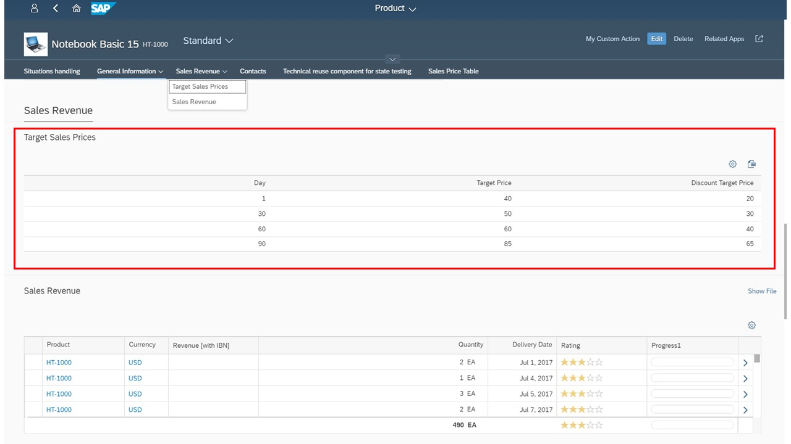

<!-- loioa4a3b319e3c5489e9c9dea50911cbb7f -->

# Extension Points for Subsections on the Object Page

On the object page, you can use extension points to add additional subsections.

> ### Caution:  
> Use app extensions with caution and only if you cannot produce the required behavior by other means, such as manifest settings or annotations. To correctly integrate your app extension coding with SAP Fiori elements, use only the `extensionAPI` of SAP Fiori elements. For more information, see [Using the extensionAPI](using-the-extensionapi-a5a4ec6.md).
> 
> After you've created an app extension, its display \(for example, control placement and layout\) and system behavior \(for example, model and binding usage, busy handling\) lies within the application's responsibility. SAP Fiori elements provides support only for the official `extensionAPI` functions. Don't access or manipulate controls, properties, models, or other internal objects created by the SAP Fiori elements framework.

> ### Tip:  
> Use the term `facet` to add a subsection to the object page in the `manifest.json` file.

You can add additional subsections in existing facets:

-   `BeforeSubSection`: The extension is inserted before a given subsection in a facet

-   `AfterSubSection`: The extension is inserted after a given subsection in a facet

-   `ReplaceSubSection`: The extension replaces an existing subsection in a facet.


You must specify the subsection in the form of its annotation path. You also have to specify the entitySet name, as the same annotation path may exist for various entity sets. You add this information to the `manifest.json` file, as shown in the following sample code: For more information, see [Extension Points for Sections on the Object Page](extension-points-for-sections-on-the-object-page-1bfddc3.md).

> ### Sample Code:  
> ```
> 
> "sap.ui.viewExtensions": {
>    "sap.suite.ui.generic.template.ObjectPage.view.Details": {
>       "BeforeSubSection|STTA_C_MP_Product|to_ProductSalesData::com.sap.vocabularies.UI.v1.Chart":{
>          "className": "sap.ui.core.mvc.View",
>          "viewName": "STTA_MP.ext.view.ProductSalesPrice",
>          "type": "XML",
>          "sap.ui.generic.app": {
>             "title": "Target Sales Prices",
>             "enableLazyLoading": true
>          }
>       },
>       "AfterSubSection|STTA_C_MP_Product|to_ProductSalesData::com.sap.vocabularies.UI.v1.LineItem":{
>          "className": "sap.ui.core.mvc.View",
>          "viewName": "STTA_MP.ext.view.ProductSalesPrice",
>          "type": "XML",
>          "sap.ui.generic.app": {
>             "title": "Target Sales Prices",
>             "enableLazyLoading": true
>          }
>      "ReplaceSubSection|STTA_C_MP_Product|to_ProductTextType::com.sap.vocabularies.UI.v1.LineItem":{
>          "className": "sap.ui.core.mvc.View",
>          "viewName": "STTA_MP.ext.view.ProductSalesPrice",
>          "type": "XML",
>          "sap.ui.generic.app": {
>             "title": "Target Sales Prices",
>             "enableLazyLoading": true
>          }
>       },
>     .....
> 
> ```

The result looks as shown in the following screenshot. The highlighted subsection has been added using the extension point.



For more information about extension points for sections, see [Extension Points for Sections on the Object Page](extension-points-for-sections-on-the-object-page-1bfddc3.md).

For more information about lazy loading for custom sections, see [Enabling Lazy Loading for Custom Sections](enabling-lazy-loading-for-custom-sections-de25ca7.md).

> ### Note:  
> You can specify either a view or a fragment contained in the additional subsection. Either way, you do not need to use the object page \(uxap\) tags `ObjectPageSection`, `subSections`, or `ObjectPageSubSection`. These definitions are already part of the template for the object page view. Additional sections are rendered if an extension exists.

