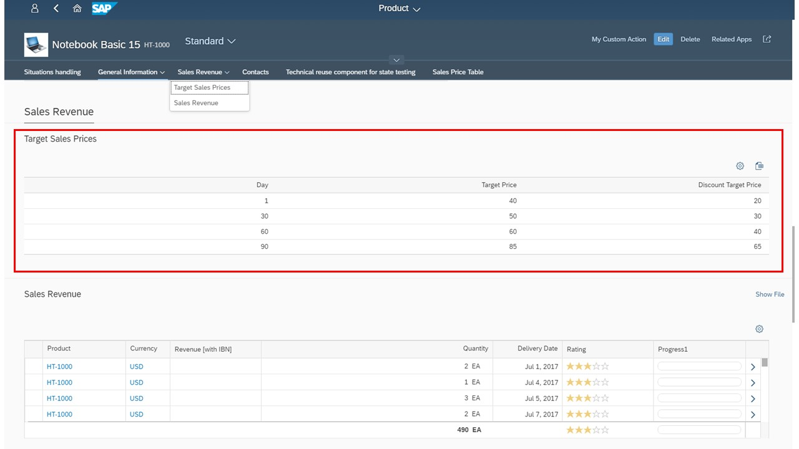

<!-- loioce8d468269814077bc4b132572979b66 -->

# Extension Points for Subsections on the Object Page

On the object page, you can use extension points to add additional subsections.

> ### Caution:  
> Use app extensions with caution and only if you cannot produce the required behavior by other means, such as manifest settings or annotations. To correctly integrate your app extension coding with SAP Fiori elements, use only the `extensionAPI` of SAP Fiori elements. For more information, see [Using the extensionAPI](using-the-extensionapi-bd2994b.md).
> 
> After you've created an app extension, its display \(for example, control placement and layout\) and system behavior \(for example, model and binding usage, busy handling\) lies within the application's responsibility. SAP Fiori elements provides support only for the official `extensionAPI` functions. Don't access or manipulate controls, properties, models, or other internal objects created by the SAP Fiori elements framework.

> ### Tip:  
> In SAP Fiori elements for OData V2, you use the term `facet` to add a subsection to the object page in the `manifest.json`.
> 
> In SAP Fiori elements for OData V4, you use the term `section` to add a subsection to the object page in the `manifest.json`.


<a name="loioce8d468269814077bc4b132572979b66__section_bnv_vvn_d4b"/>

## Additional Features in SAP Fiori Elements for OData V2

You can add additional subsections in existing facets:

-   `BeforeSubSection`: The extension is inserted before a given subsection in a facet

-   `AfterSubSection`: The extension is inserted after a given subsection in a facet

-   `ReplaceSubSection`: The extension replaces an existing subsection in a facet.


You must specify the subsection in the form of its annotation path. You also have to specify the entitySet name, as the same annotation path may exist for various entity sets. You add this information to the `manifest.json` file, as in the example. For more information, see [Extension Points for Sections on the Object Page](extension-points-for-sections-on-the-object-page-92ad996.md).

> ### Sample Code:  
> ```
> 
> "sap.ui.viewExtensions": {
>    "sap.suite.ui.generic.template.ObjectPage.view.Details": {
>       "BeforeSubSection|STTA_C_MP_Product|to_ProductSalesData::com.sap.vocabularies.UI.v1.Chart":{
>          "className": "sap.ui.core.mvc.View",
>          "viewName": "STTA_MP.ext.view.ProductSalesPrice",
>          "type": "XML",
>          "sap.ui.generic.app": {
>             "title": "Target Sales Prices",
>             "enableLazyLoading": true
>          }
>       },
>       "AfterSubSection|STTA_C_MP_Product|to_ProductSalesData::com.sap.vocabularies.UI.v1.LineItem":{
>          "className": "sap.ui.core.mvc.View",
>          "viewName": "STTA_MP.ext.view.ProductSalesPrice",
>          "type": "XML",
>          "sap.ui.generic.app": {
>             "title": "Target Sales Prices",
>             "enableLazyLoading": true
>          }
>      "ReplaceSubSection|STTA_C_MP_Product|to_ProductTextType::com.sap.vocabularies.UI.v1.LineItem":{
>          "className": "sap.ui.core.mvc.View",
>          "viewName": "STTA_MP.ext.view.ProductSalesPrice",
>          "type": "XML",
>          "sap.ui.generic.app": {
>             "title": "Target Sales Prices",
>             "enableLazyLoading": true
>          }
>       },
>     .....
> 
> ```

The result looks as shown below. The highlighted subsection has been added using the extension point.

  

> ### Note:  
> You can specify either a view or a fragment contained in the additional subsection. Either way, you do not need to use the object page \(uxap\) tags `ObjectPageSection`, `subSections`, or `ObjectPageSubSection`. These definitions are already part of the template for the object page view. Additional sections are rendered if an extension exists.


<a name="loioce8d468269814077bc4b132572979b66__section_lwj_nwn_d4b"/>

## Additional Features in SAP Fiori Elements for OData V4


### Using Custom Subsections

Custom subsections provide the following features:

-   adding arbitrary subsections via an `xmlfragment` definition

-   positioning relative to subsections defined by facets or other custom facets

-   using a localized subsection title


To define a subsection on UI level - you do this if you want to add a custom look and feel, or to use controls that are not supported by default - you can extend the settings of the corresponding object page in the `manifest.json` with a **content** block. You can enrich the body of the object page with additional subsections. To do so, you define header facets by using a custom key that you later reference by providing the following properties:

-   a title

-   the name \(which must point to the corresponding fragment and the outer section, which can be just the name of an existing section or a custom section\) and

-   the corresponding fragment


For more information, see [Extension Points for Sections on the Object Page](extension-points-for-sections-on-the-object-page-92ad996.md).

> ### Sample Code:  
> ```json
> {
> 	"sap.ui5": {
> 		"routing": {
> 			"targets": {
> 				"SalesOrderManageObjectPage": {
> 					"options": {
> 						"settings": {
> 							"content": {
> 								"body": {
> 									"sections": {
> 										"myObjectPageSection": {
> 											"subSections": {
> 												"customSubSection": {
> 													"type": "XMLFragment",
> 													"name": "SalesOrder.custom.CustomSubSection",
> 													"title": "{i18n>customSubSection}",
> 													"position": {
> 														"placement": "After",
> 														"anchor": "someSubSection"
> 													}
> 												}
> 											}
> 										}
> 									}
> 								}
> 							}
> 						}
> 					}
> 				}
> 			}
> 		}
> 	}
> }
> ```

The result looks as shown below. The highlighted subsection has been added using the extension point.

  

> ### Note:  
> You can specify either a view or a fragment contained in the additional subsection. Either way, you do not need to use the object page \(uxap\) tags `ObjectPageSection`, `subSections`, or `ObjectPageSubSection`. These definitions are already part of the template for the object page view. Additional sections are rendered if an extension exists.


### Live Example: Custom Subsection with `Table` Building Block

You can explore and work with the coding yourself. Check out our live example in the flexible programming model explorer at [Custom Subsection](https://ui5.sap.com/test-resources/sap/fe/core/fpmExplorer/index.html#/customElements/customElementsOverview/customSubSectionContent).

> ### Note:  
> Ensure that you have a defined `LineItem` service available \(`service.cds` in the linked example\).

