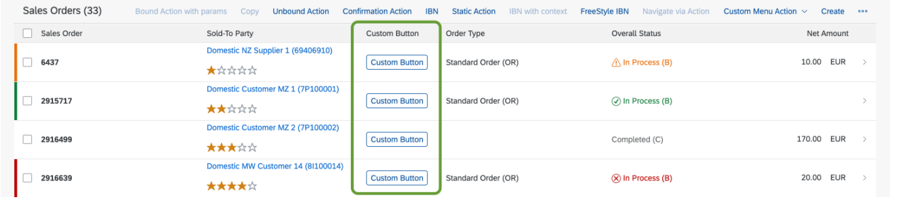
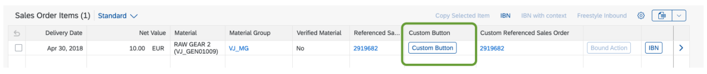
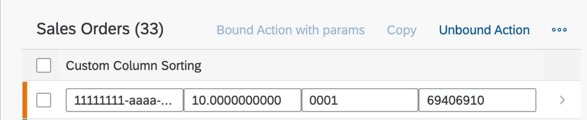
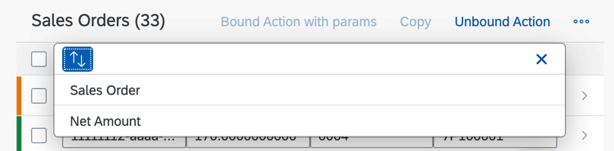
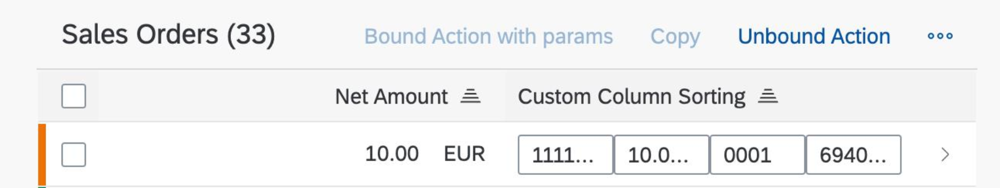
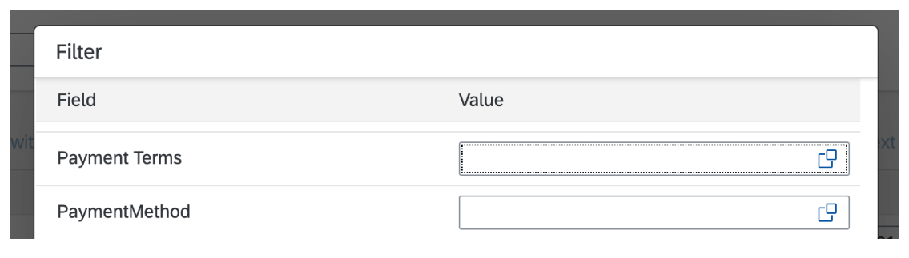

<!-- loiod525522c1bf54672ae4e02d66b38e60c -->

# Extension Points for Tables

You can use extension points to enhance tables in SAP Fiori elements apps.

> ### Caution:  
> Use app extensions with caution and only if you cannot produce the required behavior by other means, such as manifest settings or annotations. To correctly integrate your app extension coding with SAP Fiori elements, use only the `extensionAPI` of SAP Fiori elements. For more information, see [Using the extensionAPI](using-the-extensionapi-bd2994b.md).
> 
> After you've created an app extension, its display \(for example, control placement and layout\) and system behavior \(for example, model and binding usage, busy handling\) lies within the application's responsibility. SAP Fiori elements provides support only for the official `extensionAPI` functions. Don't access or manipulate controls, properties, models, or other internal objects created by the SAP Fiori elements framework.


<a name="loiod525522c1bf54672ae4e02d66b38e60c__section_abc_txf_tnb"/>

## Additional Features in SAP Fiori Elements for OData V2

You use the following extension points to add additional columns to tables:


<table>
<tr>
<th valign="top">

Table Type


</th>
<th valign="top">

SAP Fiori Elements


</th>
<th valign="top">

Extension Point


</th>
<th valign="top">

Example


</th>
</tr>
<tr>
<td valign="top">

All


</td>
<td valign="top">

Object page


</td>
<td valign="top">

 `onBeforeRebindTableExtension` 


</td>
<td valign="top">

 [Example: Applying Custom Logic When a Table is Loaded or Refreshed](example-applying-custom-logic-when-a-table-is-loaded-or-refreshed-382a6c3.md) 


</td>
</tr>
<tr>
<td valign="top" rowspan="2">

Responsive table


</td>
<td valign="top">

List report


</td>
<td valign="top">

`ResponsiveTableColumnsExtension|<Name of the EntitySet>`

`ResponsiveTableCellsExtension|<Name of the EntitySet>`


</td>
<td valign="top">

 [Example: Adding Columns to a Responsive Table in the List Report](example-adding-columns-to-a-responsive-table-in-the-list-report-28e9570.md) 


</td>
</tr>
<tr>
<td valign="top">

Object page


</td>
<td valign="top">

`ResponsiveTableColumnsExtension|<Name of the table EntitySet>|<Facet ID/Annotation Path>`

`ResponsiveTableCellsExtension|<Name of the table EntitySet>|<Facet ID/Annotation Path>`


</td>
<td valign="top">

 [Example: Adding Columns to a Responsive Table on the Object Page](example-adding-columns-to-a-responsive-table-on-the-object-page-c174923.md) 


</td>
</tr>
<tr>
<td valign="top" rowspan="2">

Grid table


</td>
<td valign="top">

List report


</td>
<td valign="top">

 `GridTableColumnsExtension|<Name of the EntitySet>` 


</td>
<td valign="top">

 [Example: Adding Columns to a Grid Table in the List Report](example-adding-columns-to-a-grid-table-in-the-list-report-69bfeec.md) 


</td>
</tr>
<tr>
<td valign="top">

Object page


</td>
<td valign="top">

 `` 


</td>
<td valign="top">

 [Example: Adding Columns to a Grid Table in the Object Page](example-adding-columns-to-a-grid-table-in-the-object-page-10a6ef1.md) 


</td>
</tr>
<tr>
<td valign="top" rowspan="2">

Analytical table


</td>
<td valign="top">

List report


</td>
<td valign="top">

 `AnalyticalTableColumnsExtension|<Name of the EntitySet>GridTableColumnsExtension|<Name of the table EntitySet>|<Facet ID/Annotation Path>` 


</td>
<td valign="top">

 


</td>
</tr>
<tr>
<td valign="top">

Object page


</td>
<td valign="top">

 `GridTableColumnsExtension|AnalyticalTableColumnsExtension|<Name of the table EntitySet>|<Facet ID/Annotation Path>` 


</td>
<td valign="top">

 [Example: Adding Columns to an Analytical Table on the Object Page](example-adding-columns-to-an-analytical-table-on-the-object-page-3b78e69.md) 


</td>
</tr>
<tr>
<td valign="top">

Tree table


</td>
<td valign="top">

List report


</td>
<td valign="top">

 `TreeTableColumnsExtension|<Name of the EntitySet>` 


</td>
<td valign="top">

 [Example: Adding Columns to a Tree Table in the List Report](example-adding-columns-to-a-tree-table-in-the-list-report-b903da5.md) 


</td>
</tr>
</table>

> ### Note:  
> `<Name of the EntitySet>` is the EntitySet of the current page. `<Name of the table EntitySet>` is the EntitySet of the table the extension is meant for. Use the `<name of the table EntitySet>` for all table column extensions on the object page, as opposed to all other view extensions on the object page.

You use extension point `ListReportExtension` to replace default navigation within a responsive table in a list report. For more information, see the following example: [Example: Replacing Standard Navigation in a Responsive Table in the List Report](example-replacing-standard-navigation-in-a-responsive-table-in-the-list-report-a12ad60.md).

You use extension point `DetailsExtension` to replace default navigation within a responsive table on an object page. For more information, see the following example: [Example: Replacing Standard Navigation in a Responsive Table on the Object Page](example-replacing-standard-navigation-in-a-responsive-table-on-the-object-page-b20dc7a.md).


<a name="loiod525522c1bf54672ae4e02d66b38e60c__section_lkv_1b5_tnb"/>

## Additional Features in SAP Fiori Elements for OData V4

The table containing additional custom columns can look like this:

  
  
**Custom Columns in a Table**

  

> ### Note:  
> When adding custom columns to tables, each column needs a column key as its unique identifier. Use only the following characters:
> 
> -   :
> 
> -   \_
> 
> -   \-
> 
> -   alpha-numeric characters
> 
> 
> For `UI.DataField`, the column keys are created using the OData path. All columns start with ...`::C::` and follow this by the annotation type, for example `UI.DataField, ::` and then the corresponding property. Example: `<sap.m.Label id="SalesOrder::SalesOrderManageList--fe::table::SalesOrderManage::LineItem::C::FieldGroup::multipleActionFields-innerColumnHeader">`. For custom columns, the ID is concatenated with ...`C::CustomColumn::<key>`.


### Procedure

1.  Define a fragment for the view extension.

    For a custom column in a table, you have to implement two extensions. First, implement the definition of the custom columns, then, implement the content of the custom columns.

    > ### Sample Code:  
    > `CustomColumnButton.fragment.xml`
    > 
    > ```
    > <core:FragmentDefinition xmlns:core="sap.ui.core" xmlns="sap.m" xmlns:l="sap.ui.layout">
    > 	<l:VerticalLayout core:require="{handler: 'SalesOrder/custom/CustomColumn'}">
    > 		<Button text="Custom Button" press="handler.buttonPressed" />
    > 	</l:VerticalLayout>
    > </core:FragmentDefinition>
    > ```

2.  Register your view extensions in the `manifest.json` file of your application as follows:

    > ### Sample Code:  
    > manifest.json
    > 
    > ```
    > {
    >     "sap.ui5": {
    >         "routing": {
    >             "targets": {
    >                 "SalesOrderManageList": {
    >                     "options": {
    >                         "settings": {
    >                             "controlConfiguration": {
    >                                 "@com.sap.vocabularies.UI.v1.LineItem": {
    >                                     "columns": {
    >                                         "CustomColumnRating": {
    >                                             "header": "{i18n>LR.Custom_Column|Button}",
    >                                             "width": "10em",
    >                                             "importance": "High",
    >                                             "horizontalAlign": "Center",
    >                                             "position": {
    >                                                 "placement": "After",
    >                                                 "anchor": "DataFieldForAnnotation::FieldGroup::multipleActionFields"
    >                                             },
    >                                             "template": "SalesOrder.custom.CustomColumnButton",
    >                                             "availability": "Default",
    >                                             "properties": [
    >                                                 "ID",
    >                                                 "TotalNetAmount",
    >                                                 "_CustomerPaymentTerms/CustomerPaymentTerms",
    >                                                 "_ShipToParty/BusinessPartner"
    >                                             ]
    >                                         }
    >                                     }
    >                                 }
    >                             }
    >                         }
    >                     }
    >                 },
    >                 "SalesOrderManageObjectPage": {
    >                     "options": {
    >                         "settings": {
    >                             "controlConfiguration": {
    >                                 "_Item/@com.sap.vocabularies.UI.v1.LineItem": {
    >                                     "columns": {
    >                                         "CustomColumnOnObjectPage": {
    >                                             "header": "AnotherColumnLabel",
    >                                             "template": "SalesOrder.custom.CustomColumnButton",
    >                                             "availability": "Adaption"
    >                                         }
    >                                     }
    >                                 }
    >                             }
    >                         }
    >                     }
    >                 }
    >             }
    >         }
    >     }
    > }
    > ```

    In this example, the `CustomColumnButton.fragment.xml` uses an event handler to be executed upon pressing \(for more information, see [Event Handler Methods](../09_Developing_Controls/event-handler-methods-bdf3e98.md)\):

    > ### Sample Code:  
    > `CustomColumn.js`
    > 
    > ```
    > sap.ui.define(["sap/m/MessageBox"], function(MessageBox) {
    >     "use strict";
    >  
    >     return {
    >         buttonPressed: function() {
    >             MessageBox.show("Button pressed!");
    >         }
    >     };
    > });
    > ```


The `manifest.json` sample code above enables you to add an additional column to an object page. By default, the column isn't visible on the UI due to the availability. Once it has been added via *Add/Remove Columns*, this is the result:

  

**Settings**


<table>
<tr>
<th valign="top">

Property


</th>
<th valign="top">

Supported Values


</th>
<th valign="top">

Description


</th>
</tr>
<tr>
<td valign="top">

key


</td>
<td valign="top">

aA-zZ, 0-9, :, \_, -


</td>
<td valign="top">

The key of the custom column is needed as an identifier, which can be used as reference for other columns.


</td>
</tr>
<tr>
<td valign="top">

header


</td>
<td valign="top">

any Unicode string


</td>
<td valign="top">

The header is shown on the table as header, as well as in the add/remove dialog.


</td>
</tr>
<tr>
<td valign="top">

width\*


</td>
<td valign="top">

**auto**|value|inherit;


</td>
<td valign="top">

auto: The browser calculates the width.

length: Defines the width in px, cm, etc.

%: Defines the width in percent of the containing block.

inherit: Inherits this property from its parent element.

Default values are set by SAP Fiori elements if nothing is set.

Note: This setting can also be used for existing annotation columns.


</td>
</tr>
<tr>
<td valign="top">

importance


</td>
<td valign="top">

"High" | "Medium" | "Low"


</td>
<td valign="top">

The responsive table provides a feature where the table automatically moves the columns to the pop-in area in the following order based on their importance:

1.  Columns with the setting "Low" importance are hidden first.

2.  Columns with the setting "Medium" importance are hidden next.

3.  Columns with the setting "High" importance are always displayed.


> ### Tip:  
> The concept for the *Show Details* button applies as described in the topic [Tables](tables-c0f6592.md).

For more information, see [Configuring Responsive Behavior of a Table](../10_More_About_Controls/configuring-responsive-behavior-of-a-table-38855e0.md).


</td>
</tr>
<tr>
<td valign="top">

horizontalAlign\*


</td>
<td valign="top">

**"Begin"** | "Center" | "End"


</td>
<td valign="top">

Aligns the header as well as the content horizontally.


</td>
</tr>
<tr>
<td valign="top">

position


</td>
<td valign="top">

 


</td>
<td valign="top">

Defines the position of the column relative to other columns.


</td>
</tr>
<tr>
<td valign="top">

position.placement


</td>
<td valign="top">

**"After"** | "Before"


</td>
<td valign="top">

Defines the placement, either before or after the anchor column.


</td>
</tr>
<tr>
<td valign="top">

position.anchor


</td>
<td valign="top">

"<key\_of\_referenced\_column\>"


</td>
<td valign="top">

The key of another column to be used as placement anchor. Columns defined via annotations can be referenced their `FieldId`.


</td>
</tr>
<tr>
<td valign="top">

template


</td>
<td valign="top">

 


</td>
<td valign="top">

Defining the target fragment follows the syntax of defining a fragment via Fragment.load


</td>
</tr>
<tr>
<td valign="top">

availability\*


</td>
<td valign="top">

**"Default"** | "Adaptation" | "Hidden"


</td>
<td valign="top">

Defines where the column is shown.

-   Default: it is shown in the table.

-   Adaptation: it is initially not shown in the table but is available via end user adaptation

-   Hidden: the column is neither available in the table nor in adaptation


Note: This setting can also be used for existing annotation columns.


</td>
</tr>
<tr>
<td valign="top">

properties\*


</td>
<td valign="top">

Array of string\(s\)


</td>
<td valign="top">

The properties can be any that already exist in the annotations and that can be consumed. This setting is used by the framework to determine which property is displayed in the custom column:

-   Sorting

    If sorting is enabled for the table, it is possible to click the header of the custom column. This results in a property or a list of properties for which sorting is enabled. The list is displayed based on the labels of the properties, corresponding to their definition in the annotations. Upon clicking, the table is sorted by the property. The sorting indicator can be seen on all columns that point to the selected property.

    Properties added to any custom column can also be found in the sorting and filtering dialog. Selecting them there results in the same behavior known from other properties in the table.

    > ### Note:  
    > Sorting is not possible for navigation properties, as this is currently not supported by the back end.

-   Message handling

    If an error occurs while editing a custom column, the properties list is used to link the message to the column.

-   Export to spreadsheet and PDF

    Every property listed here will be exported into the spreadsheet or PDF file. When you export to a spreadsheet, the basic export exports all properties in the same column, and the option *Split cells with multiple values* exports each property in a separate column. Custom columns without a properties list will not be exported. For more information, see [Using the Export Feature](using-the-export-feature-4bab6f2.md).


</td>
</tr>
</table>

\(\*\) = optional value

**bold** formatting: default/fallback behavior

The UI model can be leveraged within the fragment, for example to react to changes of the `editMode`:

> ### Sample Code:  
> ```
> enabled="{= ${ui>/editMode} === 'Editable'}"
> ```

For the correct positioning of your custom elements, you need to identify an anchor element. For more information, see [Finding the Right Key for the Anchor](finding-the-right-key-for-the-anchor-6ffb084.md).


### Sorting and Filtering

You can add the configuration to support sorting and filtering via "properties" to any custom column as an array of properties:

> ### Sample Code:  
> ```
> "properties": [
>     "TotalNetAmount",
>     "_CustomerPaymentTerms/CustomerPaymentTerms"
> ]
> ```

The header of a custom column is clickable:

  

Upon selection of the icon shown in the screenshot, the provided properties are displayed:

  

If sorting is applied, the indicator is added to any column that points to the property used for sorting:

  

Properties added to any custom column can also be found in the sorting and filtering dialog \(make sure sorting and filtering is available for your table\):

  


### Live Example: Custom Column with `Field` Building Block

You can explore and work with the coding yourself. Check out our live example in the flexible programming model explorer at [Custom Column](https://ui5.sap.com/test-resources/sap/fe/core/fpmExplorer/index.html#/customElements/customElementsOverview/customColumnContent).

