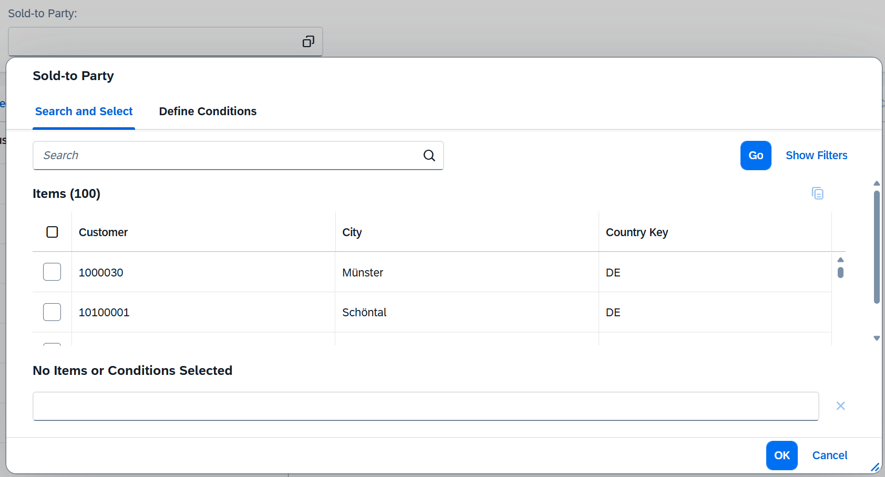
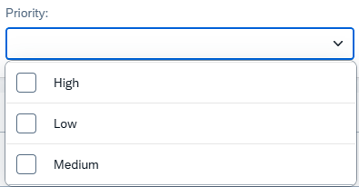

<!-- loioa5608eabcc184aee99e1a7d88b28816c -->

# Field Help

A field can be associated with a helper control, depending on how the field is configured.

> ### Note:  
> This topic is only applicable to SAP Fiori elements for OData V4.

Fields can have an associated value help, or a dropdown list for several fixed values. They can also include a date or date-time picker. This topic provides information about the supported types of associations and how applications can enable them.


<a name="loioa5608eabcc184aee99e1a7d88b28816c__section_b4m_l1c_jfc"/>

## Value Help

Value help allows end users to either select a value from a value help entity associated with the field or define a condition to retrieve a suitable value from the main entity.



For more information, see [Value Help](value-help-fccb255.md).


<a name="loioa5608eabcc184aee99e1a7d88b28816c__section_c4b_x5y_q4b"/>

## Dropdown-Based Fields

A dropdown list must be used for fields with fixed values.



For more information, see [Value Help as a Dropdown List](value-help-as-a-dropdown-list-2a0a630.md).


<a name="loioa5608eabcc184aee99e1a7d88b28816c__section_ulh_5h1_4fc"/>

## Date Picker

For fields of type `Edm.Date`, a date picker is rendered when the field is used outside a filter context. When used within a filter context, the field help depends on the filter restrictions for the field. The field help can be a date picker, value help, or dynamic semantic date options. For more information, see [Enabling Semantic Operators in the Filter Bar](enabling-semantic-operators-in-the-filter-bar-fef65d0.md).

> ### Sample Code:  
> XML Annotation
> 
> ```
> <EntityType Name="SalesOrderManage">
>    <Property Name="SalesOrderDate" Type="Edm.Date"/>
> </EntityType>
> ```

> ### Sample Code:  
> ABAP CDS Annotation
> 
> No ABAP CDS annotation sample is available. The correct metadata is generated when the `DATS` data type is used in the CDS view or database table.

> ### Sample Code:  
> CAP CDS Annotation
> 
> ```
> entity SalesOrderManage { 
>      SalesOrderDate : Date; 
> }  
> 
> ```


<a name="loioa5608eabcc184aee99e1a7d88b28816c__section_jxp_rtv_s4b"/>

## Date/Time Picker

For fields of type `Edm.DateTimeOffset`, a date/time picker is rendered when the field is used outside a filter context. Within a filter context, the field help depends on the filter restrictions defined for the field. It can be a date/time picker, a value help, or a list of dynamic semantic date options.

> ### Sample Code:  
> XML Annotation
> 
> ```
> 
> <EntityType Name="SalesOrderManage">
>     <Property Name="LastChangedDateTime" Type="Edm.DateTimeOffset"/>
> </EntityType>
> ```

> ### Sample Code:  
> ABAP CDS Annotation
> 
> No ABAP CDS annotation sample is available. The correct metadata is generated when the `TIMESTAMP` data type is used in the CDS view or database table.

> ### Sample Code:  
> CAP CDS Annotation
> 
> ```
> entity SalesOrderManage {
>        SalesOrderDate : DateTime;
> }
> ```


When an end user selects a date or time using the picker, the `DateTimeOffset` field is converted and displayed in the UI's timezone, as determined by SAPUI5. The following screenshot shows an input field without a specified or default timezone:


### Time Zone

You can specify a timezone for a field of type `Edm.DateTimeOffset`. If the timezone is defined using an annotation, it is displayed in both the input field \(edit mode\) and the text field \(in display mode\). The following settings are supported:

-   Use a fixed value for the `Timezone` annotation in the `@Common` vocabulary, following the IANA \(Internet Assigned Numbers Authority\) standard format:

    > ### Sample Code:  
    > XML Annotation
    > 
    > ```
    > <EntityType Name="SalesOrderManage">
    >     ...
    >     <Property Name="testTimeFixed" Type="Edm.DateTimeOffset"/>
    >     ...
    > </EntityType>
    > 
    > <Annotations Target="com.c_salesordermanage_sd.SalesOrderManagerManage/testTimeFixed">
    >     <Annotation Term="Common.Timezone" String="Asia/Riyadh"/>
    >     <Annotation Term="Common.Label" String="Timestamp with fixed timezone"/>
    > </Annotations>
    > 
    > ```

    > ### Sample Code:  
    > CAP CDS Annotation
    > 
    > ```
    > entity SalesOrderManage {
    > …
    > testTimeFixed  : DateTime @Common : { Timezone : 'Asia/Riyadh' };
    > … 
    > ```

-   Base the `Timezone` annotation on the value of another property:

    > ### Sample Code:  
    > XML Annotation
    > 
    > ```
    > <Annotations Target="com.c_salesordermanage_sd.SalesOrderManage/testTime">
    >    <Annotation Term="Common.Timezone" Path="testTimezone"/>
    >    <Annotation Term="Common.Label" String="Datetime Stamp with Timezone based on Property"/>
    > </Annotations>
    >   
    > <Annotations Target="com.c_salesordermanage_sd.SalesOrderManager/testTimezone">
    >    <Annotation Term="Common.Label" String="Timezone Property"/>
    > </Annotations>
    > 
    > ```

    > ### Sample Code:  
    > ABAP CDS Annotation
    > 
    > ```
    > @Semantics.timeZoneReference: 'MySAPTimezone'
    > MyDateTime,
    >   
    > @Semantics.timeZone
    > MySAPTimezone,
    > ```

    > ### Sample Code:  
    > CAP CDS Annotation
    > 
    > ```
    > entity SalesOrderManage {
    >     testTime : DateTime @Common : { Timezone : testTimezone };
    > }
    > 
    > ```


The following screenshot shows an input field where a timezone has been specified:


<a name="loioa5608eabcc184aee99e1a7d88b28816c__HistoryofRecentlyEnteredValues"/>

## History of Recently Entered Values

Fields can display the history of recently entered values, which is especially helpful when end users frequently select the same entries from a long list. When this feature is enabled, the field saves the values previously entered by end user. Upon focusing on the field, a list of recently entered values is shown. When the user starts typing, the list is filtered based on their input. If there are no previously entered values, the list is not displayed, even if the feature is enabled.

To enable the history of recently entered values, use the `INPUTFIELD_HISTORY` parameter in SAP Fiori launchpad.

> ### Note:  
> History of recently entered values is not supported for value help based on fixed values.


<a name="loioa5608eabcc184aee99e1a7d88b28816c__Type-AheadSupport"/>

## Type-Ahead Support

Fields with value help provide type-ahead suggestions based on user's input. These suggestions are fetched from the back end using the `$search` parameter included in the client request.

You can control which columns appear in the type-ahead list using the  `UI.Importance` annotation property. The type-ahead list displays only those columns annotated as  `High`. If the annotation isn't defined, the type-ahead list shows the same columns as configured in the value help dialog. For more information about `UI.Importance`, see [Annotations](value-help-fccb255.md#loiofccb255723d3489cae955648756411f6__Annotations) section in [Value Help](value-help-fccb255.md).

> ### Note:  
> Type-ahead functionality is not available if the value help entity is configured as non-searchable. For more information, see [Enabling the Search Function](enabling-the-search-function-3cdebee.md).

