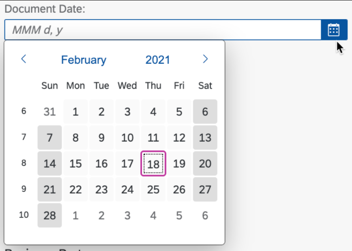
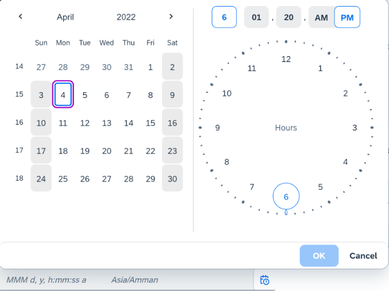
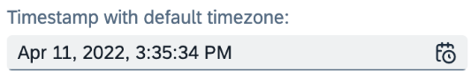
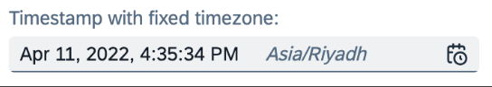

<!-- loioa5608eabcc184aee99e1a7d88b28816c -->

# Field Help

A field can be associated with a helper control, depending on how the field is configured.

> ### Note:  
> This topic is currently only applicable to SAP Fiori elements for OData V4.

Fields can have an associated value help, or a drop-down list for several fixed values, for example. Fields can also have a date or date-time picker. This topic provides information about the supported associations and how applications can enable them.


<a name="loioa5608eabcc184aee99e1a7d88b28816c__section_crm_mzx_q4b"/>

## Value Help


### Using `ValueList` Annotations

Direct `ValueList` annotations under the property level annotations:

> ### Sample Code:  
> XML Annotation
> 
> ```xml
> <Annotations Target="Self.ArtistsType/CountryOfOrigin">
>     <Annotation Term="Common.ValueList">
>         <Record>
>             <PropertyValue Property="CollectionPath" String="I_AIVS_CountryCode"/>
>             <PropertyValue Property="SearchSupported" Bool="true"/>
>             <PropertyValue Property="Parameters">
>                 <Collection>
>                     <Record Type="Common.ValueListParameterInOut">
>                         <PropertyValue Property="LocalDataProperty" PropertyPath="CountryOfOrigin"/>
>                         <PropertyValue Property="ValueListProperty" String="CountryCode"/>
>                     </Record>
>                     <Record Type="Common.ValueListParameterDisplayOnly">
>                         <PropertyValue Property="ValueListProperty" String="CountryCode_Text"/>
>                     </Record>
>                     <Record Type="Common.ValueListParameterDisplayOnly">
>                         <PropertyValue Property="ValueListProperty" String="CountryIndicator"/>
>                     </Record>
>                 </Collection>
>             </PropertyValue>
>         </Record>
>     </Annotation>
> </Annotations>
> ```

> ### Sample Code:  
> ABAP CDS Annotation
> 
> ```
> @Consumption.valueHelpDefinition:
>         [{
>           entity :{
>             name    : ' I_AIVS_CountryCode', // ValueList CollectionPath (The collection path points to consumption VH entity and will have the ValueListParameterDisplayOnly fields within it)
>             element : ' CountryCode' // ValueListProperty of ValueListParameterInOut           
>           },
>           label  : 'mylabel', // ValueList label
>           qualifier: 'test'
>           }]
> CountryOfOrigin, // LocalDataProperty of ValueListParameterInOut
> 
> ```

> ### Sample Code:  
> CAP CDS Annotation
> 
> ```
> entity Artist {
>             CountryOfOrigin                   : String(40)           @(Common : {
>            Label        : 'Country',
>             ValueList    : {
>                 CollectionPath : 'I_AIVS_CountryCode’,
>                 Parameters     : [
>                 {
>                     $Type             : 'Common.ValueListParameterInOut',
>                     LocalDataProperty : CountryOfOrigin,
>                     ValueListProperty : 'CountryCode'
>                 },
>                 {
>                     $Type             : 'Common.ValueListParameterDisplayOnly',
>                     ValueListProperty : 'CountryCode_Text'
>                 },
>                 {
>                     $Type             : 'Common.ValueListParameterDisplayOnly',
>                     ValueListProperty : 'CountryIndicator'
>                 }
>                 ]
>             }
>         });
> 
> ```


### Using `ValueListMapping` Annotations

Direct `ValueListMapping` annotations under the property level annotations:

> ### Sample Code:  
> XML Annotation
> 
> ```xml
> <Annotations Target="Self.ArtistsType/CountryOfOrigin">
>     <Annotation Term="Common.ValueListMapping">
>         <Record>
>             <PropertyValue Property="Label" String="Country Code Value Help"/>
>             <PropertyValue Property="CollectionPath" String="I_AIVS_CountryCode"/>
>             <PropertyValue Property="Parameters">
>                 <Collection>
>                     <Record Type="Common.ValueListParameterInOut">
>                         <PropertyValue Property="LocalDataProperty" PropertyPath="RegionCode"/>
>                         <PropertyValue Property="ValueListProperty" String="RegionID"/>
>                     </Record>
>                     <Record Type="Common.ValueListParameterDisplayOnly">
>                         <PropertyValue Property="ValueListProperty" String="CountryCode_Text"/>
>                     </Record>
>                     <Record Type="Common.ValueListParameterDisplayOnly">
>                         <PropertyValue Property="ValueListProperty" String="CountryIndicator"/>
>                     </Record>
>                 </Collection>
>             </PropertyValue>
>         </Record>
>     </Annotation>
> </Annotations>
> ```

> ### Sample Code:  
> ABAP CDS Annotation
> 
> No ABAP CDS annotation sample is available. Please use the local XML annotation.

> ### Sample Code:  
> CAP CDS Annotation
> 
> ```
> entity Artist {
>             CountryOfOrigin                   : String(40)           @(Common : {
>             ValueListMapping : {
>                         Label          : 'Country Code Value Help',
>                         CollectionPath : 'I_AIVS_CountryCode',
>                         Parameters     : [
>                             {
>                                 $Type             : 'Common.ValueListParameterInOut',
>                                 ValueListProperty : 'RegionID',
>                                 LocalDataProperty : RegionCode
>                             },
>                             {
>                                 $Type             : 'Common.ValueListParameterDisplayOnly',
>                                 ValueListProperty : 'CountryCode_Text'
>                             },
>                             {
>                                 $Type             : 'Common.ValueListParameterDisplayOnly',
>                                 ValueListProperty : 'CountryIndicator'
>                             }
>                        ]
>                     }
>                 }
>             )
> 
> ```


### Using `ValueListReference` Annotations

`ValueListReference` annotations pointing to another metadata source \(service\) as a reference for the value help:

> ### Sample Code:  
> XML Annotation
> 
> ```xml
> <Annotations Target="Self.ArtistsType/CountryOfOrigin">
>     <Annotation Term="Common.ValueListReferences">
>         <Collection>
>             <String>
>                 ../../../../srvd_f4/sap/i_aivs_countrycode/0001;ps='srvd-sadl_gw_appmusicdr_definition-0001';va='com.sap.gateway.srvd.sadl_gw_appmusicdr_definition.v0001.et-c_mdbu_v4_artisttp.countryoforigin'/$metadata
>             </String>
>         </Collection>
>     </Annotation>
> </Annotations>
> ```

> ### Sample Code:  
> ABAP CDS Annotation
> 
> No ABAP CDS annotation sample is available. Please use the local XML annotation.

The string here is the path relative to the main metadata file containing these `ValueListReference` annotations.

`ValueListMapping` annotations in the referenced metadata file:

> ### Sample Code:  
> XML Annotation
> 
> ```
> <Annotations Target="ParentService.ArtistsType/CountryOfOrigin">
>     <Annotation Term="Common.ValueListMapping">
>         <Record>
>             <PropertyValue Property="Label" String="Country Code Value Help"/>
>             <PropertyValue Property="CollectionPath" String="I_AIVS_CountryCode"/>
>             <PropertyValue Property="Parameters">
>                 <Collection>
>                     <Record Type="Common.ValueListParameterInOut">
>                         <PropertyValue Property="LocalDataProperty" PropertyPath="CountryOfOrigin"/>
>                         <PropertyValue Property="ValueListProperty" String="CountryCode"/>
>                     </Record>
>                     <Record Type="Common.ValueListParameterDisplayOnly">
>                         <PropertyValue Property="ValueListProperty" String="CountryCode_Text"/>
>                     </Record>
>                     <Record Type="Common.ValueListParameterDisplayOnly">
>                         <PropertyValue Property="ValueListProperty" String="CountryIndicator"/>
>                     </Record>
>                 </Collection>
>             </PropertyValue>
>         </Record>
>     </Annotation>
> </Annotations>
> ```

> ### Sample Code:  
> ABAP CDS Annotation
> 
> No ABAP CDS annotation sample is available. Please use the local XML annotation.

The `"ParentService"` in the annotation sample is an alias defined for the main service from where the annotation sample \(a\) was picked.


### Title of the Value Help Dialog

If the DataField annotation for the field has a label property, it is used as the title of the value help dialog. If it doesn't, the label annotation of the property is used instead.

Context-dependent value help uses the label defined in the `ValueList`. If no label is defined, the property label is used instead.


### Filter Fields Within the Value Help Dialog

Use the `SelectionFields` annotation on the entity of the value help to define the filter fields that are to be displayed in the filter panel of the value help dialog. Application developers must ensure that all relevant fields are part of the `SelectionFields`.

By default, the filter bar is collapsed. If one of the following conditions is met, the filter bar is expanded when the value help is opened:

-   if at least one filter field is mandatory

-   if the entity set of the value help is not search-enabled

-   if the data isn't loaded by default, which happens when the value list annotation `FetchedValues` is set to 2


> ### Note:  
> If no `SelectionFields` are annotated on the entity of the value help, all properties of the entity are displayed as filter fields. If there are no filterable fields \(see [Filter Restrictions](https://github.com/oasis-tcs/odata-vocabularies/blob/master/vocabularies/Org.OData.Capabilities.V1.xml#L430)\) within the value help entity, then the filter panel isn't visible.

**Help Icon for Fields Within the Filter Panel**

Filter fields always get a value help icon ‒ irrespective of whether a value list annotation is defined or not. This default value help icon opens up the value help dialog with only the *Define Conditions* tab. If the value list annotation is defined, then the value help dialog also contains the *Select from List* tab. If a `"ValueListWithFixedValues"` annotation is defined, then a drop-down menu is provided for the filter field instead of the value help icon. Similarly, a date picker is provided instead of the value help icon if the filter field is a date-based field with a single value.

> ### Note:  
> -   The *Define Conditions* tab is not visible for filter fields marked with `"AllowedExpressions : 'SingleValue'"` or `"AllowedExpressions : 'MultiValue'"`.
> 
> -   The *Select from List* tab only appears if, for the filter field, at least one of the value help annotations described above is found.

**Filter Operators**

The filter operators offered within the value help dialog \(under the *Define Conditions* tab\) can be restricted according to the [Filter Expression Restrictions](https://github.com/oasis-tcs/odata-vocabularies/blob/master/vocabularies/Org.OData.Capabilities.V1.md#FilterExpressionType).

For each filter expression type, the operators shown in the value help dialog depend on the base type of the property \(String, Date, DateTime, Time, Boolean, Unit, Numeric\). For filter fields with no defined filter expression type, or if it is incompatible with the base type, the complete default set of operators for the respective base type are used.

For `Date` and `DateTime` fields that have the filter expression type "Single Value", instead of the filter conditions dialog a `Date` or `DateTime` picker is shown directly in the filter field.

> ### Note:  
> For a `Date` or `DateTime` field. value help is only available for fields marked with the `MultipleValue` or `MultipleRange` filter restrictions. Value help is not available for a `Date` field that is marked with `SingleValue` or `SingleRange`.

For more information about filter restrictions, see [Configuring Filter Fields](configuring-filter-fields-f5dcb29.md).


### Search Field Within a Value Help Dialog

Application developers can control the visibility of the search field within a value help dialog by using the `Searchable` annotation set for the entity set of the value help.

> ### Sample Code:  
> ```
> annotate Customer with @(Capabilities.SearchRestrictions : {
>     Searchable : true
> });
> ```

By default, the entity set of a value help is searchable.

> ### Tip:  
> If a field has a `SearchRestriction` annotation with `Searchable : false`, no type ahead is available for the field.


### Controlling the Columns to be Displayed in the Type-Ahead List of a Value Help Field

Application developers can control the number of columns shown in the type-ahead list of a value help field by using the `Importance` annotation on a parameter of the value list. Only those columns that are annotated with `"@Importance":#High` are shown. If there is no `"Importance"="High"` annotation, the number of columns that are shown corresponds to the number in the value help dialog.

> ### Sample Code:  
> Controlling the Column Number
> 
> ```
> ValueList             : {
>     Label          : 'Sold-to Party',
>     CollectionPath : 'Customer',
>     Parameters     : [
>         {
>             $Type             : 'Common.ValueListParameterInOut',
>             LocalDataProperty : SoldToParty,
>             ValueListProperty : 'Customer',
>             "@UI.Importance" : #High
>         },
>         {
>             $Type             : 'Common.ValueListParameterDisplayOnly',
>             ValueListProperty : 'CustomerName',
>             "@UI.Importance" : #High
>         },
> ...
> ```


### Sorting Within Value Help Dialogs and Dropdown Lists

A default sorting mechanism is applied to the first column of the value help table, as well as to the dropdown list. Text-arrangement annotations for `TextOnly` are also taken into account: If the first column has a `TextOnly` annotation, the sorting is applied to the column to which the text arrangement refers.

You can change the sorting of the table using the `UI.PresentationVariant`.

> ### Sample Code:  
> `UI.PresentationVariant`
> 
> ```
> <Annotations Target="com.c_salesordermanage_sd.SalesOrderItem/Material">
>     <Annotation Term="Common.FieldControl" Path="fieldControlType_item"/>
>     <Annotation Term="Common.IsUpperCase" Bool="true"/>
>     <Annotation Term="Common.Label" String="Material"/>
>     <Annotation Term="Common.Text" Path="_Material/Material_Text"/>
>     <Annotation Term="Common.ValueList">
>         <Record Type="Common.ValueListType">
>             <PropertyValue Property="CollectionPath" String="C_MaterialBySlsOrgDistrChnl"/>
>             <PropertyValue Property="Label" String="Materials for Manage Sales Order"/>
>             <PropertyValue Property="Parameters">
>                 <Collection>
>                     <Record Type="Common.ValueListParameterInOut">
>                         <PropertyValue Property="LocalDataProperty" PropertyPath="Material"/>
>                         <PropertyValue Property="ValueListProperty" String="Material"/>
>                     </Record>                
>                     <Record Type="Common.ValueListParameterOut">
>                         <PropertyValue Property="LocalDataProperty" PropertyPath="RequestedQuantityUnit"/>
>                         <PropertyValue Property="ValueListProperty" String="RequestedQuantityUnit"/>
>                     </Record>
>                     <Record Type="Common.ValueListParameterDisplayOnly">
>                         <PropertyValue Property="ValueListProperty" String="MaterialName"/>
>                     </Record>
>                 </Collection>
>             </PropertyValue>
>             <PropertyValue Property="PresentationVariantQualifier" String="SortOrderPV"/>
>         </Record>
>     </Annotation>
> </Annotations>
>  
> <Annotations Target="com.c_salesordermanage_sd.EntityContainer/C_MaterialBySlsOrgDistrChnl">
>     <Annotation Term="UI.PresentationVariant" Qualifier="SortOrderPV">
>         <Record Type="UI.PresentationVariantType">
>             <PropertyValue Property="Visualizations">
>                 <Collection>
>                     <AnnotationPath>@UI.LineItem</AnnotationPath>
>                 </Collection>
>             </PropertyValue>
>             <PropertyValue Property="SortOrder">
>                 <Collection>
>                     <Record Type="Common.SortOrderType">
>                         <PropertyValue Property="Property" PropertyPath="MaterialName"/>
>                         <PropertyValue Property="Descending" Bool="false"/>
>                     </Record>
>                 </Collection>
>             </PropertyValue>
>         </Record>
>     </Annotation>
> </Annotations>>
> ```

> ### Tip:  
> SAP Fiori elements recommends using a `PresentationVariant`


### Client Validation Against Value Help

You can use the `ValueListForValidation` annotation to configure that the values of certain fields entered in the UI are checked at the client against the value help \(`ValueList` or `ValueListMapping`\) entity set associated to the field.

Use `ValueListForValidation` annotations under property level annotations:

> ### Sample Code:  
> `Common.ValueListForValidation`
> 
> ```
> <Annotations Target="com.c_salesordermanage_sd.SalesOrderManage/IncotermsVersion">
>     <Annotation Term="Common.IsUpperCase" Bool="true"/>
>     <Annotation Term="Common.Label" String="Incoterms Version"/>
>     <Annotation Term="Common.Text" Path="_IncotermsVersion/IncotermsVersion_Text"/>
>     <Annotation Term="Common.ValueListForValidation" String=""/>
>     <Annotation Term="Common.ValueList">
>         ...Definition of ValueList...
>     </Annotation>
> </Annotations>
> ```

The following sample code shows an example for the usage of the annotation term `Common.ValueListForValidation` with a conditional expression binding:

> ### Sample Code:  
> `Common.ValueListForValidation` with conditional expression binding
> 
> ```
> <Annotations Target="com.c_salesordermanage_sd.HeaderPartner/BusinessPartner">
>     <Annotation Term="com.sap.vocabularies.Common.v1.ValueListForValidation">
>         <If>
>             <Eq>
>                 <Path>PartnerFunction</Path>
>                 <String>WE</String>
>             </Eq>
>             <String>BusinessPartner</String>
>             <String />
>         </If>
>     </Annotation>
> </Annotations>
> ```

> ### Note:  
> -   Ensure that the `ValueListForValidation` contains the qualifier of the `ValueList` or `ValueListMapping` to be used for validation.
> 
> -   User input that does not match the entries in the `ValueListForValidation` aren't stored in the back end \(not even for drafts\).
> 
> -   App developers have two options to configure the `ValueListForValidation`:
> 
>     -   the `ValueListForValidation` can be a fixed string \(which is the qualifier of the value help\)
> 
>     -   the value for the `ValueListForValidation` can be a conditional expression that results in the qualifier of the `ValueList` or `ValueListMapping` to be used for validation
> 
> 
> -   For a conditional expression, ensure that the result contains only one qualifier that points to a valid `ValueList` or `ValueListMapping` at runtime.
> 
> -   The `ValueListForValidation` annotation with a conditional expression binding must have the If-Then-Else pattern.


### Context-Dependent Value Help

Some scenarios require different value help dialogs based on a context. This context is determined by a property other than the annotated property.

You can use the annotation term `Common.ValueListRelevantQualifiers` to configure that valid qualifiers for a value help are determined, dependent on the value of another field.

> ### Example:  
> A sales order has different types of assigned partners. Depending on the partner function, you have to provide different details in the value help to which the partner can be added. If the partner function is `"WE"`, the value help with qualifier `"BusinessPartner"` should be determined. In all other cases, the value help without a qualifier should be determined.

> ### Sample Code:  
> `Common.ValueListRelevantQualifiers`
> 
> ```
> <Annotations Target="com.c_salesordermanage_sd.HeaderPartner/BusinessPartner">
>     <Annotation Term="com.sap.vocabularies.Common.v1.ValueListRelevantQualifiers">
>         <Collection>
>             <String />
>             <If>
>                 <Eq>
>                     <Path>PartnerFunction</Path>
>                     <String>WE</String>
>                 </Eq>
>                 <String>BusinessPartner</String>
>             </If>
>         </Collection>
>         </Annotation>
>     <Annotation Term="Common.ValueList" Qualifier="BusinessPartner">
>         ...Definition of ValueList...
>     </Annotation>
>     <Annotation Term="Common.ValueList">
>         ...Definition of ValueList w/o qualifier...
>     </Annotation>
> </Annotations>
> ```

> ### Note:  
> Context-dependent value help currently does not support individual In/Out parameters for the different `ValueList` definitions. All `ValueList` definitions must have the same In/Out parameters.


### Initial Value for Value Help IN Parameters

The annotation `InitialValueIsSignificant` allows you to identify an initial value, for example an empty string, as a valid and significant value for value help IN parameters.

> ### Note:  
> Please note that the annotation below is currently only supported for parameters of data type `Edm.String`.

> ### Sample Code:  
> XML Annotation for `InitialValueIsSignificant`
> 
> ```
> <Annotation Term="Common.ValueList">
>     <Record Type="Common.ValueListType">
>         <PropertyValue Property="CollectionPath" String="ShippingCondition"/>
>         <PropertyValue Property="Label" String="Shipping Condition"/>
>         <PropertyValue Property="Parameters">
>             <Collection>
>                 <Record Type="Common.ValueListParameterInOut">
>                     <PropertyValue Property="LocalDataProperty" PropertyPath="ShippingCondition"/>
>                     <PropertyValue Property="ValueListProperty" String="ShippingCondition"/>
>                 </Record>
>                 <Record Type="Common.ValueListParameterIn">
>                     <PropertyValue Property="LocalDataProperty" PropertyPath="SoldToParty"/>
>                     <PropertyValue Property="ValueListProperty" String="SoldToParty"/>
>                     <PropertyValue Property="InitialValueIsSignificant" Bool="true"/>
>                 </Record>
>                 <Record Type="Common.ValueListParameterDisplayOnly">
>                     <PropertyValue Property="ValueListProperty" String="ShippingCondition_Text"/>
>                 </Record>
>             </Collection>
>         </PropertyValue>
>     </Record>
> </Annotation>
> ```

> ### Sample Code:  
> CDS Annotation for `InitialValueIsSignificant`
> 
> ```
> ShippingCondition             : ShippingCondition : ShippingCondition @(Common : {
>     Text            : _ShippingCondition.ShippingCondition_Text,
>     TextArrangement : #TextFirst,
>     IsUpperCase     : true,
>     ValueList       : {
>         Label          : 'Shipping Condition',
>         CollectionPath : 'ShippingCondition',
>         Parameters     : [
>         {
>             $Type             : 'Common.ValueListParameterInOut',
>             LocalDataProperty : ShippingCondition,
>             ValueListProperty : 'ShippingCondition'
>         },
>         {
>             $Type             : 'Common.ValueListParameterIn',
>             LocalDataProperty : SoldToParty,
>             ValueListProperty : 'SoldToParty',
>             InitialValueIsSignificant: true
>         },
>         {
>             $Type             : 'Common.ValueListParameterDisplayOnly',
>             ValueListProperty : 'ShippingCondition_Text'
>         }
>         ]
>     }
> });
> ```


### Multiple Value Help Dialogs / Collective Search Help

Some scenarios require more than one value help.

> ### Sample Code:  
> Multiple Value Help Dialogs
> 
> ```
> <Annotations Target="com.c_salesordermanage_sd.HeaderPartner/BusinessPartner">
>     <Annotation Term="Common.ValueList" Qualifier="BusinessPartner">
>         ...Definition of ValueList...
>     </Annotation>
>     <Annotation Term="Common.ValueList" Qualifier="SingleColumn">
>         ...Definition of ValueList...
>     </Annotation>
>     <Annotation Term="Common.ValueList">
>         ...Definition of ValueList w/o qualifier...
>     </Annotation>
> </Annotations>
> ```


### Value Help with `TextArrangement`

You can use the `UI.TextArrangement` annotation to configure the display format of a table column of the value help. The following two options are available:

-   Value Help with a Dialog

    The following text arrangements are supported:

    -   `TextOnly`

    -   `TextFirst`

    -   `TextLast`

    -   `TextSeparate`


    **Value Help with Dialog**


    <table>
    <tr>
    <th valign="top">

    Text


    
    </th>
    <th valign="top">

    `TextArrangement`


    
    </th>
    <th valign="top">

    Display Format


    
    </th>
    </tr>
    <tr>
    <td valign="top">

    \-


    
    </td>
    <td valign="top">

    \-


    
    </td>
    <td valign="top">

    `Value`


    
    </td>
    </tr>
    <tr>
    <td valign="top">

    x


    
    </td>
    <td valign="top">

    \- \*1\)


    
    </td>
    <td valign="top">

    `Value`


    
    </td>
    </tr>
    <tr>
    <td valign="top">

    x


    
    </td>
    <td valign="top">

    `TextFirst`


    
    </td>
    <td valign="top">

    `DescriptionValue`


    
    </td>
    </tr>
    <tr>
    <td valign="top">

    x


    
    </td>
    <td valign="top">

    `TextLast`


    
    </td>
    <td valign="top">

    `ValueDescription`


    
    </td>
    </tr>
    <tr>
    <td valign="top">

    x


    
    </td>
    <td valign="top">

    `TextSeparate`


    
    </td>
    <td valign="top">

    `Value`


    
    </td>
    </tr>
    <tr>
    <td valign="top">

    x


    
    </td>
    <td valign="top">

    `TextOnly`


    
    </td>
    <td valign="top">

    `Description`


    
    </td>
    </tr>
    </table>
    
    \*1\): If you define the `Common.Text` annotation without the `UI.TextArrangement`, the display format is `Value`. To get the display format `DescriptionValue`, both `Common.Text` and `UI.TextArrangement` are required.

-   Value Help with a Dropdown List \(`ValueListWithFixedValues`\)

    **Value Help with Dropdown List**


    <table>
    <tr>
    <th valign="top">

    Text


    
    </th>
    <th valign="top">

    `TextArrangement`


    
    </th>
    <th valign="top">

    Display Format


    
    </th>
    </tr>
    <tr>
    <td valign="top">

    \-


    
    </td>
    <td valign="top">

    \-


    
    </td>
    <td valign="top">

    `Value`


    
    </td>
    </tr>
    <tr>
    <td valign="top">

    x


    
    </td>
    <td valign="top">

    \- \*2\)


    
    </td>
    <td valign="top">

    `DescriptionValue`


    
    </td>
    </tr>
    <tr>
    <td valign="top">

    x


    
    </td>
    <td valign="top">

    `TextFirst`


    
    </td>
    <td valign="top">

    `DescriptionValue`


    
    </td>
    </tr>
    <tr>
    <td valign="top">

    x


    
    </td>
    <td valign="top">

    `TextLast`


    
    </td>
    <td valign="top">

    `ValueDescription`


    
    </td>
    </tr>
    <tr>
    <td valign="top">

    x


    
    </td>
    <td valign="top">

    `TextSeparate`


    
    </td>
    <td valign="top">

    `Value`


    
    </td>
    </tr>
    <tr>
    <td valign="top">

    x


    
    </td>
    <td valign="top">

    `TextOnly`


    
    </td>
    <td valign="top">

    `Description`


    
    </td>
    </tr>
    </table>
    
    \*2\): If you define the `Common.Text` annotation without the `UI.TextArrangement`, the display format is `DescriptionValue`.


> ### Tip:  
> The system automatically excludes a column with the `Description` if the `Description` is already displayed in another column that uses one of the following text arrangements:
> 
> -   `TextFirst`
> 
> -   `TestLast`
> 
> -   `TextOnly`

For more information, see [Further Features of the Field](further-features-of-the-field-f49a0f7.md).


<a name="loioa5608eabcc184aee99e1a7d88b28816c__section_h1j_xt3_5pb"/>

## Value Help for Draft-Enabled Entities

Value help for draft-enabled entities only shows active documents.


<a name="loioa5608eabcc184aee99e1a7d88b28816c__section_zmj_gw3_5pb"/>

## Value Help Using `FetchValuesType`

By default, a value help requests the data immediately when the dialog is opened. Application developers can use the <code><a href="https://github.com/SAP/odata-vocabularies/blob/master/vocabularies/Common.md#FetchValuesType">FetchValuesType</a></code>Applications can bring up value help for fields, allowing end users to choose from to define that a value help doesn't load the data immediately, and that users can first maintain a filter and then request the data by choosing *Go*.

You achieve this by setting the property "FetchValues = 2".

> ### Sample Code:  
> `ValueList` with `FetchValues`
> 
> ```
> <Annotation Term="Common.ValueList">
>     <Record Type="Common.ValueListType">
>         <PropertyValue Property="CollectionPath" String="ShippingCondition"/>
>         <PropertyValue Property="Label" String="Shipping Condition"/>
>         <PropertyValue Property="FetchValues" Int="2"/>
>         <PropertyValue Property="Parameters">
>             <Collection>
>                 <Record Type="Common.ValueListParameterInOut">
>                     <PropertyValue Property="LocalDataProperty" PropertyPath="ShippingCondition"/>
>                     <PropertyValue Property="ValueListProperty" String="ShippingCondition"/>
>                 </Record>
>                 <Record Type="Common.ValueListParameterIn">
>                     <PropertyValue Property="LocalDataProperty" PropertyPath="SoldToParty"/>
>                     <PropertyValue Property="ValueListProperty" String="SoldToParty"/>
>                 </Record>
>                 <Record Type="Common.ValueListParameterDisplayOnly">
>                     <PropertyValue Property="ValueListProperty" String="ShippingCondition_Text"/>
>                 </Record>
>             </Collection>
>         </PropertyValue>
>     </Record>
> </Annotation>
> ```


<a name="loioa5608eabcc184aee99e1a7d88b28816c__section_c4b_x5y_q4b"/>

## Fixed Values

For information about fixed values, please see the topic [Value Help as a Dropdown List](value-help-as-a-dropdown-list-2a0a630.md).


<a name="loioa5608eabcc184aee99e1a7d88b28816c__section_jxp_rtv_s4b"/>

## Date Picker and Date/Time Picker

Based on the data type of the property, you can also render a date picker or a date/time picker if the filter field is restricted to a single value \(via the `Capabilities.FilterRestrictions` annotation\). Otherwise, the corresponding picker is rendered in a value help dialog.

When you choose a property with the data type "`Edm.Date`", a date picker is rendered:

> ### Sample Code:  
> XML Annotation
> 
> ```
> <EntityType Name="SalesOrderManage">
>    ...<Property Name="SalesOrderDate" Type="Edm.Date"/>
> </EntityType>
> ```

> ### Sample Code:  
> CAP CDS Annotation
> 
> ```
> entity SalesOrderManage {
> …       SalesOrderDate                       : Date;
> }
> ```

  

When you choose a property with the data type "`Edm.DateTimeOffset`", a date/time picker is rendered:

> ### Sample Code:  
> Date/Time Picker
> 
> ```
> <EntityType Name="SalesOrderManage">
>    ...<Property Name="LastChangedDateTime" Type="Edm.DateTimeOffset"/>
> </EntityType>
> ```

  

You can specify a timezone for a field of type "`Edm.DateTimeOffset`". If the timezone is specified \(annotated\), then the timezone is displayed in the input field and the text field in display mode. You can make the following settings:

-   You can use a fixed value for the annotation `Timezone` in the `@Common` vocabulary, according to the IANA \(Internet Assigned Numbers Authority\) standard:

    > ### Sample Code:  
    > XML Annotation
    > 
    > ```
    > <EntityType Name="SalesOrderManage">
    >    <Property Name="timeDefault" Type="Edm.DateTimeOffset"/>
    >    <Property Name="testTimeFixed" Type="Edm.DateTimeOffset”/>
    >    <Property Name="testTime" Type="Edm.DateTimeOffset"/>
    >    <Property Name="testTimezone" Type="Edm.String"/>
    > </EntityType>
    >   
    > <Annotations Target="com.c_salesordermanage_sd.SalesOrderManage/timeDefault">
    >    <Annotation Term="Common.Label" String="Timestamp with default timezone"/>
    > </Annotations>
    >  
    > <Annotations Target="com.c_salesordermanage_sd.SalesOrderManagerManage/testTimeFixed">
    >    <Annotation Term="Common.Timezone" String="Asia/Riyadh"/>
    >    <Annotation Term="Common.Label" String="Timestamp with fixed timezone"/>
    > </Annotations>
    > ```

    > ### Sample Code:  
    > CAP CDS Annotation
    > 
    > ```
    > entity SalesOrderManage {
    > …
    > testTimeFixed                     : DateTime @Common : { Timezone : 'Asia/Riyadh' };
    > …
    > ```

-   You can base it on another property value:

    > ### Sample Code:  
    > XML Annotation
    > 
    > ```
    > <Annotations Target="com.c_salesordermanage_sd.SalesOrderManage/testTime">
    >    <Annotation Term="Common.Timezone" Path="testTimezone"/>
    >    <Annotation Term="Common.Label" String="Datetime Stamp with Timezone based on Property"/>
    > </Annotations>
    >   
    > <Annotations Target="com.c_salesordermanage_sd.SalesOrderManager/testTimezone">
    >    <Annotation Term="Common.Label" String="Timezone Property"/>
    > </Annotations>
    > ```

    > ### Sample Code:  
    > ABAP CDS Annotation
    > 
    > ```
    > @Semantics.timeZoneReference: 'MySAPTimezone'
    > MyDateTime,
    >   
    > @Semantics.timeZone
    > MySAPTimezone,
    > ```

    > ### Sample Code:  
    > CAP CDS Annotation
    > 
    > ```
    > entity SalesOrderManage {
    > …
    >         testTime                          : DateTime @Common : { Timezone : testTimezone };
    > …
    > ```


Check out our live example in the flexible programming model explorer at [Field - Format Options](https://ui5.sap.com/test-resources/sap/fe/core/fpmExplorer/index.html#/buildingBlocks/field/fieldFormatOptions).

If you don't explicitly define the timezone, the `DateTimeOffset` field is converted and displayed in the timezone of the UI as determined by SAPUI5.

The following screenshot shows an input field with no specified timezone or the default timezone:

  

> ### Sample Code:  
> CAP CDS Annotation
> 
> ```
> entity SalesOrderManage {
> …
>         timeDefault                       : DateTime;
> …
> ```

The following screenshot shows an input field where a timezone has been specified:

  

The following screenshot shows that the timezone is specified for the corresponding input field. The Date/Time Picker doesn't show any timezone in the dialog:

  

