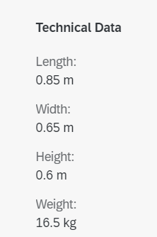

<!-- loioebe05d52c43241c19aaf79dd5f1c69f1 -->

# Form Facet

You can add a form facet to the object page header.

To do so, add a `UI.ReferenceFacet` that points to `UI.FieldGroup` or `UI.Identification`. If you provide a label in the `UI.ReferenceFacet`, it is used as the form's title.

  


The following sample codes show the `UI.FieldGroup` annotation:

> ### Sample Code:  
> XML Annotation
> 
> ```xml
> <Record Type="UI.ReferenceFacet">
>       <PropertyValue Property="Label" String="Technical Data" />
>       <PropertyValue Property="Target"AnnotationPath="@UI.FieldGroup#Dimensions" />
>  </Record>
> 
> Field Group:
> 
> <Annotation Term="UI.FieldGroup" Qualifier="Dimensions">
>      <Record>
>           <PropertyValue Property="Data">
>                <Collection>
>                     <Record Type="UI.DataField">
>                          <PropertyValue Property="Value" Path="Length"/>
>                     </Record>
>                     <Record Type="UI.DataField">
>                          <PropertyValue Property="Value" Path="Width"/>
>                     </Record>
>                     <Record Type="UI.DataField">
>                          <PropertyValue Property="Value" Path="Height"/>
>                     </Record>
>                     <Record Type="UI.DataField">
>                          <PropertyValue Property="Value" Path="Weight"/>
>                     </Record>
>                </Collection>
>           </PropertyValue>
>      </Record>
>  </Annotation>
> ```

> ### Sample Code:  
> ABAP CDS Annotation
> 
> ```
> @UI.Facet: [
>   {
>     label: 'Technical Data',
>     targetQualifier: 'Dimensions',
>     type: #FIELDGROUP_REFERENCE,
>     purpose: #HEADER
>   }
> ]
> Test;
> 
> Field Group:
> 
> @UI.fieldGroup: [
>   {
>     value: 'LENGTH',
>     type: #STANDARD,
>     qualifier: 'Dimensions'
>   }
> ]
> LENGTH;
> 
> @UI.fieldGroup: [
>   {
>     value: 'WIDTH',
>     type: #STANDARD,
>     qualifier: 'Dimensions'
>   }
> ]
> WIDTH;
> 
> @UI.fieldGroup: [
>   {
>     value: 'HEIGHT',
>     type: #STANDARD,
>     qualifier: 'Dimensions'
>   }
> ]
> HEIGHT;
> 
> @UI.fieldGroup: [
>   {
>     value: 'WEIGHT',
>     type: #STANDARD,
>     qualifier: 'Dimensions'
>   }
> ]
> WEIGHT;
> 
> ```

> ### Sample Code:  
> CAP CDS Annotation
> 
> ```
> annotate c_salesordermanage_sd.SalesOrderManage with @(UI : {
>         Facets                  : [
>                          {
>                                $Type         : 'UI.ReferenceFacet',
>                                Label         : 'Technical Data',
>                                ID            : 'TechnicalData',
>                                Target        : '@UI.FieldGroup#Dimensions'
>                          }],
>             FieldGroup #Dimensions      : {
>                                Label : 'Tech Data',
>                                Data  : [
>                                        {
>                                          $Type     : 'UI.DataField',
>                                          Value     : Length
>                                        },
>                                        {
>                                          $Type             : 'UI.DataField',
>                                          Value              : Width
>                                        },
>                                        {
>                                          $Type             : 'UI.DataField',
>                                          Value              : Height
>                                        },
>                                        {
>                                          $Type             : 'UI.DataField',
>                                          Value              : Weight
>                                        }
>                                ]
>            }
> })
> 
> ```

