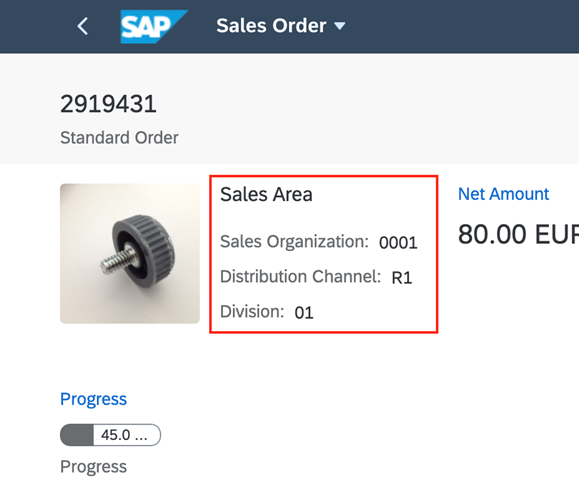

<!-- loioff0ae0b200e0488d928f87a043c4c747 -->

# Form Facet

You can add a form facet to the object page header. To do this, add a `UI.ReferenceFacet` to the `UI.HeaderFacets` that points to `UI.FieldGroup` or `UI.Identification`. If you provide a label in the `UI.ReferenceFacet`, it is used as the title of the form. For example, the figure below shows the following fields within the *Sales Area* section \(created with a header facet\):

-   *Sales Organization*

-   *Distribution Channel*
-   *Division*

   
  
**Object Page: Header Field Group**

  


<a name="loioff0ae0b200e0488d928f87a043c4c747__section_mjl_ck5_dnb"/>

## Sample Codes

> ### Sample Code:  
> XML Annotation
> 
> ```xml
> 
> <Annotation Term="UI.HeaderFacets">
>     <Collection>
>         ...
>         <Record Type="UI.ReferenceFacet">
>             <PropertyValue Property="Label" String="Sales Area" />
>             <PropertyValue Property="Target" AnnotationPath="@UI.FieldGroup#OrgData" />
>         </Record>
>         ...
>         ...
>     </Collection>
> </Annotation>
> 
> <Annotation Term="UI.FieldGroup" Qualifier="OrgData">
>     <Record Type="UI.FieldGroupType">
>         <PropertyValue Property="Data">
>             <Collection>
>                 <Record Type="UI.DataField">
>                     <PropertyValue Property="Value" Path="SalesOrganization"/>
>                     <Annotation Term="UI.Importance" EnumMember="UI.ImportanceType/High"/>
>                 </Record>
>                 <Record Type="UI.DataField">
>                     <PropertyValue Property="Value" Path="DistributionChannel"/>
>                     <Annotation Term="UI.Importance" EnumMember="UI.ImportanceType/High"/>
>                     <Annotation Term="UI.Hidden" Path="Delivered"/>
>                 </Record>
>                 <Record Type="UI.DataField">
>                     <PropertyValue Property="Value" Path="OrganizationDivision"/>
>                     <Annotation Term="UI.Importance" EnumMember="UI.ImportanceType/High"/>
>                 </Record>
>             </Collection>
>         </PropertyValue>
>     </Record>
> </Annotation>
> ```

> ### Sample Code:  
> ABAP CDS Annotation
> 
> ```
> 
> @UI.Facet: [
>   {
>     label: '{@i18n>@SalesArea}',
>     targetQualifier: 'OrgData',
>     type: #FIELDGROUP_REFERENCE,
>     purpose: #HEADER
>   },
>   ...
>   ...
> ]
> product;
> 
> @UI.fieldGroup: [
>   {
>     importance: #HIGH,
>     position: 10 ,
>     qualifier: 'OrgData'
>   }
> ]
> SALESORGANIZATION;
> 
> @UI.fieldGroup: [
>   {
>     importance: #HIGH,
>     hidden: true,
>     position: 20 ,
>     qualifier: 'OrgData'
>   }
> ]
> DISTRIBUTIONCHANNEL;
> 
> @UI.fieldGroup: [
>   {
>     importance: #HIGH,
>     position: 30 ,
>     qualifier: 'OrgData'
>   }
> ]
> ORGANIZATIONDIVISION;
> 
> ```

> ### Sample Code:  
> CAP CDS Annotation
> 
> ```
> 
> annotate service.Products with @(
>   UI.HeaderFacets : [
>     {
>         $Type : 'UI.ReferenceFacet',
>         Label : '{@i18n>@SalesArea}',
>         Target : '@UI.FieldGroup#OrgData'
>     },
>    ...
>    ...
>   ],
>   UI.FieldGroup #OrgData : {
>     $Type : 'UI.FieldGroupType',
>     Data : [
>         {
>             $Type : 'UI.DataField',
>             Value : SalesOrganization,
>             ![@UI.Importance] : #High
>         },
>         {
>             $Type : 'UI.DataField',
>             Value : DistributionChannel,
>             ![@UI.Importance] : #High,
>             ![@UI.Hidden] : Delivered
>         },
>         {
>             $Type : 'UI.DataField',
>             Value : OrganizationDivision,
>             ![@UI.Importance] : #High
>         }
>     ]
>   }
> );
> 
> ```

