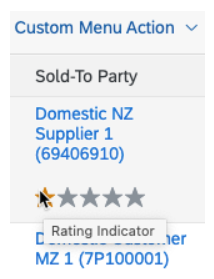

<!-- loiof49a0f7eaafe444daf4cd62d48120ad0 -->

# Further Features of the Field

Application developers can control important features of the field.

> ### Note:  
> This topic is currently only applicable to SAP Fiori elements for OData V4.


<a name="loiof49a0f7eaafe444daf4cd62d48120ad0__section_kfc_wzf_k4b"/>

## Text Annotation and Text Arrangement Annotation

The value displayed within the field can show either only the textual description of the value, or show it together with the ID representation of the value. Consider the following example data set:


<table>
<tr>
<th valign="top">

SalesOrderID


</th>
<th valign="top">

PlantID


</th>
<th valign="top">

PlantName


</th>
</tr>
<tr>
<td valign="top">

100


</td>
<td valign="top">

A1


</td>
<td valign="top">

ABC


</td>
</tr>
<tr>
<td valign="top">

101


</td>
<td valign="top">

A2


</td>
<td valign="top">

DEF


</td>
</tr>
</table>

In this example, `PlantID` represents the unique ID of the object "Plant". But this is not easily readable for the end user and typically, the field `PlantID` would have a reference to the corresponding text.

You can define a text using the `Common.Text` annotation on a property.

Application developers can define the arrangement of a code or ID value and its text using the `UI.TextArrangement` annotation.


<table>
<tr>
<th valign="top">

TextArrangement


</th>
<th valign="top">

Display Format


</th>
</tr>
<tr>
<td valign="top">

TextFirst - \(default value\)


</td>
<td valign="top">

ABC \(A1\)


</td>
</tr>
<tr>
<td valign="top">

TextLast


</td>
<td valign="top">

A1 \(ABC\)


</td>
</tr>
<tr>
<td valign="top">

TextOnly


</td>
<td valign="top">

ABC


</td>
</tr>
<tr>
<td valign="top">

TextSeparate


</td>
<td valign="top">

A1


</td>
</tr>
</table>

> ### Sample Code:  
> XML Annotation
> 
> ```xml
> <Annotations Target="com.c_salesordermanage_sd/SalesOrganization">
>    …
>    <Annotation Term="Common.Text" Path="SalesOrganization_Text">
>       <Annotation Term="UI.TextArrangement" EnumMember="UI.TextArrangementType/TextOnly"/>
>    </Annotation>
>    …
> </Annotations>
> 
> ```

> ### Sample Code:  
> ABAP CDS Annotation
> 
> ```
> …
> @ObjectModel.text.element:  [ ' SalesOrganization_Text,' ]
> @UI.textArrangement: #TEXT_ONLY
> SalesOrganization
> …
> 
> ```

> ### Sample Code:  
> CAP CDS Annotation
> 
> ```
> annotate com.c_salesordermanage_sd with {
>     ...
>     SalesOrganization @(
>              Common : {
>               Text: SalesOrganization_Text,
>               TextArrangement : #TextOnly
>             })
>     ...
> };
> 
> 
> ```

The text arrangement can also be done centrally for all properties of an entity set.

The `TextArrangement` value at entity set level is considered as a fallback only if you have not specified the `TextArrangement` at property level. So the `TextArrangement` at property level takes precedence over the one defined at entity set level.

> ### Sample Code:  
> XML Annotation
> 
> ```xml
> <Annotations Target="SalesOrder"> //Main EntitySet
>   <Annotation Term="com.sap.vocabularies.UI.v1.TextArrangement" EnumMember="com.sap.vocabularies.UI.v1.TextArrangementType/TextFirst"/>
> </Annotations>
> ```

> ### Note:  
> Consider the following when using a text arrangement annotation in a value help:
> 
> -   The `TextArrangement` of the value help entity set is used to determine the display of the fields that show up in the columns of the value help dialog. The `TextArrangement` specified at property level within the value help entity set again takes precedence over the one defined at entity set level.
> 
> -   The `TextArrangement` annotation `#TextOnly` is supported in value help tables \(that is, in the value help dialog and for the type-ahead feature\). Other `TextArrangement` annotations like `#TextFirst`, `#TextLast`, or `#TextSeparate` are not considered. Combo boxes also support `#TextFirst` and `#TextLast`.
> 
> -   A separate text column is ignored if the text annotation is already used in another column using the `TextArrangement`.


<a name="loiof49a0f7eaafe444daf4cd62d48120ad0__section_xg1_4mw_kwb"/>

## Fiscal Annotations

`Edm.String` properties can be annotated to indicate that they are based on a fiscal date.

The following annotations are available for fiscal dates with the following paterns:

****


<table>
<tr>
<th valign="top">

CAP CDS Annotation


</th>
<th valign="top">

Pattern


</th>
<th valign="top">

ABAP CDS Annotation


</th>
</tr>
<tr>
<td valign="top">

`IsFiscalYearPeriod`


</td>
<td valign="top">

PPP


</td>
<td valign="top">

`Semantics.fiscal.yearPeriod`


</td>
</tr>
<tr>
<td valign="top">

`IsDayOfFiscalYear`


</td>
<td valign="top">

d


</td>
<td valign="top">

`?`


</td>
</tr>
<tr>
<td valign="top">

`IsFiscalPeriod`


</td>
<td valign="top">

YYYYPPP


</td>
<td valign="top">

`Semantics.fiscal.period`


</td>
</tr>
<tr>
<td valign="top">

`IsFiscalQuarter`


</td>
<td valign="top">

Q


</td>
<td valign="top">

`Semantics.fiscal.quarter`


</td>
</tr>
<tr>
<td valign="top">

`IsFiscalWeek`


</td>
<td valign="top">

WW


</td>
<td valign="top">

`Semantics.fiscal.week`


</td>
</tr>
<tr>
<td valign="top">

`IsFiscalYear`


</td>
<td valign="top">

YYYY


</td>
<td valign="top">

`Semantics.fiscal.year`


</td>
</tr>
<tr>
<td valign="top">

`IsFiscalYearQuarter`


</td>
<td valign="top">

YYYYQ


</td>
<td valign="top">

`Semantics.fiscal.yearQuarter`


</td>
</tr>
<tr>
<td valign="top">

`IsFiscalYearWeek`


</td>
<td valign="top">

YYYYWW


</td>
<td valign="top">

`Semantics.fiscal.yearWeek`


</td>
</tr>
<tr>
<td valign="top">

`?`


</td>
<td valign="top">

 


</td>
<td valign="top">

`Semantics.fiscal.yearVariant`


</td>
</tr>
</table>

For example, `IsFiscalYearPeriod` indicates that the annotated `Edm.String` property is a string based on a fiscal date following the PPP pattern.

> ### Sample Code:  
> XML Annotation
> 
> ```xml
> <Annotations Target="sap.fe.manageitems.TechnicalTestingService.LineItems/fiscalYearPeriod">
>   <Annotation Term="Common.IsFiscalYearPeriod" Bool="true"/>
>   <Annotation Term="Common.Label" String="Fiscal Year Period"/>
> </Annotations>
> <Annotations Target="sap.fe.manageitems.TechnicalTestingService.LineItems/fiscalDayOfYear">
>   <Annotation Term="Common.IsDayOfFiscalYear" Bool="true"/>
>   <Annotation Term="Common.Label" String="Fiscal Day Of Year"/>
> </Annotations>
> <Annotations Target="sap.fe.manageitems.TechnicalTestingService.LineItems/fiscalPeriod">
>   <Annotation Term="Common.IsFiscalPeriod" Bool="true"/>
>   <Annotation Term="Common.Label" String="Fiscal Period"/>
> </Annotations>
> <Annotations Target="sap.fe.manageitems.TechnicalTestingService.LineItems/fiscalQuarter">
>   <Annotation Term="Common.IsFiscalQuarter" Bool="true"/>
>   <Annotation Term="Common.Label" String="Fiscal Quarter"/>
> </Annotations>
> <Annotations Target="sap.fe.manageitems.TechnicalTestingService.LineItems/fiscalWeek">
>   <Annotation Term="Common.IsFiscalWeek" Bool="true"/>
>   <Annotation Term="Common.Label" String="Fiscal Week"/>
> </Annotations>
> <Annotations Target="sap.fe.manageitems.TechnicalTestingService.LineItems/fiscalYear">
>   <Annotation Term="Common.IsFiscalYear" Bool="true"/>
>   <Annotation Term="Common.Label" String="Fiscal Year"/>
> </Annotations>
> <Annotations Target="sap.fe.manageitems.TechnicalTestingService.LineItems/fiscalYearQuarter">
>   <Annotation Term="Common.IsFiscalYearQuarter" Bool="true"/>
>   <Annotation Term="Common.IsDigitSequence" Bool="true"/>
>   <Annotation Term="Common.Label" String="Fiscal Year Quarter"/>
> </Annotations>
> <Annotations Target="sap.fe.manageitems.TechnicalTestingService.LineItems/fiscalWeekYear">
>   <Annotation Term="Common.IsFiscalYearWeek" Bool="true"/>
>   <Annotation Term="Common.Label" String="Fiscal Week Year"/>
> </Annotations>
> ```

> ### Sample Code:  
> ABAP CDS Annotation
> 
> ```
> DEFINE VIEW SalesOrderItemHistoryOvw as select from ... 
> {
>     ...
>     
>     @Semantics.fiscal.yearPeriod: true
>     fiscalYearPeriod,
>     
>     @Semantics.fiscal.period: true
>     fiscalPeriod,
>     
>     @Semantics.fiscal.year: true
>     fiscalYear,
>     
>     ...   
> }
> 
> ```

> ### Sample Code:  
> CAP CDS Annotation
> 
> ```
> fiscalYearPeriod  : String     @title: 'Fiscal Year Period'   @Common.IsFiscalYearPeriod : true;
> fiscalDayOfYear   : String     @title: 'Fiscal Day Of Year'   @Common.IsDayOfFiscalYear  : true;
> fiscalPeriod      : String     @title: 'Fiscal Period'        @Common.IsFiscalPeriod     : true;
> fiscalQuarter     : String(1)  @title: 'Fiscal Quarter'       @Common.IsFiscalQuarter    : true;
> fiscalWeek        : String     @title: 'Fiscal Week'          @Common.IsFiscalWeek       : true;
> fiscalYear        : String     @title: 'Fiscal Year'          @Common.IsFiscalYear       : true;
> fiscalYearQuarter : String(5) @title: 'Fiscal Year Quarter' @Common.IsFiscalYearQuarter: true @Common.IsDigitSequence: true;
> fiscalWeekYear    : String     @title: 'Fiscal Week Year'     @Common.IsFiscalYearWeek   : true;
> 
> ```

Check out our live example in the flexible programming model explorer at [Field - Fiscal types](https://sapui5.hana.ondemand.com/test-resources/sap/fe/core/fpmExplorer/index.html#/buildingBlocks/fieldFiscals).


<a name="loiof49a0f7eaafe444daf4cd62d48120ad0__section_v5m_xzf_k4b"/>

## Visibility and Enablement of the Field

The visibility of the field is affected by the `UI.Hidden` annotation, which can be given either at property level or field level.


### `UI.Hidden` Within a `DataField`

> ### Sample Code:  
> XML Annotation
> 
> ```xml
> <Record Type="UI.DataField">
>    <PropertyValue Property="Value" Path="TotalNetAmount" />
>    <Annotation Term="UI.Hidden" Bool="false" />
> </Record>
> 
> ```

> ### Sample Code:  
> ABAP CDS Annotation
> 
> ```
> {
>     value: 'TOTALNETAMOUNT',
>     type: #STANDARD
> }
> @UI.hidden: true
> TOTALNETAMOUNT;
> 
> ```

> ### Sample Code:  
> CAP CDS Annotation
> 
> ```
> {
>     $Type : 'UI.DataField',
>     Value : 'TotalNetAmount',
>     ![@UI.Hidden] : false
> }
> 
> ```


### `UI.Hidden` Within a `Property`

> ### Sample Code:  
> XML Annotation
> 
> ```xml
> <Annotations Target="com.c_salesordermanage_sd.SalesOrderManage/TotalNetAmount">
>     <Annotation Term="Common.Label" String="Net Amount"/>
>     <Annotation Term="Measures.ISOCurrency" Path="TransactionCurrency"/>
>     <Annotation Term="UI.Hidden" Bool="true" />
> </Annotations>
> 
> ```

> ### Sample Code:  
> ABAP CDS Annotation
> 
> ABAP CDS does not support `Measures.ISOCurrency`. Please use the local XML annotation.

> ### Sample Code:  
> CAP CDS Annotation
> 
> ```
> annotate com.c_salesordermanage_sd. SalesOrderManage with {
>   TotalNetAmount
>   @UI.Hidden
>   @Common.Label : 'Net Amount'
>   @Measures.ISOCurrency :  TransactionCurrency ;
> };
> 
> ```


### The property ID of the entity `ProductsType` is always invisible

> ### Sample Code:  
> XML Annotation
> 
> ```xml
> <Annotations Target="SAP__self.ProductsType/ID">
>     <Annotation Term="SAP__UI.Hidden"/>
> </Annotations>
> 
> ```

> ### Sample Code:  
> ABAP CDS Annotation
> 
> ```
> annotate view PRODUCTSTYPE with {
> @UI.hidden: true
> id;
> }
> 
> ```

> ### Sample Code:  
> CAP CDS Annotation
> 
> ```
> annotate ProductsType with {
>   ID @UI.Hidden;
> };
> 
> ```


### `UI.Hidden` can also be path based

The property `ModifiedAt` is invisible in the `FieldGroup` with the qualifier `AdministrativeData` if the property `HasDraftEntity` is set to `true` – all other appearances of the property `ModifiedAt` are not influenced.

> ### Sample Code:  
> XML Annotation
> 
> ```xml
> <Annotations Target="SAP__self.ProductsType">
>     <Annotation Term="SAP__UI.FieldGroup" Qualifier="AdministrativeData">
>         <Record>
>             <PropertyValue Property="Data">
>                 <Collection>
>                     <Record Type="SAP__UI.DataField">
>                         <Annotation Term="SAP__UI.Hidden" Path=="HasDraftEntity"/>
>                         <PropertyValue Property="Label" String="Modified at"/>
>                         <PropertyValue Property="Value" Path="ModifiedAt"/>
>                     </Record>
> 
> ```

> ### Sample Code:  
> ABAP CDS Annotation
> 
> ```
> @UI.fieldGroup: [{ qualifier: ' AdministrativeData', position: 10, label: 'ModifiedAt' }]
> @UI.hidden: true
> 
> ```

> ### Sample Code:  
> CAP CDS Annotation
> 
> ```
> entity ProductsType : {
>     UI.FieldGroup #AdministrativeData : {
>     Data : [
>         {
>             $Type : 'UI.DataField',
>             Label : 'Modified at',
>             Value : ModifiedAt,
>             ![@UI.Hidden] : HasDraftEntity,
>         },
>     ],
> },
> }
> 
> ```

> ### Note:  
> ABAP CDS does not allow a `UI.hidden` annotation pointing to a path. Please use the local XML annotation.

The property `ModifiedAt` is always invisible \(wherever the property appears\) if the property `HasDraftEntity` is set to `true` – in all other cases it’s visible.

> ### Sample Code:  
> XML Annotation
> 
> ```xml
> <Annotations Target="SAP__self.ProductsType/ModifiedAt">
>     <Annotation Term="SAP__UI.Hidden" Path="HasDraftEntity"/>
> </Annotations>
> 
> ```

> ### Sample Code:  
> ABAP CDS Annotation
> 
> ```
> annotate view PRODUCTSTYPE with {
> @UI.hidden: true
> modifiedat;
> }
> 
> ```

> ### Sample Code:  
> CAP CDS Annotation
> 
> ```
> entity ProductsType :{
>     ModifiedAt : {
>                ![@UI.Hidden] : HasDraftEntity
>     }
> }
> 
> ```

> ### Note:  
> ABAP CDS does not allow a `UI.hidden` annotation pointing to a path. Please use the local XML annotation.


### Metadata Showing `FieldControl`

In addition, the value of the `FieldControl` determines how the field behaves. It uses an enumeration \(`FieldControlType`\) as possible values \(the values are provided in the table below\). You can statically set a property to read only \(similar to `Core.Computed`\), but you can also refer to a property that uses the enumeration values as possible data values.

> ### Sample Code:  
> XML Annotation
> 
> ```xml
> <Annotations Target="SAP__self.ArtistsType/Name">
>    <Annotation Term="SAP__common.FieldControl" EnumMember="SAP__common.FieldControlType/Mandatory"/>
>    ....
>    ....
> </Annotations>
> 
> ```

> ### Sample Code:  
> ABAP CDS Annotation
> 
> ```
> @ObjectModel.mandatory: true
> Name;
> 
> ```

> ### Sample Code:  
> CAP CDS Annotation
> 
> ```
> entity Artist : {
>     Name : {
>         FieldControl : #Mandatory
>     }
> }
> 
> ```

> ### Note:  
> `@ObjectModel.mandatory` can be applied on the ABAP CDS view only. This is **not** possible via metadata extensions. Furthermore, only `@ObjectModel.mandatory` is exposed and not `@ObjectModel.readOnly`.


### Metadata Showing `FieldControl` within a `DataField` definition

In SAP Fiori elements for OData V4, you can use the `common.FieldControl` annotation within the usage of properties \(as in `UI.LineItem` or `UI.FieldGroup`\). With this option you can control the enablement of a property within a specific field group, for example, or you can define a property to be read only in a tabular visualization, but to be editable as a form field.

> ### Sample Code:  
> XML Annotation
> 
> ```xml
> <Record Type="UI.DataField">
>    <PropertyValue Property="Value" Path="TotalNetAmount" />
>    <Annotation Term=" SAP__common.FieldControl" EnumMember="SAP__common.FieldControlType/ReadOnly"/>
> </Record>
> 
> ```

> ### Sample Code:  
> ABAP CDS Annotation
> 
> ```
> {
>     value: 'TOTALNETAMOUNT',
>     type: #STANDARD
>   }
> 
> ```

> ### Sample Code:  
> CAP CDS Annotation
> 
> ```
> {
>             $Type : 'UI.DataField',
>             Value : TotalNetAmount,
>             ![@Common.FieldControl] : #ReadOnly,
> }
> 
> ```

> ### Note:  
> ABAP CDS only supports `@ObjectModel.mandatory` but **not** `@ObjectModel.readOnly`.


<table>
<tr>
<th valign="top">

Value of the `FieldControl`


</th>
<th valign="top">

Behavior


</th>
</tr>
<tr>
<td valign="top">

Mandatory


</td>
<td valign="top">

Property must have a non-null value whenever save or update is triggered. This validation must be done by the back end, since it's not done by SAP Fiori elements.

> ### Caution:  
> The `FieldControl` annotation won't show fields as mandatory within a table.


</td>
</tr>
<tr>
<td valign="top">

Optional


</td>
<td valign="top">

Property can have a null value.


</td>
</tr>
<tr>
<td valign="top">

ReadOnly


</td>
<td valign="top">

Property value cannot be changed. In edit mode, this property will not show up as an editable field.


</td>
</tr>
<tr>
<td valign="top">

Inapplicable


</td>
<td valign="top">

Property has no meaning in the current entity state and will show up in disabled state.

> ### Example:  
> In a travel expense report, the property `DestinationCountry` is `Inapplicable` if the trip type is domestic, and `mandatory` if the trip type is international.


</td>
</tr>
</table>

> ### Tip:  
> Fields that are part of `InsertRestrictions`/`RequiredProperties` or `UpdateRestrictions`/`RequiredProperties` are marked as mandatory only in the `create`/`update` flow. For more information, see [Adding Actions to Tables](adding-actions-to-tables-b623e0b.md).

> ### Note:  
> Handling of `FieldControl=Inapplicable`
> 
> -   SAP Fiori elements ignores the static `Inapplicable` value because it is similar to the absence of the property in the service. Applications have to ensure that the service does not include fields that are marked as inapplicable.
> 
> -   Regarding the dynamic `Inapplicable` value, the fields for which the `FieldControl` evaluates to inapplicable are rendered as disabled.


<a name="loiof49a0f7eaafe444daf4cd62d48120ad0__section_b14_xzf_k4b"/>

## Editability of the Field

There are different ways in which a field can be marked as editable:

1.  `Core.Computed`

2.  `Core.Immutable`
3.  `Common.FieldControl`

While the first two options are only used with the static values `true` and `false`, the third option is also used dynamically by referring to another property.

If a property is annotated with `Core.Computed true`, it is always displayed in a non-editable way.

`Core.Immutable` has the same result in edit mode, but in create mode the property is editable.

`Common.FieldControl` is a term using an enumeration with `ReadOnly` as a possible value. You can statically set a property to read-only \(similar to `Core.Computed`\), but you can also refer to a property that uses the enumeration values as possible data values.

> ### Tip:  
> Not all field representations are editable in the object page header. Only the plain text facet and form facets are considered for editability. Semantic links are also displayed in edit mode, but only when the field is associated with a value help.

> ### Example:  
> 1. The property `CreatedAt` of the entity `ProductsType` is always read only
> 
> > ### Sample Code:  
> > XML Annotation
> > 
> > ```xml
> > <Annotations Target="SAP__self.ProductsType/CreatedAt">
> >     <Annotation Term="SAP__Core.Computed"/>
> > </Annotations>
> > 
> > ```
> 
> > ### Sample Code:  
> > ABAP CDS Annotation
> > 
> > Core vocabulary annotations are not supported in ABAP CDS.
> 
> > ### Sample Code:  
> > CAP CDS Annotation
> > 
> > ```
> > entity ProductsType : {
> >     CreatedAt : {
> >         Core.Computed: true
> >     }
> > }
> > 
> > ```
> 
> 2. The property `SupplierName` is always read only in **this** application
> 
> > ### Sample Code:  
> > XML Annotation
> > 
> > ```xml
> > <Annotations Target="SAP__self.ProductsType/SupplierName">
> >     <Annotation Term="SAP__Common.FieldControl" EnumMember="com.sap.vocabularies.Common.v1.FieldControl/ReadOnly"/>
> > </Annotations>
> > 
> > ```
> 
> > ### Sample Code:  
> > ABAP CDS Annotation
> > 
> > No ABAP CDS annotation sample is available. Please use the local XML annotation.
> 
> > ### Sample Code:  
> > CAP CDS Annotation
> > 
> > ```
> > entity ProductsType : {
> >     SupplierName : {
> >         Common.FieldControl : #ReadOnly
> >     }
> > }
> > 
> > ```
> 
> > ### Note:  
> > ABAP CDS only supports `@ObjectModel.mandatory` but **not** `@ObjectModel.readOnly`.
> 
> 3. The property `AvailabilityCode` is always read only if the property `_FieldControl/AvailabilityCode_FC` has the value 1
> 
> > ### Sample Code:  
> > XML Annotation
> > 
> > ```xml
> > <Annotations Target="SAP__self.ReviewsType/AvailabilityCode">
> >     <Annotation Term=" SAP__Common.FieldControl" Path="__FieldControl/AvailabilityCode_FC"/>
> > </Annotations>
> > 
> > ```
> 
> > ### Sample Code:  
> > ABAP CDS Annotation
> > 
> > No ABAP CDS annotation sample is available. Please use the local XML annotation.
> 
> > ### Sample Code:  
> > CAP CDS Annotation
> > 
> > ```
> > entity ReviewsType : {
> >     Common.FieldControl : __FieldControl.AvailabilityCode_FC
> > }
> > 
> > ```

> ### Note:  
> ABAP CDS does **not** allow a path-based value for the field control \(the field element can only be annotated with `@ObjectModel.mandatory`\).


<a name="loiof49a0f7eaafe444daf4cd62d48120ad0__section_itx_ksx_2pb"/>

## Tooltip for a Data Point

A data point supports a tooltip that can be shown if no explicit label exists for that data point, that is, in a field group inside a table cell or in a header facet.

The tooltip is determined by the OData annotation `Common.QuickInfo`.

> ### Sample Code:  
> XML Annotation
> 
> ```xml
> <Annotation Term="UI.DataPoint" Qualifier="Rating">
>     <Record Type="UI.DataPointType">
>         <Annotation Term="Common.QuickInfo" String="Rating Indicator "/>
>         <PropertyValue Property="TargetValue" Int="5"/>
>         <PropertyValue Property="Title" String="Rating"/>
>         <PropertyValue Property="Value" Path="Rating"/>
>         <PropertyValue Property="Visualization" EnumMember="UI.VisualizationType/Rating"/>
>     </Record>
> </Annotation>
> 
> ```

> ### Sample Code:  
> ABAP CDS Annotation
> 
> ```
> @UI.dataPoint: {
>   title: 'Rating',
>   visualization: #RATING
>   targetValue: 5
> }
> Rating;
> 
> ```

> ### Sample Code:  
> CAP CDS Annotation
> 
> ```
> UI.DataPoint #Rating : {
>     $Type : 'UI.DataPointType',
>     TargetValue : 5,
>     Title : 'Rating',
>     Value : Rating,
>     Visualization : #Rating,
>     ![@Common.QuickInfo] : 'Rating Indicator ',
> }
> 
> ```

> ### Note:  
> In ABAP CDS, `Common.QuickInfo` is **not** supported for the `dataPoint` and the qualifier is always auto-generated with the same value as the field \(`'Rating'` in the example above\).

The following screenshot shows the result on the UI:

  

