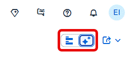
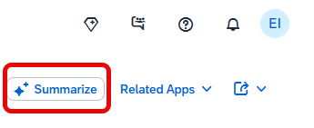

<!-- loio0ec03d463567494cb17d446e2e92c13a -->

# Generative AI Features

SAP Fiori elements provides generative AI features to enhance user experience.

**Prerequisites**

To use these generative AI features in SAP S/4HANA Cloud Public Edition, an additional entitlement and authorization may be required.

<a name="loio0ec03d463567494cb17d446e2e92c13a__section_dxz_wml_32c"/>

## AI-Assisted Easy Filter

The AI-assisted easy filter on the list report allows users to define filter queries using natural language instead of applying filters manually.

For more information, see [Working with the AI-Assisted Easy Filter](https://help.sap.com/docs/SAP_S4HANA_CLOUD/4fc8d03390c342da8a60f8ee387bca1a/804ed39a7dd34720912483ddfb847087.html).

<a name="loio0ec03d463567494cb17d446e2e92c13a__section_u2v_knl_32c"/>

## AI-Assisted Smart Summarization

The AI-assisted smart summarization generates an efficient summary of business information on an object page. This summary can be copied and shared in external collaboration tools.

For more information, see [Working with the AI-Assisted Smart Summarization](https://help.sap.com/docs/SAP_S4HANA_CLOUD/4fc8d03390c342da8a60f8ee387bca1a/6c1bc21f01c840cba336404fb249cf95.html).

