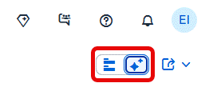
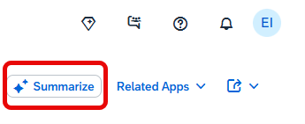
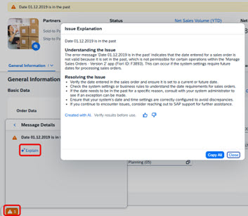

<!-- loio0ec03d463567494cb17d446e2e92c13a -->

# Generative AI Features

SAP Fiori elements provides generative AI features to enhance user experience.

**Prerequisites**

To use these generative AI features in SAP S/4HANA Cloud Public Edition, an additional entitlement and authorization may be required.

<a name="loio0ec03d463567494cb17d446e2e92c13a__section_dxz_wml_32c"/>

## AI-Assisted Easy Filter

The AI-assisted easy filter on the list report allows users to define filter queries using natural language instead of applying filters manually.

For more information, see [Working with the AI-Assisted Easy Filter](https://help.sap.com/docs/SAP_S4HANA_CLOUD/4fc8d03390c342da8a60f8ee387bca1a/804ed39a7dd34720912483ddfb847087.html).

<a name="loio0ec03d463567494cb17d446e2e92c13a__section_u2v_knl_32c"/>

## AI-Assisted Smart Summarization

The AI-assisted smart summarization generates an efficient summary of business information on an object page. This summary can be copied and shared in external collaboration tools.

For more information, see [Working with the AI-Assisted Smart Summarization](https://help.sap.com/docs/SAP_S4HANA_CLOUD/4fc8d03390c342da8a60f8ee387bca1a/6c1bc21f01c840cba336404fb249cf95.html).

## AI-Assisted Error Explanation

The AI-assisted error explanation helps users understand issues they encounter when working on an object page in an SAP Fiori elements application, and provides recommendations how to resolve these issues.

For more information, see [Working with the AI-Assisted Error Explanation](https://help.sap.com/docs/SAP_S4HANA_CLOUD/4fc8d03390c342da8a60f8ee387bca1a/d494f798f7e8492ea9b0eca9359acc16.html).

> ### Note:  
> For information about SAP Fiori elements for OData V2, see [Generative AI Features](generative-ai-features-3ac93d8.md).

