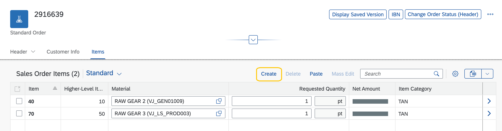

<!-- loiod27ae998a20a4dbead161e3e7c0ac2e8 -->

# Generic Action Buttons in Tables on the Object Page: Additional Considerations

You can use annotations to enable generic actions in tables on the object page.

For more information, see [Adding Actions to Tables](adding-actions-to-tables-b623e0b.md).


## Display of the *Create* Button

The *Create* button is only displayed in the table toolbar when the object page is in *Edit* mode, as shown below.

   
  
**Create Button in Table Toolbar**

  


<a name="loiod27ae998a20a4dbead161e3e7c0ac2e8__section_vmh_vbc_ztb"/>

## Additional Features in SAP Fiori Elements for OData V2

Within your annotations, you set the `creatable-path` to a particular property of the root object \(entity\) in the back-end system that is either `true` or `false`. If the value of this property is `true`, the *Create* button is displayed; if it is `false`, it is hidden. Note that the `creatable-path` must point to a property of the root entity.


### Code Samples

 **creatable-path: Annotation for SAP Fiori elements for OData V2** 

```xml
<NavigationProperty Name="to_ProductText" sap:creatable-path="CanCreateProductText".../>
```

 **creatable-path: Annotation for SAP Fiori elements for OData V4** 

```xml

<Annotations Target="STTA_PROD_MAN.STTA_PROD_MAN_Entities/STTA_C_MP_Product">
    <Annotation Term="Capabilities.InsertRestrictions">
        <Record>
            <PropertyValue Property="NonInsertableNavigationProperties">
                <Collection>
                    <If>                                                      
                        <Not>
                            <Path>CanCreateProductText</Path>
                        </Not>
                        <NavigationPropertyPath>to_ProductText</NavigationPropertyPath>
                    </If>
                </Collection>
            </PropertyValue>
        </Record>
    </Annotation>
</Annotations>
```


### Enable or Disable Delete Button

You can enable or disable the *Delete* button in the toolbar of tables on the object page based on certain conditions in the back-end system. For example, you can disable the *Delete* button for a product's text if the text is in English.

Within your annotation, you set the `deletable-path` for an entity set to point to a particular Boolean property of the entity that has a value of either `true` or `false`. The *Delete* button is enabled if the selected item's property is `true`. If multiple selection is enabled for the table, the button is enabled if at least one selected item is deletable.


<a name="loiod27ae998a20a4dbead161e3e7c0ac2e8__section_wmh_vbc_ztb"/>

## Code Samples


### Annotation for SAP Fiori elements for OData V2

```xml

<EntitySet Name="STTA_C_MP_ProductText"
           EntityType="STTA_PROD_MAN.STTA_C_MP_ProductTextType" 
           sap:deletable-path="Delete_mc" 
           sap:content-version="1"/>
```


### Annotation for SAP Fiori elements for OData V4

> ### Sample Code:  
> XML Annotation
> 
> ```xml
> <Annotations Target="STTA_PROD_MAN.STTA_PROD_MAN_Entities/STTA_C_MP_ProductText">
>    <Annotation Term="Org.OData.Capabilities.V1.DeleteRestrictions">
>         <Record>
>             <PropertyValue Property="Deletable" Path="Delete_mc"/>
>         </Record>
>     </Annotation>
> </Annotations>
> 
> ```

> ### Sample Code:  
> CAP CDS Annotation
> 
> ```
> 
> annotate STTA_PROD_MAN.STTA_C_MP_ProductText with @(
>   Capabilities.DeleteRestrictions : {
>     Deletable : Delete_mc
>   }
> );
> ```

**Related Information**  


[Example: Adding Custom Filter Fields in Table Toolbar](example-adding-custom-filter-fields-in-table-toolbar-e34f78f.md "To add custom filter fields in a table toolbar, follow the steps described below:")

