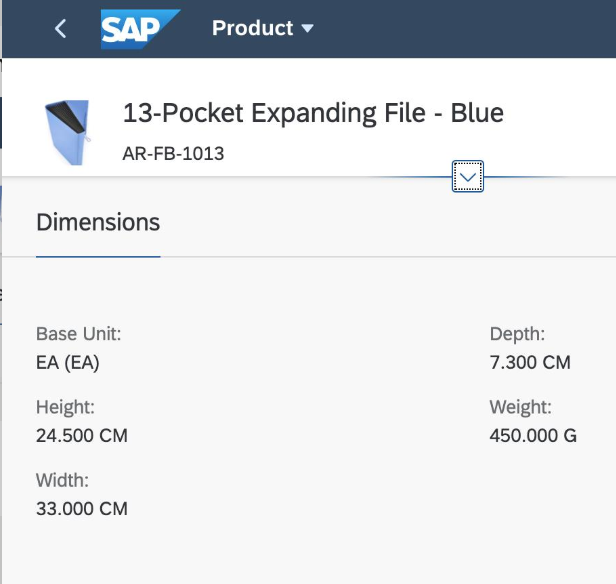
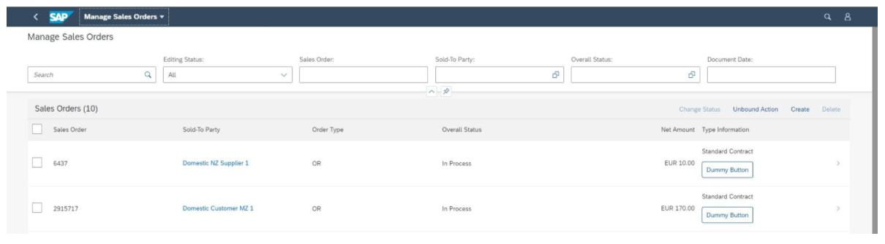
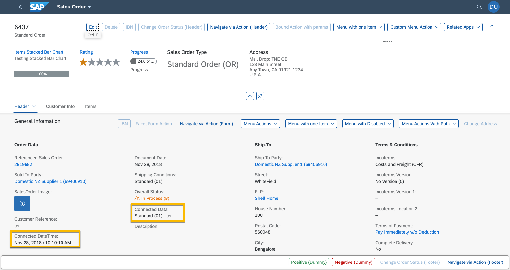
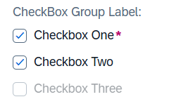

<!-- copy7d7a0c467e944ac8bcac751f8ab1e342 -->

# Grouping of Fields

Application developers can group fields that should be shown together, such as various address fields \(street name, house number, and postal code\).

The grouping can be done in several ways, depending on the use case.


<a name="copy7d7a0c467e944ac8bcac751f8ab1e342__section_lhq_n1g_k4b"/>

## Grouping Fields Using the `UI.FieldGroup` Annotation

Using a `FieldGroup` allows the grouped fields to be shown in a similar manner. The fields are typically arranged one beneath the other, but they can also spill over to the next column if, for example, a form is used. If all of the grouped fields are hidden, their container is hidden as well.


<a name="copy7d7a0c467e944ac8bcac751f8ab1e342__section_m2z_jqt_n4b"/>

## Form Implementation

Use an OData form and pass the `UI.ReferenceFacet` to it. This, in turn, has a `UI.FieldGroup` associated with it.


### `UI.FieldGroup` Definition in Object Page

> ### Sample Code:  
> XML Annotation
> 
> ```xml
> <Annotation Term="UI.FieldGroup" Qualifier="Dimensions">
>    <Record>
>       <PropertyValue Property="Label" String="Dimensions"/>
>       <PropertyValue Property="Data">
>          <Collection>
>             <Record Type="UI.DataField">
>                <PropertyValue Property="Value" Path="BaseUnit"/>
>             </Record>
>             <Record Type="UI.DataField">
>                <PropertyValue Property="Value" Path="Height"/>
>             </Record>
>             <Record Type="UI.DataField">
>                <PropertyValue Property="Value" Path="Width"/>
>             </Record>
>             <Record Type="UI.DataField">
>                <PropertyValue Property="Value" Path="Depth"/>
>             </Record>
>             <Record Type="UI.DataField">
>                <PropertyValue Property="Value" Path="Weight"/>
>             </Record>
>          </Collection>
>       </PropertyValue>
>    </Record>
> </Annotation>
> ```

> ### Sample Code:  
> ABAP CDS Annotation
> 
> ```
> @UI.fieldGroup: [
>   {
>     type: #STANDARD,
>     position: 1 ,
>     qualifier: 'Dimensions',
>     groupLabel: 'Dimensions'
>   }
> ]
> BaseUnit;
> 
> @UI.fieldGroup: [
>   {
>     type: #STANDARD,
>     position: 2 ,
>     qualifier: 'Dimensions'
>   }
> ]
> Height;
> 
> @UI.fieldGroup: [
>   {
>     type: #STANDARD,
>     position: 3 ,
>     qualifier: 'Dimensions'
>   }
> ]
> Width;
> 
> @UI.fieldGroup: [
>   {
>     type: #STANDARD,
>     position: 4 ,
>     qualifier: 'Dimensions'
>   }
> ]
> Depth;
> 
> @UI.fieldGroup: [
>   {
>     type: #STANDARD,
>     position: 5 ,
>     qualifier: 'Dimensions'
>   }
> ]
> Weight;
> 
> ```

> ### Sample Code:  
> CAP CDS Annotation
> 
> ```
> UI.FieldGroup #Dimensions : {
>     $Type : 'UI.FieldGroupType',
>     Label : 'Dimensions',
>     Data : [
>         {
>             $Type : 'UI.DataField',
>             Value : BaseUnit
>         },
>         {
>             $Type : 'UI.DataField',
>             Value : Height
>         },
>         {
>             $Type : 'UI.DataField',
>             Value : Width
>         },
> 	{
>             $Type : 'UI.DataField',
>             Value : Depth
>         },
> 	{
>             $Type : 'UI.DataField',
>             Value : Weight
>         }
>     ]
> }
> 
> ```


### Reference of `UI.FieldGroup` in `UI.Facets`

> ### Sample Code:  
> XML Annotation
> 
> ```xml
> <Annotation Term="UI.Facets">
>    <Collection>
>       <Record Type="UI.ReferenceFacet">
>          <PropertyValue Property="Label" String="Dimensions" />
>          <PropertyValue Property="Target"AnnotationPath="@UI.FieldGroup#Dimensions"/>
>       </Record>
>    </Collection>
> </Annotation>
> ```

> ### Sample Code:  
> ABAP CDS Annotation
> 
> ```
> @UI.Facet: [
>   {
>     label: 'Dimensions',
>     targetQualifier: 'Dimensions',
>     type: #FIELDGROUP_REFERENCE,
>     purpose: #STANDARD
>   }
> ]
> ```

> ### Sample Code:  
> CAP CDS Annotation
> 
> ```
> UI.Facets : [
>     {
>         $Type : 'UI.ReferenceFacet',
>         Label : 'Dimensions',
>         Target : '@UI.FieldGroup#Dimensions'
>     }
> ]
> ```

This groups the fields in a form-like display, as shown in the following screenshot:



> ### Note:  
> -   If there is no `Headerfacet` annotation and if the `Headerinfo` annotation doesn't contain any images, then the expand or collapse button and the pin button are hidden from the object page header.
> 
> -   If a subsection contains only one group and the subsection title is the same as the group title, then the group title is hidden.


<a name="copy7d7a0c467e944ac8bcac751f8ab1e342__section_fmx_nrt_n4b"/>

## Table Implementation

The fields are displayed beneath each other within the table cell. Application developers can add multiple field types within the cell. The annotation-driven design that is used here uses `UI.FieldGroup` inside a `UI.LineItem`.

To enable this feature, do the following:

1.  Add a `UI.DataFieldForAnnotation` under the `LineItem` annotation for the table.

2.  Ensure that the `DataFieldForAnnotation` record refers to a `UI.FieldGroup` annotation, where you can define multiple fields.


The following annotation types are supported:

-   `DataField`

-   `DataFieldForAction`

-   `DataFieldForAnnotation`

    This points either to a data point \(in combination with rating indicators and progress indicators\), or a contact card.


> ### Note:  
> If you use multiple `DataFieldForAction` buttons, you must ensure that you do not show a column header. You achieve this by not specifying a "Label" for the `DataFieldForAnnotation` that is under the `LineItem` definition and holds the `UI.FieldGroup`.


### Linking a `UI.FieldGroup` in the `LineItem` Annotations

> ### Sample Code:  
> XML Annotation
> 
> ```xml
> <Annotation Term="UI.LineItem">
>     <Collection>
>         …………
>         …………
>         <Record Type="UI.DataFieldForAnnotation">
>             <PropertyValue Property="Target" AnnotationPath="@UI.FieldGroup#FieldGroup1" />
>             <PropertyValue Property="Label" String="Type Information"/>
>         </Record>
>         …………
>         …………
>     </Collection>
> </Annotation>
> ```

> ### Sample Code:  
> ABAP CDS Annotation
> 
> ```
> @UI.lineItem: [
>   {
>     label: 'Type Information',
>     type: #AS_FIELDGROUP,
>     valueQualifier: 'FieldGroup1'
>   }
> ]
> producttype;
> ```

> ### Sample Code:  
> CAP CDS Annotation
> 
> ```
> UI.LineItem : [
>     {
>         $Type : 'UI.DataFieldForAnnotation',
>         Target : '@UI.FieldGroup#FieldGroup1',
>         Label : 'Type Information'
>     }
> ]
> 
> ```


### `UI.FieldGroup` Annotation

> ### Sample Code:  
> XML Annotation
> 
> ```xml
> <Annotation Term="UI.FieldGroup" Qualifier="FieldGroup1">
>     <Record>
>         <PropertyValue Property="Data">
>             <Collection>
>                 <Record Type="UI.DataField">
>                     <PropertyValue Property="Value" Path="ContractType"/>
>                 </Record>
>                 <Record Type="UI.DataFieldForAction">
>                     <PropertyValue Property="Label" String="Dummy Button"/>
>                     <PropertyValue Property="Action" String="com.sap.gateway.srvd.sadl_gw_appmusicdr_definition.v0001.SOME_ACTION_2"/>
>                 </Record>
>             </Collection>
>         </PropertyValue>
>     </Record>
> </Annotation>
> ```

> ### Sample Code:  
> ABAP CDS Annotation
> 
> ```
> @UI.fieldGroup: [
>   {
>     type: #STANDARD,
>     position: 1 ,
>     qualifier: 'FieldGroup1'
>   }
> ]
> ContractType;
> 
> @UI.fieldGroup: [
>   {
>     label: 'Dummy Button',
>     dataAction: 'com.sap.gateway.srvd.sadl_gw_appmusicdr_definition.v0001.SOME_ACTION_2',
>     type: #FOR_ACTION,
>     position: 2 ,
>     qualifier: 'FieldGroup1'
>   }
> ]
> contractName;
> 
> ```

> ### Sample Code:  
> CAP CDS Annotation
> 
> ```
> UI.FieldGroup #FieldGroup1 : {
>     Data : [
>         {
>             $Type : 'UI.DataField',
>             Value : ContractType
>         },
>         {
>             $Type : 'UI.DataFieldForAction',
>             Label : 'Dummy Button',
>             Action : 'com.sap.gateway.srvd.sadl_gw_appmusicdr_definition.v0001.SOME_ACTION_2'
>         }
>     ]
> }
> ```

This displays a `DataField` and a dummy button, as shown in the following screenshot:



> ### Note:  
> -   The `UI.FieldGroup` is not supported in grid tables, tree tables, and analytical tables.
> 
> -   If you use a table personalization, users can only filter, sort, and group the semantically connected columns based on the individual properties \(of the same entity type as the `UI.LineItem`\) given in the `UI.FieldGroup` collection.


<a name="copy7d7a0c467e944ac8bcac751f8ab1e342__section_uzp_41g_k4b"/>

## Semantically Connected Fields

Semantically connected fields are displayed side by side to reflect their data relation. Fields can be displayed under a single display name but can be edited separately. If all the semantically connected fields are hidden, the display name is hidden as well. You can use the `UI.ConnectedFields` annotation to display two or more fields side by side.

For more information about semantically connected fields in OData V2, see the [Semantically Connected Fields](grouping-of-fields-cb1748e.md#loiocb1748ea9b984251addc03718d98df35__semanticfieldsv2) subsection in this topic.

For more information about semantically connected fields in OData V4, see the [Semantically Connected Fields](grouping-of-fields-cb1748e.md#loiocb1748ea9b984251addc03718d98df35__semanticfieldsv4) subsection in this topic.

> ### Example:  
> You can maintain date and time as two properties in the back end and show this information in a single form. You can use a delimiter to separate the two values.



> ### Note:  
> The `UI.FieldGroup` annotation is not supported in grid tables, tree tables, and analytical tables.


<a name="copy7d7a0c467e944ac8bcac751f8ab1e342__section_hmt_lb2_4tb"/>

## Additional Features in SAP Fiori Elements for OData V2


### Table Implementation

> ### Note:  
> You can't use a table implementation if you need to display a label alongside each field value.


### Semantically Connected Fields

> ### Sample Code:  
> Annotation for a Connected Field
> 
> ```
> <Annotation Term="com.sap.vocabularies.UI.v1.ConnectedFields" Qualifier="ConnectedDateTime">
>     <Record >
>         <PropertyValue Property="Data">
>             <Record >
>                 <PropertyValue Property="SalesOrderDate">
>                     <Record Type="com.sap.vocabularies.UI.v1.DataField">
>                         <PropertyValue Property="Value" Path="SalesOrderDate"/>
>                     </Record>
>                 </PropertyValue>
>                 <PropertyValue Property="SalesOrderTime">
>                     <Record Type="com.sap.vocabularies.UI.v1.DataField">
>                         <PropertyValue Property="Value" Path="TrialTOD"/>
>                     </Record>
>                 </PropertyValue>
>             </Record>
>         </PropertyValue>
>         <PropertyValue Property="Label" String="Connected DateTime"/>
>         <PropertyValue Property="Template" String="{SalesOrderDate} / {SalesOrderTime}"/>
>     </Record>
> </Annotation>
>  
> <Annotation Term="com.sap.vocabularies.UI.v1.ConnectedFields" Qualifier="ConnectedData">
>     <Record >
>         <PropertyValue Property="Data">
>             <Record >
>                 <PropertyValue Property="PurchaseOrderByCustomer">
>                     <Record Type="com.sap.vocabularies.UI.v1.DataField">
>                         <PropertyValue Property="Value" Path="PurchaseOrderByCustomer"/>
>                     </Record>
>                 </PropertyValue>
>                 <PropertyValue Property="ShippingCondition">
>                     <Record Type="com.sap.vocabularies.UI.v1.DataField">
>                         <PropertyValue Property="Value" Path="ShippingCondition"/>
>                     </Record>
>                 </PropertyValue>
>             </Record>
>         </PropertyValue>
>         <PropertyValue Property="Label" String="Connected Data"/>
>         <PropertyValue Property="Template" String="{ShippingCondition} - {PurchaseOrderByCustomer}"/>
>     </Record>
> </Annotation>
>  
> .....
> <Annotation Term="com.sap.vocabularies.UI.v1.FieldGroup" Qualifier="OrderData">
>     <Record >
>         <PropertyValue Property="Data">
>             <Collection>
>                 <Record Type="com.sap.vocabularies.UI.v1.DataFieldForAnnotation">
>                     <PropertyValue Property="Target" AnnotationPath="@UI.ConnectedFields#ConnectedDateTime"/>
>                     <Annotation Term="UI.Importance" EnumMember="UI.ImportanceType/High"/>
>                 </Record>
>                 <Record Type="com.sap.vocabularies.UI.v1.DataFieldForAnnotation">
>                     <PropertyValue Property="Target" AnnotationPath="@UI.ConnectedFields#ConnectedData"/>
>                     <Annotation Term="UI.Importance" EnumMember="UI.ImportanceType/High"/>
>                 </Record>
>             </Collection>
>         </PropertyValue>
>     </Record>
> </Annotation>
> ```


<a name="copy7d7a0c467e944ac8bcac751f8ab1e342__section_fc5_rb2_4tb"/>

## Additional Features in SAP Fiori Elements for OData V4


### Showing Field Labels in a Field Group inside a Table

You can show the labels of fields inside the table columns when you show a `UI.FieldGroup`. To enable the display of a field label, you can use the `showDataFieldsLabel` setting in the manifest as shown in the following sample code:

> ### Sample Code:  
> ```
> "controlConfiguration": {
>    "@com.sap.vocabularies.UI.v1.LineItem": {
>       columns: {
>          "DataFieldForAnnotation::FieldGroup::myFieldGroup": {
>             "showDataFieldsLabel": true
>          }
>       }
>    }
> }
> ```

You can see what the result looks like in the following screenshot:

  
  
**FieldGroup Column "Sold-To Party" with Field Labels**


For more information about how to find the right key for a column, see [Finding the Right Key for the Anchor](finding-the-right-key-for-the-anchor-6ffb084.md).


### Semantically Connected Fields

> ### Sample Code:  
> XML Annotation
> 
> ```
> ...
> <Annotation Term="UI.FieldGroup" Qualifier="OrderData">
>     <Record Type="UI.FieldGroupType">
>         <PropertyValue Property="Data">
>             <Collection>
>                 <Record Type="UI.DataFieldForAnnotation">
>                     <PropertyValue Property="Target" AnnotationPath="@UI.ConnectedFields#ConnectedOrderDates"/>
>                 </Record>
>             </Collection>
>         </PropertyValue>
>     </Record>
> </Annotation>
> ...
> <Annotation Term="SAP__UI.ConnectedFields" Qualifier="ConnectedOrderDates">
> <Record>
>     <PropertyValue Property="Label" String="Order / Delivery"/>
>     <PropertyValue Property="Template" String="{OrderDate}/{DeliveryDate}"/>
>     <PropertyValue Property="Data">
>         <Record Type="Core.Dictionary">
>             <PropertyValue Property="OrderDate">
>                 <Record Type="SAP__UI.DataField">
>                     <PropertyValue Property="Value" Path="OrderDate"/>
>                 </Record>
>             </PropertyValue>
>             <PropertyValue Property="DeliveryDate">
>                 <Record Type="SAP__UI.DataField">
>                     <PropertyValue Property="Value" Path="DeliveryDate"/>
>                 </Record>
>             </PropertyValue>
>         </Record>
>     </PropertyValue>
> </Record>
> </Annotation>
> ...
> ```

> ### Sample Code:  
> ABAP CDS Annotation
> 
> ```
> annotate view SALESORDER with {
>   ...
>   @UI.facet: [
>     {
>       id: 'idIdentification',
>       type: #IDENTIFICATION_REFERENCE,
>     },
>     ...
>   ]
>   ...
>   @UI: {
>     identification: [
>       { type: #AS_CONNECTED_FIELDS, valueQualifier: 'ConnectedOrderDates' }
>     ],
>     connectedFields: [
>       {
>         name: 'OrderDate',
>         qualifier: 'ConnectedOrderDates',
>         template: '{OrderDate}/{DeliveryDate}',
>         groupLabel: 'Order / Delivery'
>       }
>     ]
>   }
>   OrderDate;
> 
>   @UI: {
>     connectedFields: [
>       { name: 'DeliveryDate', qualifier: 'ConnectedOrderDates' }
>     ]
>   }
>   DeliveryDate;
> 
>   ...
> }
> ```

> ### Sample Code:  
> CAP CDS Annotation
> 
> ```
> annotate SalesOrderService.SalesOrder with @UI : {
> 
>   FieldGroup #OrderData : {
>     Data : [
>       { $Type : 'UI.DataFieldForAnnotation', Target: '@UI.ConnectedFields#ConnectedOrderDates' }
>     ]
>   },
>   ...
> 
>   ConnectedFields #ConnectedOrderDates: {
>     $Type   : 'UI.ConnectedFieldsType',
>     Label   : 'Order / Delivery',
>     Template: '{OrderDate}/{DeliveryDate}',
>     Data    : {
>       $Type        : 'Core.Dictionary',
>       OrderDate    : { $Type : 'UI.DataField', Value : OrderDate },
>       DeliveryDate : { $Type : 'UI.DataField', Value : DeliveryDate }
>     }
>   },
>   ...
> }
> ```

> ### Restriction:  
> Connected fields can only be configured in sections that belong to a form, so connected fields cannot be configured in a header section.


### Navigation with Semantically Connected Fields

You can render semantically connected fields as a link to enable navigation using these fields. Note that you need to define the navigation details for the data fields that make up the semantically connected fields \(that is, are part of the `ConnectedFields` annotation\).

The following types of navigation are allowed:

-   `DataFieldWithURL`
-   `SemanticObject` associated with the data field
-   `DataFieldWithIntentBasedNavigation` \(with `Action` as an optional term\)
-   `DataFieldWithNavigationPath`

For more information about how to configure navigation using fields, see [Navigation from an App \(Outbound Navigation\)](navigation-from-an-app-outbound-navigation-d782acf.md).


### Merging the `TextArea` Label with the Section or Subsection Title

By default, the `TextArea` label is always displayed. However, if `UI.FieldGroup` has only one `UI.MultiLineText`-based property and no other controls, the label of the corresponding `TextArea` control can be hidden. To do this, in the `manifest.json` file, set `useSingleTextAreaFieldAsNotes` to `true`.

When this setting is enabled, only the section or subsection title is displayed. However, you must ensure that a meaningful label is assigned to the text area control as it is accessed by screen reader programs.

> ### Note:  
> The setting is at section-level and applies for all text area controls within the section. However, if a text area is marked as mandatory, the label is always visible in edit mode, regardless of the configuration.

> ### Sample Code:  
> `manifest.json`
> 
> ```
> "sap.ui5": {
>         "routing": {
>             "targets": {
>                 "SalesOrderManageObjectPage": {
>                     "options": {
>                         "settings": {
>                             "content": {
>                                 "body": {
>                                     "sections": {
>                                         "ReferenceFacet1": {
>                                             "useSingleTextAreaFieldAsNotes": true
>                                         }
>                                     }
>                                 }
>                             }
>                         }
>                     }
>                 }
>             }
>         }
>     }
> ```


### Grouping Checkboxes

You can group one or more checkboxes together under a shared label in the `UI.FieldGroup` section of the object page.

See the following screenshots for the appearance of checkbox groups in display and edit modes in vertical layout:




You can define a checkbox group in an object page section with a `UI.FieldGroup`. To group checkbox fields, configure an additional `UI.FieldGroup` within the `UI.FieldGroup`. The `UI.FieldGroup` label is shown as the label for the entire checkbox group. Each individual checkbox within the group is a Boolean field with its own label.

> ### Restriction:  
> The following restrictions apply:
> 
> -   Adding checkbox groups to header forms, filter bars, or tables is not supported.
> 
> -   Only Boolean properties are allowed in a checkbox group.
> 
> -   Dynamic instantiation of checkbox groups is not supported.

> ### Sample Code:  
> XML Annotation
> 
> ```
> 
> <Annotation Term="UI.FieldGroup" Qualifier="GeneralInformation">
>     <Record Type="UI.FieldGroupType">
>         <PropertyValue Property="Label" String="Line item data"/>
>         <PropertyValue Property="Data">
>             <Collection>
>                 <Record Type="UI.DataFieldForAnnotation">
>                     <PropertyValue Property="Target" AnnotationPath="@UI.FieldGroup#CheckBoxGroup"/>
>                 </Record>
>             </Collection>
>         </PropertyValue>
>     </Record>
> </Annotation>
> <Annotation Term="UI.FieldGroup" Qualifier="CheckBoxGroup">
>     <Record Type="UI.FieldGroupType">
>         <PropertyValue Property="Label" String="Standard CheckBoxGroup"/>
>         <PropertyValue Property="Data">
>             <Collection>
>                 <Record Type="UI.DataField">
>                     <PropertyValue Property="Value" Path="Boolean1"/>
>                     <PropertyValue Property="Label" String="Checkbox One"/>
>                 </Record>
>                 <Record Type="UI.DataField">
>                     <PropertyValue Property="Value" Path="Boolean2"/>
>                     <PropertyValue Property="Label" String="Checkbox Two"/>
>                 </Record>
>                 <Record Type="UI.DataField">
>                     <PropertyValue Property="Value" Path="Boolean3"/>
>                     <PropertyValue Property="Label" String="Checkbox Three"/>
>                 </Record>
>             </Collection>
>         </PropertyValue>
>     </Record>
> </Annotation>
> 
> <Annotations Target="sap.fe.core.FieldGroup.Products/Boolean1">
>     <Annotation Term="Common.FieldControl" Int="7"/>
> </Annotations>
> <Annotations Target="sap.fe.core.FieldGroup.Products/Boolean3">
>     <Annotation Term="Common.FieldControl">
>         <If>
>                 <Path>Boolean2</Path>
>                 <Int>0</Int>
>                 <Int>3</Int>
>         </If>
>     </Annotation>
> </Annotations>
> 
> ```

> ### Sample Code:  
> ABAP CDS Annotation
> 
> ```
> Define the following in the metadata extension of the data definition containing the Boolean fields:
> ...
> @UI: {
>     fieldGroup: [
>         { qualifier: 'GeneralInformation', type: #AS_FIELDGROUP, valueQualifier: 'CheckBoxGroup', position: 10, label: 'CheckBox Group Label' },
>         { qualifier: 'CheckBoxGroup', position: 10, label: 'Checkbox One' }
>     ]
> }
> Boolean1;
>     @UI: {
>         fieldGroup: [
>             { qualifier: 'CheckBoxGroup', position: 20, label: 'Checkbox Two'  }
>         ]
>     }
> Boolean2;
>     @UI: {
>         fieldGroup: [
>             { qualifier: 'CheckBoxGroup', position: 30, label: 'Checkbox Three'  }
>         ]
>     }
> Boolean3;
> ...
> 
> ```

You must define the dynamic-field control of the Boolean fields in the behavior definition. For more information, see [Developing Feature Control](https://help.sap.com/docs/abap-cloud/abap-rap/developing-feature-control).

> ### Sample Code:  
> CAP CDS Annotation
> 
> ```
> 
> ...
> Boolean1            : Boolean @Common.FieldControl: #Mandatory;
> Boolean2            : Boolean;
> Boolean3            : Boolean @Common.FieldControl: (Boolean2 ? 0 : 3);
> // FieldControl can also be set as path based reference to property or expression binding
> ...
> FieldGroup #CheckBoxGroup: {
>     $Type: 'UI.FieldGroupType',
>     Label: 'CheckBox Group Label',
>     Data : [
>         {
>             $Type: 'UI.DataField',
>             Value: Boolean1,
>             Label: 'Checkbox One'
>         },
>         {
>             $Type: 'UI.DataField',
>             Value: Boolean2,
>             Label: 'Checkbox Two'
>         },
>         {
>             $Type: 'UI.DataField',
>             Value: Boolean3, 
>             Label: 'Checkbox Three'
>         }
>     ]
> },
> ...
> FieldGroup #GeneralInformation: {
>     Label: 'Line item data',
> 	Data : [
>     {
>         $Type : 'UI.DataFieldForAnnotation',
>         Target: '@UI.FieldGroup#CheckBoxGroup'
>     }
>     ]
> }
> 
> ```

You can align the boxes horizontally by adding the horizontal layout setting to the `manifest.json` file.

  
  
**Checkbox Group in Display Mode \(Horizontal Layout\)**

")

> ### Sample Code:  
> `manifest.json`
> 
> ```
> 
> "options": {
>     "settings": {
>          "entitySet": "Products",
>          "content": {
>              "body": {
>                 "sections": {
>                      "@com.sap.vocabularies.UI.v1.FieldGroup#CheckBoxGroups": {
>                          "subSections": {
>                             "@com.sap.vocabularies.UI.v1.FieldGroup#CheckBoxGroupH1": {
>                                 "horizontalLayout": true
>                  }
>                }
>              }
>            }
>          }
>       }
>     }
>   }
> }
> 
> ```

> ### Note:  
> Configuring a mandatory checkbox group that requires users to select at least one checkbox is not supported. Use the `MultiComboBox` property instead. For more information, see [Value Help as a Dropdown List](https://sapui5untested.int.sap.eu2.hana.ondemand.com/#/topic/2a0a630e50c7472b803fb94dab922d18).


<a name="copy7d7a0c467e944ac8bcac751f8ab1e342__section_yr3_gt2_m4b"/>

## Related Links

For more information, see the section about [forms and form groups](https://experience.sap.com/fiori-design-web/form/), and about [forms in the object page](https://experience.sap.com/fiori-design-web/object-page/#forms) in the SAP Fiori design guidelines.

