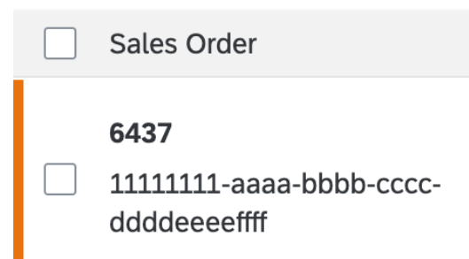
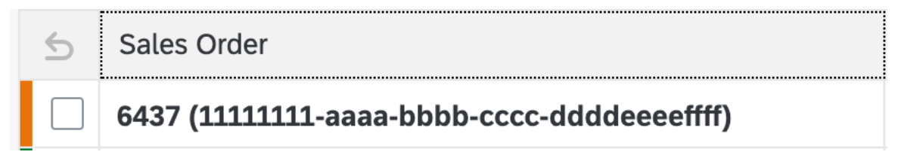

<!-- loioaa2793cd877a4ecebc35d335920ee145 -->

# Handling Semantic Key Fields

Semantic key fields in tables are displayed with a special logic.

In list reports, semantic key fields are displayed with the following logic:

-   For responsive tables, SAP Fiori elements uses `ObjectIdentifier`. The part in bold will be the text followed by the ID in the next line. If there is no text,the ID will be shown in bold in the first line. In this case, there will be no second line. The screenshot below shows the use case for both a text and an ID in a responsive table:

      

-   For other tables, SAP Fiori elements uses a label and renders the entire content in bold. SAP Fiori elements also reads the associated text and combines the information in accordance with how the `TextArrangement` is configured. The behavior is as follows:

    -   If no `TextArrangement` is configured, SAP Fiori elements for OData V2 shows the ID along with the text in parenthesis if text is available, and if no text is available, only the ID.

    -   If no `TextArrangement` is configured, SAP Fiori elements for OData V4 shows only text, and if no text is available, only the ID.

    The screenshot below shows the use case for `TextFirst` arrangement in a grid table:

      

> ### Note:  
> In responsive tables, if a semantic object is linked to the field, the `ObjectIdentifier` will not be used. Instead, the ID is shown as a link. In other tables, the entire content \(that is, the ID and the text\) will be a link with no wrapping.

<a name="loioaa2793cd877a4ecebc35d335920ee145__section_pvt_y54_npb"/>

## Additional Features in SAP Fiori Elements for OData V4

The logic for handling semantic key fields is applicable to object pages and subobject pages as well.

**Related Information**  

[Editing Status](editing-status-668ea18.md "The editing status reflects the state of the object or entry in terms of the processing cycle. For example, it can give the user information about whether the item can be accessed, or about its level of completion.")

