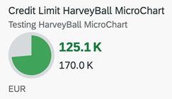

<!-- loiode4f8bf44b9846ccace1d78f3915aa81 -->

# Harvey Micro Chart



> ### Note:  
> A single measure value is shown against a maximum value. For more information about this chart type, see [Samples](https://ui5.sap.com/1.82.5/#/entity/sap.suite.ui.microchart.HarveyBallMicroChart).


<a name="loiode4f8bf44b9846ccace1d78f3915aa81__section_llx_jhq_qmb"/>

## UI.Chart Annotation

The `UI.Chart Title` property is used for the title.

The `UI.Chart Description` property is used for the subtitle.

> ### Sample Code:  
> XML Annotation
> 
> ```xml
> 
> <Annotation Term="UI.Chart" Qualifier="SpecificationWidthHarveyChart">
>     <Record>
>         <PropertyValue EnumMember="UI.ChartType/Pie" Property="ChartType" />
>         <PropertyValue Property="Title" String="Sold to Produced Harvey Chart" />
>         <PropertyValue Property="Description" String="Harvey Chart" />
>         <PropertyValue Property="Measures">
>             <Collection>
>                 <PropertyPath>Sold</PropertyPath>
>             </Collection>
>         </PropertyValue>
>         <PropertyValue Property="MeasureAttributes">
>             <Collection>
>                 <Record Type="UI.ChartMeasureAttributeType">
>                     <PropertyValue Property="DataPoint" AnnotationPath="@UI.DataPoint" />
>                 </Record>
>             </Collection>
>         </PropertyValue>
>     </Record>
> </Annotation>
> ```

> ### Sample Code:  
> ABAP CDS Annotation
> 
> ```
> 
> @UI.Chart: [
>   {
>     title: 'Sold to Produced Harvey Chart',
>     description: 'Harvey Chart',
>     chartType: #PIE,
>     measures: [
>       'Sold'
>     ],
>     measureAttributes: [
>       {
>         measure: 'Sold',
>         role: #AXIS_1,
>         asDataPoint: true
>       }
>     ],
>     qualifier: 'SpecificationWidthHarveyChart'
>   }
> ]
> annotate view STTA_C_MP_PRODUCT with {
> 
> }
> 
> ```

> ### Sample Code:  
> CAP CDS Annotation
> 
> ```
> 
> UI.Chart #SpecificationWidthHarveyChart : {
>     ChartType : #Pie,
>     Title : 'Sold to Produced Harvey Chart',
>     Description : 'Harvey Chart',
>     Measures : [
>         Sold
>     ],
>     MeasureAttributes : [
>         {
>             $Type : 'UI.ChartMeasureAttributeType',
>             DataPoint : '@UI.DataPoint'
>         }
>     ]
> }
> 
> ```


<a name="loiode4f8bf44b9846ccace1d78f3915aa81__section_bgx_jhq_qmb"/>

## UI.DataPoint Annotation

> ### Sample Code:  
> XML Annotation
> 
> ```xml
> <Annotation Term="UI.DataPoint">
>     <Record>
>         <PropertyValue Path="Sold" Property="Value" />
>         <PropertyValue Path="Produced" Property="MaximumValue" />
>         <PropertyValue Path="criticalityValue" Property="Criticality" />
>     </Record>
> </Annotation>
> 
> ```

> ### Sample Code:  
> ABAP CDS Annotation
> 
> ```
> 
> @UI.dataPoint: {
>   criticality: 'criticalityValue',
>   maximumValue: 20
> }
> Sold;
> ```

> ### Sample Code:  
> CAP CDS Annotation
> 
> ```
> 
> UI.DataPoint : {
>     Value : Sold,
>     MaximumValue : Produced,
>     Criticality : criticalityValue
> }
> ```

For semanting coloring, only the `Criticality` property is supported.

Mandatory:

1.  `UI.Chart` → `ChartType`: “`Pie`”
2.  `UI.Chart` → `Measures`
3.  `UI.Chart` → `MeasureAttributes` → `DataPoint`
4.  `UI.DataPoint`→ `MaximumValue`
5.  In case semantic coloring is required, use `UI.DataPoint` → `Criticality`

