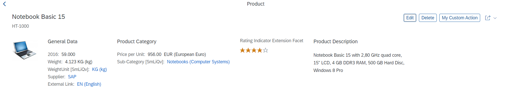
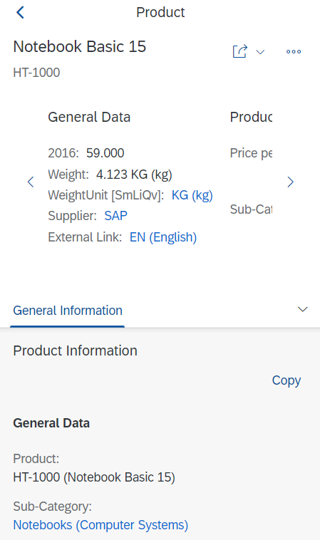
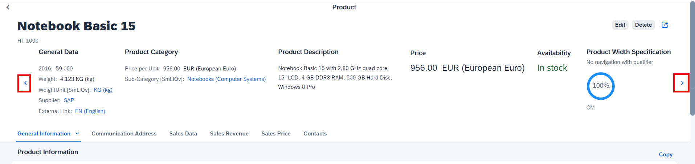

<!-- loio17dbd5b7a61e4cdcb079062e976cd63f -->

# Header Facets

You can include various types of header facets in your object page header, for example to display contact data or a rating indicator.

You can use the annotation term `UI.HeaderFacets` to define which information is displayed in the header. The `UI.HeaderFacets` annotation contains a collection of `UI.ReferenceFacet`, with each reference facet, corresponding to a header element displayed on the UI. The following sample code shows such a structure:

> ### Sample Code:  
> XML Annotation
> 
> ```xml
> <Annotation Term="UI.HeaderFacets">
>     <Collection>
>         ...
>         <Record Type="UI.ReferenceFacet">
>             <PropertyValue Property="Target" AnnotationPath="@UI.DataPoint#Price" />
>         </Record>
>         ...
>         <Record Type="UI.ReferenceFacet">
>             <PropertyValue Property="Target" AnnotationPath="to_StockAvailability/@UI.DataPoint#StockAvailability" />
>         </Record>
>         ...
>     </Collection>
> </Annotation>
> 
> ```

> ### Sample Code:  
> ABAP CDS Annotation
> 
> ```
> @UI.Facet: [
>   {
>     targetQualifier: 'Price',
>     type: #DATAPOINT_REFERENCE,
>     purpose: #HEADER
>   },
>   {
>     targetQualifier: 'StockAvailability',
>     targetElement: 'TO_STOCKAVAILABILITY',
>     type: #DATAPOINT_REFERENCE,
>     purpose: #HEADER
>   }
> ]
> Test;
> 
> ```

> ### Sample Code:  
> CAP CDS Annotation
> 
> ```
> annotate c_salesordermanage_sd.SalesOrderManage with @(UI : {
>             HeaderFacets                                    : [
>                             {
>                                            $Type             : 'UI.ReferenceFacet',
>                                            Label             : 'Price',
>                                            ID                : 'Price',
>                                            Target            : '@UI.DataPoint#Price'
>                             },
>                             {
>                                            $Type             : 'UI.ReferenceFacet',
>                                            Label             : 'Stock Availability',
>                                            ID                : 'StockAvailability',
>                                            Target            : 'to_StockAvailability@UI.DataPoint#StockAvailability'
>                             }
>             ]
> })
> 
> ```

On desktops, the dynamic or static header is used with the responsive layout.



On mobile devices, a header container is used with the horizontal layout, providing scrolling for header facets.



You can see the object page header facets within a horizontal scroll container.


<a name="loio17dbd5b7a61e4cdcb079062e976cd63f__section_dn1_5zh_nlb"/>

## Additional Features in SAP Fiori Elements for OData V2

The horizontal scroll container is the default on mobile devices, while the dynamic or static header is the default on desktops.



To enable the carousel header on desktops, set `"showHeaderAsCarouselOnDesktop": true` in the `manifest.json` file, as shown in the following sample code:

> ### Sample Code:  
> manifest.json
> 
> ```
> "sap.ui.generic.app": {
>        ………
>                 "pages": [
>                     {
>                         "entitySet": "STTA_C_MP_Product",
>                         "component": {
>                             "name": "sap.suite.ui.generic.template.ObjectPage",
>                             "settings": {
>                                 "showHeaderAsCarouselOnDesktop": true,
>                                …….
>                             }
>                         },
>                         "pages": [
>                             {
>                                 "navigationProperty": "to_ProductText",
>                                 "entitySet": "STTA_C_MP_ProductText",
>                                 "component": {
>                                     "name": "sap.suite.ui.generic.template.ObjectPage",
>                                     "settings": {
>                                         "showHeaderAsCarouselOnDesktop": true,
> 		    ……………
>                                     }
>                                 }
>                             }
>                         ]
>                     }
>                 ]
>             }
>         ]
>     }
> }
> 
> ```

> ### Note:  
> This setting must be specified at each component level in the `manifest.json` file.


<a name="loio17dbd5b7a61e4cdcb079062e976cd63f__section_mjc_ccs_hnb"/>

## Additional Features in SAP Fiori Elements for OData V4


### Stashing

If an application developer has defined header facets as `stashed` in the `manifest.json` file, they are initially not visible on the UI. Such header facets are not loaded when the application is started. Key users can add these stashed header facets using the key user adaptation at runtime and make them visible for end users on the object page header.

For more information, see to [Adapting the UI](adapting-the-ui-59bfd31.md).

