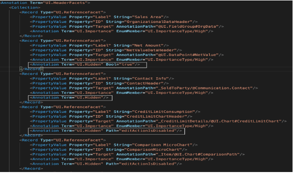
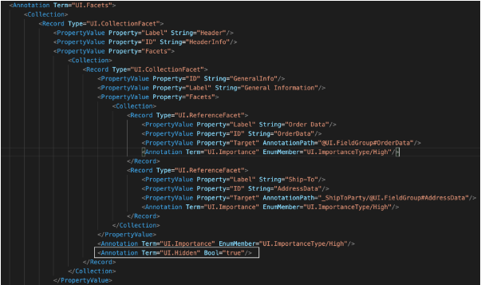
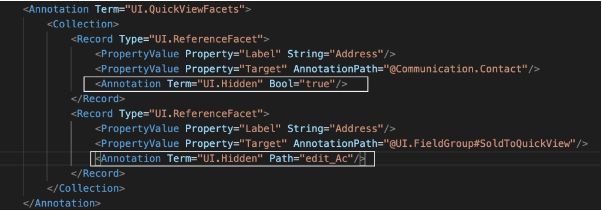
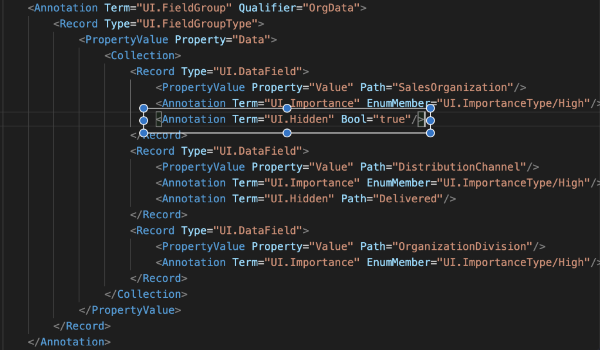
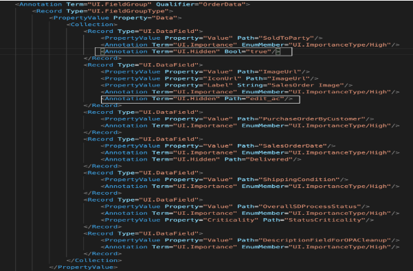
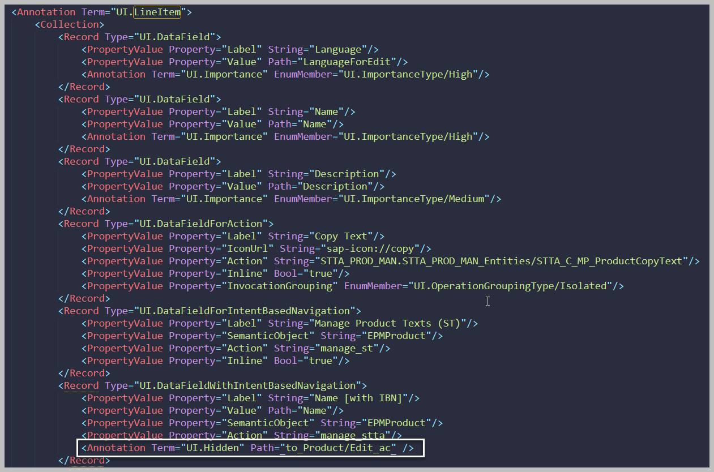
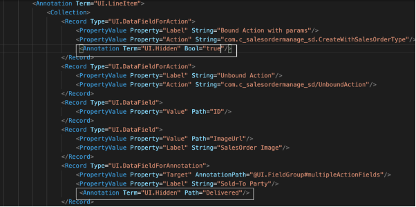

<!-- loioca00ee45fe344a73998f482cb2e669bb -->

# Hiding Features Using the UI.Hidden Annotation

You can use the `UI.Hidden` annotation to hide or display specific features on the object page.

The default value of the `UI.Hidden` annotation is `true`, that is, a feature using the `UI.Hidden` annotation term is not visible on the UI. These are the values you can set:

<table>
<tr>
<th valign="top">

Annotation

</th>
<th valign="top">

System Behavior

</th>
</tr>
<tr>
<td valign="top">

`Hiding Features Using<Annotation Term="UI.Hidden" Bool="false"/>`

</td>
<td valign="top">

The feature is visible

</td>
</tr>
<tr>
<td valign="top">

`<Annotation Term="UI.Hidden" Bool="true"/>`

</td>
<td valign="top">

The feature is not visible

</td>
</tr>
<tr>
<td valign="top">

`<Annotation Term="UI.Hidden" Path="Edit_ac"/>`

</td>
<td valign="top">

The feature is visible if the path evaluates to `false` and is not visible if the path evaluates to `true`.

> ### Note:  
> The path must point to a Boolean property. Expression bindings, for instance, using a negation with !, are not supported behind the path. For more information, see [Expression Binding](../04_Essentials/expression-binding-daf6852.md).

</td>
</tr>
<tr>
<td valign="top">

`<Annotation Term="UI.Hidden" />` 

</td>
<td valign="top">

The default value is `true` so the feature will not be visible

</td>
</tr>
</table>

<a name="loioca00ee45fe344a73998f482cb2e669bb__section_wr1_hxz_dnb"/>

## Header Facets on Object Page

You can hide header facets as shown below:

  

<a name="loioca00ee45fe344a73998f482cb2e669bb__section_ng3_mxz_dnb"/>

## Sections on Object Page

You can hide an entire section. To hide one subsection, you can hide content within a section. See also the section about DataField Records in Header Facets in this topic.

   
  
**Sections on Object Page**

  

  

<a name="loioca00ee45fe344a73998f482cb2e669bb__section_mxq_rxz_dnb"/>

## Content in Quick Views

You can hide content in quick views, such as field groups like this:

   
  
**Field Groups in Quick Views on Object Page**

  

  

You can also use this annotation to hide the content in quick views in the list report.

<a name="loioca00ee45fe344a73998f482cb2e669bb__section_ivf_xxz_dnb"/>

## DataField Records in Header Facets

You can hide DataField records, for example, UI.DataField, UI.DataFieldForAnnotation in facets as shown below:

   
  
**DataField Records in Header Facets**

  

  

<a name="loioca00ee45fe344a73998f482cb2e669bb__section_odp_cyz_dnb"/>

## DataField Records in Facets

You can hide DataField records, for example, UI.DataField, UI.DataFieldForAnnotation in facets as shown below:

   
  
**DataField Records in Facets**

  

  

<a name="loioca00ee45fe344a73998f482cb2e669bb__section_bnn_hyz_dnb"/>

## Additional Features in SAP Fiori Elements for OData V2

**Header Facets on the Object Page**

You cannot use the `UI.Hidden` annotation to hide the entire `UI.FieldGroup` and `UI.Identification`. If you want to hide these, you have to hide all `DataField` records in them.

**DataField Records in Facets**

You cannot use the `UI.Hidden` annotation to hide the entire `UI.FieldGroup` and `UI.Identification`. If you want to hide these, you have to hide all `DataField` records within them or use the `UI.Hidden` to hide the wrapper around the `FieldGroup` which is normally the `ReferenceFacet` or the `DataFieldForAnnotation` as shown in the examples in this page.

**DataField Records in Tables**

To hide table columns, the `UI.Hidden` path needs to refer to the property of the header instance, for example:

`<Annotation Term="UI.Hidden" Path="to_Product/Edit_ac">`

In the following example, `STTA_C_MP_Product` is the entity set of the object page header and `STTA_C_MP_ProductText` is the entity set of the smart table on the object page, and `to_Product` is the navigation property from `STTA_C_MP_ProductText` to `STTA_C_MP_Product`.

  
  
**DataField Records in Tables**

  

  

**Notes on Hiding DataField Records**

-   Even if you hide all determining actions in the footer, the footer is still displayed on the UI since it is required to show any bound messages coming from the back end. This also applies to determining actions added via the manifest.

-   The *See More* button is visible even if the content within it is hidden.

<a name="loioca00ee45fe344a73998f482cb2e669bb__section_lvf_5yz_dnb"/>

## Additional Features in SAP Fiori Elements for OData V4

**Header Facets on the Object Page**

You cannot use the `UI.Hidden` annotation to hide the entire `UI.FieldGroup` and `UI.Identification`. If you want to hide these, you have to hide all `DataField` records in them or use the `UI.Hidden` to hide the wrapper around the `FieldGroup` which is normally the `ReferenceFacet` or the `DataFieldForAnnotation` as shown in the examples in this page.

**DataField Records in Facets**

You cannot use the `UI.Hidden` annotation to hide the entire `UI.FieldGroup` and `UI.Identification`. If you want to hide these, you have to hide all `DataField` records within them or use the `UI.Hidden` to hide the wrapper around the `FieldGroup` which is normally the `ReferenceFacet` or the `DataFieldForAnnotation` as shown in the examples in this page.

**DataField Records in Tables**

If `UI.Hidden` is provided a static `true` value for any field, then the column is not rendered at all. But if there is a path based value for this, the field is not shown for the instances for which the `UI.Hidden` evaluates to `true`.

> ### Note:  
> For a path based value for `UI.Hidden`, even if the path evaluates to `true` for all the rows, only the field is hidden and not the entire table column.

  
  
**DataField Records in Tables**

  

  

> ### Note:  
> Even if you hide all determining actions in the footer, the footer is still displayed on the UI since it is required to show any bound messages coming from the back end.

