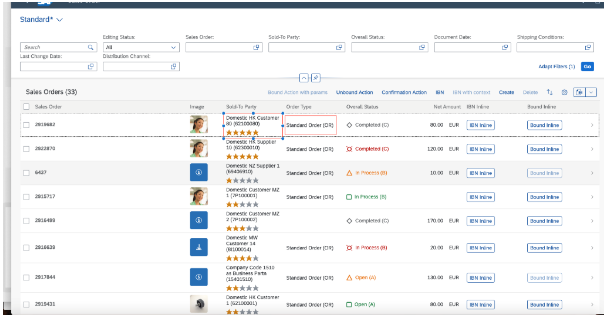

<!-- loiofe453464a121454ab58884f0739c22f9 -->

# Hiding Table Columns Using the `UI.Hidden` Annotation

The `UI.Hidden` annotation allows you to hide entire columns or specific fields within columns in SAP Fiori elements for OData V4. Use this feature to dynamically control which data appears in your tables based on business logic or user context.

You can hide the table columns or specific fields within the table column in analytical list page, list report page, and object page tables.

To hide the entire table column, set the `UI.Hidden` annotation value for any field as static `true`. To hide a specific field of a table column, set the `UI.Hidden` annotation value as a path-based value, and the fields for which `UI.Hidden` evaluates to `true` are hidden. For more information, see [Hiding Features Using the UI.Hidden Annotation](hiding-features-using-the-ui-hidden-annotation-ca00ee4.md).

> ### Note:  
> If the path-based value for `UI.Hidden` evaluates to `true` for all rows, then only the fields are hidden and not the entire column.

  
  
**DataField Records in Tables**



> ### Sample Code:  
> XML Annotation
> 
> ```
> <Annotation Term="UI.LineItem">
>     <Collection>
>         <Record Type="UI.DataFieldForAnnotation">
>             <PropertyValue Property="Target" AnnotationPath="@UI.FieldGroup#multipleActionFields" />
>             <PropertyValue Property="Label" String="Sold-To Party" />
>             <Annotation Term="UI.Hidden" Path="Delivered" />
>         </Record>
>     </Collection>
> </Annotation>
> 
> ```

> ### Sample Code:  
> ABAP CDS Annotation
> 
> ```
> @UI.lineItem: [{
>     type: #AS_FIELDGROUP,
>     valueQualifier: 'multipleActionFields',
>     label: 'Sold-To Party',
>     hidden: #( 'Delivered' )
> }]
> TEST;
> 
> ```

> ### Sample Code:  
> CAP CDS Annotation
> 
> ```
> LineItem: {
>     $value: [
>         {
>             $Type: 'UI.DataFieldForAnnotation',
>             Target: '@UI.FieldGroup#multipleActionFields',
>             Label: 'Sold-To Party',
>             ![@UI.Hidden]: Delivered
>         }
>     ]
> }
> 
> ```

