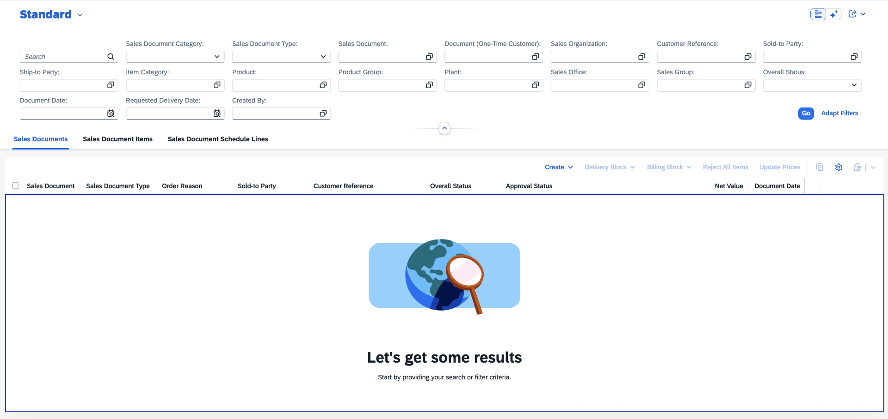
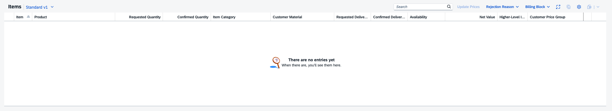

<!-- loiof9925b63da5443afb7d3b50abb932cf2 -->

# Illustrated Message When No Data Is Found

SAP Fiori elements displays an illustrated message when no data is found for a table.

The illustration, the title of the message and its description depend on the situation in which they are displayed: no items created within the table, applied filters, or search query.

On the list report page, the size of the illustrated message adapts to the available space for the table, as shown in the following screenshot:



On the object page in anchor bar mode, the size of the illustrated message is reduced to keep optimal information density, as shown in the following screenshot:



In icon tab bar mode, if the section contains only a table, the size of the illustrated message adapts to the available space for the table similarly to the list report.

The following illustrated message texts are displayed by default:

-   When opening a list report without autoload, an illustrated message is displayed with *Let’s get some results* as the title and *Start by providing your search or filter criteria.* as the description.
-   When no filters are applied and no data is found on the list report page, an illustrated message is displayed with *No results found* as the title and *Start by providing your search or filter criteria.* as the description.

-   When filters are applied and the search shows no results, an illustrated message is displayed with *No results found* as the title and *Try changing your filter criteria.* as the description.

-   When the table is used in multi-view mode and no data is found, an illustrated message is displayed with *No no results found* as the title and *Try changing the view or filter criteria.* as the description.

-   When no search nor filters are applied and no data is found on the object page, an illustrated message is displayed with *No items available* as the title and *When there are, you'll find them here.* as the description.


You can override standard illustrated message texts by adding specific keys to the i18n file of the list report page and object page. For a list of the keys, see [Localization of UI Texts](localization-of-ui-texts-b8cb649.md).


<a name="loiof9925b63da5443afb7d3b50abb932cf2__section_rqr_4qm_vcc"/>

## Additional Features in SAP Fiori Elements for OData V4

You can adapt the description to suit the use case of your application as described in [Maintaining Standard Texts for Tables](maintaining-standard-texts-for-tables-aacfac5.md).

You can use the manifest setting `useTextForNoDataMessages` to display a text instead of an illustrated message on the object page, as shown in the following code sample:

> ### Sample Code:  
> `manifest.json`
> 
> ```
> 
> "SalesOrderManageObjectPage": {
>     "type": "Component",
>     "id": "SalesOrderManageObjectPage",
>     "name": "sap.fe.templates.ObjectPage",
>     "options": {
>         "settings": {
>             "contextPath": "/SalesOrderManage",
>             "enhanceI18n": "i18n/SalesOrderObjectPage.properties",
>             "variantManagement": "Control",
>             "showRelatedApps": true,
>             "sectionLayout": "Tabs",
>             "useTextForNoDataMessages": true,
>             "controlConfiguration": {
> ...
>             }
>         }
>     }
> }
> 
> ```

This option is applied to all tables within the page.

When using this option, the default texts must be overridden by the application using keys listed in [Localization of UI Texts](localization-of-ui-texts-b8cb649.md).


### Adding Actions to an Illustrated Message

You can add additional actions to illustrated messages to guide the end user when no data is displayed within a table. To do so, use the `beforeRebindTable` extension point.

> ### Sample Code:  
> `manifest.json`
> 
> ```
> "targets": {
>     "sample": {
>         "type": "Component",
>         "id": "Default",
>         "name": "sap.fe.templates.ObjectPage",
>         "level": 1,
>         "options": {
>             "settings": {
>                 "contextPath": "/RootEntity",
>                 "editableHeaderContent": false,
>                 "variantManagement": "Control",
>                 "controlConfiguration": {
>                     "_Child/@com.sap.vocabularies.UI.v1.LineItem": {
>                         "tableSettings": {
>                             "beforeRebindTable": ".extension.sap.fe.core.fpmExplorer.OPExtend.onTableRefresh"
>                         }
>                     }
>                 }
>             }
>         }
>     }
> }
> ```

Within the callback function, you can define the illustrated message to include actions to be proposed to the end user. The illustrated message is applied to the table using the `setNoData` method of the table, as shown in the following sample code:

> ### Sample Code:  
> ```
> sap.ui.define(
>     [
>         "sap/ui/core/mvc/ControllerExtension",
>         "sap/ui/model/Filter",
>         "sap/ui/model/FilterOperator",
>         "sap/m/IllustratedMessage",
>         "sap/m/IllustratedMessageType",
>         "sap/m/Button",
>         "sap/m/MessageToast",
>         "sap/m/IllustratedMessageSize"
>     ],
>     function (
>         ControllerExtension,
>         Filter,
>         FilterOperator,
>         IllustratedMessage,
>         IllustratedMessageType,
>         Button,
>         MessageToast,
>         IllustratedMessageSize
>     ) {
>         "use strict";
> 
>         return ControllerExtension.extend("sap.fe.core.fpmExplorer.OPExtend", {
>             onTableRefresh: function (event) {
>                 var collectionBindingInfoAPI = event.getParameter("collectionBindingInfo");
>                 var table = this.getView().byId("fe::table::_Child::LineItem::Table");
>                 var illustratedMessage = new IllustratedMessage();
>                 var showDialogNoData = function () {
>                     return MessageToast.show("Action when No Data in edit mode");
>                 };
>                 var showDialogFilterSearch = function () {
>                     return MessageToast.show("Action when No Data with filter or search");
>                 };
> 
>                 //Filters or Search applied
>                 if (
>                     (collectionBindingInfoAPI.getFilters() && collectionBindingInfoAPI.getFilters().aFilters.length > 0) ||
>                     collectionBindingInfoAPI.collectionBindingInfo.parameters.$search
>                 ) {
>                     illustratedMessage.setTitle("No Data");
>                     illustratedMessage.setDescription("Change Search or filter criteria.");
>                     illustratedMessage.setIllustrationType(IllustratedMessageType.NoSearchResults);
>                     illustratedMessage.setIllustrationSize(sap.m.IllustratedMessageSize.Dot);
>                     illustratedMessage.addAdditionalContent(new Button({ text: "My Action", press: showDialogFilterSearch }));
>                     table.setNoData(illustratedMessage);
>                 } else {
>                     //No filter or search and table in edit mode
>                     illustratedMessage.setTitle("No Item found");
>                     illustratedMessage.setDescription("Please create some.");
>                     illustratedMessage.setIllustrationType(IllustratedMessageType.NoSearchResults);
>                     illustratedMessage.setIllustrationSize(sap.m.IllustratedMessageSize.Dot);
>                     illustratedMessage.addAdditionalContent(
>                         new Button({ text: "Create New Item", visible: "{ui>/isEditable}", press: showDialogNoData })
>                     );
>                     table.setNoData(illustratedMessage);
>                 }
>             }
>         });
>     }
> );
> ```

For more information and live examples, see the SAP Fiori development portal at [Building Blocks - Table - Extensions - Table APIs](https://ui5.sap.com/test-resources/sap/fe/core/fpmExplorer/index.html#/buildingBlocks/table/tableNoData).

