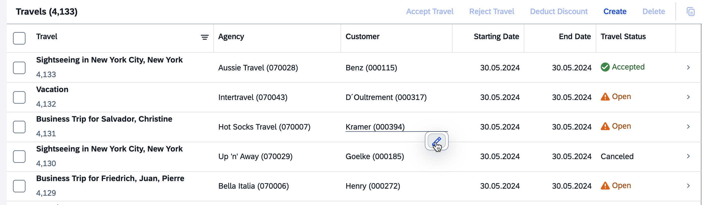
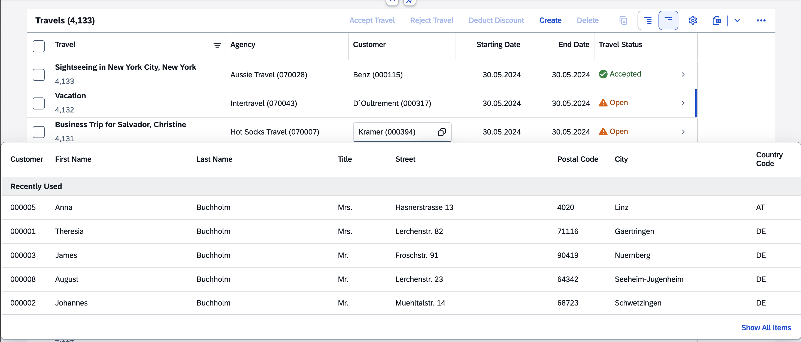
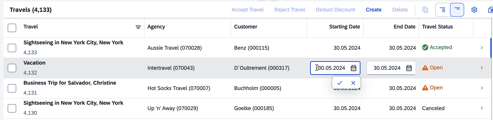
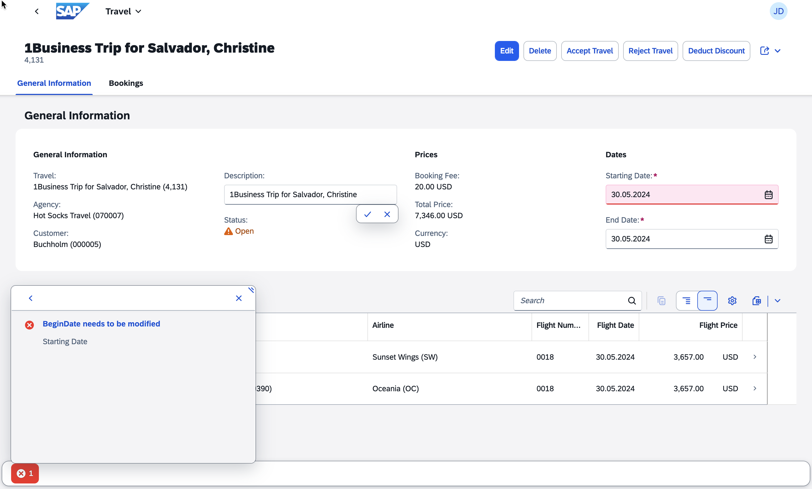

<!-- loiobb56175f37aa4530a59214025a005466 -->

<link rel="stylesheet" type="text/css" href="../css/sap-icons.css"/>

# Inline Edit

Users can use inline edit to edit specific fields or field groups without switching the entire object to draft.

SAP Fiori elements for OData V4 supports inline edit in the list report and on the object page as of SAPUI5 1.136. With this feature, users can directly edit a field or a group of fields in the active version without switching the entire object to draft. Inline edit supports the same features as the regular edit mode.

> ### Note:  
> This topic is only applicable to SAP Fiori elements for OData V4.

Inline edit is supported on pages based on the `sap.fe.templates.ListReport` or `sap.fe.templates.ObjectPage` templates with a draft-enabled service. Inline edit is also supported with building blocks when they are used within these templates.

> ### Restriction:  
> Inline edit isn't supported in the following cases:
> 
> -   Collaborative draft is enabled in the application.
> 
> -   The application uses the flexible column layout.
> 
> -   The field is a stream property field or a multi-input field.


<a name="loiobb56175f37aa4530a59214025a005466__section_p1m_22y_ffc"/>

## Inline Editing of a Field

When hovering, fields that can be edited inline are underlined, and an *Edit* button is shown. The inline edit indicators are shown if the field is editable and the inline edit functionality is available for it. For more information about configuring inline editable fields, see the [Configuring Inline Edit](inline-edit-bb56175.md#loiobb56175f37aa4530a59214025a005466__configuring_inline_edit) section in this topic.

  
  
**Inline Edit Indicators**



To edit a field, the user must click the :pencil2: \(*Edit*\) icon or double-click the field. The user can also press [Enter\] after setting focus on the field.

> ### Note:  
> -   Double-click is not supported for responsive tables.
> 
> -   Inline edit isn't available if the object already has a draft.

Depending on the type of field, the inline edit provides the same features that are available in the regular edit mode, such as recently used values, date and time selection, and value help.

  
  
**Inline Editing of a Field**



If the field belongs to a group of connected fields, all fields within the group are enabled for editing.

  
  
**Inline Editing a Field Group**



After entering a new value, the user can do the following:

-   Validate the changes by clicking the :heavy_check_mark: \(*Save*\) icon or pressing [Enter\]

-   Cancel by clicking the :x: \(*Cancel*\) icon or pressing [Esc\]


When validating an entry, the active version of the object is directly updated, and no draft is created. For a group of connected fields, the changes in all fields are made with a single request.


<a name="loiobb56175f37aa4530a59214025a005466__section_hcq_mhy_ffc"/>

## Error Management

If an error occurs when submitting an inline edit change, a message button is shown in the footer of the page. The changed fields and the fields related to the error are displayed in edit mode so the user can make the required changes. If a field related to the error is part of a group of connected fields, all the fields of the group are displayed in edit mode. The following screenshot shows an example where a change in the *Description* field causes an error in the *Starting Date* field. *Starting Date* is grouped with *End Date*, so both fields are displayed in edit mode:

  
  
**Error Caused by Inline Editing**



If the error references a field not displayed on the page, the issue can't be fixed by inline editing, and the user must switch the object to edit mode to make the changes.


<a name="loiobb56175f37aa4530a59214025a005466__section_egw_why_ffc"/>

## Action Execution and Navigation

If the user triggers an action or navigation from a table when using inline edit, a prompt is shown to save or discard the ongoing change. After the user chooses an option, the action is executed or the navigation occurs.

  
  
**Prompt to Save or Discard Changes \(Navigation\)**

")

> ### Caution:  
> When navigation is triggered from the browser's navigation icons, the FLP header, or through an intent-based navigation, the navigation occurs and the current change is lost.


<a name="loiobb56175f37aa4530a59214025a005466__configuring_inline_edit"/>

## Configuring Inline Edit

You must enable inline edit at the page level using a manifest setting. To specify the list of fields enabled for inline edit, use the `enabledFields` parameter with either a property name or a `FieldGroup` annotation. To disable inline edit for certain fields, use the `disabledFields` parameter with either a property name or a `FieldGroup` annotation. If `disabledFields` is empty, inline edit is enabled for all fields.

You can also specify groups of connected fields which should be edited together. To do that, use the `connectedFields` parameter with either arrays of property names or `FieldGroup` annotations.

> ### Tip:  
> Immediate side effects aren't supported within a group of connected fields. If a side effect has a source property A and a target property B where both A and B belong to the same group of connected fields, this side effect is not triggered when property A is changed.

**Example 1: All Fields Are Enabled for Inline Edit in the List Report**

> ### Sample Code:  
> `manifest.json`
> 
> ```
> "TravelList": {
>     "type": "Component",
>     "name": "sap.fe.templates.ListReport",
>     "id": "TravelList",
>     "options": {
>         "settings": {
>             "inlineEdit": {
>                 "disabledFields": []
>             },
>             "contextPath": "/Travel",
>             "initialLoad": "Enabled",
>             "navigation": {
>                 "Travel": {
>                     "detail": {
>                         "route": "TravelObjectPage"
>                     }
>                 }
>             }
>         }
>     }
> }
> ```

**Example 2: Four Fields Are Enabled for Inline Edit, and One Group of Connected Fields Is Defined**

> ### Sample Code:  
> `manifest.json`
> 
> ```
> "TravelList": {
>     "type": "Component",
>     "name": "sap.fe.templates.ListReport",
>     "id": "TravelList",
>     "options": {
>         "settings": {
>             "inlineEdit": {
>                 "enabledFields": ["to_Customer_CustomerID", "BeginDate","EndDate", "BookingFee"],
>                 "connectedFields": [["BeginDate", "EndDate"]]
>             },
>             "contextPath": "/Travel",
>             "initialLoad": "Enabled",
>             "navigation": {
>                 "Travel": {
>                     "detail": {
>                         "route": "TravelObjectPage"
>                     }
>                 }
>             }
>         }
>     }
> }
> ```

**Example 3: Fields Within a Table in an Object Page Form Are Enabled Using Field Groups, and Connected Fields Are Defined Using an Array of Properties and a `FieldGroup` Annotation**

> ### Sample Code:  
> `manifest.json`
> 
> ```
> "TravelObjectPage": {
>     "type": "Component",
>     "id": "TravelObjectPage",
>     "name": "sap.fe.templates.ObjectPage",
>     "options": {
>         "settings": {
>             "entitySet": "Travel",
>             "inlineEdit": {
>                "enabledFields": ["@com.sap.vocabularies.UI.v1.FieldGroup#TripData", "to_Booking/@com.sap.vocabularies.UI.v1.FieldGroup#Flight"],
>                 "connectedFields": [
>                     ["BeginDate", "EndDate"],
>                     "to_Booking/@com.sap.vocabularies.UI.v1.FieldGroup#Flight"
>                 ]
>             }
>         }
>     }
> }
> ```


<a name="loiobb56175f37aa4530a59214025a005466__section_ll2_cpy_ffc"/>

## Back-End Configuration

When using inline edit, the active version of the object is patched directly, so no draft is created.

When using ABAP, you must follow the implementation recommendations for business objects. For more information, see [ABAP RESTful Application Programming Model](https://help.sap.com/docs/abap-cloud/abap-rap/abap-restful-application-programming-model).

When using CAP, you must ensure that the option to bypass the draft is set correctly. For more information about CAP Node.js, see the [Bypassing the SAP Fiori Draft Flow](https://cap.cloud.sap/docs/node.js/fiori#bypassing-the-sap-fiori-draft-flow) section in [Fiori Support](https://cap.cloud.sap/docs/node.js/fiori). For more information about CAP Java, see the [Bypassing the SAP Fiori Draft Flow](https://cap.cloud.sap/docs/java/fiori-drafts#bypassing-draft-flow) section in [Fiori Drafts](https://cap.cloud.sap/docs/java/fiori-drafts).

