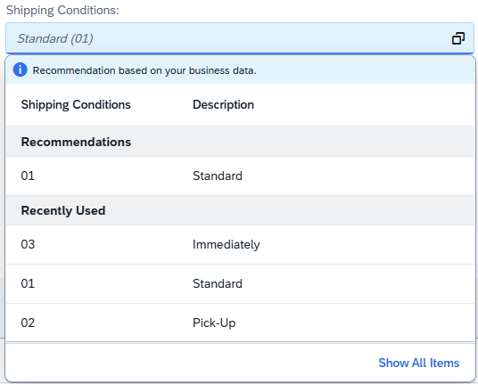
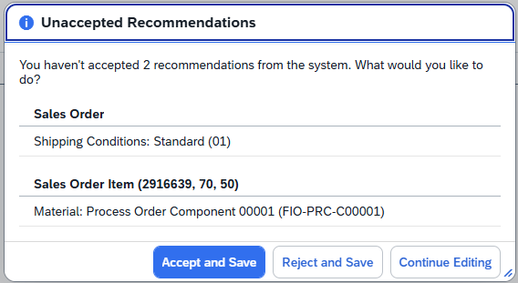

<!-- loio1a6324d5ad7f4034a93f911b4e53e080 -->

# Input Assistance

Object page fields can be filled with recommended values.

> ### Note:  
> This topic is only applicable to SAP Fiori elements for OData V4.

In edit mode, object page fields can include recommendations. The recommendations are shown in the *Recommendations* section in the same order as they are sent from the back end. The back end can also label one of the recommendations as the most fitting recommendation. This recommendation is displayed as a placeholder in the field with a different style to indicate to users that recommendations are available for this field.

Users can click the field and accept the recommended value or ignore the recommendation and choose a different value.

  
  
**Input Assistance**



> ### Note:  
> -   If the field already has a `ValueState` because of back-end messages, the recommendation placeholder isn't displayed. In this case, the back-end messages are shown instead of recommendations.
> 
> -   Input assistance isn't offered for fields with business-defined values \(for example, values defined through a side effect\) or user-defined values. Empty fields are an exception. If `empty` is a valid value for a field, don't make it relevant for recommendations.
> 
> -   Although technically possible, we recommend that key users don't hide the recommendation fields \(or the section, subsection, or table holding them\) in UI adaptation mode.

> ### Restriction:  
> Recommendations aren't available in the following cases:
> 
> -   Fields without value help \(except fields with a drop-down list\).
> 
> -   Fields with business-defined values \(for example, side effects\).
> 
> -   Fields with multiple values.
> 
> -   Custom fields.
> 
> -   Fields that have more than one key field in their value help entity aren't used for recommendations. For example, if the field *Plant* has two key fields, *PlantID* and *RegionID*, to uniquely identify a given plant, the field *Plant* must be excluded from providing recommendations.


<a name="loio1a6324d5ad7f4034a93f911b4e53e080__section_bkp_tmd_dgc"/>

## Modeling Applications for Input Assistance

Applications must enable input assistance by modeling it in the back end. This enhances the metadata with recommendation-relevant annotations, which are interpreted by the SAP Fiori elements framework to provide input assistance for users working on the object in edit mode.

The `UI.Recommendations` annotation is the most important annotation and is defined at entity level. The entity uses back-end recommendations and points to a complex property in the entity.

> ### Sample Code:  
> Usage of `UI.Recommendations`
> 
> ```
> 
> <Annotations Target="com.c_salesordermanage_sd.SalesOrderManage">
>     <Annotation Term="UI.Recommendations" Path="SAP_Recommendations" />
> </Annotations>
> 
> ```

The complex property points to another complex property, which holds the actual entity properties that can handle recommendations. The following sample code shows a main entity enhanced with a complex type to hold recommendations:

> ### Sample Code:  
> ```
> 
> <EntityType Name="SalesOrderManage">
>     <Key>
>         <PropertyRef Name="ID"/>
>     </Key>
>     <Property Name="ID" Type="Edm.Guid" Nullable="false"/>
>     <Property Name="ShippingCondition" Type="Edm.String" MaxLength="2"/>
>     <NavigationProperty Name="_ShipToParty" Type="com.c_salesordermanage_sd.HeaderShipToParty" />
>     <Property Name="SAP_Recommendations" Type="com.c_salesordermanage_sd.c_salesordermanage_sd_SalesOrderRecommendations"/> // This is for the recommendations
> </EntityType>
> 
> ```

The complex type `com.c_salesordermanage_sd.c_salesordermanage_sd_SalesOrderRecommendations` contains a list of all entity properties that can handle recommendations. The following sample code shows a complex type listing all recommendation-relevant properties of the entity:

> ### Sample Code:  
> ```
> 
> // SalesOrderManage entity
> <ComplexType Name="c_salesordermanage_sd_SalesOrderRecommendations">
>     <Property Name="ShippingCondition" Type="Collection(com.c_salesordermanage_sd.c_salesordermanage_sd_ShippingConditionRecommendationType)" Nullable="false"/>
>     <Property Name="ShipToParty" Type="Collection(com.c_salesordermanage_sd.c_salesordermanage_sd_ShipToPartyRecommendationType)" Nullable="false"/>
> </ComplexType>
> ```

For each recommendation-relevant property listed above, the recommendations that are fetched from the back end fit into the structure defined by the corresponding complex type. The following sample code shows a complex property defined against entity property to hold incoming recommendation values:

> ### Sample Code:  
> ```
> 
> <ComplexType Name="c_salesordermanage_sd_ShippingConditionRecommendationType">
>     <Property Name="RecommendedFieldValue" Type="Edm.String" MaxLength="2"/>
>     <Property Name="RecommendedFieldDescription" Type="Edm.String" MaxLength="20"/>
>     <Property Name="RecommendedFieldScoreValue" Type="Edm.Decimal" Scale="variable"/>
>     <Property Name="RecommendedFieldIsSuggestion" Type="Edm.Boolean"/>
> </ComplexType>
> <ComplexType Name="c_salesordermanage_sd_ShipToPartyRecommendationType">
>     <Property Name="RecommendedFieldValue" Type="Edm.String" MaxLength="10"/>
>     <Property Name="RecommendedFieldDescription" Type="Edm.String" MaxLength="90"/>
>     <Property Name="RecommendedFieldScoreValue" Type="Edm.Decimal" Scale="variable"/>
>     <Property Name="RecommendedFieldIsSuggestion" Type="Edm.Boolean"/>
> </ComplexType>
> 
> ```

See below for recommendation-relevant properties and their descriptions:

-   `RecommendedFieldValue`: The recommended value.
-   `RecommendedFieldDescription`: The recommended value's text description. Only relevant for recommendation fields with `RecommendedFieldIsSuggestion=true`.
-   `RecommendedFieldScoreValue`: The confidence score of the recommended value. Note that it's not used by the SAP Fiori elements client.
-   `RecommendedFieldIsSuggestion`: The highest confidence score of the recommended value. If set to `true`, the value appears as a placeholder within the field in the recommendation styling.


### Ensuring Correct Labels for Recommended Fields

When users try to save the object, unaccepted recommendations are displayed in a dialog.

The label of the recommended field in the dialog that lists all unaddressed recommendations always shows the value from the label at the property level of the recommended field. If the field has a `UI.DataField` wrapped around it, the label seen in the object page or subobject page differs. In that case, the label value comes from the label of the `UI.DataField` property. For a consistent field naming, ensure that the label at the property level is the same as the label at the `UI.DataField` level for the recommended fields.

The dialog also groups the recommendations under the entity to which the recommended fields belong using the `UI.HeaderInfo.TypeName` of the entity for the group name. This group name possibly differs from the name of the field group seen outside of the dialog, such as on the object page or subobject page, where we use the label of the `UI.ReferenceFacet` holding that field.

For more information, see the [User Notifications](input-assistance-1a6324d.md#loio1a6324d5ad7f4034a93f911b4e53e080__section_ccf_dm4_dzb) section below.


<a name="loio1a6324d5ad7f4034a93f911b4e53e080__section_dnx_tmd_dgc"/>

## Switching Off Input Assistance from Front End

If input assistance is not required, ensure that the metadata generated by the back end doesn't include the input assistance-relevant annotations. However, even when recommendations are configured as part of the metadata, you can choose to switch off all recommendation-relevant behavior. To do this, use the `initializeFeatureToggles()` and `changePageConfiguration()` methods as shown in the following sample code:

> ### Sample Code:  
> Disable recommendations
> 
> ```
> 
> sap.ui.define(["sap/fe/core/AppComponent"], function (AppComponent) {
>     "use strict";
>     return AppComponent.extend("recommendation-disableInputAssistance.Component", {
>         ...
>         initializeFeatureToggles: function () {
>             this.changePageConfiguration("sap.fe", "app/disableInputAssistance", true);
>         }
>     });
> });
> 
> ```


<a name="loio1a6324d5ad7f4034a93f911b4e53e080__section_snb_ymd_dgc"/>

## Triggers of Recommendation Calls

New recommendation values are fetched from the back end when one of the following events occurs:

-   A new context is created or loaded when users click on *Create* in the list report and the new object details are loaded or when users create a new table row in inline creation mode.

-   The draft version of the object is loaded due to user actions, such as when users click the *Edit* button.

-   When a draft object is visible again through app state restoration, back navigation, or page refresh.

-   When users scroll through the section or tabs to bring in new content.

-   When users scroll the table for the newly loaded records in various sections.

-   When users change the value of a field that is configured for a recommendation update.


### Using Side Effects for Recommendation Updates

You can use the standard side-effect mechanism, such as a field change or a user action, to fetch recommendations. Applications must model a side-effect annotation that has the complex property defined against the entity.

The following sample code shows the fetching of recommendations through side effects triggered by a field change:

> ### Sample Code:  
> ```
> 
> <Annotation Term="Common.SideEffects" Qualifier="SoldToChangeSalesAreaShipTo">
>     <Record Type="Common.SideEffectsType">
>         <PropertyValue Property="SourceProperties">
>             <Collection>
>                 <PropertyPath>SoldToParty</PropertyPath>
>             </Collection>
>         </PropertyValue>
>         <PropertyValue Property="TargetProperties">
>             <Collection>
>                 <String>DistributionChannel</String>
>                 <String>OrganizationDivision</String>
>                 <String>TotalNetAmount</String>
>                 <String>SAP_Recommendations</String> // This brings in recommendations for all recommendation-relevant properties in this entity
>                 <String>_ShipToParty/*</String>
>            </Collection>
>         </PropertyValue>
>     </Record>
> </Annotation>
> 
> ```

In the above sample code, when users change the value of `SoldToParty`, all recommendation-relevant properties listed under `SAP_Recommendations` of the current entity \(entity under which the side effect was defined\) are fetched.


<a name="loio1a6324d5ad7f4034a93f911b4e53e080__section_ccf_dm4_dzb"/>

## User Notifications

Users are notified if they try to save or apply changes while there are still fields with unaccepted recommendations. An unaccepted recommendation is a recommendation that the users didn't accept and didn't enter another value for. In this case, a dialog notifies users about these recommendations, displaying the respective fields and their recommended values. Users can then choose to accept or reject all recommendations with one click and continue. Alternatively, they can also return to the object page in edit mode and accept or reject all recommendations individually.

Users are also notified when if try to navigate away from a draft containing fields with unaccepted recommendations. The standard confirmation dialog for activating the draft is displayed first. If users select *Save* or *Create*, the *Unaccepted Recommendations* dialog is displayed. If they select *Keep Draft*, the recommendations aren't accepted. If these recommendations are still valid, they are displayed when the draft is loaded again.

  
  
**Unaccepted Recommendations Dialog**



The set of recommendations rejected by the user is not displayed again in the same editing session unless the user changes the context by entering values in other fields or performing an action that triggers different recommendations.


### Recommendation Handling for Fields Not in Current View

Recommendations are also fetched for fields that are not displayed in the current view, such as fields hidden behind personalization, or fields in sections that haven't been loaded yet. Recommendations for fields not shown in the current view are also displayed in the *Unaccepted Recommendations* dialog.

It's the application's responsibility to ensure that recommendations are fetched only for fields with a non-empty value in the back end. This is especially important when dealing with recommendations for fields not included in the current view.

To simplify, we provide the `onBeforeAcceptRecommendations()` application hook, which you can include in applications that use recommendations. This hook provides context information and lists all open, unaccepted recommendations. It's the application's responsibility to filter out fields with recommendations which already have a non-empty value in the back end. Ensure that such fields are not part of recommendations passed by the hook implementation.

> ### Sample Code:  
> Sample Implementation of `onBeforeAcceptRecommendations()`
> 
> ```
> 
> sap.ui.define(["sap/ui/core/mvc/ControllerExtension"], function (ControllerExtension) {
>     "use strict";
>   
>     return ControllerExtension.extend("recommendation-basic.ext.OPExtend", {
>         override: {
>             recommendations: {
>                 onBeforeAcceptRecommendations: async function (params) {
>                  // Add application logic here to ensure that from the given context (params), recommendations
>                  // are returned ONLY for fields that do not have a non-empty value in the back end;
>                  // remove fields with a non-empty value in back end from the recommendationData structure here.
>                   params.recommendationData = returnRecommendationData;
>                   return;
>                 },
>         ...
>     }
> }
>  
> export type RecommendationData = {
>     context?: ODataV4Context;
>     contextIdentifier?: string[];
>     contextIdentifierText?: string[];
>     propertyPath?: string;
>     value?: string;
>     text?: string;
> }
> 
> ```

