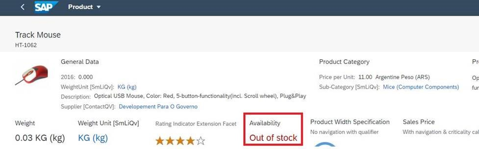

<!-- loioed96e9c4d2464c3dbac72222517d5435 -->

# Key Value Facet


If you add a `UI.ReferenceFacet` that points to `UI.DataPoint`, the title and value of the `UI.DataPoint` are rendered as follows:



> ### Sample Code:  
> XML Annotation
> 
> ```xml
> 
> <Annotation Term="UI.DataPoint" Qualifier="ProductCategory">
>       <Record>
>             <PropertyValue Property="Value" Path="ProductCategory"/>
>             <PropertyValue Property="Title" String="{@i18n>ProductCategory}"/>
>       </Record>
> </Annotation>
> 
> ```

> ### Sample Code:  
> ABAP CDS Annotation
> 
> ```
> 
> @UI.dataPoint: {
>   title: '{@i18n>@ProductCategory}'
> }
> ProductCategory;
> ```

> ### Sample Code:  
> CAP CDS Annotation
> 
> ```
> 
> UI.DataPoint #ProductCategory : {
>     Value : ProductCategory,
>     Title : '{@i18n>@ProductCategory}'
> }
> ```

The data point can also be colored based on criticality.

> ### Sample Code:  
> XML Annotation
> 
> ```xml
> 
> <Annotation Term="UI.DataPoint" Qualifier="StockAvailability">
>       <Record Type="UI.DataPointType">
>            <PropertyValue Property="Title" String="Availability" />
>            <PropertyValue Property="Value" Path="stock/availability" />
>            <PropertyValue Property="Criticality" Path="stock/availability"/>
>       </Record>
> </Annotation>
> ```

> ### Sample Code:  
> ABAP CDS Annotation
> 
> ```
> @UI.dataPoint: {
>   title: 'Availability',
>   criticality: 'stock/availability'
> }
> stock/availability;
> 
> ```

> ### Sample Code:  
> CAP CDS Annotation
> 
> ```
> UI.DataPoint #StockAvailability : {
>     Value : stock/availability,
>     Title : Availability,
>     Criticality : stock/availability
> }
> 
> ```

> ### Tip:  
> If you add a semantic object annotation to the value field of the `DataPoint`, the value is shown as a link but does not show any criticality information. For more information about adding the semantic object annotation, see the *Using a Link* subsection in [Navigation from an App \(Outbound Navigation\)](navigation-from-an-app-outbound-navigation-c35fa60.md).

