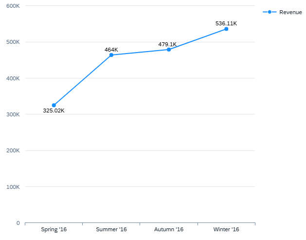

<!-- loio3e8c6ff603694b7e98b12fc9ed63e9a7 -->

# Line Chart

You can render the chart as a line chart to display information as a series of data points connected by straight-line segments.

  
  
**Example of a Line Chart**



Line charts are often used to visualize a trend in data over time. Line charts need at least one measure and one dimension.

-   Dimensions for which the role is set to `category` make up the x-axis \(category axis\). If no dimension is specified with this role, the first dimension is used as the x-axis. We recommend using only time-based dimensions \(for example, day, date, quarter, or year\) for the category axis of a line chart.
-   Dimensions for which the role is set to `series` make up the line segments of the chart, with different colors assigned to each dimension value. If multiple dimensions are assigned to this role, the values of all the dimensions together are considered as one dimension and a color is assigned.
-   Measures make up the y-axis \(value axis\). If there are multiple measures, then each measure is represented by a different colored line in the chart area.

> ### Sample Code:  
> XML Annotation
> 
> ```xml
> <Annotation Term="UI.Chart" Qualifier="LineMaxPath">
>     <Record Type="UI.ChartDefinitionType">
>         <PropertyValue Property="Title" String="Items Line Chart"/>
>         <PropertyValue Property="Description" String="Testing Line Chart"/>
>         <PropertyValue Property="ChartType" EnumMember="UI.ChartType/Line"/>
>         <PropertyValue Property="Measures">
>             <Collection>
>                 <PropertyPath>NetAmount</PropertyPath>
>                 <PropertyPath>TargetAmount</PropertyPath>
>             </Collection>
>         </PropertyValue>
>         <PropertyValue Property="Dimensions">
>             <Collection>
>                 <PropertyPath>SalesOrderItem</PropertyPath>
>             </Collection>
>         </PropertyValue>
>         <PropertyValue Property="MeasureAttributes">
>             <Collection>
>                 <Record Type="UI.ChartMeasureAttributeType">
>                     <PropertyValue Property="Measure" PropertyPath="NetAmount"/>
>                     <PropertyValue Property="Role" EnumMember="UI.ChartMeasureRoleType/Axis1"/>
>                     <PropertyValue Property="DataPoint" AnnotationPath="@UI.DataPoint#LineValueCriticality"/>
>                 </Record>
>                 <Record Type="UI.ChartMeasureAttributeType">
>                     <PropertyValue Property="Measure" PropertyPath="TargetAmount"/>
>                     <PropertyValue Property="Role" EnumMember="UI.ChartMeasureRoleType/Axis1"/>
>                     <PropertyValue Property="DataPoint" AnnotationPath="@UI.DataPoint#LineTargetCriticality"/>
>                 </Record>
>             </Collection>
>         </PropertyValue>
>     </Record>
> </Annotation>
> ```

> ### Sample Code:  
> ABAP CDS Annotation
> 
> ```
> No ABAP CDS annotation sample is available. Please use the local XML annotation.
> ```

> ### Sample Code:  
> CAP CDS Annotation
> 
> ```
> Chart #LineChart                                        : {
>       $Type              : 'UI.ChartDefinitionType',
>       Title              : 'Line Chart (Time based)',
>       Description        : 'Testing Line Chart',
>       ChartType          : #Line,
>       Measures           : [maxPricing],
>       DynamicMeasures    : ['@Analytics.AggregatedProperty#max'],
>       Dimensions         : [Processed_Date],
>       MeasureAttributes  : [{
>         $Type    : 'UI.ChartMeasureAttributeType',
>         Measure  : maxPricing,
>         Role     : #Axis1,
>         DataPoint: '@UI.DataPoint#LineChartTimeDataPoint'
>       }],
>       DimensionAttributes: []
>     },
> ```

The line chart supports a color palette for semantic coloring.


> ### Note:  
> For information about SAP Fiori elements for OData V2, see [Line Chart Card](line-chart-card-97b86c4.md).

