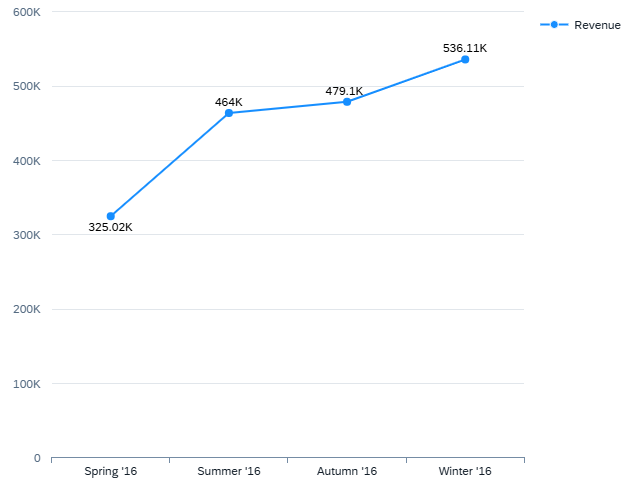

<!-- loio3e8c6ff603694b7e98b12fc9ed63e9a7 -->

# Line Chart Card

Line charts display information as a series of data points connected by straight-line segments.

Line charts are often used to visualize a trend in data over time. Line charts need at least one measure and one dimension.

-   Dimensions for which the role is set to `category` make up the x-axis \(category axis\). If no dimension is specified with this role, the first dimension is used as the x-axis. We recommend using only time-based dimensions \(for example, day, date, quarter, or year\) for the category axis of a line chart.
-   Dimensions for which the role is set to `series` make up the line segments of the chart, with different colors assigned to each dimension value. If multiple dimensions are assigned to this role, the values of all the dimensions together are considered as one dimension and a color is assigned.
-   Measures make up the y-axis \(value axis\). If there are multiple measures, then each measure is represented by a different colored line in the chart area.

The line chart supports a color palette for semantic coloring.

   
  
**Example of a Line Chart Card**

  

