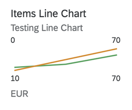

<!-- loioe5cb2afe0e484e4b803b0c82190895de -->

# Line Micro Chart

A line chart is a basic type of chart used in many fields.

It displays information as a series of data points connected by a line.



> ### Note:  
> -   In the above chart, the values at the bottom \(10 and 70\) represent the dimension values. They are the numerical IDs of the sales order items. The values at the top are the measure values - the value on the left is the lowest and the value on the right is the highest of the two measure values.
> 
> -   Ensure that the dimension values linked to the chart either have a float-based field or the current values can be cast to float values.
> 
> -   The dimension values can also have string-based fields if they are annotated to denote calendar values. For more information about the sample code, see [Additional Features in SAP Fiori Elements for OData V4](line-micro-chart-e5cb2af.md#loioe5cb2afe0e484e4b803b0c82190895de__section_wv2_2sg_rwb).

For more information about this chart type, see [Samples](https://ui5.sap.com/1.82.5/#/entity/sap.suite.ui.microchart.LineMicroChart).


<a name="loioe5cb2afe0e484e4b803b0c82190895de__section_q2l_g3q_qmb"/>

## `UI.Chart` Annotation

The `UI.Chart Title` property is used for the title.

The `UI.Chart Description` property is used for the subtitle.

> ### Sample Code:  
> XML Annotation
> 
> ```xml
> 
> <Annotation Term="UI.Chart" Qualifier="SpecificationWidthLineChart">
>     <Record Type="UI.ChartDefinitionType">
>         <PropertyValue Property="Title" String="Product Width Specification Line Chart"/>
>         <PropertyValue Property="Description" String="Describe Line Chart"/>
>         <PropertyValue Property="ChartType" EnumMember="UI.ChartType/Line"/>
>         <PropertyValue Property="Measures">
>             <Collection>
>                 <PropertyPath>Width</PropertyPath>
>                 <PropertyPath>Depth</PropertyPath>
>             </Collection>
>         </PropertyValue>
>         <PropertyValue Property="Dimensions">
>             <Collection>
>                 <PropertyPath>Day</PropertyPath>
>             </Collection>
>         </PropertyValue>
>         <PropertyValue Property="MeasureAttributes">
>              <Collection>
>                   <Record Type="UI.ChartMeasureAttributeType">
>                        <PropertyValue Property="Measure" PropertyPath="Width"/>
>                        <PropertyValue Property="Role" EnumMember="UI.ChartMeasureRoleType/Axis2"/>
>                        <PropertyValue Property="DataPoint" AnnotationPath="@UI.DataPoint#Width"/>
>                   </Record>
>                   <Record Type="UI.ChartMeasureAttributeType">
>                       <PropertyValue Property="Measure" PropertyPath="Depth"/>
>                       <PropertyValue Property="Role" EnumMember="UI.ChartMeasureRoleType/Axis2"/>
>                       <PropertyValue Property="DataPoint" AnnotationPath="@UI.DataPoint#Depth"/>
>                   </Record>
>               </Collection>
>          </PropertyValue>
>     </Record>
> </Annotation>
> ```

> ### Sample Code:  
> ABAP CDS Annotation
> 
> ```
> 
> @UI.Chart: [
>   {
>     title: 'Product Width Specification Line Chart',
>     description: 'Describe Line Chart',
>     chartType: #LINE,
>     measures: [
>       'WIDTH',
>       'DEPTH'
>     ],
>     dimensions: [
>       'DAY',
>       'DAY'
>     ],
>     measureAttributes: [
>       {
>         measure: 'Width',
>         role: #AXIS_2,
>         asDataPoint: true
>       },
>       {
>         measure: 'Depth',
>         role: #AXIS_2,
>         asDataPoint: true
>       }
>     ],
>     qualifier: 'SpecificationWidthtLineChart'
>   }
> ]
> annotate view STTA_C_MP_PRODUCT with {
> 
> }
> 
> ```

> ### Sample Code:  
> CAP CDS Annotation
> 
> ```
> 
> UI.Chart #SpecificationWidthLineChart : {
>     $Type : 'UI.ChartDefinitionType',
>     Title : 'Product Width Specification Line Chart',
>     Description : 'Describe Line Chart',
>     ChartType : #Line,
>     Measures : [
>         Width,
>         Depth
>     ],
>     Dimensions : [
>         Day,
>         Day
>     ],
>     MeasureAttributes : [
>         {
>             $Type : 'UI.ChartMeasureAttributeType',
>             Measure : Width,
>             Role : #Axis2,
>             DataPoint : '@UI.DataPoint#Width'
>         },
>         {
>             $Type : 'UI.ChartMeasureAttributeType',
>             Measure : Depth,
>             Role : #Axis2,
>             DataPoint : '@UI.DataPoint#Depth'
>         }
>     ]
> }
> 
> ```


<a name="loioe5cb2afe0e484e4b803b0c82190895de__section_l1l_g3q_qmb"/>

## `UI.DataPoint` Annotation

> ### Sample Code:  
> XML Annotation
> 
> ```xml
> <Annotation Term="UI.DataPoint" Qualifier="Width">
>     <Record>
>         <PropertyValue Property="Value" Path="Width"/>
>         <PropertyValue Path="Day1" Property="Title" />
>         <PropertyValue Property="Description" String="Line Micro Chart"/>
>         <PropertyValue Property="TargetValue" Path="Weight"/>
>         <PropertyValue Property="ForecastValue" Path="Height"/>
>         <PropertyValue Property="MinimumValue" Decimal="0"/>
>         <PropertyValue Property="MaximumValue" Decimal="100"/>
>         <PropertyValue Property="Criticality" Path="criticalityValue"/>
>     </Record>
> </Annotation>
>  
> <Annotation Term="UI.DataPoint" Qualifier="Depth">
>     <Record>
>         <PropertyValue Property="Value" Path="Depth"/>
>         <PropertyValue Path="Day2" Property="Title" />
>         <PropertyValue Property="MinimumValue" Decimal="0"/>
>         <PropertyValue Property="MaximumValue" Decimal="200"/>
>         <PropertyValue Property="Criticality" Path="criticalityValue"/>
>     </Record>
> </Annotation>
> 
> ```

> ### Sample Code:  
> ABAP CDS Annotation
> 
> ```
> 
> @UI.dataPoint: {
>   description: 'Line Micro Chart',
>   targetValueElement: 'Weight',
>   forecastValue: 'Height',
>   minimumValue: 0,
>   maximumValue: 100,
>   criticality: 'criticalityValue'
> }
> Width;
> 
> @UI.dataPoint: {
>   minimumValue: 0,
>   maximumValue: 200,
>   criticality: 'criticalityValue'
> }
> Depth;
> 
> ```

> ### Sample Code:  
> CAP CDS Annotation
> 
> ```
> 
> UI.DataPoint #Width : {
>     Value : Width,
>     Title : Day1,
>     Description : 'null',
>     TargetValue : Weight,
>     ForecastValue : Height,
>     MinimumValue : 0,
>     MaximumValue : 100,
>     Criticality : criticalityValue
> },
> UI.DataPoint #Depth : {
>     Value : Depth,
>     Title : Day2,
>     MinimumValue : 0,
>     MaximumValue : 200,
>     Criticality : criticalityValue
> }
> 
> 
> ```

> ### Note:  
> -   For semantic coloring, only the `Criticality` property is supported. If this resolves to a hard-coded `Enum` value, then the entire line is colored according to the specified value \(`Criticality.Negative=Red`, for example\). If the `Criticality` property contains a path, then the value of the last data point's criticality determines the color of the line.
> 
> -   The unit of measure is plotted using the first entry in the data that is to be plotted.
> 
> -   We recommend to use only one measure, and a maximum of three measures, if you require more measures.
> 
> -   The measure values are shown in the top left and right. When multiple measures are plotted, the smallest of the measure values at the first dimension value is set as the label on the top left, and the largest of the measure values at the last dimension value is set as the label at the top right corner of the micro chart.

Mandatory:

1.  `UI.Chart` → `ChartType`: "`Line`"
2.  `UI.Chart` → `Dimensions`
3.  `UI.Chart` → `Measures`
4.  `UI.Chart` → `MeasureAttributes` → `DataPoint`
5.  If multiple measures are used, then the first measure must have `UI.Chart` → `Measure` and `UI.Chart` → `MeasureAttribute` \(with `DataPoint` associated to it\). For the subsequent measures, if this is missing, the measure will not be plotted, but if this is missing for the first measure, then the chart itself will not show up \(even if the other measures are configured correctly\).
6.  `UI.DataPoint` → `Value`


<a name="loioe5cb2afe0e484e4b803b0c82190895de__section_wv2_2sg_rwb"/>

## Additional Features in SAP Fiori Elements for OData V4


### Support for String-Based Dimension Fields Annotated to Denote Time Period

Line micro charts can have string-based dimension fields annotated with any of the following:

-   `Common.IsCalendarYear` annotation with the value format `yyyy`.

-   `Common.IsCalendarQuarter` annotation with the value format `Q`. The value must match the regex pattern \[1-4\].

-   `Common.IsCalendarMonth` annotation with the value format `MM`. The value must match the regex pattern 0\[1-9\]|1\[0-2\].

-   `Common.IsCalendarWeek` annotation with the value format `ww`. The value must match the regex pattern 0\[1-9\]|\[1-4\]\[0-9\]|5\[0-3\].

-   `Common.IsCalendarYearMonth` annotation with the value format `yyyyMM` with a valid year and month. The value must match the regex pattern 0\[1-9\]|\[1-4\]\[0-9\]|5\[0-3\].

-   `Common.IsCalendarDate` annotation with the value format `yyyyMMdd` representing a valid date.


> ### Sample Code:  
> XML Annotation
> 
> ```
> 
> <Annotations Target="com.c_salesordermanage_sd_aggregate.SalesOrderItem/OrderYear"> 
> 	<Annotation Term="Common.IsCalendarYear" Bool="true" /> 
> </Annotations>
> ```

> ### Sample Code:  
> ABAP CDS Annotation
> 
> ```
> 
> annotate view C_SALESORDERMANAGE_SD_AGGREGATE.SALESORDERITEM with { 
>  @Semantics.calendar.year: true 
>  OrderYear 
> } 
> ```

> ### Sample Code:  
> CAP CDS Annotation
> 
> ```
> 
> OrderYear : String(4) @(Common.IsCalendarYear : true); 
> 
> ```

