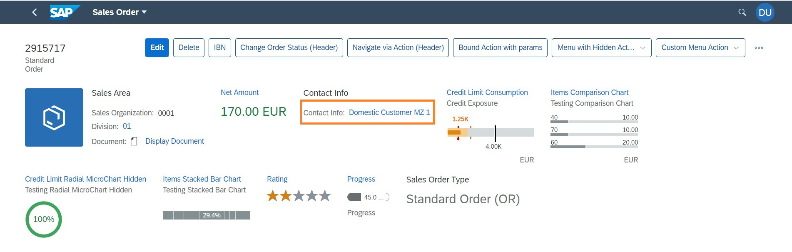

<!-- loio1695504f4b9b4c86ae84e033f65e1ca4 -->

# Link Fields

You can display a field as a link in multiple scenarios in SAP Fiori elements for OData V4.

See the following screenshot of a field displayed as a link:



You can use links as follows:

-   Semantic links. For more information, see the [Semantic Links](link-fields-1695504.md#loio1695504f4b9b4c86ae84e033f65e1ca4__SemanticLinks) section in this topic.

-   Links for quick view cards. For more information, see [Enabling Quick Views for Link Navigation](enabling-quick-views-for-link-navigation-307ced1.md).

-   Links for contact cards. For more information, see [Adding a Contact Facet](adding-a-contact-facet-a6a8c0c.md) and [Adding a Contact Quick View to a Table](adding-a-contact-quick-view-to-a-table-677fbde.md).

-   Contact links. For more information, see the [Contact Links](link-fields-1695504.md#loio1695504f4b9b4c86ae84e033f65e1ca4__ContactLinks) section in this topic.

-   Basic links. For more information, see the [Basic Links](link-fields-1695504.md#loio1695504f4b9b4c86ae84e033f65e1ca4__BasicLinks) section in this topic.


<a name="loio1695504f4b9b4c86ae84e033f65e1ca4__SemanticLinks"/>

## Semantic Links

If the field is associated with a semantic object, it is rendered as a link, provided that the semantic object is a valid one in SAP Fiori launchpad. All the actions configured for this semantic object are displayed when users click on the link. If there is only one navigation target, users are directly navigated upon clicking the link.

> ### Sample Code:  
> XML Annotation
> 
> ```
> <Annotations Target="clouds.products.CatalogService.Products/SoldToParty">
>     <Annotation Term="Common.SemanticObject" String="supplier"/>
> </Annotations>
> ```

> ### Sample Code:  
> ABAP CDS Annotation
> 
> ```
> annotate view PRODUCTS.CATALOGSERVICE.PRODUCTS with {
> @Consumption.semanticObject: 'supplier'
> soldtoparty;
> }
> 
> ```

> ### Sample Code:  
> CAP CDS Annotation
> 
> ```
> SoldToParty                   : String(10)                            @(Common : {
> SemanticObject                  : 'supplier'
> });
> 
> ```

For more information, see [Navigation from an App \(Outbound Navigation\)](navigation-from-an-app-outbound-navigation-d782acf.md).


<a name="loio1695504f4b9b4c86ae84e033f65e1ca4__ContactLinks"/>

## Contact Links

You can specify links for phone numbers or email addresses by using the following annotations:

-   `Communication.IsPhoneNumber` creates a link tagged with the prefix "tel:".

-   `Communication.IsEmailAddress` creates a link tagged with the prefix "mailto:".


When users click the link, the browser redirects to the operating system, for example, Android, iOS, or Windows, and directly performs the corresponding action, such as opening an email app.

```xml
<Annotations Target="sap.fe.manageitems.TechnicalTestingService.LineItems/phoneNumber">
    <Annotation Term="Common.Label" String="Mobile"/>
    <Annotation Term="Communication.IsPhoneNumber" Bool="true"/>
</Annotations>
```

```xml
XML<Annotations Target="sap.fe.manageitems.TechnicalTestingService.LineItems/emailAddress">
    <Annotation Term="Common.Label" String="Email"/>
    <Annotation Term="Communication.IsEmailAddress" Bool="true"/>
</Annotations>
```


<a name="loio1695504f4b9b4c86ae84e033f65e1ca4__BasicLinks"/>

## Basic Links

You can display a basic link with an optional icon or image. To do so, use `DataFieldWithUrl` as shown in the following sample code:

> ### Sample Code:  
> XML Annotation
> 
> ```
> <Annotation Term="UI.FieldGroup" Qualifier="DataFieldUrl">
>     <Record Type="UI.FieldGroupType">
>         <PropertyValue Property="Data">
>             <Collection>
>                 <Record Type="UI.DataFieldWithUrl">
>                     <PropertyValue Property="Url" String="www.sap.com"/>
>                     <PropertyValue Property="Value" String="This is an URL"/>
>                     <PropertyValue Property="IconUrl" String="sap-icon://arrow-right"/>
>                 </Record>
>                 <Record Type="UI.DataFieldWithUrl">
>                     <PropertyValue Property="Url" String="www.sap.com"/>
>                     <PropertyValue Property="Value" String=""/>
>                     <PropertyValue Property="IconUrl" Path="oneIcon"/>
>                 </Record>
>                 <Record Type="UI.DataFieldWithUrl">
>                     <PropertyValue Property="Url" Path="oneUrl"/>
>                     <PropertyValue Property="Value" String="This is an URL three"/>
>                     <PropertyValue Property="IconUrl" String="sap-icon://arrow-right"/>
>                 </Record>
>             </Collection>
>         </PropertyValue>
>     </Record>
> </Annotation>
> ```

> ### Sample Code:  
> ABAP CDS Annotation
> 
> ```
> @UI.fieldGroup: [
>   {
>     iconUrl: 'sap-icon://arrow-right'
>     type: #WITH_URL,
>     position: 1 ,
>     qualifier: 'DataFieldUrl'
>   },
>   {
>     url: 'ONEURL',
>     value: 'ONEURL',
>     type: #WITH_URL,
>     position: 2 ,
>     qualifier: 'DataFieldUrl'
>   }
> ]
> 
> ```

> ### Sample Code:  
> CAP CDS Annotation
> 
> ```
> UI.FieldGroup #DataFieldUrl: {
> Data : [{
>               $Type : 'UI.DataFieldWithUrl',
>               Url   : 'www.sap.com',
>               Value : 'This is an URL',
>               IconUrl: 'sap-icon://arrow-right',
>        },
>        {
>               $Type  : 'UI.DataFieldWithUrl',
>               Url    : oneDisplay,
>               Value  : oneUrl,
>               IconUrl: oneIcon
> }
> }]
> 
> ```

For more information, see [Navigation from an App \(Outbound Navigation\)](navigation-from-an-app-outbound-navigation-d782acf.md).

