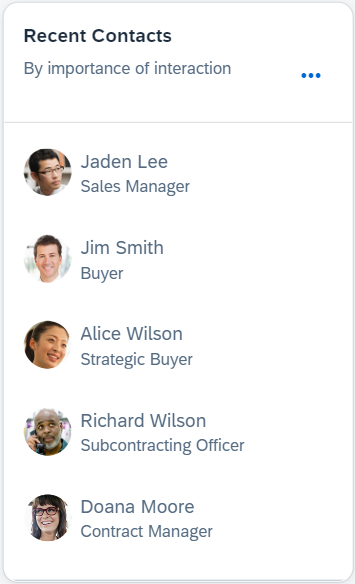

<!-- loio0326f910c6af4fb1b86f2810ee10419e -->

# Link List Cards

Displays a list of links with a title, picture, icon, or subtitle.


A link list card supports the following:

-   Quick view to display contact annotation information.

-   `SmartLink` control to display semantic object information.





### Descriptor Settings: Title

Property: `title`

Description: Configuring this property places the card title on top of the link list card.

**Configuration Sample:**

```
	"sap.ovp": {
		"globalFilterModel": "salesOrder",
		"globalFilterEntityType": "GlobalFilters",
              ...
              ...
          "card005_RecentContacts": {
            "model": "purchaseOrder",
            "template": "sap.ovp.cards.linklist",
            "settings": {
              "title": "Recent Contacts",
              "entitySet": "SalesShare",
              ...
              ...
              ...
                }
              ]
            }
          },
```


### Descriptor Settings: Subtitle

Property: `subTitle`

Description: Configuring this property places the card subtitle below the title of the link list card.

**Configuration Sample:**

```
	"sap.ovp": {
		"globalFilterModel": "salesOrder",
		"globalFilterEntityType": "GlobalFilters",
              ...
              ...
		"cards": {
          "card005_RecentContacts": {
            "model": "purchaseOrder",
            "template": "sap.ovp.cards.linklist",
            "settings": {
              "title": "Recent Contacts",
              "targetUri": "https://en.abc.org/wiki/abc_2", \\Link list card header link URI
              "subTitle": "by Importance of Interaction",
              "entitySet": "SalesShare",
              ...
              ...
                }
              ]
            }
          },
```


### Content Area

Property: `staticContent`

```
	"sap.ovp": {
		"globalFilterModel": "salesOrder",
		"globalFilterEntityType": "GlobalFilters",
              ...
              ...
		"cards": {
          "card005_RecentContacts": {
            "model": "purchaseOrder",
            "template": "sap.ovp.cards.linklist",
            "settings": {
              "title": "Recent Contacts",
              "targetUri": "https://en.wikipedia.org/wiki/Mangalyaan_2",
              "subTitle": "by Importance of Interaction",
              "listFlavor": "standard",
              "sortBy": "Employee",
              "entitySet": "Zme_Overdue",
              "sortOrder": "ascending",
              "defaultSpan": {
                "rows": 24,
                "cols": 2,
                "showOnlyHeader":true
              },
              "staticContent": [
                {
                  "title": "Jim Smith",
                  "subTitle": "Sales",
                  "imageUri": "img/JD.png",
                  "imageAltText": "Jim Smith",
                  "targetUri": "https://google.com",
                  "openInNewWindow": true
                },
                {
                  "title": "Alice Wilson",
                  "subTitle": "Sales",
                  "imageUri": "img/AW.png",
                  "imageAltText": "Jim Smith",
                  "targetUri": "https://google.com",
                  "openInNewWindow": true
                },
                {
                  "title": "Daniel Quote",
                  "subTitle": "Production",
                  "imageUri": "img/DQ.png",
                  "imageAltText": "Jim Smith",
                  "targetUri": "https://google.com",
                  "openInNewWindow": true
                },
                {
                  "title": "Kate Holly",
                  "subTitle": "Sales",
                  "imageUri": "img/Kate.png",
                  "imageAltText": "Jim Smith",
                  "targetUri": "https://google.com",
                  "openInNewWindow": true
                },
                {
                  "title": "Aurora Smith",
                  "subTitle": "HR",
                  "imageUri": "img/KJ.png",
                  "imageAltText": "Jim Smith",
                  "targetUri": "https://google.com",
                  "openInNewWindow": true
                },
                {
                  "title": "Wong Lee",
                  "subTitle": "Management",
                  "imageUri": "img/YM.png",
                  "imageAltText": "Jim Smith",
                  "targetUri": "https://google.com",
                  "openInNewWindow": true
                }
              ]
            }
          },
```


Link list card supports the following types of navigation:

-   Quick view link: Displays contact information from a collection, for example, a recent contact list.
-   Cross app link: Enables access to related applications through intent-based navigation.
-   External URL link: Links to external web pages or resources.


<a name="loio0326f910c6af4fb1b86f2810ee10419e__section_grp_p54_vdc"/>

## Types of Link List Cards

The following types of link list cards are available:

-   Static link list card: This card type displays static data, such as links, images, and icons, in the form of a list. Application developers can specify this data directly in the `manifest.json` file. For more information about configuring static link list cards, see [Configuring the Static Link List Card](configuring-the-static-link-list-card-4e81b77.md).

-   Dynamic link list card: This card type reads data including links, images, and icons from the back end and displays them as list items. For more information about configuring dynamic link list cards, see [Configuring the Dynamic Link List Card](configuring-the-dynamic-link-list-card-675c514.md).


<a name="loio0326f910c6af4fb1b86f2810ee10419e__section_r1m_mkw_rdc"/>

## Different Layouts of Link List Card

The following layouts of link list cards are available:

-   Standard link list card
-   Carousel link list card


### Standard Link List Card

The standard link list card displays a list of ordered items. Optionally, you can configure this card to display the following:

-   A picture and/or subtitle to the list item.
-   Multiple columns if the dashboard layout includes multiple columns by modifying the card size.


The following sample code shows how to configure a link list card with a standard view:

> ### Sample Code:  
> ```
> "card20": {
>     "model": "salesOrder",
>     "template": "sap.ovp.cards.linklist",
>     "settings": {
>         "title": "Dynamic Linklist Card",
>         "targetUri": "https://en.abc.org/wiki/A_2",
>         "subtitle": "NEW CARD",
>         "listFlavor": "standard",
>         "sortBy": "Name",
>         "entitySet": "ProductSet",
>         "sortOrder": "ascending",
>         "headerAnnotationPath": "com.sap.vocabularies.UI.v1.HeaderInfo#header1",
>         "identificationAnnotationPath": "com.sap.vocabularies.UI.v1.Identification#identify1",
>     }
> }
> 
> ```


### Carousel Link List Card

This type of card provides a carousel-based view, where the title and subtitle appear at the top of the card, allowing more space for the image. Additionally, this list type can be configured to support multiple columns.


You can customize the link list information to appear in the following formats:

-   One or two lines from any of the following content:

    -   Text only.

    -   Text with an icon. The icon is displayed using the image control.

    -   Text with an image. The image is displayed using the avatar control.


-   Interaction States: Additional interactions can be incorporated into the link list.


The following sample code shows how to configure a link list card with a carousel view:

> ### Sample Code:  
> ```
> "card_20": {
>     "model": "HEPM_OVP_TECH_VAL",
>     "template": "sap.ovp.cards.linklist",
>     "settings": {
>         "title": "{{card20_title}}",
>         "entitySet": "Hepmra_C_OFT_Employee",
>         "listFlavor": "carousel",
>         "sortBy": "Employee",
>         "sortOrder": "ascending",
>     }
> ```

> ### Note:  
> In SAP Fiori elements for OData V4, add `sap.ovp.cards.v4.linklist` as the `template`. All other settings in the `manifest.json` file remain the same as in SAP Fiori elements for OData V2.

