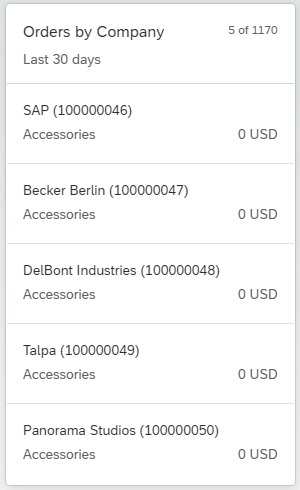
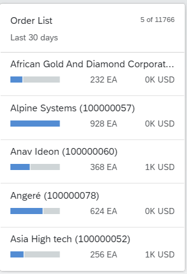
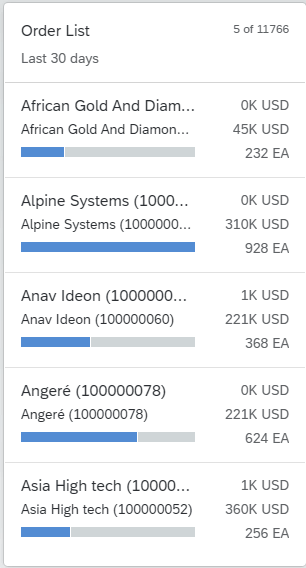

<!-- loio56f39e077efb477d9e851cd082b7760c -->

# List Cards

List cards display lists of records according to the configuration in the `com.sap.vocabularies.UI.v1.LineItem` term. List cards display up to six fields of data in each list item.


When creating a list card, you can choose from a number of different types of lists. The number of items displayed depends on the type of list. You can choose from two types of list cards:

-   Condensed

-   Extended


For each of these types you can choose from two flavors:

-   Standard

-   Bar


The `com.sap.vocabularies.UI.v1.LineItem` term can be configured in the application manifest file by setting the `annotationPath` property with a qualifier, as shown in the example below. If the `annotationPath` property is not configured, the `com.sap.vocabularies.UI.v1.LineItem` term, without a qualifier, is used.

> ### Sample Code:  
> ```
> "sap.ovp": {
>     ...
>     "cards": {
>         ...
>         "card04": {
>             "model": "ZCD204_EPM_DEMO_SRV",
>             "template": "sap.ovp.cards.list",
>             "settings": {
>                 "sortBy": "Price",
>                 "sortOrder": "descending",
>                 "listFlavor": "bar",
>                 "annotationPath": "com.sap.vocabularies.UI.v1.LineItem#bar",
>                 "category": "{{card04_category}}",
>                 "entitySet": "Products"
>             }
>         },
>         ...
>     }
> }
> ```

> ### Note:  
> In SAP Fiori elements for OData V4, add `sap.ovp.cards.v4.list` as the `template`. All other manifest settings are the same as in SAP Fiori elements for OData V2.

By default, the fields in the list card are mapped to the `com.sap.vocabularies.UI.v1.LineItem` annotation. Any other collection of `DataFieldAbstract` can be used by setting the `annotationPath` property. `LineItem` is a collection of `DataFieldAbstract` records. You can use different `com.sap.vocabularies.UI.v1.LineItem` annotations for different card instances of the same entity type by using different qualifiers and setting the `annotationPath` property with the qualifier in the card configuration. For example `com.sap.vocabularies.UI.v1.LineItem#Qualifier1`.

At runtime, the `DataField` records are sorted according to the optional `Importance (com.sap.vocabularies.UI.v1.ImportanceType)` annotation. `DataField` entries are sorted according to importance and their order of entry.


## Condensed List Type - Standard Flavor

In this type of list, each list item displays up to three fields. The first two `DataField` records are displayed at the top left and bottom left of the list item. If there is a `DataFieldForAnnotation` record that has a `DataPoint` target, it is displayed at the top right of the list item, and its value can be highlighted according to the criticality of the datapoint. If no `DataFieldForAnnotation` record is defined, the next `DataField` record is displayed instead.

Number of list items displayed: up to 3.


## Extended List Type - Standard Flavor

In this type of list, each list item displays up to six fields. `DataField` records are displayed on the left side of the line item, and `DataPoint` records are displayed on the right. If no `DataPoint` record is defined, or less than three `DataPoint` records are available, the right side of the line item displays `DataField` records instead.

Number of list items displayed: up to 6.


<table>
<tr>
<td valign="top">

  


</td>
<td valign="top">

  


</td>
</tr>
<tr>
<td valign="top">

Condensed List Type - Standard Flavor


</td>
<td valign="top">

Extended List Type - Standard Flavor


</td>
</tr>
</table>


## Condensed List Type - Bar Flavor

In this type of list, each list item displays up to three fields. Only use this kind of list if you want to display a `DataPoint` record. The first `DataField` record is displayed as a title for the line item in the top-left field. The first `DataPoint` record is displayed as a bar beneath the title, and as a numeric value to the right of the bar. You can also display an additional `DataPoint` record to the right of the first `DataPoint` record. The bar can display values as a percentage or as any numeric value.

Number of list items displayed: up to 3.


## Extended List Type - Bar Flavor

In this type of list, each list item displays up to five fields. The first `DataField` record is displayed as a title for the line item in the top-left field. An additional `DataField` record can be displayed beneath the title. The first `DataPoint` record is displayed as a bar beneath the `DataField` records, and as a numeric value to the right of the bar at the bottom of the line item. You can also display two additional `DataPoint` records to the right of line item, one above the other.

> ### Note:  
> If highlighting \(criticality\) is defined in the annotation of the `DataPoint` records, only one will be highlighted in the line item according to the order in which they are displayed.
> 
> Number of list items displayed: up to 5.


<table>
<tr>
<td valign="top">

  


</td>
<td valign="top">

  


</td>
</tr>
<tr>
<td valign="top">

Condensed List Type - Bar Flavor


</td>
<td valign="top">

Extended List Type - Bar Flavor


</td>
</tr>
</table>


<a name="loio56f39e077efb477d9e851cd082b7760c__section_xt3_h4n_m2b"/>

## Condensed List Card with Images or Icons

To display images or icons in the condensed list card, set the property `”imageSupported": true,` in the descriptor settings and configure the `DataField` property in the `LineItem` annotation. For example:

> ### Sample Code:  
> XML Annotation
> 
> ```xml
> <Annotation Term="com.sap.vocabularies.UI.v1.LineItem">
>  <Collection>
>  <Record Type="com.sap.vocabularies.UI.v1.DataField">
>  <PropertyValue Property="IconUrl" Path="web_address"/>
>  <PropertyValue Property="Value" Path="MaterialName"/>
>  </Record>
> </Collection>
> <Annotation>
> ```

> ### Sample Code:  
> ABAP CDS Annotation
> 
> ```
> @UI.lineItem: [{ value: 'MATERIALNAME' }]
> MATERIALNAME;
> ```

> ### Sample Code:  
> CAP CDS Annotation
> 
> ```
> UI.LineItem : [
>     {
>         $Type : 'com.sap.vocabularies.UI.v1.DataField',
>         IconUrl : web_address,
>         Value : MaterialName
>     }
> ]
> ```

> ### Note:  
> In list card, an image control is used instead of avatar. For more information, see [Using Images, Initials, and Icons](using-images-initials-and-icons-5760b63.md).

