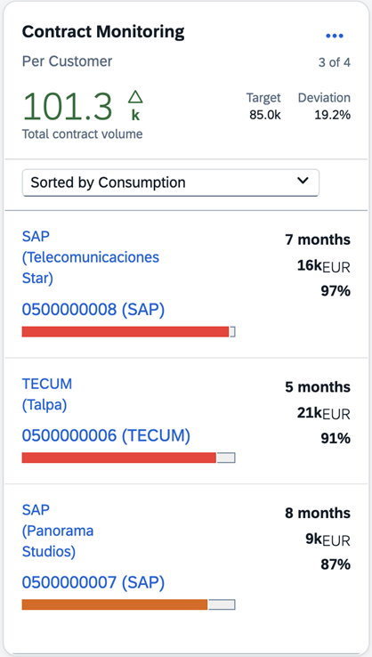
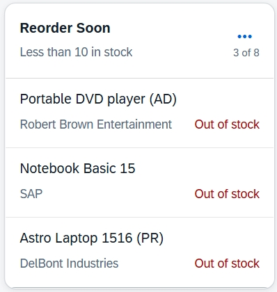
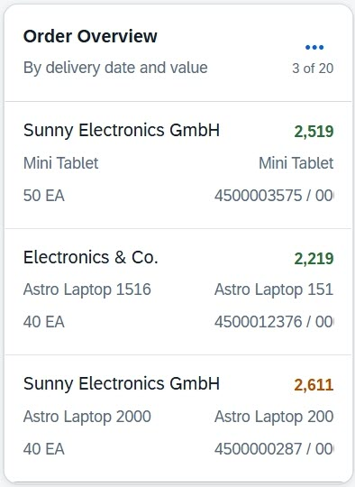

<!-- loio56f39e077efb477d9e851cd082b7760c -->

# List Cards

You can use list cards to display lists of records according to the configuration in the `com.sap.vocabularies.UI.v1.LineItem` term. List cards display up to six fields of data in each list item.





### Manifest Settings: Title

Property: `title`

Description: Configuring this property displays the card title on top of the list card.

**Manifest Settings Sample:**

> ### Sample Code:  
> `manifest.json`
> 
> ```
> 
>   "sap.ovp": {
>     "globalFilterModel": "salesOrder",
>     "globalFilterEntitySet": "GlobalFilters",
>               ...
>               ...
>     "cards": {
>       "sap.ovp.test_card.card002": {
>         "model": "salesOrder",
>         "template": "sap.ovp.cards.v4.list",
>         "settings": {
>           "title": "Purchase History",
>           "entitySet": "SalesOrderSet"
>               ...
>               ...
>               ...
>         }
>       }
>     }
>   }
> }
> ```


### Manifest Settings: Subtitle

Property: `subTitle`

Description: Configuring this property displays the card subtitle below the title of the list card.

**Configuration Sample:**

> ### Sample Code:  
> `manifest.json`
> 
> ```
> "sap.ovp": {
> 		"globalFilterModel": "salesOrder",
> 		"globalFilterEntitySet": "GlobalFilters",
>               ...
>               ...
> 		"cards": {
>           "sap.ovp.test_card.card002": {
>             "model": "salesOrder",
>             "template": "sap.ovp.cards.v4.list",
>             "settings": {
>               "title": "Purchase History",
>               "subTitle": "SubTitle",
>               "entitySet": "SalesOrderSet",
>               ...
>               ...
>                 }
>               ]
>             }
>           },
> ```

You can display the unit of measure next to numeric values by providing the `sap:unit` attribute in the OData metadata file or by annotating the unit in the annotation document. For example, if you have the following data and want to display 850kg after the subtitle text:

```
{
   CurrencyCode:"KG"
   GrossAmount:850
}
```

Use one of the following options:

-   Option 1: Define `sap:unit` in metadata

    ```
    <Property 
        Name="CurrencyCode" 
        Type="Edm.String" 
        MaxLength="5" 
        sap:label="Currency" 
        sap:updatable="false" 
        sap:semantics="currency-code"
    />
    <Property 
        Name="GrossAmount" 
        Type="Edm.Decimal" 
        Precision="16" 
        Scale="3" 
        sap:unit="CurrencyCode" 
        sap:label="Gross Amt." 
        sap:creatable="false" 
        sap:updatable="false"
    />
    ```

-   Option 2: Define `Org.OData.Measures.V1.ISOCurrency` in annotations

    > ### Sample Code:  
    > XML Annotation
    > 
    > ```xml
    > <Annotations Target="GWSAMPLE_BASIC.SalesOrderSet/GrossAmount">
    >     <Annotation Term="Org.OData.Measures.V1.ISOCurrency" Path="CurrencyCode"/>
    > </Annotations>
    > ```

    > ### Sample Code:  
    > CAP CDS Annotation
    > 
    > ```
    > annotate GWSAMPLE_BASIC.SalesOrderSet with {
    >   @Measures.ISOCurrency : CurrencyCode
    >   GrossAmount
    > };
    > ```


### KPI annotation

Manifest Settings

```
"sap.ovp": {//section for ovp-specific manifest settings
	...
	"kpiAnnotationPath":"com.sap.vocabularies.UI.v1.KPI#AllActualCosts", // Represents the KPI annotation path
     ...
}
```

**Annotation Sample**

> ### Sample Code:  
> XML Annotation
> 
> ```xml
> <Annotation Term="UI.KPI" Qualifier="AllActualCosts">
>    <Record Type="UI.KPIType">
>       <PropertyValue Property="Detail">
>          <Record Type="UI.KPIDetailType">
>             <PropertyValue Property="DefaultPresentationVariant" Path="@UI.PresentationVariant#Eval_by_Currency1" />
>             <PropertyValue Property="AlternativePresentationVariants">
>                <Collection>
>                   <Path>@UI.PresentationVariant#Eval_by_Currency_Column</Path>
>                </Collection>
>             </PropertyValue>
>             <PropertyValue Property="SemanticObject" String="Action" />
>             <PropertyValue Property="Action" String="toappnavsample" />
>          </Record>
>       </PropertyValue>
>       <PropertyValue Property="SelectionVariant" Path="@UI.SelectionVariant#Eval_by_Currency_1" />
>       <PropertyValue Property="DataPoint" Path="@UI.DataPoint#Eval_by_Country_Generic" />
>       <PropertyValue Property="ID" String="String for KPI Annotation" />
>    </Record>
> </Annotation>
> ```

> ### Sample Code:  
> ABAP CDS Annotation
> 
> ```
> @UI.KPI: [
>   {
>     detail: {
>       defaultPresentationVariantQualifier: 'Eval_by_Currency1',
>       alternativePresentationVariantQualifiers: [
>         'Eval_by_Currency_Column'
>       ],
>       semanticObject: 'Action',
>       semanticObjectAction: 'toappnavsample'
>     },
>     selectionVariantQualifier: 'Eval_by_Currency_1',
>     id: 'String for KPI Annotation',
>     qualifier: 'AllActualCosts'
>   }
> ]
> Eval_by_Country-Generic;
> ```

> ### Sample Code:  
> CAP CDS Annotation
> 
> ```
> UI.KPI #AllActualCosts : {
>     $Type : 'UI.KPIType',
>     Detail : {
>         $Type : 'UI.KPIDetailType',
>         DefaultPresentationVariant : ![@UI.PresentationVariant#Eval_by_Currency1],
>         AlternativePresentationVariants : [
>             ![@UI.PresentationVariant#Eval_by_Currency_Column]
>         ],
>         SemanticObject : 'Action',
>         Action : 'toappnavsample',
>     },
>     SelectionVariant : ![@UI.SelectionVariant#Eval_by_Currency_1],
>     DataPoint : ![@UI.DataPoint#Eval_by_Country-Generic],
>     ID : 'String for KPI Annotation'
> },
> 
> ```

**`PresentationVariant`**

> ### Sample Code:  
> XML Annotation
> 
> ```
> <Annotation Term="UI.PresentationVariant" Qualifier="Eval_by_Currency1">
>    <Record>
>       <PropertyValue Property="MaxItems" Int="5" />
>       <PropertyValue Property="GroupBy">
>          <Collection>
>             <PropertyPath>Country</PropertyPath>
>             <PropertyPath>Currency</PropertyPath>
>          </Collection>
>       </PropertyValue>
>       <PropertyValue Property="SortOrder">
>          <Collection>
>             <Record>
>                <PropertyValue Property="Property" PropertyPath="TotalSales" />
>                <PropertyValue Property="Descending" Bool="true" />
>             </Record>
>          </Collection>
>       </PropertyValue>
>       <PropertyValue Property="Visualizations">
>          <Collection>
>             <AnnotationPath>@UI.Chart#Eval_by_Currency_Donut</AnnotationPath>
>          </Collection>
>       </PropertyValue>
>    </Record>
> </Annotation>
> ```

> ### Sample Code:  
> ABAP CDS Annotation
> 
> ```
> @UI.PresentationVariant: [
>   {
>     maxItems: 5,
>     groupBy: [
>       'COUNTRY',
>       'CURRENCY'
>     ],
>     sortOrder: [
>       {
>         by: 'TOTALSALES'
>       }
>     ],
>     visualizations: [
>       {
>         type: #AS_CHART,
>         qualifier: 'Eval_by_Currency_Donut'
>       }
>     ],
>     qualifier: 'Eval_by_Currency1'
>   }
> ]
> annotate view VIEWNAME with { }
> ```

> ### Sample Code:  
> CAP CDS Annotation
> 
> ```
> UI.PresentationVariant #Eval_by_Currency1 : {
>     MaxItems : 5,
>     GroupBy : [
>         Country,
>         Currency
>     ],
>     SortOrder : [
>         {
>             Property : TotalSales,
>             Descending : true
>         },
>     ],
>     Visualizations : [
>         '@UI.Chart#Eval_by_Currency_Donut'
>     ]
> }
> 
> ```

**`SelectionVariant`**

> ### Sample Code:  
> XML Annotation
> 
> ```xml
> <Annotation Term="UI.SelectionVariant" Qualifier="Eval_by_Currency_1">
>    <Record>
>       <PropertyValue Property="SelectOptions">
>          <Collection>
>             <Record>
>                <PropertyValue Property="PropertyName" PropertyPath="Country" />
>                <PropertyValue Property="Ranges">
>                   <Collection>
>                      <Record>
>                         <PropertyValue Property="Sign" EnumMember="UI.SelectionRangeSignType/I" />
>                         <PropertyValue Property="Option" EnumMember="UI.SelectionRangeOptionType/EQ" />
>                         <PropertyValue Property="Low" String="IN" />
>                      </Record>
>                   </Collection>
>                </PropertyValue>
>             </Record>
>          </Collection>
>       </PropertyValue>
>       <PropertyValue Property="Parameters">
>          <Collection>
>             <Record Type="UI.Parameter">
>                <PropertyValue Property="PropertyName" PropertyPath="Currency_Target" />
>                <PropertyValue Property="PropertyValue" String="EUR" />
>             </Record>
>             <Record Type="UI.Parameter">
>                <PropertyValue Property="PropertyName" PropertyPath="UoM_Target" />
>                <PropertyValue Property="PropertyValue" String="KGM" />
>             </Record>
>          </Collection>
>       </PropertyValue>
>    </Record>
> </Annotation>
> ```

> ### Sample Code:  
> ABAP CDS Annotation
> 
> ```
> @UI.SelectionVariant: [
>   {
>     qualifier: 'Eval_by_Currency_1'
>   }
> ]
> annotate view VIEWNAME with { }
> 
> ```

> ### Sample Code:  
> CAP CDS Annotation
> 
> ```
> UI.SelectionVariant #Eval_by_Currency_1 : {
>     SelectOptions : [
>         {
>             PropertyName : Country,
>             Ranges : [
>                 {
>                     Sign : #I,
>                     Option : #EQ,
>                     Low : 'IN'
>                 }
>             ]
>         }
>     ],
>     Parameters : [
>         {
>             $Type : 'UI.Parameter',
>             PropertyName : Currency_Target,
>             PropertyValue : 'EUR'
>         },
>         {
>             $Type : 'UI.Parameter',
>             PropertyName : UoM_Target,
>             PropertyValue : 'KGM'
>         }
>     ]
> }
> 
> ```

**`DataPoint`**

> ### Sample Code:  
> XML Annotation
> 
> ```xml
> <Annotation Term="UI.DataPoint" Qualifier="Eval_by_Country_Generic">
>    <Record Type="UI.DataPointType">
>       <PropertyValue Property="Title" String="Sales India - Generic Card" />
>       <PropertyValue Property="Value" Path="Sales" />
>       <PropertyValue Property="ValueFormat">
>          <Record>
>             <PropertyValue Property="ScaleFactor" Decimal="2" />
>             <PropertyValue Property="NumberOfFractionalDigits" Int="1" />
>          </Record>
>       </PropertyValue>
>       <PropertyValue Property="CriticalityCalculation">
>          <Record>
>             <PropertyValue Property="ImprovementDirection" EnumMember="UI.ImprovementDirectionType/Minimize" />
>             <PropertyValue Property="DeviationRangeHighValue" String="7300" />
>             <PropertyValue Property="ToleranceRangeHighValue" String="7200" />
>          </Record>
>       </PropertyValue>
>       <PropertyValue Property="TargetValue" String="2.000 " />
>       <PropertyValue Property="TrendCalculation">
>          <Record>
>             <PropertyValue Property="ReferenceValue" String="5201680" />
>             <PropertyValue Property="DownDifference" Decimal="10000000.0" />
>          </Record>
>       </PropertyValue>
>    </Record>
> </Annotation>
> ```

> ### Sample Code:  
> ABAP CDS Annotation
> 
> ```
> 
> @UI.dataPoint: { 
> 	 title: 'Sales India - Generic Card',
> 	 valueFormat: { scaleFactor: 2, numberOfFractionalDigits: 1 },
> 	 criticalityCalculation: { 
> 	   improvementDirection: #MINIMIZE,
> 	   deviationRangeHighValue: 7300,
> 	   toleranceRangeHighValue: 7200
> 	 },
> 	 targetValue: 2.000,
> 	 trendCalculation: { referenceValue: 'refValElement', downDifference: 10000000.0 }
> }
> Sales;
> 
> ```

> ### Sample Code:  
> CAP CDS Annotation
> 
> ```
> 
> UI.DataPoint #Eval_by_Country-Generic : {
>     $Type : 'UI.DataPointType',
>     Title : 'Sales India - Generic Card',
>     Value : Sales,
>     ValueFormat : {
>         ScaleFactor : 2,
>         NumberOfFractionalDigits : 1
>     },
>     CriticalityCalculation : {
>         ImprovementDirection : #Minimizing,
>         DeviationRangeHighValue : '7300',
>         ToleranceRangeHighValue : '7200'
>     },
>     TargetValue : '2.000 ',
>     TrendCalculation : {
>         ReferenceValue : '5201680',
>         DownDifference : 10000000.0
>     }
> },
> ```


### View Switch

Property: `valueSelectionInfo`

> ### Sample Code:  
> `manifest.json`
> 
> ```
> 
>   "sap.ovp": {
>     "globalFilterModel": "SalesOrderSet",
>     "globalFilterEntitySet": "GlobalFilters",
>     "showDateInRelativeFormat": false,
>     "disableTableCardFlexibility": false,
> 
>     "considerAnalyticalParameters": true,
>     "useDateRangeType": false,
>     "cards": {
>       "card014": {
>         "model": "salesOrder",
>         "template": "sap.ovp.cards.v4.list",
>         "settings": {
>           "title": "Sales Forecast",
>           "subTitle": "per Supplier",
>           "valueSelectionInfo": "Value Selection Info",
>           "listFlavor": "bar",
>           "listType": "extended",
>           "entitySet": "SalesOrderSet",
>           "showFilterInHeader": true,
>           "tabs": [
>             {
>               "dynamicSubtitleAnnotationPath": "com.sap.vocabularies.UI.v1.HeaderInfo#dynamicSubtitle",
>               "annotationPath": "com.sap.vocabularies.UI.v1.LineItem#View1",
>               "selectionAnnotationPath": "com.sap.vocabularies.UI.v1.SelectionVariant#line1",
>               "presentationAnnotationPath": "com.sap.vocabularies.UI.v1.PresentationVariant#line",
>               "identificationAnnotationPath": "com.sap.vocabularies.UI.v1.Identification",
>               "dataPointAnnotationPath": "com.sap.vocabularies.UI.v1.DataPoint#line",
>               "value": "{{dropdown_value2}}"
>             },
>             {
>               "dynamicSubtitleAnnotationPath": "com.sap.vocabularies.UI.v1.HeaderInfo#dynamicSubtitle",
>               "annotationPath": "com.sap.vocabularies.UI.v1.LineItem#View4",
>               "identificationAnnotationPath": "com.sap.vocabularies.UI.v1.Identification#item2",
>               "dataPointAnnotationPath": "com.sap.vocabularies.UI.v1.DataPoint#line",
>               "value": "{{dropdown_value4}}"
>             }
>           ]
>         }
>       }
>     }
>   }
> }
> ```


### List Area

Annotation: `LineItem`

Description: Configuring this annotation displays a list of items with bar chart.

Manifest Settings

```

  "sap.ovp": {
    "globalFilterModel": "salesOrder",
    "globalFilterEntitySet": "GlobalFilters",  
    "showDateInRelativeFormat": false,
    "disableTableCardFlexibility": false,
    "considerAnalyticalParameters": true,
    "useDateRangeType": false,
    "cards": {
      "card014": {
        "model": "salesOrder",
        "template": "sap.ovp.cards.v4.list", 
        "settings": {
          "title": "Sales Forecast",
          "subTitle": "per Supplier",
          "valueSelectionInfo": "Value Selection Info",
          "listFlavor": "bar",
          "listType": "extended",
          "entitySet": "SalesOrderSet",
          "showFilterInHeader": true,
          "enableTextWrapping": true //The default value is false
          "tabs": [
            {
              "annotationPath": "com.sap.vocabularies.UI.v1.LineItem#View1",
              "selectionAnnotationPath": "com.sap.vocabularies.UI.v1.SelectionVariant#line1",
              "presentationAnnotationPath": "com.sap.vocabularies.UI.v1.PresentationVariant#line",
              "identificationAnnotationPath": "com.sap.vocabularies.UI.v1.Identification",
              "dataPointAnnotationPath": "com.sap.vocabularies.UI.v1.DataPoint#line",
              "value": "{{dropdown_value2}}"
            },
            {
              "annotationPath": "com.sap.vocabularies.UI.v1.LineItem#View4",
              "identificationAnnotationPath": "com.sap.vocabularies.UI.v1.Identification#item2",
              "dataPointAnnotationPath": "com.sap.vocabularies.UI.v1.DataPoint#line",
              "value": "{{dropdown_value4}}"
            }
          ]
        }
      }
    }
  }
}	
```

Annotation Sample for `LineItem#View4`

> ### Sample Code:  
> XML Annotation
> 
> ```xml
>                 <Annotation Term="com.sap.vocabularies.UI.v1.LineItem" Qualifier="View4">
>                     <Collection>
>                         <Record Type="com.sap.vocabularies.UI.v1.DataField">
>                             <PropertyValue Property="Label" String="Order ID"/>
>                             <PropertyValue Property="Value" Path="SalesOrderID"/>
>                         </Record>
>                         <Record Type="com.sap.vocabularies.UI.v1.DataField">
>                             <PropertyValue Property="Label" String="Customer"/>
>                             <PropertyValue Property="Value" Path="ToBusinessPartner/EmailAddress"/>
>                         </Record>
>                         <Record Type="com.sap.vocabularies.UI.v1.DataField">
>                             <PropertyValue Property="Label" String="Customer"/>
>                             <PropertyValue Property="Value" Path="CustomerName"/>
>                         </Record>
>                         <Record Type="com.sap.vocabularies.UI.v1.DataFieldForAnnotation">
>                             <PropertyValue Property="Label" String="TaxAmount"/>
>                             <PropertyValue Property="Target" AnnotationPath="@com.sap.vocabularies.UI.v1.DataPoint#TaxAmount"/>
>                         </Record>
>                     </Collection>
>                 </Annotation>
> ```

> ### Sample Code:  
> ABAP CDS Annotation
> 
> ```
> @UI.lineItem: [
>   {
>     label: 'Order ID',
>     position: 10,
>     qualifier: 'View4'
>   }
> ]
> SALESORDERID;
> 
> @UI.lineItem: [
>   {
>     label: 'Customer',
>     value: '_BUSINESSPARTNER.EMAILADDRESS',
>     position: 20,
>     qualifier: 'View4'
>   }
> ]
> TOBUSINESSPARTNER/EMAILADDRESS;
> 
> @UI.lineItem: [
>   {
>     label: 'Customer',
>     position: 30,
>     qualifier: 'View4'
>   }
> ]
> CUSTOMERNAME;
> 
> @UI.lineItem: [
>   {
>     label: 'TaxAmount',
>     valueQualifier: 'TaxAmount',
>     type: #AS_DATAPOINT,
>     position: 40,
>     qualifier: 'View4'
>   }
> ]
> PROPERT_NAME;
> 
> ```

> ### Sample Code:  
> CAP CDS Annotation
> 
> ```
> UI.LineItem #View4 : [
>     {
>         $Type : 'UI.DataField',
>         Label : 'Order ID',
>         Value : SalesOrderID
>     },
>     {
>         $Type : 'UI.DataField',
>         Label : 'Customer',
>         Value : ToBusinessPartner.EmailAddress
>     },
>     {
>         $Type : 'UI.DataField',
>         Label : 'Customer',
>         Value : CustomerName
>     },
>     {
>         $Type : 'UI.DataFieldForAnnotation',
>         Label : 'TaxAmount',
>         Target : '@UI.DataPoint#TaxAmount'
>     }
> ],
> 
> ```

Annotation Sample for `DataPoint#TaxAmount`

> ### Sample Code:  
> XML Annotation
> 
> ```xml
> 
> <Annotation Term="com.sap.vocabularies.UI.v1.DataPoint" Qualifier="TaxAmount">
>     <Record Type="com.sap.vocabularies.UI.v1.DataPointType">
>         <PropertyValue Property="Title" String="TaxAmount"/>
>         <PropertyValue Property="Value" Path="TaxAmount"/>
>     </Record>
> </Annotation>
> ```

> ### Sample Code:  
> ABAP CDS Annotation
> 
> ```
> 
> @UI.dataPoint: {
>   title: 'TaxAmount'
> }
> TaxAmount;
> ```

> ### Sample Code:  
> CAP CDS Annotation
> 
> ```
> UI.DataPoint #TaxAmount : {
>     $Type : 'UI.DataPointType',
>     Title : 'TaxAmount',
>     Value : TaxAmount
> }
> ```

The following sample code shows configuring the list item annotation path:

> ### Sample Code:  
> `manifest.json`
> 
> ```
> "sap.ovp": {
>     ...
>     "cards": {
>         ...
>         "card04": {
>             "model": "ZCD204_EPM_DEMO_SRV",
>             "template": "sap.ovp.cards.v4.list",
>             "settings": {
>                 "sortBy": "Price",
>                 "sortOrder": "descending",
>                 "listFlavor": "bar",
>                 "annotationPath": "com.sap.vocabularies.UI.v1.LineItem#bar",
>                 "category": "{{card04_category}}",
>                 "entitySet": "Products",
>                 "enableTextWrapping": true //The default value is false
>             }
>         },
>         ...
>     }
> }
> ```

When creating a list card, you can choose from a number of different types of lists. The number of items displayed depends on the type of list. You can choose from two types of list cards:

-   Condensed

-   Extended


For each of these types you can choose from two flavors:

-   Standard

-   Bar


The `com.sap.vocabularies.UI.v1.LineItem` term can be configured in the application manifest file by setting the `annotationPath` property with a qualifier. If the `annotationPath` property is not configured, the `com.sap.vocabularies.UI.v1.LineItem` term, without a qualifier, is used.

> ### Sample Code:  
> `manifest.json`
> 
> ```
> "sap.ovp": {
>     ...
>     "cards": {
>         ...
>         "card04": {
>             "model": "ZCD204_EPM_DEMO_SRV",
>             "template": "sap.ovp.cards.v4.list",
>             "settings": {
>                 "sortBy": "Price",
>                 "sortOrder": "descending",
>                 "listFlavor": "bar",
>                 "annotationPath": "com.sap.vocabularies.UI.v1.LineItem#bar",
>                 "category": "{{card04_category}}",
>                 "entitySet": "Products",
>                 "enableTextWrapping": true //The default value is false
>             }
>         },
>         ...
>     }
> }
> ```

> ### Note:  
> The template setting in the `manifest.json` file depends on your OData version. Use `sap.ovp.cards.v4.<cardType>` for SAP Fiori elements for OData V4 and `sap.ovp.cards.<cardType>` for SAP Fiori elements for OData V2.

By default, the fields in the list card are mapped to the `com.sap.vocabularies.UI.v1.LineItem` annotation. Any other collection of `DataFieldAbstract` can be used by setting the `annotationPath` property. `LineItem` is a collection of `DataFieldAbstract` records. You can use different `com.sap.vocabularies.UI.v1.LineItem` annotations for different card instances of the same entity type by using different qualifiers and setting the `annotationPath` property with the qualifier in the card configuration. For example `com.sap.vocabularies.UI.v1.LineItem#Qualifier1`.

At runtime, the `DataField` records are sorted according to the optional `Importance (com.sap.vocabularies.UI.v1.ImportanceType)` annotation. `DataField` entries are sorted according to importance and their order of entry.

You can control how text is displayed in list cards by using the `enableTextWrapping` property. If you set `"enableTextWrapping" : true`, then at runtime, text in the table area is wrapped instead of being truncated. The default value is `false`. This property can be defined at the card level in the `manifest.json` file. You can also enable the text wrapping feature using the *Adapt UI* option.


## Condensed List Type - Standard Flavor

In this type of list, each list item displays up to three fields. The first two `DataField` records are displayed at the top left and bottom left of the list item. If there is a `DataFieldForAnnotation` record that has a `DataPoint` target, it is displayed at the top right of the list item, and its value can be highlighted according to the criticality of the datapoint. If no `DataFieldForAnnotation` record is defined, the next `DataField` record is displayed instead.

Number of list items displayed: up to 3.


## Extended List Type - Standard Flavor

In this type of list, each list item displays up to six fields. `DataField` records are displayed on the left side of the line item, and `DataPoint` records are displayed on the right. If no `DataPoint` record is defined, or less than three `DataPoint` records are available, the right side of the line item displays `DataField` records instead.

Number of list items displayed: up to 6.


<table>
<tr>
<td valign="top">



</td>
<td valign="top">



</td>
</tr>
<tr>
<td valign="top">

Condensed List Type - Standard Flavor

</td>
<td valign="top">

Extended List Type - Standard Flavor

</td>
</tr>
</table>


## Condensed List Type - Bar Flavor

In this type of list, each list item displays up to three fields. Only use this kind of list if you want to display a `DataPoint` record. The first `DataField` record is displayed as a title for the line item in the top-left field. The first `DataPoint` record is displayed as a bar beneath the title, and as a numeric value to the right of the bar. You can also display an additional `DataPoint` record to the right of the first `DataPoint` record. The bar can display values as a percentage or as any numeric value.

Number of list items displayed: up to 3.


## Extended List Type - Bar Flavor

In this type of list, each list item displays up to five fields. The first `DataField` record is displayed as a title for the line item in the top-left field. An additional `DataField` record can be displayed beneath the title. The first `DataPoint` record is displayed as a bar beneath the `DataField` records, and as a numeric value to the right of the bar at the bottom of the line item. You can also display two additional `DataPoint` records to the right of line item, one above the other.

> ### Note:  
> If highlighting \(criticality\) is defined in the annotation of the `DataPoint` records, only one will be highlighted in the line item according to the order in which they are displayed.
> 
> Number of list items displayed: up to 5.


<table>
<tr>
<td valign="top">


</td>
<td valign="top">


</td>
</tr>
<tr>
<td valign="top">

Condensed List Type - Bar Flavor

</td>
<td valign="top">

Extended List Type - Bar Flavor

</td>
</tr>
</table>


<a name="loio56f39e077efb477d9e851cd082b7760c__section_xt3_h4n_m2b"/>

## Condensed List Card with Images or Icons

To display images or icons in the condensed list card, set the property `"imageSupported": true,` in the manifest settings and configure the `DataField` property in the `LineItem` annotation. For example:

> ### Sample Code:  
> XML Annotation
> 
> ```xml
> <Annotation Term="com.sap.vocabularies.UI.v1.LineItem">
>  <Collection>
>  <Record Type="com.sap.vocabularies.UI.v1.DataField">
>  <PropertyValue Property="IconUrl" Path="web_address"/>
>  <PropertyValue Property="Value" Path="MaterialName"/>
>  </Record>
> </Collection>
> <Annotation>
> ```

> ### Sample Code:  
> ABAP CDS Annotation
> 
> ```
> @UI.lineItem: [{ value: 'MATERIALNAME' }]
> MATERIALNAME;
> ```

> ### Sample Code:  
> CAP CDS Annotation
> 
> ```
> UI.LineItem : [
>     {
>         $Type : 'com.sap.vocabularies.UI.v1.DataField',
>         IconUrl : web_address,
>         Value : MaterialName
>     }
> ]
> ```

> ### Note:  
> In list card, an image control is used instead of avatar. For more information, see [Using Images and Icons](using-images-and-icons-5760b63.md).

**Related Information**  


[Configuring the List Card](configuring-the-list-card-7f65716.md "You can configure several attributes of a list card, including text formatting, filtering, sorting.")

[Configuring the List Area](configuring-the-list-area-f57373d.md "You can configure the list area by defining values, navigation properties, and numeric data points and contact information.")

