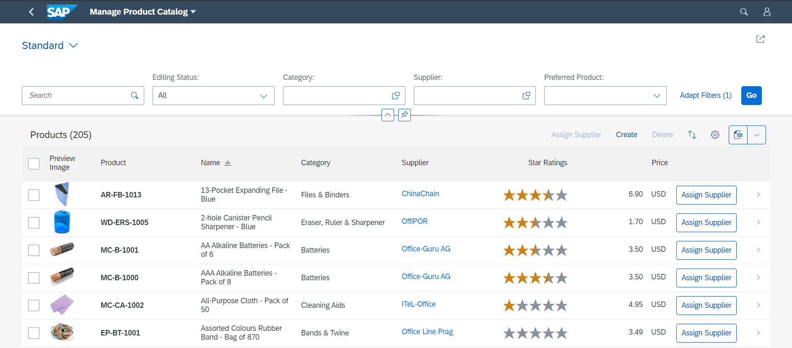

<!-- loio1cf5c7f5b81c4cb3ba98fd14314d4504 -->

# List Report Elements

The list report lets the user work with a large list of items. It combines powerful functions for filtering large lists with different ways of displaying the resulting item list.

<a name="loio1cf5c7f5b81c4cb3ba98fd14314d4504__section_an2_wdm_ymb"/>

## Main Elements of the List Report

The list report view includes the following main elements:

-   Application header

-   Filter bar with variant management and a generic *Share* menu that includes the following actions:

    -   *Send Email*

    -   *Save as Tile*

-   Table

-   Footer toolbar that can include optional actions

For more information about the loading behavior of an app, see [Loading Behavior Based on the Chosen Variant](loading-behavior-based-on-the-chosen-variant-9f4e119.md).

<a name="loio1cf5c7f5b81c4cb3ba98fd14314d4504__section_pcy_4cm_ymb"/>

## More Information

For more information about the various functions of the list report view, see:

-   [Configuring List Report Features](configuring-list-report-features-3af1d03.md)

-   [Configuring Further Common Features](configuring-further-common-features-a4d3c46.md)

