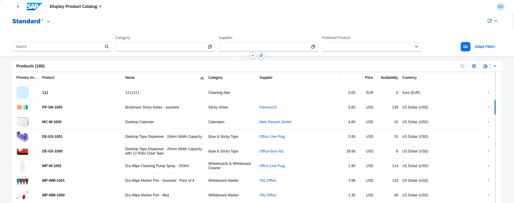

<!-- loio1cf5c7f5b81c4cb3ba98fd14314d4504 -->

# List Report Elements

The list report allows end users to work with a large list of items. It combines powerful functions for filtering large lists with different ways of displaying the resulting item list.

<a name="loio1cf5c7f5b81c4cb3ba98fd14314d4504__section_uc3_jkw_qfc"/>

## Main Elements

The list report view includes the following main elements:

-   Application header

-   Variant Management

-   Header Toolbar with a generic *Share* menu that includes the following actions:

    -   *Send Email*

    -   *Share in SAP Jam*

    -   *Save as Tile*

    -   *Share: Microsoft Teams*

    -   *Share: Collaboration Manager*

-   Content area that includes a table, a chart, or both

<a name="loio1cf5c7f5b81c4cb3ba98fd14314d4504__section_qsx_vlw_qfc"/>

## Related Information

For more information about the various functions in a list report, see [Configuring List Report Features](configuring-list-report-features-3af1d03.md) and [Configuring Further Common Features](configuring-further-common-features-a4d3c46.md).

For more information about the loading behavior of an app, see [Loading Behavior of Data on Initial Launch of the Application](loading-behavior-of-data-on-initial-launch-of-the-application-9f4e119.md).

