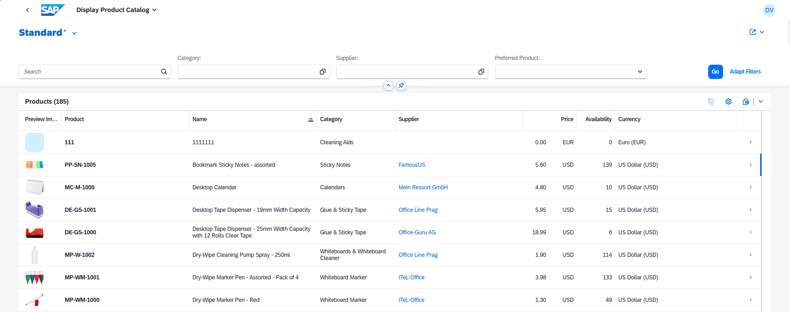

<!-- loio1cf5c7f5b81c4cb3ba98fd14314d4504 -->

# List Report Page

Users can make use of the list report page to work with a large list of items.

The list report page combines powerful functions for filtering large lists with different ways of displaying the resulting item list.

<a name="loio1cf5c7f5b81c4cb3ba98fd14314d4504__section_uc3_jkw_qfc"/>

## Main Elements

The list report page view includes the following main elements:

-   Application header

-   Variant management

-   Header toolbar with a generic *Share* menu that includes the following actions:

    -   *Send E-Mail*

    -   *Microsoft Teams*

        -   *As Chat*

        -   *As Tab*

    -   *Save as Tile*

-   Content area that includes a table, a chart, or both

<a name="loio1cf5c7f5b81c4cb3ba98fd14314d4504__section_qsx_vlw_qfc"/>

## Related Information

For more information about the loading behavior of an app, see [Loading Behavior of Data on Initial Launch of the Application](loading-behavior-of-data-on-initial-launch-of-the-application-9f4e119.md).

> ### Note:  
> For information about SAP Fiori elements for OData V2, see [Elements of the List Report Page](elements-of-the-list-report-page-0418ac4.md).

