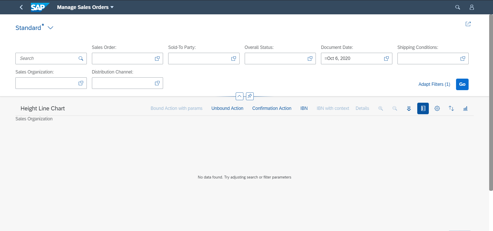

<!-- loio37cd601a771f4c21a7d4a5087a607b7d -->

# Maintaining Standard Texts for Charts

For charts in analytical list pages, list reports, and object pages, if the system does not find any entries when using the filters, standard UI texts are displayed, which you can adapt in the `i18n` file of your app.

The following UI texts are displayed by default:

-   SAP Fiori elements for OData V2
    -   When no filters are applied and no data is found, a *No data found* message is displayed in the object page chart, and the message *To start, set relevant filters* is displayed in the list report chart.

    -   When filters are applied and the search shows no results, the message *No data found. Try adjusting the search or filter parameters* is displayed in the object page chart, and the message *There is no data for the selected filter criteria and chart view* is displayed in the list report chart.

-   SAP Fiori elements for OData V4
    -   When no filters are applied and no data is found, an illustrated message is displayed with *No data found* as the title and *To start, set the relevant filters and choose "Go".* as the description.

    -   When filters are applied and the search shows no results, an illustrated message is displayed with *No data found* as the title and *Try adjusting the search or filter criteria.* as the description.

    -   When no filters are applied and no data is found, the message an illustrated message is displayed with *No item available* as the title and *When there are, you'll find them here.* as the description. You cannot override these texts.

<a name="loio37cd601a771f4c21a7d4a5087a607b7d__section_sjr_gxk_r4b"/>

## Changing Standard Texts

### SAP Fiori Elements for OData V2

You can override the standard texts using the following keys in the `i18n` file:

-   `NOITEMS_SMARTCHART`

-   `NOITEMS_SMARTCHART_WITH_FILTER`

-   `NOITEMS_LR_SMARTCHART`

### SAP Fiori Elements for OData V4

You can override the standard texts using the following keys in the `i18n` file:

<table>
<tr>
<th valign="top">

Keys

</th>
<th valign="top">

Default Text in SAP Fiori Elements

</th>
<th valign="top">

Used In

</th>
</tr>
<tr>
<td valign="top">

`T_TABLE_AND_CHART_NO_DATA_TEXT`

</td>
<td valign="top">

To start, set the relevant filters and choose "Go".

</td>
<td valign="top">

To add a text when no filters are applied and no data is found.

This is applicable only to the list report.

</td>
</tr>
<tr>
<td valign="top">

`T_TABLE_AND_CHART_NO_DATA_TEXT_WITH_FILTER`

</td>
<td valign="top">

Try adjusting the search or filter criteria.

</td>
<td valign="top">

To add a text when filters are applied and no data is found.

</td>
</tr>
<tr>
<td valign="top">

`M_TABLE_AND_CHART_NO_DATA_TEXT_MULTI_VIEW`

</td>
<td valign="top">

Try adjusting the selected filter criteria or view.

</td>
<td valign="top">

To add a text when using a list report with multiple views, filters are applied, and no data is found.

</td>
</tr>
</table>

> ### Note:  
> You cannot override the title of an illustrated message.

<a name="loio37cd601a771f4c21a7d4a5087a607b7d__section_icw_ffx_1lb"/>

## Related Information

[Configuring Tables](configuring-tables-f4eb70f.md)

