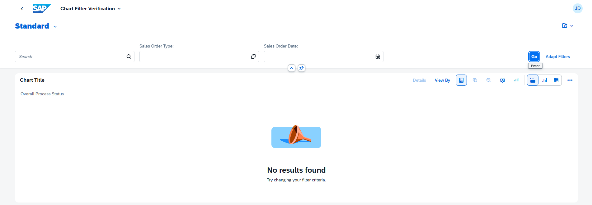

<!-- loio37cd601a771f4c21a7d4a5087a607b7d -->

# Maintaining Standard Texts for Charts

For charts in analytical list pages, list reports, and object pages, if the system does not find any entries when using the filters, standard UI texts are displayed, which you can adapt in the `i18n` file of your app.

The following UI texts are displayed by default:

-   SAP Fiori elements for OData V2
    -   When no filters are applied and no data is found, a *No data found.* message is displayed in the object page chart, and the message *To start, set the relevant filters and choose "Go".* is displayed in the list report chart.

    -   When filters are applied and the search shows no results, the message *No data found. Try adjusting the search or filter parameters.* is displayed in the object page chart, and the message *There is no data for the selected filter criteria and chart view.* is displayed in the list report chart.

-   SAP Fiori elements for OData V4
    -   When opening a list report without autoload, an illustrated message is displayed with *Let’s get some results* as the title and *Start by providing your search or filter criteria.* as the description.
    -   When no filters are applied and no data is found on the list report page, an illustrated message is displayed with *No results found* as the title and *Start by providing your search or filter criteria.* as the description.

    -   When filters are applied and the search shows no results, an illustrated message is displayed with *No results found* as the title and *Try changing your filter criteria.* as the description.

    -   When the chart is used in multi-view mode and no data is found, an illustrated message is displayed with *No no results found* as the title and *Try changing the view or filter criteria.* as the description.

    -   When no search nor filters are applied and no data is found on the object page, an illustrated message is displayed with *No items available* as the title and *When there are, you'll find them here.* as the description.

<a name="loio37cd601a771f4c21a7d4a5087a607b7d__section_sjr_gxk_r4b"/>

## Changing Standard Texts

### SAP Fiori Elements for OData V2

You can override the standard texts using the following keys in the `i18n` file:

-   `NOITEMS_SMARTCHART`

-   `NOITEMS_SMARTCHART_WITH_FILTER`

-   `NOITEMS_LR_SMARTCHART`

### SAP Fiori Elements for OData V4

You can override standard illustrated message texts by adding specific keys to the i18n file of the list report page and object page. For a list of the keys, see [Localization of UI Texts](localization-of-ui-texts-b8cb649.md).

<a name="loio37cd601a771f4c21a7d4a5087a607b7d__section_icw_ffx_1lb"/>

## Related Information

[Configuring Tables](configuring-tables-f4eb70f.md)

