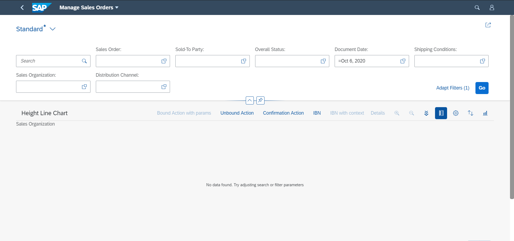

<!-- loio37cd601a771f4c21a7d4a5087a607b7d -->

# Maintaining Standard Texts for Charts

For charts in analytical list pages, list reports, and object pages, if the system does not find any entries when using the filters, standard UI texts are displayed, which you can adapt in the `i18n` file of your app.

The following UI texts are displayed by default:

-   When no filters are applied and no data is found, a *No data found.* message is displayed in the object page chart, and the message *To start, set the relevant filters and choose "Go".* is displayed in the list report chart.

-   When filters are applied and the search shows no results, the message *No data found. Try adjusting the search or filter parameters.* is displayed in the object page chart, and the message *There is no data for the selected filter criteria and chart view.* is displayed in the list report chart.

<a name="loio37cd601a771f4c21a7d4a5087a607b7d__section_sjr_gxk_r4b"/>

## Changing Standard Texts

You can override the standard texts using the following keys in the `i18n` file:

-   `NOITEMS_SMARTCHART`

-   `NOITEMS_SMARTCHART_WITH_FILTER`

-   `NOITEMS_LR_SMARTCHART`

<a name="loio37cd601a771f4c21a7d4a5087a607b7d__section_icw_ffx_1lb"/>

## Related Information

[Configuring Tables](configuring-tables-3695931.md)

