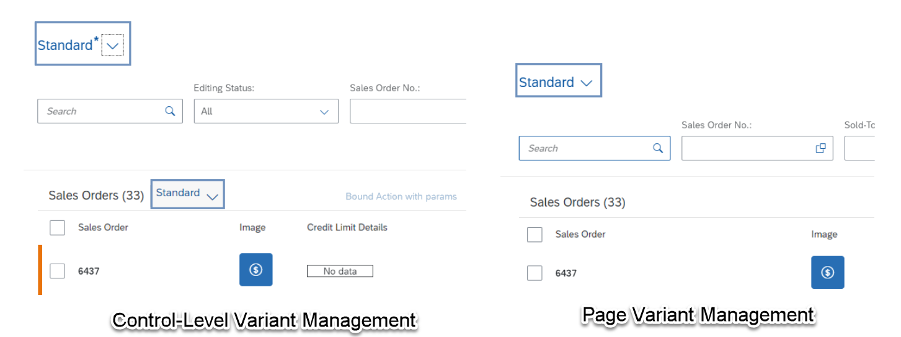

<!-- loio8ce658e05498466d9a74823b94e840ac -->

# Managing Variants

Lets you manage variants with different structures in the filter and content areas.


<a name="loio8ce658e05498466d9a74823b94e840ac__context_wzz_hs3_lmb"/>

## Context

The list report provides variant management on page level and on control level. Control-level variant management can also be used on the object page.

Use control-level variant management to define separate variants for filters and table sections. The filter variant stores filter area selections and the filter mode. When you load the stored variant, both the filter area selection and filter mode appear. It is not possible to use control-level variant management and page-level variant management together.

Use page-level variant management to capture filter selection, filter mode, view mode, auto-hide icon state \(eye-icon\), chart, and table configuration \(measures and dimensions\), sort order, and grouping. The page level variant is enabled by default.

  

> ### Note:  
> You can define variants for specific selections of data on the user interface, for example, based on filter settings. In the definition dialog, these variants are called views, however, the feature is called variant management. Therefore, for clarity, we use the term variant management in this section.

Control-level variant management is not recommended for list report templates and analytical list page templates. Use it only for object page templates. For more information about how to the enable control-level variant in the object page, see [Enabling Variant Management on the Object Page](enabling-variant-management-on-the-object-page-f26d42b.md).

 <a name="topic_fdm_n4r_1qb"/>

<!-- topic\_fdm\_n4r\_1qb -->

## Which Variant Is Loaded on Initial Load?

For table and chart control variants, SAP Fiori elements always loads the variant which users have marked as their default variant.

For the filter control variant or the page variant, the following behavior applies:

-   SAP Fiori elements loads the "`Standard`" variant and ignores the user's default variant when navigation to the list report template is triggered with the navigation context \(so either with URL parameters or `xAppState`\). The filter values of the standard variants are cleared and the filter or parameter values from the incoming navigation context are applied.

-   SAP Fiori elements loads the user's default variant \(if configured\) when navigation to the list report template is triggered with **no** navigation context. If no user default variant is found, the standard variant is used as the fallback option. Only in this case does SAP Fiori elements apply the user default values of FLP.


For more information, see [Loading Behavior Based on the Chosen Variant](loading-behavior-based-on-the-chosen-variant-9f4e119.md).

 <a name="topic_ctc_rlg_mqb"/>

<!-- topic\_ctc\_rlg\_mqb -->

## Managing Variants in SAP Fiori Elements for OData V2

For the list report object page and worklist, the `smartVariantManagement` variable is set to `true` by default within the `manifest.json` file. For the analytical list page, the `smartVariantManagement` variable is set to `false` by default. These settings are automatically set by the SAP Fiori generator. It can be changed in the manifest as shown here:

```js
"sap.ui.generic.app": {
        "_version":"1.1.0",
        "pages": [
            {
                "entitySet": "XXXXXX_Product",
                "component": {
                    "name": "sap.suite.ui.generic.template.ListReport",
                    "list": true,
                    "settings" : {
                        "gridTable" : false,
                        "multiSelect": false,
                        "smartVariantManagement": true
```

You can also change the `smartVariantManagement` variable using the *Page Editor*.

If `smartVariantManagement` is set to `true`, the page variant is enabled. If it is set to `false`, control-level variant is enabled. If it is undefined, then the default setting is `true`.

For more information see, [Develop an Application](https://help.sap.com/docs/SAP_FIORI_tools/17d50220bcd848aa854c9c182d65b699/a9c004397af5461fbf765419fc1d606a.html).

 <a name="topic_jmz_ylg_mqb"/>

<!-- topic\_jmz\_ylg\_mqb -->

## Managing Variants in SAP Fiori Elements for OData V4

In the `manifest.json` file, the `VariantManagement` variable is set to `Page` by default. It can be changed in the manifest as shown below:

```json
{
    "sap.ui5": {
        "routing": {
            "targets": {
                "SalesOrderManageList": {
                    "options": {
                        "settings": {
                            "variantManagement": "Page"
                        }
                    }
                },
                "SalesOrderManageObject": {
                    "options": {
                        "settings": {
                            "variantManagement": "None"
                        }
                    }
                }
            }
        }
    }
}

```

You can also change the `VariantManagement` variable using the *Page Editor*.

