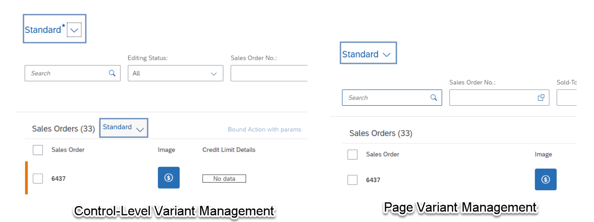

<!-- loio8ce658e05498466d9a74823b94e840ac -->

# Managing Variants

You can manage variants with different structures in the filter and content areas.


<a name="loio8ce658e05498466d9a74823b94e840ac__context_wzz_hs3_lmb"/>

## Context

> ### Note:  
> This topic describes how to use the building block within SAP Fiori elements floorplans. If the functionality isn't available when you use the building block in custom pages or custom sections, you can try achieving the functionality through other means, such as the following:
> 
> -   Properties or methods exposed by the building block
> 
> -   Custom code using extensions

The list report page provides variant management at both page level and control level. Control-level variant management can also be used on the object page.

Use control-level variant management to define separate variants for filters and table sections. The filter variant stores filter area selections and the filter mode. When you load the stored variant, both the filter area selection and filter mode appear. It is not possible to use control-level variant management and page-level variant management together.

Use page-level variant management to capture filter selection, filter mode, view mode, auto-hide icon state \(eye-icon\), chart, and table configuration \(measures and dimensions\), sort order, and grouping. The page-level variant is enabled by default.



> ### Note:  
> You can define variants for specific selections of data on the user interface, for example, based on filter settings. In the definition dialog, these variants are called views, however, the feature is called variant management. Therefore, for clarity, we use the term variant management in this section.

You can use either control-level variant management or page-level variant management for your list report page and analytical list page. Providing both options simultaneously can confuse users.

For more information about how to the enable the control-level variant in the object page, see [Enabling Variant Management on the Object Page](enabling-variant-management-on-the-object-page-f26d42b.md).

<a name="topic_fdm_n4r_1qb"/>

<!-- topic\_fdm\_n4r\_1qb -->

## Which Variant Is Loaded on Initial Load?

For table and chart control variants, SAP Fiori elements always loads the variant which users have marked as their default variant.

For the filter control variant or the page variant, the following behavior applies:

-   When the SAP Fiori elements application is launched through external navigation with a navigation context \(either by using URL parameters or in `xAppState`\), the incoming navigation context is applied, and the filter values of the user's default variant are overridden. As a result, the variant name is displayed as *Standard\** in the filter bar where "\*" indicates that the variant isn't in a clean state. However, the personalization settings for tables or charts from the user's default variant are retained.

-   SAP Fiori elements loads the user's default variant \(if configured\) when navigation to the list report page template is triggered with **no** navigation context. If no user default variant is found, the standard variant is used as the fallback option. Only in this case does SAP Fiori elements apply the user default values of FLP.


For more information, see [Loading Behavior of Data on Initial Launch of the Application](loading-behavior-of-data-on-initial-launch-of-the-application-9f4e119.md).

<a name="topic_jmz_ylg_mqb"/>

<!-- topic\_jmz\_ylg\_mqb -->

## Using the `VariantManagement` Variable

In the `manifest.json` file, the `VariantManagement` variable is set to `Page` by default. You can change the default settings in the `manifest.json` file, as shown in the following sample code:

```json
{
    "sap.ui5": {
        "routing": {
            "targets": {
                "SalesOrderManageList": {
                    "options": {
                        "settings": {
                            "variantManagement": "Page"
                        }
                    }
                },
                "SalesOrderManageObject": {
                    "options": {
                        "settings": {
                            "variantManagement": "None"
                        }
                    }
                }
            }
        }
    }
}

```

You can also change the `VariantManagement` variable using the *Page Editor*. For more information, see [Configure Page Elements](https://help.sap.com/docs/SAP_FIORI_tools/17d50220bcd848aa854c9c182d65b699/047507c86afa4e96bb3d284adb9f4726.html).

<a name="concept_k3v_541_c3c"/>

<!-- concept\_k3v\_541\_c3c -->

## 

> ### Note:  
> For information about SAP Fiori elements for OData V2, see [Managing Variants](managing-variants-b82d987.md).

