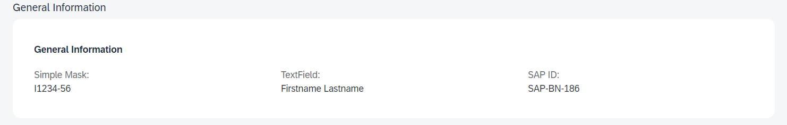

<!-- loiode89aec0895443409e045ae894b1b898 -->

# Masked Input Fields

You can use masked input fields, allowing users to enter values only in the specified format, in SAP Fiori elements for OData V4.

Masked input fields don't accept data in formats that don't match the defined pattern. Examples of such fields include a postal code, a product activation key, or a phone number with an area code.



For example, if the mask symbol is `S^AP-AA-999`, the end user input value must be `DE239`. The value displayed on the UI is `SAP-DE-239`. The characters used as mask symbols such as `SAP`, `I`, or special characters such as `()` are only displayed on the UI and not saved in the back end.

> ### Sample Code:  
> XML Annotation
> 
> ```
> <Annotations Target="sap.fe.core.MaskInputMassEdit.MainEntity/MaskedInputPhone"> 
>           <Annotation Term="UI.InputMask"> 
>               <Record> 
>                    <PropertyValue Property="Mask" String="(***) *** ******"/> 
>                    <PropertyValue Property="PlaceholderSymbol" String="_"/> 
>               </Record> 
>           </Annotation> 
>           <Annotation Term="UI.Placeholder" String="Enter twelve-digit number"/> 
> </Annotations> 
> 
> <Annotations Target="sap.fe.core.MaskInputMassEdit.MainEntity/MaskedInputRegistration"> 
>           <Annotation Term="UI.InputMask"> 
>                 <Record> 
>                    <PropertyValue Property="Mask" String="I____-__"/> 
>                    <PropertyValue Property="PlaceholderSymbol" String="_"/> 
>                    <PropertyValue Property="Rules"> 
>                         <Collection> 
>                                   <Record> 
>                                        <PropertyValue Property="MaskSymbol" String="_"/> 
>                                        <PropertyValue Property="RegExp" String="[0-9]"/> 
>                                   </Record> 
>                         </Collection> 
>                    </PropertyValue> 
>                </Record> 
>           </Annotation> 
> 
> 
> 
> ```

> ### Sample Code:  
> ABAP CDS Annotation
> 
> No ABAP CDS annotation sample is available. Please use the local XML annotation.

> ### Sample Code:  
> CAP CDS Annotation
> 
> ```
> MaskedInputPhone   : String          @( 
>       UI.InputMask  : { 
>          Mask       : '(***) *** ******', 
>          PlaceholderSymbol: '_', 
>       }, 
>       UI.Placeholder: 'Enter twelve-digit number' 
>       ); 
>      MaskedInputRegistration    : String          @( 
>       UI.InputMask  : { 
>         Mask       : 'I****-**', 
>         PlaceholderSymbol: '_', 
>         Rules      : [{ 
>          MaskSymbol: '*', 
>          RegExp    : '[0-9]' 
>         }] 
>       }, 
>       UI.Placeholder: 'Enter digits registration number' 
> ); 
>      MaskedInputSAP            : String          @(
>   UI.InputMask  : {
>     Mask             : 'S^AP-AA-999',
>     PlaceholderSymbol: '_',
>     Rules            : [
>       {
>         MaskSymbol: '9',
>         RegExp    : '[0-9]'
>       },
>       {
>         MaskSymbol: 'A',
>         RegExp    : '[A-Z]'
>       }
>     ]
>   },
>   UI.Placeholder: 'Starts with SAP followed by two uppercase letter and three digits'
> );
> ```

> ### Note:  
> You must ensure that placeholder symbols do not match the mask symbols.
> 
> The mask characters normally correspond to an existing rule \(one rule per unique character\). Characters which don't, are considered immutable characters \(for example, the mask `2099`, where `9` corresponds to a rule for digits, has the characters `2` and `0` as immutable\). You can use the special escape character `^` called "Caret" directly before a rule character to make it immutable.

For more information and live examples, see the SAP Fiori development portal at [Building Blocks - Field - Input Fields - Input Mask](https://ui5.sap.com/test-resources/sap/fe/core/fpmExplorer/index.html#/buildingBlocks/field/fieldInputMask).

