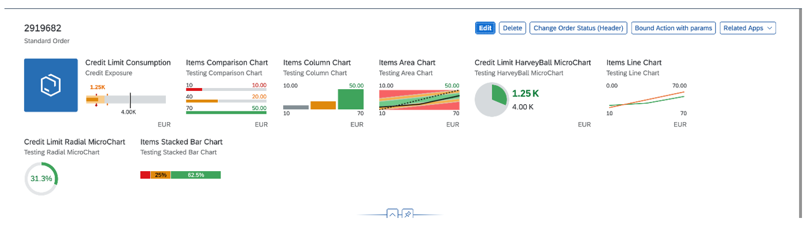
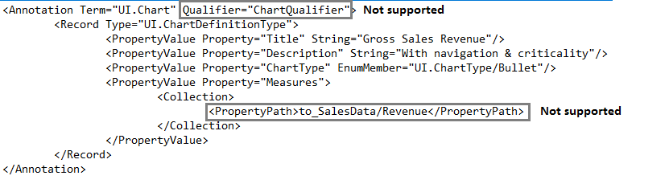
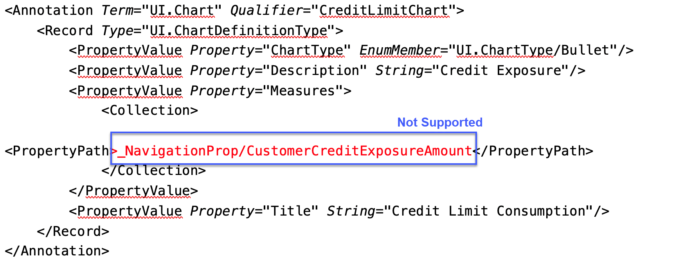

<!-- loioe219fd0c85b842c69ac3a514e712ece5 -->

# Micro Chart Facet

You can add a `MicroChart` control to a facet within the header area on the object page.

A micro chart facet contains a title, subtitle, `MicroChart` control, and a footer. The `MicroChart` control supports the following micro charts in the object page header:




To add a micro chart facet, in the local annotations file, use a `UI.HeaderFacets` term and the complex type `UI.ReferenceFacet` and reference the `UI.Chart` as shown in the sample code below.


### `UI.HeaderFacets` and `UI.ReferenceFacet`

> ### Sample Code:  
> XML Annotation
> 
> ```xml
> <Annotations Target="STTA_PROD_MAN.STTA_C_MP_ProductType">
>     <Annotation Term="UI.HeaderFacets">
>         <Collection>
>             <Record Type="UI.ReferenceFacet">
>                 <PropertyValue Property="Target" AnnotationPath="to_ProductSalesPrice/@UI.Chart"/>
>             </Record>
>         </Collection>
>     </Annotation>
> </Annotations>
> 
> ```

> ### Sample Code:  
> ABAP CDS Annotation
> 
> ```
> 
> annotate view STTA_C_MP_PRODUCT with {
> @UI.Facet: [
>   {
>     targetElement: 'TO_PRODUCTSALESPRICE',
>     type: #CHART_REFERENCE,
>     purpose: #HEADER
>   }
> ]
> 
> product;
> }
> 
> ```

> ### Sample Code:  
> CAP CDS Annotation
> 
> ```
> 
> annotate STTA_PROD_MAN.STTA_C_MP_ProductType with @(
>   UI.HeaderFacets : [
>     {
>         $Type : 'UI.ReferenceFacet',
>         Target : 'to_ProductSalesPrice/@UI.Chart'
>     }
>   ]
> );
> 
> ```


### `UI.Chart` Annotations

The `UI.Chart Title` property is used for the title.

The `UI.Chart Description` property is used for the subtitle.


### `UI.DataPoint` Annotation

The `DataPoint` property of the `MeasureAttributes` of the `Chart` annotation has to point to the `UI.DataPoint` annotation.

The micro chart supports both the `Criticality` and `CriticalityCalculation` properties of a `UI.DataPoint`. For an example of how to use the `CriticalityCalculation`, see the area micro chart annotation example. For an example of how to use the `Criticality` property, see the bullet micro chart annotation example.


### Unit of Measure Annotations

The unit of measure is used for the footer of the micro chart. An annotation for the unit of measure is included in the example below. The example uses the `Measures.ISOCurrency` term and it is applied to the entity type property that is used as the value property of the `UI.DataPoint`.

> ### Sample Code:  
> XML Annotation
> 
> ```xml
> <Annotations xmlns="http://docs.oasis-open.org/odata/ns/edm" Target="STTA_PROD_MAN.STTA_C_MP_ProductSalesPriceType/AreaChartPrice">
>      <Annotation Term="Measures.ISOCurrency" Path="Currency"/>
> </Annotations>
> ```

> ### Sample Code:  
> ABAP CDS Annotation
> 
> ```
> @Semantics.amount.currencyCode: 'Currency'
> AreaChartPrice;
> @Semantics.currencyCode:true
> Currency;
> ```

> ### Sample Code:  
> CAP CDS Annotation
> 
> ```
> 
> annotate STTA_PROD_MAN.STTA_C_MP_ProductSalesPriceType with {
> 	@Measures.ISOCurrency : Currency
> 	AreaChartPrice
> 
> ```


<a name="loioe219fd0c85b842c69ac3a514e712ece5__section_l5h_1qp_btb"/>

## Additional Features in SAP Fiori Elements for OData V2

> ### Note:  
> The template does not currently support the use of navigation properties in the `UI.Chart` term for the micro chart \(see example below\).
> 
>    
>   
> **Navigation Property**
> 
>   


<a name="loioe219fd0c85b842c69ac3a514e712ece5__section_nhk_hqp_btb"/>

## Additional Features in SAP Fiori Elements for OData V4

Application developers can also enable in-page and external navigation from the micro chart title. For more information, see [Navigation from Header Facet Title](navigation-from-header-facet-title-fa0ca22.md).

SAP Fiori elements for OData V4 also supports the comparison micro chart.

> ### Note:  
> The use of navigation properties, like the one highlighted below, is currently not supported.
> 
>    
>   
> **Navigation Property**
> 
>   

**Related Information**  


[Area Micro Chart](area-micro-chart-1467f2b.md "An area micro chart is a trend chart.")

[Bullet Micro Chart](bullet-micro-chart-b915166.md "The bullet chart features a single, primary measure (for example, current year-to-date revenue).")

[Radial Micro Chart](radial-micro-chart-51eb569.md "Radial micro charts displays a single percentage value.")

[Line Micro Chart](line-micro-chart-e5cb2af.md "A line chart is a basic type of chart used in many fields.")

[Column Micro Chart](column-micro-chart-1a4ecb8.md "A column chart uses vertical bars to compare multiple values over time or across categories.")

[Harvey Micro Chart](harvey-micro-chart-de4f8bf.md "")

[Stacked Bar Micro Chart](stacked-bar-micro-chart-9c93837.md "A stacked bar micro chart displays all the values from the backend for the configured measure as a percentage of the total measure value.")

[Comparison Micro Chart](comparison-micro-chart-9d126f1.md "A single measure value is shown against a maximum value. Only the first three values as received from the back end are shown.")

