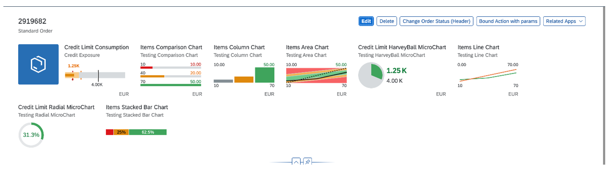

<!-- loioe90fbf99996e42d2a84f09e10ed14f9f -->

# Micro Chart Facet

You can add a `MicroChart` control to a facet within the header area of the object page.

A micro chart facet contains a title, subtitle, `MicroChart` control, and a footer. The `MicroChart` control supports several types of micro charts in the object page header, as shown in the following image:




You can annotate a micro chart and use it as a facet, as shown in the following sample code:

> ### Sample Code:  
> XML Annotation
> 
> ```
> <Annotations Target="SAP__self.BookingType">
>     <Annotation Term="SAP__UI.DataPoint" Qualifier="FlightPrice">
>         <Record>
>             <PropertyValue Property="Value" Path="FlightPrice"/>
>         </Record>
>     </Annotation>
>     <Annotation Term="SAP__UI.Chart" Qualifier="FlightPrice">
>         <Record Type="SAP__UI.ChartDefinitionType">
>             <PropertyValue Property="ChartType" EnumMember="SAP__UI.ChartType/Column"/>
>             <PropertyValue Property="Title" String="Flight Price"/>
>             <PropertyValue Property="Measures">
>                 <Collection>
>                     <PropertyPath>FlightPrice</PropertyPath>
>                 </Collection>
>             </PropertyValue>
>             <PropertyValue Property="MeasureAttributes">
>                 <Collection>
>                     <Record Type="SAP__UI.ChartMeasureAttributeType">
>                         <PropertyValue Property="DataPoint" AnnotationPath="@SAP__UI.DataPoint#FlightPrice"/>
>                         <PropertyValue Property="Role" EnumMember="SAP__UI.ChartMeasureRoleType/Axis1"/>
>                         <PropertyValue Property="Measure" PropertyPath="FlightPrice"/>
>                     </Record>
>                 </Collection>
>             </PropertyValue>
>             <PropertyValue Property="Dimensions">
>                 <Collection>
>                     <PropertyPath>FlightDate</PropertyPath>
>                 </Collection>
>             </PropertyValue>
>         </Record>
>     </Annotation>
> </Annotations>
> 
> <Annotations Target="SAP__self.TravelType">
>     <Annotation Term="SAP__UI.HeaderFacets">
>         <Collection>
>             <Record Type="SAP__UI.ReferenceFacet">
>                 <PropertyValue Property="ID" String="FlightPrice"/>
>                 <PropertyValue Property="Target" AnnotationPath="_Booking/@SAP__UI.Chart#FlightPrice"/>
>             </Record>
>         </Collection>
>     </Annotation>
> </Annotations>
> ```

> ### Sample Code:  
> ABAP CDS Annotation
> 
> ```
> //@Scope: [VIEW] ("TRAVEL")
> annotate view VIEWNAME with
> {
>   @UI.facet: [ {
>     targetElement: '_Booking',
>     targetQualifier: 'FlightPrice',
>     type: #CHART_REFERENCE,
>     purpose: #HEADER
>   } ]
>   ...
> }
> 
> //@Scope: [ENTITY] ("BOOKING")
> @UI: {
>   chart: [ {
>     title: 'Flight Price',
>     qualifier: 'FlightPrice', 
>     chartType: #COLUMN,
>     measures: [
>       'FlightPrice'
>     ],
>     measureAttributes: [
>       {
>         measure: 'FlightPrice',
>         role: #AXIS_1,
>         asDataPoint: true
>       }
>     ],
>     dimensions: [
>       'FlightDate'
>     ]
>   } ]
> }
> 
> //@Scope: [VIEW] ("BOOKING")
> annotate view VIEWNAME with
> {
>   ...
>   @UI.dataPoint: {
>     title: 'Flight Price'
>   }   
>   FlightPrice;
>   ...
> }
> ```

> ### Sample Code:  
> CAP CDS Annotation
> 
> ```
>   annotate Booking with @(UI: {
>     DataPoint #FlightPrice: {Value: FlightPrice},
> 
>     Chart #FlightPrice    : {
>       $Type            : 'UI.ChartDefinitionType',
>       Title            : 'Flight Price',
>       ChartType        : #Column,
>       Measures         : [FlightPrice],
>       Dimensions       : [FlightDate],
>       MeasureAttributes: [{
>         $Type    : 'UI.ChartMeasureAttributeType',
>         Measure  : FlightPrice,
>         Role     : #Axis1,
>         DataPoint: '@UI.DataPoint#FlightPrice'
>       }]
>     },
> 
> 
>   });
> 
>   annotate Travel with @(UI: {HeaderFacets: [{
>     $Type : 'UI.ReferenceFacet',
>     ID    : 'FlightPrice',
>     Target: '_Booking/@UI.Chart#FlightPrice'
>   }]});
> 
> ```

To add a micro chart facet, in the local annotations file, you must add a `UI.HeaderFacets` term along with the complex type `UI.ReferenceFacet`, and reference the `UI.Chart` as shown in the following sample code:


### `UI.HeaderFacets` and `UI.ReferenceFacet`

> ### Sample Code:  
> ```xml
> <Annotations Target="STTA_PROD_MAN.STTA_C_MP_ProductType">
>     <Annotation Term="UI.HeaderFacets">
>         <Collection>
>             <Record Type="UI.ReferenceFacet">
>                 <PropertyValue Property="Target" AnnotationPath="to_ProductSalesPrice/@UI.Chart"/>
>             </Record>
>         </Collection>
>     </Annotation>
> </Annotations>
> 
> ```

> ### Sample Code:  
> ABAP CDS Annotation
> 
> ```
> 
> annotate view STTA_C_MP_PRODUCT with {
> @UI.Facet: [
>   {
>     targetElement: 'TO_PRODUCTSALESPRICE',
>     type: #CHART_REFERENCE,
>     purpose: #HEADER
>   }
> ]
> 
> product;
> }
> 
> ```

> ### Sample Code:  
> CAP CDS Annotation
> 
> ```
> 
> annotate STTA_PROD_MAN.STTA_C_MP_ProductType with @(
>   UI.HeaderFacets : [
>     {
>         $Type : 'UI.ReferenceFacet',
>         Target : 'to_ProductSalesPrice/@UI.Chart'
>     }
>   ]
> );
> 
> ```


### `UI.Chart` Annotations

The `UI.Chart Title` property is used for the title. The `UI.Chart Description` property is used for the subtitle.


### `UI.DataPoint` Annotation

The `DataPoint` property of `MeasureAttributes` in the `Chart` annotation must point to the `UI.DataPoint` annotation.

The micro chart supports both the `Criticality` and `CriticalityCalculation` properties of a `UI.DataPoint`.

For more information about how to use the `CriticalityCalculation` property, see the annotation examples in [Area Micro Chart](area-micro-chart-92a40b6.md). For more information about how to use the `Criticality` property, see the annotation examples in [Bullet Micro Chart](bullet-micro-chart-4a7e1b8.md).


### Unit of Measure Annotations

The unit of measure is displayed in the footer of the micro chart. The following sample code provides an annotation for specifying the unit of measure. The sample code uses the `Measures.ISOCurrency` term, which is applied to the entity type property that serves as the value property of `UI.DataPoint`.

> ### Sample Code:  
> XML Annotation
> 
> ```xml
> <Annotations xmlns="http://docs.oasis-open.org/odata/ns/edm" Target="STTA_PROD_MAN.STTA_C_MP_ProductSalesPriceType/AreaChartPrice">
>      <Annotation Term="Measures.ISOCurrency" Path="Currency"/>
> </Annotations>
> ```

> ### Sample Code:  
> ABAP CDS Annotation
> 
> ```
> @Semantics.amount.currencyCode: 'Currency'
> AreaChartPrice;
> @Semantics.currencyCode:true
> Currency;
> ```

> ### Sample Code:  
> CAP CDS Annotation
> 
> ```
> 
> annotate STTA_PROD_MAN.STTA_C_MP_ProductSalesPriceType with {
> 	@Measures.ISOCurrency : Currency
> 	AreaChartPrice
> 
> ```

**Related Information**  


[Area Micro Chart](area-micro-chart-92a40b6.md "An area micro chart is a trend chart.")

[Bullet Micro Chart](bullet-micro-chart-4a7e1b8.md "The bullet chart features a single, primary measure (for example, current year-to-date revenue).")

[Radial Micro Chart](radial-micro-chart-1d7cebc.md "Radial micro charts displays a single percentage value.")

[Line Micro Chart](line-micro-chart-3af8420.md "A line chart is a basic type of chart used in many fields.")

[Column Micro Chart](column-micro-chart-5c0b4cd.md "A column chart uses vertical bars to compare multiple values over time or across categories.")

[Harvey Micro Chart](harvey-micro-chart-6c4835d.md "")

[Stacked Bar Micro Chart](stacked-bar-micro-chart-7328c4f.md "A stacked bar micro chart displays all the values from the back end for the configured measure as a percentage of the total measure value.")

