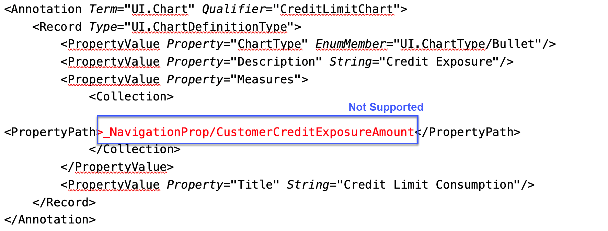

<!-- loioe219fd0c85b842c69ac3a514e712ece5 -->

# Micro Chart Facet in the Object Page Header

You can add a `MicroChart` control to a facet within the header area of the object page.

A micro chart facet contains a title, subtitle, `MicroChart` control, and a footer. The `MicroChart` control supports several types of micro charts in the object page header, as shown in the following image:


You can annotate a micro chart and use it as a facet, as shown in the following sample code:

> ### Sample Code:  
> XML Annotation
> 
> ```
> <Annotations Target="SAP__self.BookingType">
>     <Annotation Term="SAP__UI.DataPoint" Qualifier="FlightPrice">
>         <Record>
>             <PropertyValue Property="Value" Path="FlightPrice"/>
>         </Record>
>     </Annotation>
>     <Annotation Term="SAP__UI.Chart" Qualifier="FlightPrice">
>         <Record Type="SAP__UI.ChartDefinitionType">
>             <PropertyValue Property="ChartType" EnumMember="SAP__UI.ChartType/Column"/>
>             <PropertyValue Property="Title" String="Flight Price"/>
>             <PropertyValue Property="Measures">
>                 <Collection>
>                     <PropertyPath>FlightPrice</PropertyPath>
>                 </Collection>
>             </PropertyValue>
>             <PropertyValue Property="MeasureAttributes">
>                 <Collection>
>                     <Record Type="SAP__UI.ChartMeasureAttributeType">
>                         <PropertyValue Property="DataPoint" AnnotationPath="@SAP__UI.DataPoint#FlightPrice"/>
>                         <PropertyValue Property="Role" EnumMember="SAP__UI.ChartMeasureRoleType/Axis1"/>
>                         <PropertyValue Property="Measure" PropertyPath="FlightPrice"/>
>                     </Record>
>                 </Collection>
>             </PropertyValue>
>             <PropertyValue Property="Dimensions">
>                 <Collection>
>                     <PropertyPath>FlightDate</PropertyPath>
>                 </Collection>
>             </PropertyValue>
>         </Record>
>     </Annotation>
> </Annotations>
> 
> <Annotations Target="SAP__self.TravelType">
>     <Annotation Term="SAP__UI.HeaderFacets">
>         <Collection>
>             <Record Type="SAP__UI.ReferenceFacet">
>                 <PropertyValue Property="ID" String="FlightPrice"/>
>                 <PropertyValue Property="Target" AnnotationPath="_Booking/@SAP__UI.Chart#FlightPrice"/>
>             </Record>
>         </Collection>
>     </Annotation>
> </Annotations>
> ```

> ### Sample Code:  
> ABAP CDS Annotation
> 
> ```
> //@Scope: [VIEW] ("TRAVEL")
> annotate view VIEWNAME with
> {
>   @UI.facet: [ {
>     targetElement: '_Booking',
>     targetQualifier: 'FlightPrice',
>     type: #CHART_REFERENCE,
>     purpose: #HEADER
>   } ]
>   ...
> }
> 
> //@Scope: [ENTITY] ("BOOKING")
> @UI: {
>   chart: [ {
>     title: 'Flight Price',
>     qualifier: 'FlightPrice', 
>     chartType: #COLUMN,
>     measures: [
>       'FlightPrice'
>     ],
>     measureAttributes: [
>       {
>         measure: 'FlightPrice',
>         role: #AXIS_1,
>         asDataPoint: true
>       }
>     ],
>     dimensions: [
>       'FlightDate'
>     ]
>   } ]
> }
> 
> //@Scope: [VIEW] ("BOOKING")
> annotate view VIEWNAME with
> {
>   ...
>   @UI.dataPoint: {
>     title: 'Flight Price'
>   }   
>   FlightPrice;
>   ...
> }
> ```

> ### Sample Code:  
> CAP CDS Annotation
> 
> ```
>   annotate Booking with @(UI: {
>     DataPoint #FlightPrice: {Value: FlightPrice},
> 
>     Chart #FlightPrice    : {
>       $Type            : 'UI.ChartDefinitionType',
>       Title            : 'Flight Price',
>       ChartType        : #Column,
>       Measures         : [FlightPrice],
>       Dimensions       : [FlightDate],
>       MeasureAttributes: [{
>         $Type    : 'UI.ChartMeasureAttributeType',
>         Measure  : FlightPrice,
>         Role     : #Axis1,
>         DataPoint: '@UI.DataPoint#FlightPrice'
>       }]
>     },
> 
> 
>   });
> 
>   annotate Travel with @(UI: {HeaderFacets: [{
>     $Type : 'UI.ReferenceFacet',
>     ID    : 'FlightPrice',
>     Target: '_Booking/@UI.Chart#FlightPrice'
>   }]});
> 
> ```

To add a micro chart facet, in the local annotations file, you must add a `UI.HeaderFacets` term along with the complex type `UI.ReferenceFacet`, and reference the `UI.Chart` as shown in the following sample code:

> ### Sample Code:  
> `UI.HeaderFacets` and `UI.ReferenceFacet`
> 
> ```xml
> <Annotations Target="STTA_PROD_MAN.STTA_C_MP_ProductType">
>     <Annotation Term="UI.HeaderFacets">
>         <Collection>
>             <Record Type="UI.ReferenceFacet">
>                 <PropertyValue Property="Target" AnnotationPath="to_ProductSalesPrice/@UI.Chart"/>
>             </Record>
>         </Collection>
>     </Annotation>
> </Annotations>
> 
> ```

> ### Sample Code:  
> ABAP CDS Annotation
> 
> ```
> 
> annotate view STTA_C_MP_PRODUCT with {
> @UI.Facet: [
>   {
>     targetElement: 'TO_PRODUCTSALESPRICE',
>     type: #CHART_REFERENCE,
>     purpose: #HEADER
>   }
> ]
> 
> product;
> }
> 
> ```

> ### Sample Code:  
> CAP CDS Annotation
> 
> ```
> 
> annotate STTA_PROD_MAN.STTA_C_MP_ProductType with @(
>   UI.HeaderFacets : [
>     {
>         $Type : 'UI.ReferenceFacet',
>         Target : 'to_ProductSalesPrice/@UI.Chart'
>     }
>   ]
> );
> 
> ```

> ### Restriction:  
> Micro charts require data that is aggregated by the back end, as the client-side doesn't support aggregating the entity sets.
> 
> For example, there is an entity that is linked with a micro chart that has multiple records with the values 'Purchase' and 'Sales'. In this case, the back end must aggregate the 'Sales' value and ensure that the entity has only one record for each 'Purchase' value. This behavior is unlike the behavior of regular charts or analytical tables, where SAP Fiori elements for OData V4 initiates an aggregation call to the back end for the aggregated 'Sales' value.


## `UI.Chart` Annotations

The `UI.Chart Title` property is used for the title. The `UI.Chart Description` property is used for the subtitle.


## `UI.DataPoint` Annotation

The `DataPoint` property of `MeasureAttributes` in the `Chart` annotation must point to the `UI.DataPoint` annotation.

The micro chart supports both the `Criticality` and `CriticalityCalculation` properties of a `UI.DataPoint`.

For more information about how to use the `CriticalityCalculation` property, see the annotation examples in [Area Micro Chart](area-micro-chart-1467f2b.md). For more information about how to use the `Criticality` property, see the annotation examples in [Bullet Micro Chart](bullet-micro-chart-b915166.md).


## Unit of Measure Annotations

The unit of measure is displayed in the footer of the micro chart. The following sample code provides an annotation for specifying the unit of measure. The sample code uses the `Measures.ISOCurrency` term, which is applied to the entity type property that serves as the value property of `UI.DataPoint`.

> ### Sample Code:  
> XML Annotation
> 
> ```xml
> <Annotations xmlns="http://docs.oasis-open.org/odata/ns/edm" Target="STTA_PROD_MAN.STTA_C_MP_ProductSalesPriceType/AreaChartPrice">
>      <Annotation Term="Measures.ISOCurrency" Path="Currency"/>
> </Annotations>
> ```

> ### Sample Code:  
> ABAP CDS Annotation
> 
> ```
> @Semantics.amount.currencyCode: 'Currency'
> AreaChartPrice;
> @Semantics.currencyCode:true
> Currency;
> ```

> ### Sample Code:  
> CAP CDS Annotation
> 
> ```
> 
> annotate STTA_PROD_MAN.STTA_C_MP_ProductSalesPriceType with {
> 	@Measures.ISOCurrency : Currency
> 	AreaChartPrice
> 
> ```


<a name="loioe219fd0c85b842c69ac3a514e712ece5__section_nhk_hqp_btb"/>

## Navigation

You can enable both in-page and external navigation from the micro chart title. For more information, see [Navigation from Header Facet Title](navigation-from-header-facet-title-fa0ca22.md).

> ### Note:  
> We don't support the use of navigation properties, such as the one highlighted in the following sample code:
> 
>   
>   
> **Navigation Property**
> 
> 


## Applying Sort Order to Micro Charts

You can apply a sort order to the micro chart data using the `UI.PresentationVariant`, choosing either ascending or descending order. The sorting option is available for area micro charts, line micro charts, column micro charts, comparison micro charts, and stacked bar micro charts.

> ### Note:  
> Micro charts consider only the `SortOrderType` property and ignore other properties in the `PresentationVariantType`.

> ### Sample Code:  
> XML Annotation
> 
> ```
> <Annotations Target="SAP__self.BookingType">
>     <Annotation Term="SAP__UI.DataPoint" Qualifier="FlightPrice">
>         <Record>
>             <PropertyValue Property="Value" Path="FlightPrice"/>
>         </Record>
>     </Annotation>
>     <Annotation Term="SAP__UI.Chart" Qualifier="FlightPrice">
>         <Record Type="SAP__UI.ChartDefinitionType">
>             <PropertyValue Property="ChartType" EnumMember="SAP__UI.ChartType/Column"/>
>             <PropertyValue Property="Title" String="Flight Price"/>
>             <PropertyValue Property="Measures">
>                 <Collection>
>                     <PropertyPath>FlightPrice</PropertyPath>
>                 </Collection>
>             </PropertyValue>
>             <PropertyValue Property="MeasureAttributes">
>                 <Collection>
>                     <Record Type="SAP__UI.ChartMeasureAttributeType">
>                         <PropertyValue Property="DataPoint" AnnotationPath="@SAP__UI.DataPoint#FlightPrice"/>
>                         <PropertyValue Property="Role" EnumMember="SAP__UI.ChartMeasureRoleType/Axis1"/>
>                         <PropertyValue Property="Measure" PropertyPath="FlightPrice"/>
>                     </Record>
>                 </Collection>
>             </PropertyValue>
>             <PropertyValue Property="Dimensions">
>                 <Collection>
>                     <PropertyPath>FlightDate</PropertyPath>
>                 </Collection>
>             </PropertyValue>
>         </Record>
>     </Annotation>
>     <Annotation Term="SAP__UI.PresentationVariant">
>         <Record Type="SAP__UI.PresentationVariantType">
>             <PropertyValue Property="SortOrder">
>                 <Collection>
>                     <Record Type="SAP__Common.SortOrderType">
>                         <PropertyValue Property="Property" PropertyPath="FlightPrice" />
>                         <PropertyValue Property="Descending" Bool="false" />
>                     </Record>
>                 </Collection>
>             </PropertyValue>
>             <PropertyValue Property="Visualizations">
>                 <Collection>
>                     <AnnotationPath>@SAP__UI.Chart#FlightPrice</AnnotationPath>
>                 </Collection>
>             </PropertyValue>
>         </Record>
>     </Annotation>
> </Annotations>
> <Annotations Target="SAP__self.TravelType">
>     <Annotation Term="SAP__UI.HeaderFacets">
>         <Collection>
>             <Record Type="SAP__UI.ReferenceFacet">
>                 <PropertyValue Property="ID" String="FlightPrice"/>
>                 <PropertyValue Property="Target" AnnotationPath="_Booking/@SAP__UI.PresentationVariant"/>
>             </Record>
>         </Collection>
>     </Annotation>
> </Annotations>
> ```

> ### Sample Code:  
> ABAP CDS Annotation
> 
> ```
> //@Scope: [VIEW] ("TRAVEL")
> annotate view VIEWNAME with
> {
>   @UI.facet: [ {
>     targetElement: '_Booking',
>     type: #PRESENTATIONVARIANT_REFERENCE,
>     purpose: #HEADER
>   } ]
>   ...
> }
> 
> //@Scope: [ENTITY] ("BOOKING")
> @UI: {
>   presentationVariant: [ {
>     sortOrder: [ {
>       by: 'FlightPrice',
>       direction: #ASC
>     } ],
>     visualizations: [ {
>       type: #AS_CHART,
>       qualifier: 'FlightPrice'
>     } ]
>   } ],
>   chart: [ {
>     title: 'Flight Price',
>     qualifier: 'FlightPrice', 
>     chartType: #COLUMN,
>     measures: [
>       'FlightPrice'
>     ],
>     measureAttributes: [
>       {
>         measure: 'FlightPrice',
>         role: #AXIS_1,
>         asDataPoint: true
>       }
>     ],
>     dimensions: [
>       'FlightDate'
>     ]
>   } ]
> }
> 
> //@Scope: [VIEW] ("BOOKING")
> annotate view VIEWNAME with
> {
>   ...
>   @UI.dataPoint: {
>     title: 'Flight Price'
>   }   
>   FlightPrice;
>   ...
> }
> ```

> ### Sample Code:  
> CAP CDS Annotation
> 
> ```
>   annotate Booking with @(UI: {
>     DataPoint #FlightPrice: {Value: FlightPrice},
> 
>     Chart #FlightPrice    : {
>       $Type            : 'UI.ChartDefinitionType',
>       Title            : 'Flight Price',
>       ChartType        : #Column,
>       Measures         : [FlightPrice],
>       Dimensions       : [FlightDate],
>       MeasureAttributes: [{
>         $Type    : 'UI.ChartMeasureAttributeType',
>         Measure  : FlightPrice,
>         Role     : #Axis1,
>         DataPoint: '@UI.DataPoint#FlightPrice'
>       }]
>     },
> 
>     PresentationVariant   : {
>       Visualizations: ['@UI.Chart#FlightPrice'],
>       SortOrder     : [{
>         Property  : FlightPrice,
>         Descending: false
>       }],
>     }
>   });
> 
>   annotate Travel with @(UI: {HeaderFacets: [{
>     $Type : 'UI.ReferenceFacet',
>     ID    : 'FlightPrice',
>     Target: '_Booking/@UI.PresentationVariant'
>   }]});
> 
> ```


> ### Note:  
> For information about SAP Fiori elements for OData V2, see [Micro Chart Facet](micro-chart-facet-e90fbf9.md).

**Related Information**  


[Area Micro Chart](area-micro-chart-1467f2b.md "You can render the micro chart as an area micro chart.")

[Bullet Micro Chart](bullet-micro-chart-b915166.md "You can render the micro chart as a bullet micro chart.")

[Radial Micro Chart](radial-micro-chart-51eb569.md "You can render the micro chart as a radial micro chart.")

[Line Micro Chart](line-micro-chart-e5cb2af.md "You can render the micro chart as a line micro chart.")

[Column Micro Chart](column-micro-chart-1a4ecb8.md "You can render the micro chart as a column micro chart")

[Harvey Micro Chart](harvey-micro-chart-de4f8bf.md "You can render the micro chart as a Harvey Ball micro chart.")

[Stacked Bar Micro Chart](stacked-bar-micro-chart-9c93837.md "You can render the micro chart as a stacked bar micro chart.")

[Comparison Micro Chart](comparison-micro-chart-9d126f1.md "You can render the micro chart as a comparison micro chart.")

[Header Facets](header-facets-17dbd5b.md "You can include various types of header facets in your object page header, for example to display contact data or a rating indicator.")

