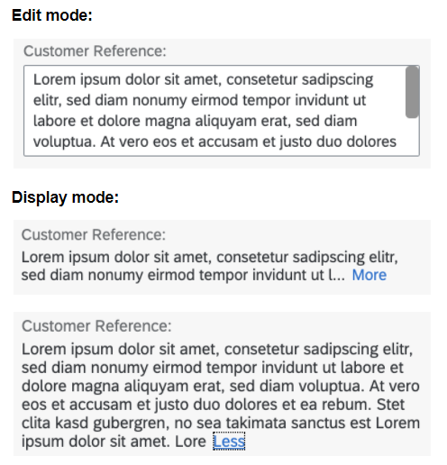

<!-- loiob5021469ca58446ea4e6cf73635dd5d3 -->

# Multi-Line Text Fields

You can use annotations to display a field as a multi-line text in SAP Fiori elements for OData V4.

To display a field as a multi-line text, annotate the property associated to the field with `UI.MultiLineText`. The field is displayed as a text area in edit mode and as an expandable text in display mode.



```xml
<Annotations Target="com.c_salesordermanage_sd.SalesOrderManage">
    <Annotation Term="Common.Label" String="Customer Reference"/>
    <Annotation Term="UI.MultiLineText" Bool="true"/>
</Annotations>
```

You can explore and work with the coding yourself. For more information and live examples, see the SAP Fiori development portal at [Building Blocks - Field - Multi-Line Text](https://ui5.sap.com/test-resources/sap/fe/core/fpmExplorer/index.html#/buildingBlocks/field/fieldMultiLineText).

> ### Restriction:  
> Fields annotated with `UI.MultiLineText` aren't supported in grid tables, tree tables, and analytical tables.

In display mode, the text is cut off after 100 characters, and a *More* link is shown, allowing users to display the full text. In edit mode, a scroll bar is displayed if a text exceeds 4 lines. You can also configure a text area in edit mode to grow and shrink, depending on its content.


## Configuring Multi-Line Text Fields

You can configure the multi-line field by using the following parameters in `formatOptions`:


<table>
<tr>
<th valign="top">

Parameter

</th>
<th valign="top">

Allowed values

</th>
<th valign="top">

Description

</th>
</tr>
<tr>
<td valign="top">

`textLinesEdit` 

</td>
<td valign="top">

Integer value

String containing an integer value

</td>
<td valign="top">

Defines the number of lines the field can show before a scroll bar is shown in edit mode.

Used together with `textMaxLines`, this parameter defines the minimum number of lines the field can shrink to.

</td>
</tr>
<tr>
<td valign="top">

`textMaxLines` 

</td>
<td valign="top">

Integer value

String containing an integer value

</td>
<td valign="top">

Defines the maximum number of lines that the text area can grow to before a scroll bar is shown in edit mode. If `textMaxLines` is not set or if it is not larger than `textLinesEdit`, the text area does not grow or shrink.

</td>
</tr>
<tr>
<td valign="top">

`textMaxCharactersDisplay` 

</td>
<td valign="top">

Integer value

String containing an integer value

`"Infinity"`: The full text is shown.

</td>
<td valign="top">

Defines the number of characters to be displayed before the text is cut off and a *More* link is shown in display mode.

</td>
</tr>
<tr>
<td valign="top">

`textExpandBehaviorDisplay` 

</td>
<td valign="top">

`"InPlace"` \(default\): The field grows to match the length of the full text.

`"Popover"`: The full text is displayed in a popover.

</td>
<td valign="top">

Defines how the full text is displayed after users click the *More* link.

</td>
</tr>
<tr>
<td valign="top">

`textMaxLength` 

</td>
<td valign="top">

Integer value

String containing an integer value

</td>
<td valign="top">

Defines the maximum number of characters that can be entered in the text area. If it isn't set, the number of characters isn't restricted.

When a text exceeds the maximum number of characters, users see a notification**\(how does this make sense? Is it possible to exceed it?\)**. Users can't enter more characters than the defined length.

</td>
</tr>
</table>

You can explore and work with the coding yourself. For more information and live examples, see the SAP Fiori development portal at [Building Blocks - Field - Multi-Line Text](https://ui5.sap.com/test-resources/sap/fe/core/fpmExplorer/index.html#/buildingBlocks/field/fieldMultiLineText) and select *Fine-Tuning* in the code editor.


<a name="loiob5021469ca58446ea4e6cf73635dd5d3__ManifestBasedDefinition"/>

## Manifest-Based Definition

To define a custom text length in a `FieldGroup` or a `LineItem`, extend their `controlConfiguration` with a `"fields"` block or `"columns"` block in a structure, as shown in the following sample code:

> ### Sample Code:  
> `manifest.json`
> 
> ```
> "sap.ui5": {
>     "routing": {
>         "targets": {
>             "SalesOrderManageObjectPage": {
>                 "options": {
>                     "settings": {
>                         "controlConfiguration": {
>                             "@com.sap.vocabularies.UI.v1.FieldGroup#myQualifier": {
>                                 "fields": {
>                                     "DataField::myFormTextField": {
>                                         "formatOptions": {
>                                             "textLinesEdit": "6",
>                                             "textMaxCharactersDisplay": "Infinity"
>                                         }
>                                     }
>                                  }
>                              },
>                             "myEntity/@com.sap.vocabularies.UI.v1.LineItem": {
>                                 "columns": {
>                                     "DataField::myTableTextField": {
>                                         "formatOptions": {                                         
>                                             "textLinesEdit": "3",
>                                             "textMaxLines": "5",
>                                             "textMaxCharactersDisplay": "400",
>                                             "textExpandBehaviorDisplay" : "Popover"
>                                         }
>                                     }
>                                 }
>                             }
>                          }
>                      }
>                  }
>              }
>         }
>     }
>  }
> ```

