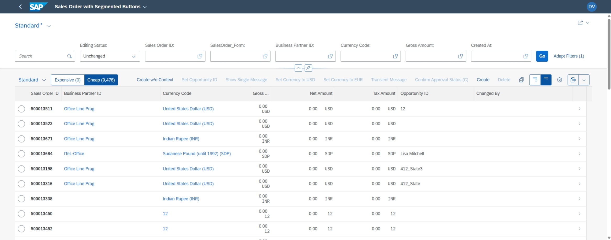
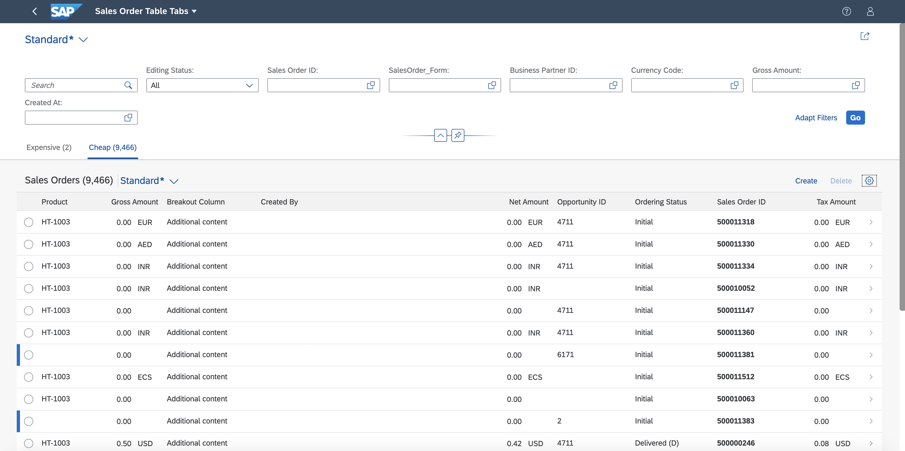
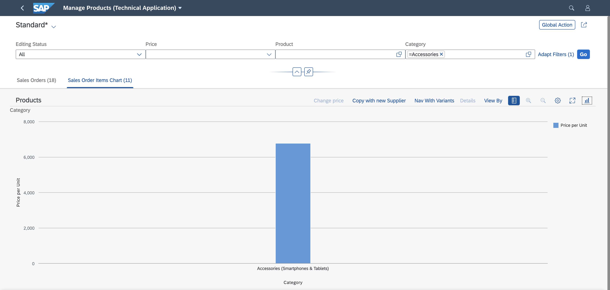

<!-- loiod0e685572b0b48d4bdc4aa428268b30f -->

# Multiple Views on the List Report Page

You can define multiple views of a table and add a chart.

> ### Note:  
> For information about SAP Fiori elements for OData V4, see [Multiple Views on the List Report Page](multiple-views-on-the-list-report-page-a37df40.md).

> ### Note:  
> You can define variants for specific selections of data on the user interface, for example, based on filter settings. In the definition dialog, these variants are called views, however, the feature is called variant management. Therefore, for clarity, we use the term variant management in this section.

By default, the list report page displays only one table. You have the following options to define multiple views:

-   **A single table for all views \("single table mode"\)**: The UI contains a single table instance, one table toolbar, and \(if activated\) one table variant management. To switch between the views, a segmented button is rendered in the table toolbar. If there are more than three views, a select control is rendered instead of a segmented button.

      
      
    **Single Table Mode**

    

-   **A separate table for each view \("multiple table mode"\)**: If there are n views, the UI contains n table instances. This results in n separate table toolbars and n separate table variant managements. An icon tab bar is rendered above the table for switching between the views \(table instances\). Only the table on the currently selected tab is visible.

      
      
    **Multiple Table Mode**

    

> ### Note:  
> If a property used in multiple views is not listed in the `SelectionFields`, you need to remove the property in the `FilterBar`. Users should not be able to add it using the adapt filter.

Tables are displayed by default.

<a name="loiod0e685572b0b48d4bdc4aa428268b30f__section_djj_44x_cmb"/>

## Which Annotations Should I Use?

-   If you only want to describe **which** data should be displayed in a view, you can define a `SelectionVariant` containing filter criteria for the data. See [Defining Multiple Views on a List Report Page Table - Single Table Mode](defining-multiple-views-on-a-list-report-page-table-single-table-mode-0f6901e.md).

-   If you also want to describe **how** the data should be displayed \(for example, different sort orders in a table or a different visualization in a table\), you can define a `SelectionPresentationVariant`. Note that you can use this annotation only for multiple table mode and multiple table mode with charts. See [Defining Multiple Views in a List Report Page Table - Multiple Table Mode](defining-multiple-views-in-a-list-report-page-table-multiple-table-mode-97dfeea.md).

-   If all you want to do is use a different visualization, you can define a `PresentationVariant`.

-   In multiple table mode, in addition to tables, you can also display charts on specific tab pages.

      
      
    **Multiple Table Mode with Charts**

    

-   On each tab, you can also display data for different entity sets, for example, a sales order or a supplier. To do so, add the entity set to the corresponding tab in the manifest.

      
      
    **Multiple Views on a List Report Page with Different Entity Sets**

    

> ### Restriction:  
> You can't use `StandardList` nor `ObjectList` in the multiple view scenario.

> ### Note:  
> For information about `SelectionVariants`, `PresentationVariants`, and `SelectionPresentationVariants`, see the OData vocabulary at [https://github.com/SAP/odata-vocabularies/blob/main/vocabularies/UI.md](https://github.com/SAP/odata-vocabularies/blob/main/vocabularies/UI.md).

**Related Information**  

[Defining Multiple Views on a List Report Page Table - Single Table Mode](defining-multiple-views-on-a-list-report-page-table-single-table-mode-0f6901e.md "You can define multiple views of a table and display them in single table mode. Users can switch between views using a segmented button.")

[Defining Multiple Views in a List Report Page Table - Multiple Table Mode](defining-multiple-views-in-a-list-report-page-table-multiple-table-mode-97dfeea.md "You can define multiple views of a table and display them in multiple table mode. Users can switch between views using an icon tab bar.")

[Defining Multiple Views on a List Report Page with Different Entity Sets and Table Settings](defining-multiple-views-on-a-list-report-page-with-different-entity-sets-and-table-settin-6698b80.md "You can configure your application to display data for different entity sets and table settings.")

