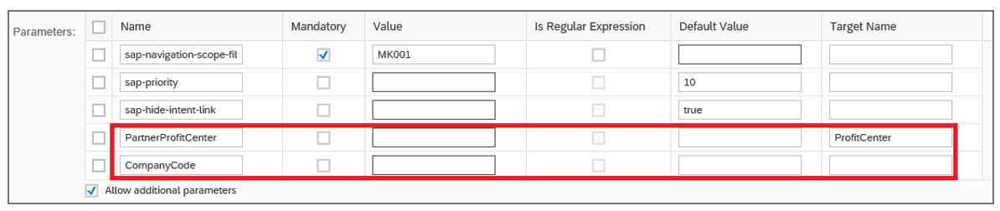

<!-- loiod782acf8bfd74107ad6a04f0361c5f62 -->

# Navigation from an App \(Outbound Navigation\)

You can either specify a URL or associate a semantic object \(intent-based navigation\) for external navigation targets.


<a name="loiod782acf8bfd74107ad6a04f0361c5f62__section_q3c_dg5_5lb"/>

## Using a URL

You have two annotation options. You can either specify the absolute URL explicitly, or you can use a path reference to a property using the `DataFieldWithUrl` annotation as follows:

Example 1: `DataFieldWithURL` as path reference to a property:

> ### Sample Code:  
> XML Annotation
> 
> ```xml
> <Record Type="UI.DataFieldWithUrl">
>     <PropertyValue Property="Label" String="Column label" />
>     <PropertyValue Property="Value" Path="URL"/>
>     <PropertyValue Property="Url" Path="URL"/>
> </Record>
> ```

> ### Sample Code:  
> ABAP CDS Annotation
> 
> ```
> @UI.<lineItem/fieldGroup>: [{ type: #WITH_URL, url: 'URL' }]
> URL;
> ```

> ### Sample Code:  
> CAP CDS Annotation
> 
> ```
> {
>     $Type :  'UI.DataFieldWithUrl',
>     Value :  URL,
>     Url :    URL,
>     Label :  'Column label'
> },
> ```

Example 2: `DataFieldWithURL` with absolute URL:

> ### Sample Code:  
> XML Annotation
> 
> ```xml
> <Record Type="UI.DataFieldWithUrl">
>     <PropertyValue Property="Url" String="Your URL"/><!--For example: https://www.sap.com-->
>     <PropertyValue Property="Value" Path="URL"/>
>     <PropertyValue Property="Label" String="Company"/>
> </Record>
> ```

> ### Sample Code:  
> ABAP CDS Annotation
> 
> ```
> {
>     label: 'Company',
>     type: #WITH_URL,
>     url: 'Your URL' //For example: https://sap.com
> }
> ```

> ### Sample Code:  
> CAP CDS Annotation
> 
> ```
> {
>     $Type : 'UI.DataFieldWithUrl',
>     Url :   'Your URL', //For example: https://www.sap.com
>     Value : 'URL',
>     Label : 'Company'
> }
> ```

A link control is rendered for the property on the list report or object page.


## Navigation to a Semantic Object \(Intent-Based Navigation\)

If you associate a semantic object annotation with any property, this establishes [Intent-Based Navigation](http://help.sap.com/saphelp_nw75/helpdata/en/bd/8ae3d327ab4541bcce8e7353c046fc/content.htm).

An intent is a mechanism that lets you perform actions on semantic objects \(such as navigating to a sales order or displaying a fact sheet\), without having to worry about the UI technology or technical implementation of the navigation target. Intent-based navigation is necessary in the following cases:

-   Depending on the user’s role, a different application or view of an application must be displayed.

-   You want to define an ambiguous navigation target. This means that, at runtime, a list of potential targets is suggested to the user.


### Options for Intent-Based Navigation

To enable intent-based navigation, you must associate a semantic object. Navigation can then be triggered using a link or a button.

**Using a Link**

-   Global association

    To use a specific property that is always shown as a link in your application, you must annotate the property with a semantic object. Wherever the property is used as a `DataField`, it is always rendered as a link.

    When a user chooses the link, and only one navigation target is found, direct navigation to the target is triggered. If more than one target is found, the system displays a popover containing some text and links to the targets for the user to choose from. You can enhance the content of this popover and display a quick view containing more information about the navigation target. For more information, see [Enabling Quick Views for Link Navigation](enabling-quick-views-for-link-navigation-307ced1.md).

    > ### Sample Code:  
    > XML Annotation
    > 
    > ```xml
    > <Annotations xmlns="http://docs.oasis-open.org/odata/ns/edm" Target="ZFAR_CUSTOMER_LINE_ITEMS2_SRV.Item/CostCenter">
    >     <Annotation Term="com.sap.vocabularies.Common.v1.SemanticObject" String="CostCenter"/>
    > </Annotations>
    > 
    > ```

    > ### Sample Code:  
    > ABAP CDS Annotation
    > 
    > ```
    > annotate view ITEM with {
    >     @Consumption.semanticObject: 'CostCenter'
    >     costcenter;
    > }
    > ```

    > ### Sample Code:  
    > CAP CDS Annotation
    > 
    > ```
    > annotate ZFAR_CUSTOMER_LINE_ITEMS2_SRV.Item with {
    >     @Common.SemanticObject : 'CostCenter'
    >     CostCenter
    > };
    > ```

    Semantic links can also point to dynamically added semantic objects. To do so, make sure that you point to a path that returns a valid semantic object name as a string at runtime.

    > ### Sample Code:  
    > XML Annotation
    > 
    > ```xml
    > <Annotations Target="myService.SalesorderManage/SoldToParty">
    >    <Annotation Term="Common.SemanticObject" Path="solToPartySemanticObject"/>
    > </Annotations>
    > ```

    > ### Sample Code:  
    > ABAP CDS Annotation
    > 
    > No ABAP CDS annotation sample is available. Please use the local XML annotation.

    > ### Sample Code:  
    > CAP CDS Annotation
    > 
    > ```
    > SoldToParty: String(10) @(
    >  Common.SemanticObject: solToPartySemanticObject
    > );
    > ```

-   Local association

    To only show the property as a link in a specific use case, for example within a form on an object page, you must use the `DataFieldWithIntentBasedNavigation` annotation. You can use this type of link in tables and forms, that is, a `DataFieldWithIntentBasedNavigation` can be added to a `LineItem` or `FieldGroup` annotation. The link text is set according to the `"Value"` property \(in the example below this is the value of `SomePath`\). Note that in SAP Fiori elements for OData V2`sap:unit` annotations currently aren't evaluated in this context.

    > ### Note:  
    > Make sure you define a unique target by specifying both the semantic object and an action. Otherwise, clicking the link will not trigger direct navigation to the target.

    > ### Sample Code:  
    > XML Annotation
    > 
    > ```xml
    > <Record Type="UI.DataFieldWithIntentBasedNavigation">
    >     <PropertyValue Property="Label" String="My Link for navigation" />
    >     <PropertyValue Property="Value" Path="SomePath" />
    >     <PropertyValue Property="SemanticObject" String="MySemanticObject"/>
    >     <PropertyValue Property="Action" String="manage"/>
    > </Record>
    > 
    > ```

    > ### Sample Code:  
    > ABAP CDS Annotation
    > 
    > ```
    > @UI.<lineItem/fieldGroup>: [ 
    >   {
    >     label: 'My Link for navigation',
    >     value: 'SOMEPATH',
    >     semanticObjectAction: 'manage',
    >     type: #WITH_INTENT_BASED_NAVIGATION
    >   }
    > ]
    > @Consumption.semanticObject: 'MySemanticObject'
    > 
    > ```

    > ### Sample Code:  
    > CAP CDS Annotation
    > 
    > ```
    >     {
    >         $Type : 'UI.DataFieldWithIntentBasedNavigation',
    >         Label : 'My Link for navigation',
    >         Value : SomePath,
    >         SemanticObject : 'MySemanticObject',
    >         Action : 'manage',
    >     },
    > ```

    For examples of how to use the `DataFieldWithIntentBasedNavigation` annotation, see [Form Facet](form-facet-ff0ae0b.md) and [Adding Actions to Tables](adding-actions-to-tables-b623e0b.md).


**Using a Button**

To provide a button for navigation, you annotate a property as a `DataFieldForIntentBasedNavigation`.

> ### Sample Code:  
> XML Annotation
> 
> ```xml
> <Record Type="UI.DataFieldForIntentBasedNavigation">
>     <PropertyValue Property="Label" String="My Button for navigation"/>
>     <PropertyValue Property="SemanticObject" String="MySemanticObject"/>
>     <PropertyValue Property="Action" String="manage"/>
> </Record>
> 
> ```

> ### Sample Code:  
> ABAP CDS Annotation
> 
> ```
> @UI.<lineItem/fieldGroup>: [ 
>   {
>     label: 'My Button for navigation',
>     semanticObjectAction: 'manage',
>     type: #FOR_INTENT_BASED_NAVIGATION
>   }
> ]
> @Consumption.semanticObject: 'MySemanticObject'
> ```

> ### Sample Code:  
> CAP CDS Annotation
> 
> ```
> {
>     $Type : 'UI.DataFieldForIntentBasedNavigation',
>     Label : 'My Button for navigation',
>     SemanticObject : 'MySemanticObject',
>     Action : 'manage',
> },
> ```

You can replace standard internal navigation with external navigation by using intent-based navigation. For more information, see [Changing Navigation to Object Page](changing-navigation-to-object-page-8bd546e.md).


### Actions Triggering External Navigation

Add the following property: `<PropertyValue Property="RequiresContext" Bool="true"/>`

If `RequiresContext` is true, then the button is disabled until a selection is made. If it’s false, then the button is always enabled. The default value for `RequiresContext` is false.

> ### Sample Code:  
> XML Annotation
> 
> ```xml
> <<Record Type="UI.DataFieldForIntentBasedNavigation">
>    <PropertyValue Property="SemanticObject" String="EPMProduct"/>
>    <PropertyValue Property="Action" String="manage_st"/>
>    <PropertyValue Property="Label" String="IBNWithContext"/>
>    <PropertyValue Property="RequiresContext" Bool="true"/>
> </Record>
> ```

> ### Sample Code:  
> ABAP CDS Annotation
> 
> ```
> {    
>     semanticObject: 'EPMProduct',
>     semanticObjectAction: 'manage_st',
>     label: 'IBNWithContext',
>     requiresContext: true,
>     type: #FOR_INTENT_BASED_NAVIGATION
> }
> 
> ```

> ### Sample Code:  
> CAP CDS Annotation
> 
> ```
> {
>    $Type: 'UI.DataFieldForIntentBasedNavigation',
>    SemanticObject: 'SalesOrder',
>    Action: 'manageInline',
>    Label: 'IBNwithcontext',
>    RequiresContext: true
> }
> ```

-   **Enable or Disable Buttons Triggering External Navigation**

    In a `DataFieldForIntentBasedNavigation`, you can specify `RequiresContext`. Setting it to `True` means that a line needs to be selected for the button to be enabled. Otherwise, it’s disabled.

-   **Display or Hide Buttons Triggering External Navigation**

    You can define that context-independent buttons \(`RequiresContext` is set to `False`\) triggering external navigation are displayed only if the navigation target is supported on the current device. In addition, if the `SemanticObject` or the action is invalid, and if the user doesn’t have the correct authorizations, the button isn't displayed. As a prerequisite, you need to have maintained the navigation target in the SAP Fiori launchpad, as shown in the following images:

       
      
    **SAP Fiori launchpad: Maintain the Supported Devices for the Combination of Semantic Object and Action**

      

       
      
    **SAP Fiori launchpad: Maintain the Mandatory Parameters for Semantic Object and Action**

      

    > ### Note:  
    > -   As already shown, you maintain mandatory parameters for navigation in SAP Fiori launchpad, for example a sales order ID. If you have specified `RequiresContext: False`, for the combination of semantic object and action, and for this combination you maintain a mandatory parameter in SAP Fiori launchpad, these settings contradict each other and the button isn't displayed.
    > 
    > -   This feature isn't relevant for context-dependent buttons. For information about context-dependent and context-independent actions, see [Actions](actions-cbf16c5.md).


You can also hide the intent-based navigation button by using `UI.Hidden` against the `UI.DataFieldForIntentBasedNavigation` button. This can have the static values true or false, or have a path-based value. Please note that you can't set `UI.Hidden` for inline `DataFieldForIntentBasedNavigation` buttons.


## Additional Features in SAP Fiori Elements for OData V2


### Excluding Properties in a Navigation Context

The properties marked with the `PersonalData.IsPotentiallySensitive` annotation aren't included in the navigation context. You can also choose to exclude any property from the application using the `UI.ExcludeFromNavigationContext` annotation.

> ### Sample Code:  
> XML Annotation
> 
> ```xml
> <Annotations Target="ZEPM_C_User.C_UserDetailsType/CreditCardNumber">
> 	<Annotation Term="com.sap.vocabularies.PersonalData.v1.IsPotentiallySensitive" />
> </Annotations>
> 
> <Annotations Target="ZEPM_C_SALESORDERITEMQUERY_CDS.ZEPM_C_SALESORDERITEMKPIResult/BusinessPartner">
> 	<Annotation Term="UI.ExcludeFromNavigationContext />
> </Annotations>
> ```

> ### Sample Code:  
> ABAP CDS Annotation
> 
> ```
> annotate view C_UserDetails with {
>   @Semantics.personalData.isPotentiallySensitive: true
>   CreditCardNumber;
> }
> ```


### Navigation to Any Desired Object Page in a Multi-Entity Set with Tabs

You can navigate to any desired object page of the target app that has a multi-entity set with tabs, if the navigation context is enough to uniquely identify a record in the target app. Configure the source and the target app as follows.

In the extension controller of the source app, you can pass an additional parameter to the target app using the `adaptNavigationParameterExtension` extension. The additional parameter, that is, a **Key-Value** pair would be used in the `manifest.json` of the target app to uniquely identify the desired object page to be opened.

> ### Sample Code:  
> `ListReportExtension.controller.js`
> 
> ```
> adaptNavigationParameterExtension: function(oSelectionVariant, oObjectInfo) {
> if (oObjectInfo.semanticObject === "EPMSalesOrder" && oObjectInfo.action === "manage_sttasomv") {
> 	oSelectionVariant.addParameter("<Key>", "<Value1>");
> 	}
> }
> 
> ```

> ### Sample Code:  
> `ObjectPageExtension.controller.js`
> 
> ```
> adaptNavigationParameterExtension: function(oSelectionVariant, oObjectInfo) {
> if (oObjectInfo.semanticObject === "EPMSalesOrder" && oObjectInfo.action === "manage_sttasomv") {
> 	oSelectionVariant.addParameter("<Key>", "<Value2>");
> 	}
> }
> 
> ```

In the target app’s `manifest.json`, you must mark the parameter to be used to determine the object page using `useForTargetResolution`.

> ### Sample Code:  
> ```
> manifest.json:
> "sap.ui.generic.app": {
>         "settings": {
>             "inboundParameters": {
>                 "<Key>": {
>                     "useForTargetResolution": true
>                 }
>             }
>         }
> }
> 
> ```

Once the key is identified, you can use the same key’s value in the page hierarchy to determine the object page.

> ### Example:  
> > ### Sample Code:  
> > ```
> > "sap.ui.generic.app": {
> >         "pages": {
> >             "ListReport|<EntitySet1>": {
> >                 "entitySet": "<EntitySet1>",
> >                 "component": {
> >                     "name": "sap.suite.ui.generic.template.ListReport",
> >                     "settings": {
> >                         "quickVariantSelectionX": {
> >                             "variants": {
> >                                 "1": {
> >                                     "key": "1",
> >                                     "entitySet": "<EntitySet1>",
> >                                     "annotationPath": "com.sap.vocabularies.UI.v1.SelectionVariant#VAR1"
> >                                 },
> >                                 "2": {
> >                                     "key": "2",
> >                                     "entitySet": "<EntitySet2>",
> >                                     "annotationPath": "com.sap.vocabularies.UI.v1.SelectionVariant#VAR2" 
> >                             }
> >                         }
> >                     }
> >                 },
> >                 "pages": {
> >                     "ObjectPage|<EntitySet1>": {
> >                         "entitySet": "<EntitySet1>",
> >                         "component": {
> >                             "name": "sap.suite.ui.generic.template.ObjectPage",
> >                             "settings": { 
> >                                 "targetResolution": {
> >                                     "<Key>": "<Value1>"
> >                                 }
> >                             }
> >                         }
> >                     },
> >                     "ObjectPage|<EntitySet2>": {
> >                         "entitySet": "<EntitySet2>",
> >                         "component": {
> >                             "name": "sap.suite.ui.generic.template.ObjectPage",
> >                             "settings": {
> >                                 "targetResolution": {
> >                                     "<Key>": "<Value2>"
> >                                 }
> >                             } 
> >                         } 
> >                     }
> >                 }
> >             }
> >         }
> >     }
> > 
> > ```

In this example, if `<Key>-<Value1>` is passed as an additional parameter in the navigation context, then the `<EntitySet1>` object page is opened. Similarly, if `<Key>-<Value2>` is passed, then the `<EntitySet2>` object page is opened.

> ### Note:  
> -   `creationEntitySet` settings are prioritized in case of a conflict with the above-mentioned configuration defined in the target app’s `manifest.json`.
> 
> -   If the navigation context, passed from the source app, isn't enough to determine a record of the desired object page, then the list report is opened with the first tab as the selected tab.


<a name="loiod782acf8bfd74107ad6a04f0361c5f62__section_hnp_tjw_xmb"/>

## Additional Features in SAP Fiori Elements for OData V4


### Handling Sensitive and Inapplicable Data

During external outbound navigation, the following data is removed from the navigation context because the data is sensitive or non-applicable:

-   Measures: Properties defined as `com.sap.vocabularies.Analytics.v1.Measures` in the metadata

-   Properties annotated with `com.sap.vocabularies.PersonalData.v1.IsPotentiallySensitive`

    > ### Sample Code:  
    > XML Annotation
    > 
    > ```xml
    > <Annotations Target="com.c_salesordermanage_sd.SalesOrderManage/ID">
    >     <Annotation Term="com.sap.vocabularies.PersonalData.v1.IsPotentiallySensitive" />
    > </Annotations>
    > ```

    > ### Sample Code:  
    > ABAP CDS Annotation
    > 
    > ```
    > annotate view SALESORDERMANAGE with {
    >   @Semantics.personalData.isPotentiallySensitive: true
    >   ID;
    > }
    > ```

    > ### Sample Code:  
    > CAP CDS Annotation
    > 
    > ```
    > annotate com.c_salesordermanage_sd.SalesOrderManage {
    >     @PersonalData.IsPotentiallySensitive
    >     ID
    > };
    > ```

-   Properties annotated with `com.sap.vocabularies.UI.v1.ExcludeFromNavigationContext`

    > ### Sample Code:  
    > XML Annotation
    > 
    > ```xml
    > <Annotations Target="com.c_salesordermanage_sd.SalesOrderManage/ID">
    >     <Annotation Term="UI.ExcludeFromNavigationContext" Bool="true"/>
    > </Annotations>
    > ```

    > ### Sample Code:  
    > ABAP CDS Annotation
    > 
    > No ABAP CDS annotation sample is available. Please use the local XML annotation.

    > ### Sample Code:  
    > CAP CDS Annotation
    > 
    > ```
    > annotate com.c_salesordermanage_sd.SalesOrderManage {
    >     @UI.ExcludeFromNavigationContext : true
    >     ID
    > };
    > ```

-   Inapplicable properties: Properties annotated with `com.sap.vocabularies.Common.v1.FieldControl` that have a path that resolves to `Inapplicable` at runtime

    > ### Sample Code:  
    > XML Annotation
    > 
    > ```xml
    > <Annotations Target="SAP__self.ReviewsType/AvailabilityCode">
    >     <Annotation Term=" SAP__Common.FieldControl" Path="__FieldControl/AvailabilityCode_FC"/>
    > </Annotations>
    > ```

    > ### Sample Code:  
    > ABAP CDS Annotation
    > 
    > Path-based `FieldControl` isn't supported via ABAP CDS annotations.

    > ### Sample Code:  
    > CAP CDS Annotation
    > 
    > ```
    > annotate SAP__self.ReviewsType {
    >     @Common.FieldControl : __FieldControl.AvailabilityCode_FC
    >     AvailabilityCode
    > };
    > ```


> ### Caution:  
> Sensitive properties of navigation entities beyond one level won't be removed from the navigation context.


### Handling Information from the Navigation Entity Set

When outbound navigation is triggered, the information that comes from the navigation entity set is prepared in accordance with the following rules:

1.  If there's no conflicting property, that is, if the property with a given technical name **only** comes from one entity set, then the property value is passed against the property name **without** any leading entity set name.

2.  If the exact technical name of the property is found in more than one entity set, this is considered as a conflict. In case of such a conflict, the properties from each entity set are also always passed \(together with the appended names of the entity sets\) in addition to the property value that is passed without the prefix of the names of the entity sets.


The following conflict resolutions are available:

-   Conflict resolution at the same level

    -   If the property also comes from the main entity set, then the main entity value is considered for the property \(see scenario 3 below\).

    -   If the same property from the main entity set is **not** present, and only the current entity set is present, the current entity set value is considered for the property \(see scenarios 4 and 5\).

    -   If the same property is **not** from the main entity set, and **not** from the current entity set, and **only** from other navigation entity sets, then the last value from the context is used for the property.


-   Conflict resolution at different levels

    -   If the conflict is at different levels, like between the filter bar and a table, or between the page context and a table, the more specific selection, namely the table, always wins. Similarly, the micro chart context wins if there's a conflict when navigating from a micro chart \(see scenarios 1 and 2\).


> ### Example:  
> In the following scenarios, "SO" represents the "main entity set" to which the list report is bound. All entity sets starting with "\_" are the associated navigation entity sets.
> 
> -   Scenario 1 \(list report\)
> 
>     LR filter bar has: "SO.OrderType" = "Standard Order" or "Special Order" | "SO.Status"="In Process" | "\_PO.Status"="Prepared" or "Completed"
> 
>     Selected table context: "SO.OrderID"="123" | "SO.OrderType"="Standard" | "\_PO.Status"="Prepared" | "\_PO.Responsible"="ABC"
> 
>     Merged context: "OrderID"="123" | "OrderType"="Standard" | "Status"="Prepared" | "Responsible"="ABC" | "SO.Status"="In Process" | "SO.\_PO.Status"="Prepared"
> 
>     -   "Status" is passed with the most specific value
> 
>     -   Due to the conflicting values in entities with the same property name, in addition "SO.Status" and "SO.\_PO.Status" is passed
> 
>     -   "\_PO.Responsible" is simply passed as "Responsible" – this avoids a property name conflict
> 
> 
> -   Scenario 2 \(object page\)
> 
>     OP page context has: "SO.SalesOrder"="123" | "SO.Price"="400 EUR" | "\_ReferenceSO.SalesOrder"="456" | "\_ReferenceSO.SalesCategory"="Resale"
> 
>     Selected table \(\_Item\) context: "\_Item.ItemNumber"="10" | "\_Item.Price" = "20 EUR" | "\_Item.\_ReferenceSO.SalesOrder"="789" | "\_Item.\_ReferenceSO.OrderType" = "Standard"
> 
>     Merged context: "SalesOrder"="789" | "ItemNumber"="10" | "Price"="20 EUR" | "SalesCategory"="Resale" | "OrderType"="Standard" | "SO.Price"="400 EUR" | "SO.\_Item.Price"="20 EUR" | "SO.SalesOrder"="123" | "SO.\_ReferenceSO.SalesOrder"="456" | "SO.\_Item.\_ReferenceSO.SalesOrder"="789"
> 
>     -   "123" \(from header\) vs "789" \(from more specific control – table\)
> 
>     -   Target app gets conflicting property values with full entity set names
> 
> 
> -   Scenario 3 \(object page\)
> 
>     OP page context has: "SO.SalesOrder"="123" | "\_ReferenceOrder.OrderType"="Express"
> 
>     Selected table \(\_Item\) context: "\_Item.ItemNumber"="10" | "SO.OrderType" = "Standard" | "\_Item.OrderType" = "InHouse" | "\_ReferenceOrder.OrderType"="Outsource"
> 
>     Merged context: "SalesOrder"="123" | "ItemNumber"="10" | "OrderType"="Standard" | "SO.OrderType" = "Standard" | "SO.\_Item.OrderType" = "InHouse" | "SO.\_Item.\_ReferenceOrder.OrderType"="Outsource" | "SO.\_ReferenceOrder.OrderType"="Express"
> 
>     -   "OrderType" = "Standard", since the main entity set always wins at the same level
> 
>     -   "SO.\_ReferenceOrder.OrderType"="Outsource", because the table-specific value wins over the header value
> 
> 
> -   Scenario 4 \(object page\)
> 
>     OP page context has: "SO.SalesOrder"="123" | "\_ReferenceOrder.OrderType"="Express"
> 
>     Selected table \(\_Item\) context: "\_Item.ItemNumber"="10" | "\_Item.OrderType" = "InHouse" | "\_Item.\_ReferenceOrder.OrderType"="Outsource"
> 
>     Merged context: "SalesOrder"="123" | "ItemNumber"="10" | "OrderType"="InHouse" | "SO.\_Item.OrderType" = "InHouse" | "SO.\_Item.\_ReferenceOrder.OrderType"="Outsource" | "SO.\_ReferenceOrder.OrderType"="Express"
> 
>     -   "OrderType"="InHouse", because the same property from the main entity is **not** found, but the property that comes from the current entity set is found
> 
> 
> -   Scenario 5 \(subobject page\)
> 
>     Sub-OP page \(\_Item page\) context has: "\_Item.ItemNumber"="10"
> 
>     Selected table \(\_SubItem\) context: "\_SubItem.ItemNumber"="101" | "\_Item.ItemNumber"="10" | "\_ReferenceItem.ItemNumber"="200"
> 
>     Merged context: "ItemNumber"="101" | "SO.\_Item.ItemNumber"="10" | "SO.\_Item.\_SubItem.ItemNumber"="101" | "SO.\_Item.\_SubItem.\_ReferenceItem.ItemNumber"="200"
> 
>     -   "ItemNumber"="101", because in the more specific table entity set, the `ItemNumber` property does **not** come from the main entity set \(that is, from `SO.ItemNumber`\), but the property is found in the current entity set \(`SubItems`\)
> 
>     -   The `ItemNumber` from the immediate parent \(\_Item\), which is also found, does **not** have any impact

**Special Handling of Semantic Links**

For semantic links, the value from the field shown as the link is passed rather than the value from another field that has the same technical name and is present elsewhere in the context. The rest of the merged context is passed as described in the rules above.

> ### Example:  
> -   List report
> 
>     LR filter bar has: "SO.OrderType" = "Standard Order" or "Special Order" | "SO.Status"="In Process" | "\_PO.Status"="Prepared" or "Completed"
> 
>     Selected table context: "SO.OrderID"="123" | "SO.OrderType"="Standard" | "SO.Status"="In Process" | "\_PO.Status"="Prepared" | "\_PO.Responsible"="ABC"
> 
>     Assumption: "\_PO.Status" is the field that has the semantic link
> 
>     Merged context that is passed when semantic link "\_PO.Status" is clicked: "OrderID"="123" | "OrderType"="Standard" | "Status"="Prepared" | "Responsible"="ABC" | "SO.Status"="In Process" | "\_PO.Status"="Prepared"
> 
>     Note that "Status" holds the value \("Prepared"\) from the semantic link field and not the main entity set field at the same level, because the semantic field is the more specific context here – and the navigation is triggered from the semantic field.


### Passing of Parameters in an Outbound Context

Irrespective of how an outbound external navigation is triggered, the parameters that are part of the context are always passed to the target application. The parameter field \(along with its value\) is always added to two places within the `SelectionVariant` that is part of the `xAppState` that is handed over to the target:

-   It's added to the `SelectionVariant→SelectOptions` with the prefix `"$Parameter."`. For example, a parameter called `"P_CompanyCode"` is passed as `"SelectionVariant→SelectOptions→"$Parameter.P_CompanyCode"`.

-   It's also added to the `SelectionVariant→SelectOptions` directly \(as in SAP Fiori elements for OData V2\). In the above example, we will then find: `SelectionVariant→SelectOptions→"P_CompanyCode"`.


### Semantic Object Mapping

You can change the name of properties that are passed in the navigation context while using the intent-based navigation mechanism.

> ### Tip:  
> We recommend using the common field names from the global field catalog in both the source and target applications. If the source field name is not from the global field catalog, don't pass the source field name, but rather pass the global field catalog name to the target.

If the target field name isn't from the global field catalog, you can use the target-mapping mechanism to convert the incoming global field catalog name to the target-specific field.

To do this when navigating via the `DataFieldForIntentBasedNavigation` button, use the `Mapping` property in the `DataFieldForIntentBasedNavigation` annotation.

   
  
**Mapping Semantic Objects**

  

> ### Sample Code:  
> XML Annotation
> 
> ```xml
> <Record Type="UI.DataFieldForIntentBasedNavigation">
>    ...
>    ...
>     <PropertyValue Property="Mapping">
>         <Collection>
>             <Record>
>                 <PropertyValue Property="LocalProperty" PropertyPath="nameOfSourceProperty"/>
>                 <PropertyValue Property="SemanticObjectProperty" String="nameOfTargetProperty"/>
>             </Record>                                              
>             ...
>             ...
>         </Collection>
>     </PropertyValue>
> </Record>
> ```

> ### Sample Code:  
> ABAP CDS Annotation
> 
> No ABAP CDS annotation sample is available. Please use the local XML annotation.

> ### Sample Code:  
> CAP CDS Annotation
> 
> ```
> {
>      $Type : 'UI.DataFieldForIntentBasedNavigation',
>      Mapping : [
>          {
>              LocalProperty : nameOfSourceProperty,
>              SemanticObjectProperty : 'nameOfTargetProperty',
>          },
>      ],
> },
> ```

The value for the field is passed as the value for `ABC` rather than as the value for `SoldToParty`.

Empty values aren't passed to the target application, unless explicitly set via *Define Conditions* in the filter bar.


### Using a URL

You can use `DataFieldWithURL` with absolute URL:

> ### Sample Code:  
> XML Annotation
> 
> ```xml
> <Record Type="UI.DataFieldWithUrl">
>     <PropertyValue Property="Url" String="Your URL"/><!--For example: https://www.sap.com-->
>     <PropertyValue Property="Value" String="SAP"/>
>     <PropertyValue Property="Label" String="Company"/>
> </Record>
> ```

> ### Sample Code:  
> ABAP CDS Annotation
> 
> ```
> {
>     label: 'Company',
>     type: #WITH_URL,
>     url: 'Your URL' //For example: https://sap.com
> }
> ```

> ### Sample Code:  
> CAP CDS Annotation
> 
> ```
> {
>   $Type : 'UI.DataFieldWithUrl',
>   Url :   'Your URL', //For example: https://www.sap.com
>   Value : 'SAP',
>   Label : 'Company'
> }
> ```


### Navigation via Link

The value of the property, against which the semantic object is configured, is passed directly in the navigation context. For example, if the property is `SoldToParty` and has the value `001`, the navigation context is `SoldToParty=001`. To achieve a different property in the navigation context, use the `SemanticObjectMapping` annotation.

> ### Sample Code:  
> XML Annotation
> 
> ```xml
> <Annotations Target="com.c_salesordermanage_sd.defaultParamsForSalesOrderCreate/SoldToParty">
>      <Annotation Term="Common.SemanticObject" String="SalesOrder"/>
>      <Annotation Term="Common.SemanticObjectMapping">
>           <Collection>
>                <Record Type="Common.SemanticObjectMappingType">
>                     <PropertyValue Property="LocalProperty" PropertyPath="SoldToParty"/>
>                     <PropertyValue Property="SemanticObjectProperty" String="SoldToParty"/>
>                </Record>
>           </Collection>
>      </Annotation>
> </Annotations>
> 
> ```

> ### Sample Code:  
> ABAP CDS Annotation
> 
> No ABAP CDS annotation sample is available. Please use the local XML annotation.

> ### Sample Code:  
> CAP CDS Annotation
> 
> ```
> SoldToParty : String(10) @(Common : { 
>     SemanticObject                : 'SalesOrder',
>     SemanticObjectMapping         : [
>         {
>         LocalProperty           : SoldToParty,
>         SemanticObjectProperty  : 'SoldToParty'
>         }
>     ]
> });
> ```

Links are only editable if the field with the link representation has a value help associated with it.


### Navigation via Button

Applications can selectively enable `DataFieldForIntentBasedNavigation` buttons using the "`NavigationAvailable`" property of the `DataFieldForIntentBasedNavigation` annotation. This Boolean property accepts `true` / `false` / `path` and points to a property that evaluates to `true/false`.

If the property points to a path, it can be a path to one of the following:

-   the parent property, such as the header button in the object page, or the table button in the object page

-   a same-level property

-   a property from a 1:1 navigation entity set, such as a table toolbar button \(this is supported only if `requiresContext` is set to `true`\), or an inline button


If "`NavigationAvailable`" is defined as a path for a table toolbar button, the button is enabled only if at least one selected context has a path evaluating to `true`. Only the selected contexts for which the path evaluates to `true` are passed to the target application.

> ### Note:  
> -   SAP Fiori elements recommends not to use static `false` or `true` as a value for the "`NavigationAvailable`" property. Static `false` results in the button always being disabled, and static `true` is equal to not specifying anything.
> 
> -   This feature isn't applicable for charts and analytical tables.

> ### Sample Code:  
> XML Annotation
> 
> ```xml
> <Record Type="UI.DataFieldForIntentBasedNavigation">
>     <PropertyValue Property="SemanticObject" String="v4Freestyle"/>
>     <PropertyValue Property="Action" String="Inbound"/>
>     <PropertyValue Property="Label" String="IBN with context"/>
>     <PropertyValue Property="RequiresContext" Bool="true"/>
>     <PropertyValue Property="NavigationAvailable" Path="isDeletable"/>
> </Record>
> ```

> ### Sample Code:  
> ABAP CDS Annotation
> 
> No ABAP CDS annotation sample is available. Please use the local XML annotation.

> ### Sample Code:  
> CAP CDS Annotation
> 
> ```
> {
>         $Type           : 'UI.DataFieldForIntentBasedNavigation',
>         SemanticObject  : 'v4Freestyle',
>         Action          : 'Inbound',
>         Label           : 'IBN',
>         NavigationAvailable : isDeletable,
>         RequiresContext : false
> }
> ```


### Hiding Unwanted Actions from a Semantic Object

You can hide actions on semantic objects through the `SemanticObjectUnavailableActions` settings defined with or without a qualifier. Such actions aren't displayed when the link \(or quick view link\) popover is shown.

> ### Sample Code:  
> XML Annotation
> 
> ```xml
> <Annotations Target="MyService.SalesOrderManage/SoldToParty">
>     <Annotation Term="Common.SemanticObject" Qualifier="SalesOrder" String="SalesOrder"/>
>     <Annotation Term="Common.SemanticObjectMapping" Qualifier="SalesOrder">
>         <Collection>
>             <Record Type="Common.SemanticObjectMappingType">
>                 <PropertyValue Property="LocalProperty" PropertyPath="SoldToParty"/>
>                     <PropertyValue Property="SemanticObjectProperty" String="SoldToParty"/>
>             </Record>
>         </Collection>
>     </Annotation>
>     ...
>     <Annotation Term="Common.SemanticObjectUnavailableActions" Qualifier="SalesOrder">
>         <Collection>
>             <String>manageVM</String>
>         </Collection>
>     </Annotation>
>     <Annotation Term="Common.SemanticObjectUnavailableActions">
>         <Collection>
>             <String>manage</String>
>         </Collection>
>     </Annotation>
>     ...
>     ...
> </Annotations>
> ```

> ### Sample Code:  
> ABAP CDS Annotation
> 
> ```
> annotate view SALESORDERMANAGE with {
>     @Consumption.semanticObject: 'SalesOrder'
>     OrderID;
> }
> ```

> ### Sample Code:  
> CAP CDS Annotation
> 
> ```
> annotate myService.SalesorderManage {
>     @Common.SemanticObject : 'SalesOrder'
>     @Common.SemanticObject #SalesOrder : 'SalesOrder'
>     @Common.SemanticObjectUnavailableActions #SalesOrder : ['analyze']
>     @Common.SemanticObjectUnavailableActions : ['manage']
>     OrderID
> };
> ```

This results in both the `analyze` and `manage` actions being hidden from the link popover of the `OrderID` field. The other available actions from the `SalesOrder` entity set is displayed.


### Additional Context During Outbound Navigation from Object Page or Subobject Page

The page context that is passed is augmented with the technical and semantic keys.

The page context contains all the information passed from the previous level – typically the object page, but it could also be a parent-level subobject page. The page context will, therefore, normally have all the visible fields \(and values\) that are bound to the parent-level page. In addition, the technical keys or semantic keys \(or both\) of the entity set \(that is, the control from where the navigation is triggered\) are added to the page context together with the technical keys or semantic keys \(or both\) of the 'parent' entity set. When you navigate away from the subobject page by means of `DataFieldForIBN`, for example, the navigation context also contains the keys from the parent page \(together with the keys from the subobject page data\).

For example, when you navigate from the object page table into a subobject page, the table record context includes the keys of the table entity set. In addition, the keys of the entity set from the object page header are also part of the page context of the subobject page.

The technical keys are always passed, since it is clear what the technical keys are from the metadata of the entity set. The semantic keys are only passed if they are used by the application – in this case, they have to add annotations to mark the semantic keys:

> ### Sample Code:  
> ```
> Common: {
>         SemanticKey   : [SalesOrder]
>     }
> 
> ```

When there is a specific control-level selection context, the merged context has both the parent-level context \(Sales Order ID page context\) and the control-level context \(Sales Order Item selection\). If there is the same property at both parent level and the entity set of the control, then the control-level value persists.

For example, if an object page header has "Location"="DE" and there is also the same "Location" property in the items table with the value "JP", then the merged context that is passed just has "Location"="JP". The header level "Location" is lost.


<a name="loiod782acf8bfd74107ad6a04f0361c5f62__section_acb_tbc_vlb"/>

## Restrictions


### SAP Fiori elements for OData V2

-   When you specify a URL for external navigation, a `link` control is rendered for the property on the list report or object page only if it's in *Display* mode.

-   When using intent-based navigation for external navigation, a `link` control is rendered for the property on the list report or object page only if it's in *Display* mode.


### SAP Fiori elements for OData V4

-   For outbound navigation, if there is a filter bar and a filter field has values with the operators `Not Equal To` or `Not Empty`, then these fields are not transported to the target application.

-   Parameters are currently not supported.


