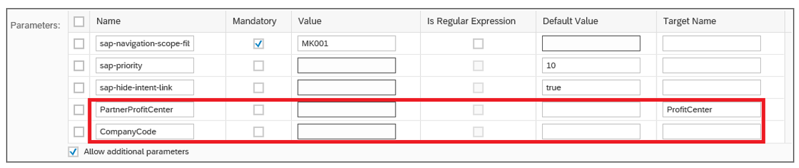

<!-- loiod782acf8bfd74107ad6a04f0361c5f62 -->

# Navigation from an App \(Outbound Navigation\)

You can either specify a URL or associate a semantic object \(intent-based navigation\) for external navigation targets.


<a name="loiod782acf8bfd74107ad6a04f0361c5f62__section_q3c_dg5_5lb"/>

## Using a URL

You have two annotation options. You can either specify the absolute URL explicitly, or you can use a path reference to a property using the `DataFieldWithUrl` annotation as follows:

Example 1: `DataFieldWithURL` as path reference to a property:

> ### Sample Code:  
> XML Annotation
> 
> ```xml
> <Record Type="UI.DataFieldWithUrl">
>     <PropertyValue Property="Label" String="Column label" />
>     <PropertyValue Property="Value" Path="URL"/>
>     <PropertyValue Property="Url" Path="URL"/>
> </Record>
> ```

> ### Sample Code:  
> ABAP CDS Annotation
> 
> ```
> @UI.<lineItem/fieldGroup>: [{ type: #WITH_URL, url: 'URL' }]
> URL;
> ```

> ### Sample Code:  
> CAP CDS Annotation
> 
> ```
> {
>     $Type :  'UI.DataFieldWithUrl',
>     Value :  URL,
>     Url :    URL,
>     Label :  'Column label'
> },
> ```

Example 2: `DataFieldWithURL` with absolute URL:

> ### Sample Code:  
> XML Annotation
> 
> ```xml
> <Record Type="UI.DataFieldWithUrl">
>     <PropertyValue Property="Url" String="Your URL"/><!--For example: https://www.sap.com-->
>     <PropertyValue Property="Value" Path="URL"/>
>     <PropertyValue Property="Label" String="Company"/>
> </Record>
> ```

> ### Sample Code:  
> ABAP CDS Annotation
> 
> ```
> @UI.<lineItem/fieldGroup>: [
> {
>     label: 'Company',
>     type: #WITH_URL,
>     url: 'Your URL' //For example: https://sap.com
> }
> ]
> URL;
> 
> ```

> ### Sample Code:  
> CAP CDS Annotation
> 
> ```
> {
>     $Type : 'UI.DataFieldWithUrl',
>     Url :   'Your URL', //For example: https://www.sap.com
>     Value : 'URL',
>     Label : 'Company'
> }
> ```

A link control is rendered for the property on the list report page or the object page.

You can use `DataFieldWithURL` with an absolute value for the `Value` property instead of a path-based value:

> ### Sample Code:  
> XML Annotation
> 
> ```xml
> <Record Type="UI.DataFieldWithUrl">
>     <PropertyValue Property="Url" String="Your URL"/><!--For example: https://www.sap.com-->
>     <PropertyValue Property="Value" String="SAP"/>
>     <PropertyValue Property="Label" String="Company"/>
> </Record>
> ```

> ### Sample Code:  
> ABAP CDS Annotation
> 
> ```
> {
>     label: 'Company',
>     type: #WITH_URL,
>     url: 'Your URL' //For example: https://sap.com
> }
> ```

> ### Sample Code:  
> CAP CDS Annotation
> 
> ```
> {
>   $Type : 'UI.DataFieldWithUrl',
>   Url :   'Your URL', //For example: https://www.sap.com
>   Value : 'SAP',
>   Label : 'Company'
> }
> ```

You can use the `LinkTarget` property to specify in which window, tab, or frame the link target is opened. The following values are supported:

-   `_self`: The link is opened in the same tab or window \(default\).

-   `_blank`: The link is opened in a new tab or window.

-   `_parent`: The link is opened in the parent frame or window.

-   `_top`: The link is opened in the full browser window, overriding any nested frames.


> ### Sample Code:  
> XML Annotation
> 
> ```xml
> <edmx:Reference Uri="https://sap.github.io/odata-vocabularies/vocabularies/HTML5.xml">
>       <edmx:Include Namespace="com.sap.vocabularies.HTML5.v1" Alias="SAP__HTML5"/>
> </edmx:Reference>
> 
> <Record Type="UI.DataFieldWithUrl">
>   <PropertyValue Property="Label" String="FLP version 6"/>
>   <PropertyValue Property="Url" String="http://www.example.com"/>
>   <PropertyValue Property="Value" String="Link Target"/>
>   <Annotation Term="HTML5.LinkTarget" String="_blank"/>
> </Record>
> ```

> ### Sample Code:  
> ABAP CDS Annotation
> 
> No ABAP CDS annotation sample is available. Please use the local XML annotation.

> ### Sample Code:  
> CAP CDS Annotation
> 
> ```
> {
>   $Type               : 'UI.DataFieldWithUrl',
>   Label               : 'FLP version 6',
>   Url                 : 'http://www.example.com',
>   Value               : 'Link Target',
>   ![@HTML5.LinkTarget]: '_blank',
> }
> ```

For more information and live examples, see the SAP Fiori development portal at [Building Blocks - Field](https://ui5.sap.com/test-resources/sap/fe/core/fpmExplorer/index.html#/buildingBlocks/field/fieldDefault)


## Navigation to a Semantic Object \(Intent-Based Navigation\)

If you associate a semantic object annotation with any property, this establishes [Intent-Based Navigation](http://help.sap.com/saphelp_nw75/helpdata/en/bd/8ae3d327ab4541bcce8e7353c046fc/content.htm).

An intent is a mechanism that lets you perform actions on semantic objects \(such as navigating to a sales order or displaying a fact sheet\) without having to worry about the UI technology or technical implementation of the navigation target. Intent-based navigation is the standard navigation mechanism in FLP and can also be used for the following purposes:

-   Depending on the user's role, a different application or view of an application must be displayed.

-   You want to define an ambiguous navigation target. This means that, at runtime, a list of potential targets is suggested to the user.


## Options for Intent-Based Navigation

To enable intent-based navigation, you must associate a semantic object. Navigation can then be triggered using a link or a button.


### Using a Link

-   Global association

    To use a specific property that is always shown as a link in your application, you must annotate the property with a semantic object. Wherever the property is used as a `DataField`, it is always rendered as a link, also known as semantic link.

    When a user chooses the semantic link and only one navigation target is found, direct navigation to the target is triggered. If more than one target is found, the system displays a popover containing some text and links to the targets for the user to choose from. You can hide unwanted semantic object actions from the popover using the `SemanticObjectUnavailableActions` annotation. You can also annotate a property with multiple semantic objects by using different qualifiers for the `SemanticObject` annotation.

    You can enhance the content of this popover and display a quick view containing more information about the navigation target. For more information, see [Enabling Quick Views for Link Navigation](enabling-quick-views-for-link-navigation-307ced1.md).

    If a quick view is defined for the semantic link popover, SAP Fiori elements displays the popover every time users choose the semantic link. The popover is also displayed if only one navigation target is found or even if no navigation target is found.

    > ### Sample Code:  
    > XML Annotation
    > 
    > ```xml
    > <Annotations xmlns="http://docs.oasis-open.org/odata/ns/edm" Target="ZFAR_CUSTOMER_LINE_ITEMS2_SRV.Item/CostCenter">
    >     <Annotation Term="com.sap.vocabularies.Common.v1.SemanticObject" String="CostCenter"/>
    > </Annotations>
    > 
    > ```

    > ### Sample Code:  
    > ABAP CDS Annotation
    > 
    > ```
    > annotate view ITEM with {
    >     @Consumption.semanticObject: 'CostCenter'
    >     CostCenter;
    > }
    > ```

    > ### Sample Code:  
    > CAP CDS Annotation
    > 
    > ```
    > annotate ZFAR_CUSTOMER_LINE_ITEMS2_SRV.Item with {
    >     @Common.SemanticObject : 'CostCenter'
    >     CostCenter
    > };
    > ```

    Semantic links can also point to dynamically added semantic objects. To do so, make sure that you point to a path that returns a valid semantic object name as a string at runtime.

    > ### Sample Code:  
    > XML Annotation
    > 
    > ```xml
    > <Annotations Target="myService.SalesorderManage/SoldToParty">
    >    <Annotation Term="Common.SemanticObject" Path="solToPartySemanticObject"/>
    > </Annotations>
    > ```

    > ### Sample Code:  
    > ABAP CDS Annotation
    > 
    > No ABAP CDS annotation sample is available. Please use the local XML annotation.

    > ### Sample Code:  
    > CAP CDS Annotation
    > 
    > ```
    > SoldToParty: String(10) @(
    >  Common.SemanticObject: solToPartySemanticObject
    > );
    > ```

-   Local association

    To only show the property as a link in a specific use case \(for example, within a form on an object page\), you must use the `DataFieldWithIntentBasedNavigation` annotation. You can use this type of link in tables and forms, that is, a `DataFieldWithIntentBasedNavigation` can be added to a `LineItem` or `FieldGroup` annotation. The link text is set according to the `"Value"` property \(in the example below, this is the value of `SomePath`\). Note that in SAP Fiori elements for OData V2 `sap:unit` annotations aren't evaluated in this context.

    > ### Note:  
    > -   Make sure you define a unique target by specifying both the semantic object and an action. Otherwise, clicking the link will not trigger direct navigation to the target.
    > 
    > -   In applications where links are annotated with `DataFieldWithIntentBasedNavigation`, the context menu does not display the *Open in New Tab* and *Open in New Window* options when an end user right-clicks on them.

    > ### Sample Code:  
    > XML Annotation
    > 
    > ```xml
    > <Record Type="UI.DataFieldWithIntentBasedNavigation">
    >     <PropertyValue Property="Label" String="My Link for navigation" />
    >     <PropertyValue Property="Value" Path="SomePath" />
    >     <PropertyValue Property="SemanticObject" String="MySemanticObject"/>
    >     <PropertyValue Property="Action" String="manage"/>
    > </Record>
    > 
    > ```

    > ### Sample Code:  
    > ABAP CDS Annotation
    > 
    > ```
    > @UI.<lineItem/fieldGroup>: [ 
    >   {
    >     label: 'My Link for navigation',
    >     value: 'SOMEPATH',
    >     semanticObjectAction: 'manage',
    >     type: #WITH_INTENT_BASED_NAVIGATION
    >   }
    > ]
    > @Consumption.semanticObject: 'MySemanticObject'
    > 
    > ```

    > ### Sample Code:  
    > CAP CDS Annotation
    > 
    > ```
    >     {
    >         $Type : 'UI.DataFieldWithIntentBasedNavigation',
    >         Label : 'My Link for navigation',
    >         Value : SomePath,
    >         SemanticObject : 'MySemanticObject',
    >         Action : 'manage',
    >     },
    > ```

    For examples of how to use the `DataFieldWithIntentBasedNavigation` annotation, see the [App-Specific Actions](adding-actions-to-tables-b623e0b.md#loiob623e0bbbb2b4147b2d0516c463921a0__section_ifk_jqb_2nb) section in [Adding Actions to Tables](adding-actions-to-tables-b623e0b.md).


If a semantic object is configured for a property, the value of this property is passed within the semantic object in the navigation context. For example, if the property is `SoldToParty` with the value `001` and the `SemanticObject` is `Customer`, then the navigation context will have `Customer` with the value `001`.


### Using a Button

To provide a button for navigation, you annotate a property as a `DataFieldForIntentBasedNavigation`.

> ### Sample Code:  
> XML Annotation
> 
> ```xml
> <Record Type="UI.DataFieldForIntentBasedNavigation">
>     <PropertyValue Property="Label" String="My Button for navigation"/>
>     <PropertyValue Property="SemanticObject" String="MySemanticObject"/>
>     <PropertyValue Property="Action" String="manage"/>
> </Record>
> 
> ```

> ### Sample Code:  
> ABAP CDS Annotation
> 
> ```
> @UI.<lineItem/fieldGroup>: [ 
>   {
>     label: 'My Button for navigation',
>     semanticObjectAction: 'manage',
>     type: #FOR_INTENT_BASED_NAVIGATION
>   }
> ]
> @Consumption.semanticObject: 'MySemanticObject'
> ```

> ### Sample Code:  
> CAP CDS Annotation
> 
> ```
> {
>     $Type : 'UI.DataFieldForIntentBasedNavigation',
>     Label : 'My Button for navigation',
>     SemanticObject : 'MySemanticObject',
>     Action : 'manage',
> },
> ```

You can replace standard internal navigation with external navigation by using intent-based navigation. For more information, see [Changing Navigation to Object Page](changing-navigation-to-object-page-8bd546e.md).

Applications can selectively enable `DataFieldForIntentBasedNavigation` buttons using the `NavigationAvailable` property of the `DataFieldForIntentBasedNavigation` annotation. This Boolean property accepts `true` / `false` / `path` and points to a property that evaluates to `true/false`.

If the property points to a path, it can be a path to one of the following:

-   The parent property, such as the header button in the object page or the table button in the object page

-   A same-level property

-   A property from a 1:1 navigation entity set, such as a table toolbar button \(this is supported only if `requiresContext` is set to `true`\) or an inline button


If `NavigationAvailable` is defined as a path for a table toolbar button, the button is enabled only if at least one selected context has a path evaluating to `true`. Only the selected contexts for which the path evaluates to `true` are passed to the target application.

> ### Note:  
> -   SAP Fiori elements recommends not to use static `false` or `true` as a value for the `NavigationAvailable` property. Static `false` results in the button always being disabled, and static `true` is equal to not specifying anything.
> 
> -   This feature isn't applicable for charts and analytical tables.

> ### Sample Code:  
> XML Annotation
> 
> ```xml
> <Record Type="UI.DataFieldForIntentBasedNavigation">
>     <PropertyValue Property="SemanticObject" String="v4Freestyle"/>
>     <PropertyValue Property="Action" String="Inbound"/>
>     <PropertyValue Property="Label" String="IBN with context"/>
>     <PropertyValue Property="RequiresContext" Bool="true"/>
>     <PropertyValue Property="NavigationAvailable" Path="isDeletable"/>
> </Record>
> ```

> ### Sample Code:  
> ABAP CDS Annotation
> 
> No ABAP CDS annotation sample is available. Please use the local XML annotation.

> ### Sample Code:  
> CAP CDS Annotation
> 
> ```
> {
>         $Type           : 'UI.DataFieldForIntentBasedNavigation',
>         SemanticObject  : 'v4Freestyle',
>         Action          : 'Inbound',
>         Label           : 'IBN',
>         NavigationAvailable : isDeletable,
>         RequiresContext : false
> }
> ```


## Actions Triggering External Navigation

Add the following property: `<PropertyValue Property="RequiresContext" Bool="true"/>`

If `RequiresContext` is `true`, then the button is disabled until a selection is made. If it's `false`, then the button is always enabled. The default value for `RequiresContext` is `false`.

> ### Note:  
> `RequiresContext` only determines whether the button is enabled based on the end user's selected context. Regardless of its value, any available context is always passed along, following the standard navigation process.

> ### Sample Code:  
> XML Annotation
> 
> ```xml
> <Record Type="UI.DataFieldForIntentBasedNavigation">
>    <PropertyValue Property="SemanticObject" String="EPMProduct"/>
>    <PropertyValue Property="Action" String="manage_st"/>
>    <PropertyValue Property="Label" String="IBNWithContext"/>
>    <PropertyValue Property="RequiresContext" Bool="true"/>
> </Record>
> ```

> ### Sample Code:  
> ABAP CDS Annotation
> 
> ```
> {    
>     semanticObject: 'EPMProduct',
>     semanticObjectAction: 'manage_st',
>     label: 'IBNWithContext',
>     requiresContext: true,
>     type: #FOR_INTENT_BASED_NAVIGATION
> }
> 
> ```

> ### Sample Code:  
> CAP CDS Annotation
> 
> ```
> {
>    $Type: 'UI.DataFieldForIntentBasedNavigation',
>    SemanticObject: 'SalesOrder',
>    Action: 'manageInline',
>    Label: 'IBNwithcontext',
>    RequiresContext: true
> }
> ```


### Display or Hide Buttons Triggering External Navigation

You can define that context-independent buttons \(`RequiresContext` is set to `false`\) triggering external navigation are displayed only if the navigation target is supported on the current device. In addition, if the `SemanticObject` or the action is invalid and if the user doesn't have the correct authorizations, the button isn't displayed. As a prerequisite, you must have maintained the navigation target in the SAP Fiori launchpad as shown in the following images:

  
  
**SAP Fiori launchpad: Maintain the Supported Devices for the Combination of Semantic Object and Action**


  
  
**SAP Fiori launchpad: Maintain the Mandatory Parameters for Semantic Object and Action**


> ### Note:  
> -   As already shown, you maintain mandatory parameters for navigation in SAP Fiori launchpad, such as a sales order ID. If you have specified `RequiresContext: False` for the combination of semantic object and action, and if for this combination you maintain a mandatory parameter in SAP Fiori launchpad, these settings contradict each other and the button isn't displayed.
> 
> -   This feature isn't relevant for context-dependent buttons. For information about context-dependent and context-independent actions, see [Actions](actions-cbf16c5.md).

You can also hide the intent-based navigation button by using `UI.Hidden` against the `UI.DataFieldForIntentBasedNavigation` button. This can have the static values `true` or `false`, or have a path-based value. You can't set `UI.Hidden` for inline `DataFieldForIntentBasedNavigation` buttons.


<a name="loiod782acf8bfd74107ad6a04f0361c5f62__semantic_object_mapping_subsection"/>

## Semantic Object Mapping

You can change the name of properties that are passed in the navigation context when using the intent-based navigation mechanism.

> ### Tip:  
> We recommend using the common field names from the global field catalog in both the source and target applications. If the source field name is not from the global field catalog, don't pass the source field name, but rather pass the global field catalog name to the target.

If the target field name isn't from the global field catalog, you can use the target-mapping mechanism to convert the incoming global field catalog name to the target-specific field.

To do this when using the semantic link-based navigation, use the `SemanticObjectMapping` annotation as shown in the following sample code:

> ### Sample Code:  
> XML Annotation
> 
> ```xml
> <Annotations Target="com.c_salesordermanage_sd.defaultParamsForSalesOrderCreate/SoldToParty">
>      <Annotation Term="Common.SemanticObject" String="Customer"/>
>      <Annotation Term="Common.SemanticObjectMapping">
>           <Collection>
>                <Record Type="Common.SemanticObjectMappingType">
>                     <PropertyValue Property="LocalProperty" PropertyPath="SoldToPartyID"/>
>                     <PropertyValue Property="SemanticObjectProperty" String="CustomerID"/>
>                </Record>
>           </Collection>
>      </Annotation>
> </Annotations>
> ```

> ### Sample Code:  
> ABAP CDS Annotation
> 
> No ABAP CDS annotation sample is available. Please use the local XML annotation.

> ### Sample Code:  
> CAP CDS Annotation
> 
> ```
> SoldToParty : String(10) @(Common : { 
>     SemanticObject                : 'Customer',
>     SemanticObjectMapping         : 'SoldToPartyID'[
>         {
>         LocalProperty           : SoldToPartyID,
>         SemanticObjectProperty  : 'CustomerID'
>         }
>     ]
> });
> ```

> ### Note:  
> Navigation properties cannot be used within the annotation as mapping properties.

For semantic object mapping when navigating using the `DataFieldForIntentBasedNavigation` button, use the `Mapping` property in the `DataFieldForIntentBasedNavigation` annotation.

  
  
**Mapping Semantic Objects**



> ### Sample Code:  
> XML Annotation
> 
> ```xml
> <Annotation Term="UI.FieldGroup" Qualifier="IntentBasedNavigation">
>     <Record Type="UI.FieldGroupType">
>         <PropertyValue Property="Data">
>             <Collection>
>                 <Record Type="UI.DataFieldWithIntentBasedNavigation">
>                     <PropertyValue Property="Label" String="Approve Travel"/>
>                     <PropertyValue Property="SemanticObject" String="Description"/>
>                     <PropertyValue Property="Action" String="maintain"/>
>                     <PropertyValue Property="Mapping">
>                         <Collection>
>                             <Record Type="Common.SemanticObjectMappingType">
>                                 <PropertyValue Property="LocalProperty" PropertyPath="to_Agency/AgencyID"/>
>                                 <PropertyValue Property="SemanticObjectProperty" String="Agency_Identifier"/>
>                             </Record>
>                         </Collection>
>                     </PropertyValue>
>                 </Record>
>             </Collection>
>         </PropertyValue>
>     </Record>
> </Annotation>
> ```

> ### Sample Code:  
> ABAP CDS Annotation
> 
> ```
> {
>       type: #FOR_INTENT_BASED_NAVIGATION,
>       semanticObject: 'nameOfSemanticObject',
>       semanticObjectAction: 'nameOfSemanticObjectAction',
>       semanticObjectBinding: [ 
>        {
>         localElement: 'nameOfSourceProperty',
>         element: 'nameOfTargetProperty',
>       } 
>    ]
> }
> ```

> ### Sample Code:  
> CAP CDS Annotation
> 
> ```
> {
>     $Type         : 'UI.DataFieldForIntentBasedNavigation',
>     Label         : 'Approve Travel',
>     SemanticObject: 'Description',
>     Action        : 'maintain',
>     Mapping       : [{
>         LocalProperty         : to_Agency.AgencyID,
>         SemanticObjectProperty: 'Agency_Identifier'
>     }]
> }
> 
> ```

Empty values aren't passed to the target application, unless explicitly set using *Define Conditions* in the filter bar.


<a name="loiod782acf8bfd74107ad6a04f0361c5f62__sensitive_inapplicable_data_subsection"/>

## Handling Sensitive and Inapplicable Data

During external outbound navigation, the following data is removed from the navigation context because the data is sensitive or non-applicable:

-   Measures in analytical services: Properties defined as `com.sap.vocabularies.Analytics.v1.CustomAggregate` in the metadata

-   Properties annotated with `com.sap.vocabularies.PersonalData.v1.IsPotentiallySensitive`

    > ### Sample Code:  
    > XML Annotation
    > 
    > ```xml
    > <Annotations Target="com.c_salesordermanage_sd.SalesOrderManage/ID">
    >     <Annotation Term="com.sap.vocabularies.PersonalData.v1.IsPotentiallySensitive" />
    > </Annotations>
    > ```

    > ### Sample Code:  
    > ABAP CDS Annotation
    > 
    > ```
    > annotate view SALESORDERMANAGE with {
    >   @Semantics.personalData.isPotentiallySensitive: true
    >   ID;
    > }
    > ```

    > ### Sample Code:  
    > CAP CDS Annotation
    > 
    > ```
    > annotate com.c_salesordermanage_sd.SalesOrderManage {
    >     @PersonalData.IsPotentiallySensitive
    >     ID
    > };
    > ```

-   Properties annotated with `com.sap.vocabularies.UI.v1.ExcludeFromNavigationContext`

    > ### Sample Code:  
    > XML Annotation
    > 
    > ```xml
    > <Annotations Target="com.c_salesordermanage_sd.SalesOrderManage/ID">
    >     <Annotation Term="UI.ExcludeFromNavigationContext" Bool="true"/>
    > </Annotations>
    > ```

    > ### Sample Code:  
    > ABAP CDS Annotation
    > 
    > No ABAP CDS annotation sample is available. Please use the local XML annotation.

    > ### Sample Code:  
    > CAP CDS Annotation
    > 
    > ```
    > annotate com.c_salesordermanage_sd.SalesOrderManage {
    >     @UI.ExcludeFromNavigationContext : true
    >     ID
    > };
    > ```

-   Inapplicable properties: Properties annotated with `com.sap.vocabularies.Common.v1.FieldControl` that have a path that resolves to `Inapplicable` at runtime

    > ### Sample Code:  
    > XML Annotation
    > 
    > ```xml
    > <Annotations Target="SAP__self.ReviewsType/AvailabilityCode">
    >     <Annotation Term=" SAP__Common.FieldControl" Path="__FieldControl/AvailabilityCode_FC"/>
    > </Annotations>
    > ```

    > ### Sample Code:  
    > ABAP CDS Annotation
    > 
    > Path-based `FieldControl` isn't supported using ABAP CDS annotations.

    > ### Sample Code:  
    > CAP CDS Annotation
    > 
    > ```
    > annotate SAP__self.ReviewsType {
    >     @Common.FieldControl : __FieldControl.AvailabilityCode_FC
    >     AvailabilityCode
    > };
    > ```


> ### Caution:  
> Sensitive properties of navigation entities beyond one level won't be removed from the navigation context.

For more security-related information, see [Security Configuration](security-configuration-ba0484b.md).


## Handling Information from the Navigation Entity Set

When navigation is triggered from a control, the navigation may include more information than is available in the control context. For example, when navigating from a table on a list report page navigating after selecting a table row brings into the navigation context not just the selected row information but also the context present in the filter bar. Similarly, when navigation is triggered after selection of a table row in an object page, the navigation context also contains information from the page context, not just the selected row information.

When the navigation context is prepared, the information from the specific control entity \(for example, the table entity\) is merged with the information that comes from the parent entity, for example, a filter bar on a list report page or the page context in an object or subobject page, in the following order:

1.  If there's no conflicting property, that is, if the property with a given technical name only comes from one entity set, then the property value is passed against the property name without any leading entity set name.

2.  If the exact technical name of the property is found in both the entities, this is considered as a conflict. The properties from each of these entity sets are always passed \(together with the appended names of the entity sets\) in addition to the property value that is passed without the prefix of the names of the entity sets. For property names without a prefix, values from a specific selection are passed. For example, a page context and a table have the same property. When the navigation is triggered from the table context, then the table selection is prioritized, and this value is passed against the property without a prefix.


> ### Example:  
> In the following scenarios, "SO" represents the "main entity set" to which the list report page is bound. All entity sets starting with "\_" are the associated navigation entity sets.
> 
> -   Scenario 1 \(list report page\)
> 
>     LR filter bar has: "SO.OrderType" = "Standard Order" or "Special Order" | "SO.Status"="In Process" | "\_PO.Status"="Prepared" or "Completed".
> 
>     Selected table context: "SO.OrderID"="123" | "SO.OrderType"="Standard" | "\_PO.Status"="Prepared" | "\_PO.Responsible"="ABC".
> 
>     Merged context: "OrderID"="123" | "OrderType"="Standard" | "Status"="In Process".
> 
>     -   "OrderType" is passed with the most specific value.
> 
>     -   Information coming from the navigation entity set \("\_PO"\) is ignored by both the page context and the selected row context.
> 
> 
> -   Scenario 2 \(object page\)
> 
>     OP page context has: "SO.SalesOrder"="123" | "SO.Price"="400 EUR" | "\_ReferenceSO.SalesOrder"="456" | "\_ReferenceSO.SalesCategory"="Resale".
> 
>     Selected table \(\_Item\) context: "\_Item.ItemNumber"="10" | "\_Item.Price" = "20 EUR" | "\_Item.\_ReferenceSO.SalesOrder"="789" | "\_Item.\_ReferenceSO.OrderType" = "Standard".
> 
>     Merged context: "SalesOrder"="123" | "ItemNumber"="10" | "Price"="20 EUR" | "SO.Price"="400 EUR" | "SO.\_Item.Price"="20 EUR".
> 
>     -   "Price" is passed with the value "20 EUR" \(value from a more specific context, such as from a selected row context\). We also pass "SO.Price" and "SO.\_Item.Price" due to a conflict with this property.
> 
>     -   Information coming from the navigation entity set \("\_ReferenceSO"\) is ignored by the page context and the selected row context.
> 
> -   Scenario 3 \(object page\)
> 
>     OP page context has: "SO.SalesOrder"="123" | "\_ReferenceOrder.OrderType"="Express".
> 
>     Selected table \(\_Item\) context: "\_Item.ItemNumber"="10" | "SO.OrderType" = "Standard" | "\_Item.OrderType" = "InHouse" | "\_ReferenceOrder.OrderType"="Outsource".
> 
>     Merged context: "SalesOrder"="123" | "ItemNumber"="10" | "OrderType"="InHouse".
> 
>     -   "OrderType" = "InHouse" - all other values are ignored as they come from navigation entity set.
> 
> 
> -   Scenario 4 \(subobject page\)
> 
>     Sub-OP page \(\_Item page\) context has: "\_Item.ItemNumber"="10".
> 
>     Selected table \(\_SubItem\) context: "\_SubItem.ItemNumber"="101" | "\_Item.ItemNumber"="10" | "\_ReferenceItem.ItemNumber"="200".
> 
>     Merged context: "ItemNumber"="101" | "SO.\_Item.ItemNumber"="10" | "SO.\_Item.\_SubItem.ItemNumber"="101".
> 
>     -   "ItemNumber" is passed with the value "101" \(value from a more specific context, such as from a selected row context\). We also pass "SO.\_Item.ItemNumber" and "SO.\_Item.\_SubItem.ItemNumber" due to the conflict with this property.


### Passing of Information from the Navigation Entity Set

By default, only the information from the entity set, which is bound to each control, is included in the navigation context. See the following examples of what is included in the navigation context:

-   The table entity when navigation is triggered after row selection.
-   The main entity from the filter bar on list report pages.
-   The page context in object pages

Information from a navigation entity, relative to each control that provides information to the navigation context, is passed if there is a `SemanticObjectMapping` defined against the navigation property. For more information, see the [Semantic Object Mapping](navigation-from-an-app-outbound-navigation-d782acf.md#loiod782acf8bfd74107ad6a04f0361c5f62__semantic_object_mapping_subsection) section in this topic.

Any information from the table that comes from a navigation entity defined against the table entity is ignored. Similarly, any information in the filter bar \(for list report pages\) or the page context \(for object pages\) that comes from a navigation entity defined against the main entity is ignored.

For example, an object page which displays information from the `SO` main entity set but also has information which comes from the `_PO` navigation entity set, contains different information in the navigation context depending on whether there's a semantic mapping. When there's a semantic mapping defined against `_PO.Status`, then the `_PO.Status` is added to the navigation context. If the mapping specifies a different name to be used in the target using the `SemanticObjectProperty` property, then this name is used instead of `_PO.Status`.

Another example is a table in an object page which is bound to the `_Items` entity and the table also has fields which come from the `_Items._ReferenceSO` navigation entity set. A navigation property such as `_ReferenceSO.SalesCategory` is passed only if this field has a semantic object mapping defined against it.

> ### Note:  
> If your target expects the exact same name as the local property name, for example, `_PO.Status` or `_ReferenceSO.SalesCategory`, you still need to define a semantic object mapping to trigger passing these navigation properties. However, you must keep the same name against both the `LocalProperty` and the `SemanticObjectProperty`.


### Special Handling of Semantic Links

If there are fields with the same technical name as the semantic link field that was clicked to trigger the navigation, for this field, only the value from the semantic link field is passed in the navigation context, and the values from other fields with this technical name are ignored. The merged context for the other fields is passed as described in the rules above.

> ### Example:  
> -   List report
> 
>     LR filter bar has: "SO.OrderType" = "Standard Order" or "Special Order" | "SO.Status"="In Process" | "\_PO.Status"="Prepared" or "Completed".
> 
>     Selected table context: "SO.OrderID"="123" | "SO.OrderType"="Standard" | "SO.Status"="In Process" | "\_PO.Status"="Prepared" | "\_PO.Responsible"="ABC".
> 
>     Assumption: "\_PO.Status" is the field that has the semantic link.
> 
>     Merged context that is passed when semantic link "\_PO.Status" is clicked: "OrderID"="123" | "OrderType"="Standard" | "Status"="Prepared" | "SO.Status"="In Process" | "\_PO.Status"="Prepared".
> 
>     Note that "Status" holds the value \("Prepared"\) from the semantic link field and not the main entity set field at the same level, because the semantic field is the more specific context here – and the navigation is triggered from the semantic field.


## Passing of Parameters in an Outbound Context

Irrespective of how an outbound external navigation is triggered, the parameters that are part of the context are always passed to the target application. The parameter field \(along with its value\) is always added to two places within the `SelectionVariant` that is part of the `xAppState` that is handed over to the target:

-   It's added to the `SelectionVariant→SelectOptions` with the prefix `"$Parameter."`. For example, a parameter called `"P_CompanyCode"` is passed as `"SelectionVariant→SelectOptions→"$Parameter.P_CompanyCode"`.

-   It's also added to the `SelectionVariant→SelectOptions` directly \(as in SAP Fiori elements for OData V2\). In the above example, we then find: `SelectionVariant→SelectOptions→"P_CompanyCode"`.


<a name="loiod782acf8bfd74107ad6a04f0361c5f62__hiding_unwanted_actions_subsection"/>

## Hiding Unwanted Actions from a Semantic Object

You can hide actions on semantic objects through the `SemanticObjectUnavailableActions` settings defined with or without a qualifier. Such actions aren't displayed when the link \(or quick-view link\) popover is shown.

> ### Sample Code:  
> XML Annotation
> 
> ```xml
> <Annotations Target="MyService.SalesOrderManage/SoldToParty">
>     <Annotation Term="Common.SemanticObject" Qualifier="SalesOrder" String="SalesOrder"/>
>     <Annotation Term="Common.SemanticObjectMapping" Qualifier="SalesOrder">
>         <Collection>
>             <Record Type="Common.SemanticObjectMappingType">
>                 <PropertyValue Property="LocalProperty" PropertyPath="SoldToParty"/>
>                     <PropertyValue Property="SemanticObjectProperty" String="SoldToParty"/>
>             </Record>
>         </Collection>
>     </Annotation>
>     ...
>     <Annotation Term="Common.SemanticObjectUnavailableActions" Qualifier="SalesOrder">
>         <Collection>
>             <String>manageVM</String>
>         </Collection>
>     </Annotation>
>     <Annotation Term="Common.SemanticObjectUnavailableActions">
>         <Collection>
>             <String>manage</String>
>         </Collection>
>     </Annotation>
>     ...
>     ...
> </Annotations>
> ```

> ### Sample Code:  
> ABAP CDS Annotation
> 
> No ABAP CDS annotation sample is available. Please use the local XML annotation.

> ### Sample Code:  
> CAP CDS Annotation
> 
> ```
> annotate myService.SalesorderManage {
>     @Common.SemanticObject : 'SalesOrder'
>     @Common.SemanticObject #SalesOrder : 'SalesOrder'
>     @Common.SemanticObjectUnavailableActions #SalesOrder : ['analyze']
>     @Common.SemanticObjectUnavailableActions : ['manage']
>     OrderID
> };
> ```

This results in both the `analyze` and `manage` actions being hidden from the link popover of the `OrderID` field. The other available actions from the `SalesOrder` entity set are displayed.


## Additional Context During Outbound Navigation from Object Page or Subobject Page

The page context that is passed is augmented with the technical and semantic keys.

The page context contains all the information passed from the previous level – typically the object page, but it could also be a parent-level subobject page. The page context therefore normally has all the visible fields \(and values\) that are bound to the parent-level page. In addition, the technical keys or semantic keys \(or both\) of the entity set \(that is, the control from where the navigation is triggered\) are added to the page context together with the technical keys or semantic keys \(or both\) of the parent entity set. When you navigate away from the subobject page by means of `DataFieldForIBN`, for example, the navigation context also contains the keys from the parent page \(together with the keys from the subobject page data\).

For example, when you navigate from the object page table into a subobject page, the table record context includes the keys of the table entity set. In addition, the keys of the entity set from the object page header are also part of the page context of the subobject page.

The technical keys are always passed, since it is clear what the technical keys are from the metadata of the entity set. The semantic keys are only passed if they are used by the application – in this case, they have to add annotations to mark the semantic keys:

> ### Sample Code:  
> ```
> Common: {
>         SemanticKey   : [SalesOrder]
>     }
> 
> ```

When there is a specific control-level selection context, the merged context has both the parent-level context \(Sales Order ID page context\) and the control-level context \(Sales Order Item selection\). If there is the same property at both parent level and the entity set of the control, then the control-level value is persisted.

For example, if an object page header has "Location"="DE" and there is also the same "Location" property in the items table with the value "JP", then the merged context that is passed just has "Location"="JP". The header level "Location" is lost.

Additionally, the secondary keys maintained using annotations can be linked to the navigation context. If the specified properties are missing in the page context, these secondary keys are fetched and passed with the navigation context.

> ### Sample Code:  
> XML Annotation
> 
> ```xml
> <edmx:Reference Uri="https://sap.github.io/odata-vocabularies/vocabularies/Common.xml">
> 	<edmx:Include Alias="Common" Namespace="com.sap.vocabularies.Common.v1" />
> </edmx:Reference>
> ...
> <EntityType Name="Product">
>    <Key>
>        <PropertyRef Name="ProductId"/>
>    </Key>
>    <Property Name="ProductId" Type="Edm.Int32" Nullable="false"/>
>    <Property Name="ProductCode" Type="Edm.String" Nullable="false"/>
>    <Property Name="ProductName" Type="Edm.String" Nullable="false"/>
> 
>    <!-- Secondary key annotation -->
>    <Annotations>
>        <Annotation Term="Common.SecondaryKey">
>            <Collection>
>                  <PropertyPath>ProductCode</PropertyPath>
>            </Collection>
>        </Annotation>
>    </Annotations>
> </EntityType>
> ```

> ### Sample Code:  
> ABAP CDS Annotation
> 
> No ABAP CDS annotation sample is available. Please use the local XML annotation.

> ### Sample Code:  
> CAP CDS Annotation
> 
> ```
> annotate c_salesordermanage_sd.Product with @(
>   Common.SecondaryKey: ['ProductCode']
> ){}
> ```


## Navigation to Object Pages in a Multi-Entity Set with Tabs

You can navigate to any object page in a target app that has a multi-entity set with tabs if the navigation context uniquely identifies a record in the target app. Configure both the source and target apps as follows:

In the extension controller of the source app, pass an additional parameter to the target app using the `adaptNavigationContext` extension. This additional parameter, a key-value pair, is used in the `manifest.json` file of the target app to uniquely identify the object page to be opened.

> ### Sample Code:  
> `ListReportExtension.controller.js`
> 
> ```
> adaptNavigationContext: function (selectionVariant, targetInfo) {
>     if (targetInfo.semanticObject === "SalesOrder" && targetInfo.action === "manage") {
>         selectionVariant.addParameter("<Key>", "<Value1>");
>     }
> }
> 
> ```

> ### Sample Code:  
> `ObjectPageExtension.controller.js`
> 
> ```
> adaptNavigationContext: function (selectionVariant, targetInfo) {
>     if (targetInfo.semanticObject === "SalesOrder" && targetInfo.action === "manage") {
>         selectionVariant.addParameter("<Key>", "<Value2>");
>     }
> }
> 
> ```

In the target app's `manifest.json` file, mark the parameter used to determine the object page with `inboundParameterForTargetResolution`.

> ### Sample Code:  
> `manifest.json`
> 
> ```json
> 
> "sap.fe": {
>     "app": {
>         "inboundParameterForTargetResolution": "<Key>"
>     }
> }
> 
> ```

After you identify the key, use its value in the page hierarchy to determine the object page.

> ### Example:  
> > ### Sample Code:  
> > `manifest.json`
> > 
> > ```
> > "sap.ui5": {
> >     "routing": {
> >         "targets": {
> >             "ObjectPage|<EntitySet1>": {
> >                 "type": "Component",
> >                 "id": "ObjectPage1",
> >                 "name": "sap.fe.templates.ObjectPage",
> >                 "options": {
> >                     "settings": {
> >                         "targetResolutionValue": "<Value1>",
> >                         "entitySet": "<EntitySet1>"
> >                     }
> >                 }
> >             },
> >             "ObjectPage|<EntitySet2>": {
> >                 "type": "Component",
> >                 "id": "ObjectPage2",
> >                 "name": "sap.fe.templates.ObjectPage",
> >                 "options": {
> >                     "settings": {
> >                         "targetResolutionValue": "<Value2>",
> >                         "entitySet": "<EntitySet2>"
> >                     }
> >                 }
> >             }
> > 
> > ```

In this example, when `<Key>-<Value1>` is passed as an additional parameter in the navigation context, the `<EntitySet1>` object page is opened. Similarly, when `<Key>-<Value2>` is passed, the `<EntitySet2>` object page is opened.


> ### Note:  
> For information about SAP Fiori elements for OData V2, see [Navigation from an App \(Outbound Navigation\)](navigation-from-an-app-outbound-navigation-c35fa60.md).

