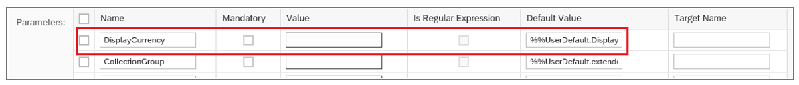

<!-- loioc337d8bde8c544598969c8e4edaab262 -->

# Navigation to an App \(Inbound Navigation\)

This topic describes the key features when navigating into an SAP Fiori elements template, that is, inbound navigation.

When navigating to an SAP Fiori elements application that has a filter bar \(with the exception of the overview page\), the incoming context is processed and the filter bar populated. This overrides the default variant/filter settings of the SAP Fiori elements application.


<a name="loioc337d8bde8c544598969c8e4edaab262__section_w52_g2z_cqb"/>

## Handling Incoming Filters

An incoming value for a field that is also a filter field in the entity set of the target application is applied to the filter field. If the field is not yet seen in the filter bar, upon finding a value for the field from the incoming context, the filter field is brought into the visible area in the filter bar.


### Handling Default Values from SAP Fiori launchpad \(FLP\)

When dealing with incoming navigation, in addition to the navigation context passed by the source application, there are also other values coming from the FLP, like the FLP target mapping default values. The FLP target mapping can have parameters to which you can assign default values. These default values can also point to the FLP user default values.

  
  
**Handling Default Values from FLP**



-   When you navigate to a list report application using intent-based navigation:

    Only the values added by the FLP through the standard target mapping mechanism are considered.

-   When you navigate to a list report application using a static FLP tile \(with no navigation context\)

    If no user default variant is available, the FLP default values passed using the target mapping mechanism are used.

-   When you navigate to a list report application using a dynamic tile, such as an *SAP Smart Business* tile where the navigation context is passed:

    In this case, a special handling applies for `DisplayCurrency`. If a mandatory filter field or a parameter with the technical name `DisplayCurrency` or `P_DisplayCurrency` respectively, doesn't receive a value from the incoming navigation context, it is set using the default `DisplayCurrency` setting configured in the end user's SAP Fiori launchpad. For all other fields, the FLP default values are ignored, except those provided by the FLP through the standard target mapping mechanism.


> ### Note:  
> The user default values from SAP Fiori launchpad marks the standard variant as dirty.


<a name="loioc337d8bde8c544598969c8e4edaab262__section_krn_xk3_vlb"/>

## Deep Linking

Navigation to the application uses deep linking. For more information, see [Navigation](https://experience.sap.com/fiori-design/concept/navigation/) in the SAP Fiori design guidelines and go to the *Deep Links* section.

> ### Note:  
> You need the SAP Fiori launchpad for this type of navigation. For a stand-alone application, you need to change the links in the annotations as required.

For the SAP Fiori launchpad, the configuration steps for [Intent-Based Navigation](http://help.sap.com/saphelp_nw75/helpdata/en/bd/8ae3d327ab4541bcce8e7353c046fc/content.htm) are also relevant since it's the same mechanism.

If the source application provides all the key fields in the URL to uniquely identify an object page \(or subobject page\) record, then this will be directly opened instead of the list report or analytical list page. Otherwise, the list report or analytical list page will be opened.


### Deep Linking to Object Pages

You can trigger deep linking to object pages by providing all technical keys corresponding to the list report entity set. Depending on the value of the `IsActiveEntity` technical key, the result is:

-   either the active or draft page is loaded

    or

-   if the draft is requested from the URL and is not accessible for the user, the user sees an error page


Technical keys are part of the metadata and are configured in the back end.

> ### Sample Code:  
> ```xml
> <EntityType Name="SalesOrderManage">
>    <Key>
>       <PropertyRef Name="ID"/>
>       <PropertyRef Name="IsActiveEntity"/>
>    </Key>  
> </EntityType>
> ```

> ### Example:  
> Technical keys are passed in the URL that triggers deep linking: …<code>?<b>ID</b>=11111111-aaaa-bbbb-cccc-ddddeeeeffff&amp;<b>IsActiveEntity</b>=true</code> 


### Deep Linking to Subobject Pages

You can also trigger deep linking directly to the n-th level of a subobject page. Youmust provide the manifest setting to indicate that deep linking is allowed for the subobject level. For more information, see the version-specific sections in this topic.

> ### Note:  
> -   To directly load the n-th level subobject page, `allowDeepLinking` has to be true for all the n levels of the subobject page.
> 
>     > ### Example:  
>     > To be able to directly load the 2nd-level subobject page, `allowDeepLinking` has to be true for the 1st-level subobject page and the 2nd-level subobject page.
> 
>     If `allowDeepLinking` is false, then the last subobject page for which `allowDeepLinking` is true is loaded. 
> 
>     > ### Example:  
>     > If `allowDeepLinking` is false for the 2nd-level subobject page, but true for the 1st-level and 3rd-level subobject page, and you provide semantic keys up to the 3rd level of the subobject page, then the 1st-level subobject page is loaded.
> 
> 
> -   `allowDeepLinking` is not required or relevant for the object page. Deep linking to an object page always happens if the URL has all the technical or semantic keys of the entity set of the object page. It is only required for the deep linking to subobject page.

> ### Restriction:  
> We don't support deep linking for applications that are configured with parameters or mandatory filters.


<a name="loioc337d8bde8c544598969c8e4edaab262__section_zst_cld_hmb"/>

## Additional Features in SAP Fiori Elements for OData V2


### Inbound Navigation to Subobject Pages Using Deep Linking

You can configure inbound navigation to any subobject page belonging to an application by using deep linking. To do so, make the following settings:

1.  In the target application's `manifest.json` file, for the corresponding subobject page, set `allowDeepLinking: true`, as shown in the following sample code:

    > ### Sample Code:  
    > manifest.json
    > 
    > ```
    > "pages": {
    >      "navigationProperty": "to_ProductText",
    >      "entitySet": "STTA_C_MP_ProductText",
    >      "component": {
    >           "name": "sap.suite.ui.generic.template.ObjectPage",
    >           "settings": {
    >                "allowDeepLinking": true
    >           }
    >      }
    > }
    > 
    > ```

    If multiple pages on the same level have this property set to `true`, the entry that comes first in the manifest is used.

    Navigation to any level is possible by setting `allowDeepLinking: true` for each level. Note that each level needs to have the setting `allowDeepLinking: true`. In the following sample code, the navigation goes to subobject level 3:

    > ### Sample Code:  
    > ```
    > Object Page1: {
    >      allowDeepLinking:true,
    >      SubObjectPage1:{
    >           allowDeepLinking:true
    >           SubObjectPage2:{
    >                allowDeepLinking:true
    >                SubObjectPage3:{
    >                     allowDeepLinking:true
    >                }
    >           }
    >      }
    > }
    > 
    > ```

2.  Provide the URL parameters for navigation, as described under [Configuring Navigation](https://help.sap.com/viewer/cc1c7615ee2f4a699a9272453379006c/7.5.5/en-US/bd8ae3d327ab4541bcce8e7353c046fc.html).


### Configuring Sort Order

If the `xapp-state` carries the sort orders during inbound navigation to a target list report or an analytical list page application, the target framework reads these sort parameters from the `xapp-state` and applies it as the sorting criteria to the table in the list report or the analytical list page.

Although the sorters coming from the navigation is merged with the existing sorting criteria of the table, the sorters from the navigation context always take the priority.

The following are some of the possible scenarios:

-   If the user defined control variant exists as default with a sorter, the framework merges the navigation sorter on priority followed by the sorter from control variant.

-   If there is no default user defined variant with sorters, the framework merges the navigation sorter on priority followed by the sorter from `PresentationVariant` annotations.

-   If neither default user defined variant nor `PresentationVariant` is defined, the framework only uses sorters coming from navigation.


### Enabling Fullscreen Mode for Inbound Navigation in Flexible Column Layout Mode

During inbound navigation to flexible column layout application, if the navigation context points to a unique object, you can open the object in fullscreen mode by adding the configuration mentioned here. To experience better performance, set the `"defaultLayoutTypeIfExternalNavigation": "MidColumnFullScreen"` for the main objects and `"EndColumnFullScreen"` for sub-objects.

> ### Sample Code:  
> ```
> "pages": {
>     "ObjectPage|C_STTA_BusinessPartner": {
>         "entitySet": "C_STTA_BusinessPartner",
>         "defaultLayoutType": "TwoColumnsMidExpanded",
>         "defaultLayoutTypeIfExternalNavigation": "MidColumnFullScreen",
>         "component": {
>             "name": "sap.suite.ui.generic.template.ObjectPage"
>              "settings':{"allowDeepLinking": true
>         }
>     },
>     "pages": {
> .....
> ```

> ### Note:  
> -   If the navigation is external and flexible column layout is enabled, the flag `defaultLayoutTypeIfExternalNavigation` is considered.
> 
> -   If the app is launched from SAP Fiori launchpad and flexible column layout is enabled, the flag `defaultLayout` is considered.


<a name="loioc337d8bde8c544598969c8e4edaab262__section_ibr_yvk_mmb"/>

## Additional Features in SAP Fiori Elements for OData V4


### Inbound Navigation to Object Pages Using Deep Linking

Applications can also trigger deep linking to object pages by only providing all semantic keys corresponding to the list report entity set. In this case either the draft object page instance is loaded \(if a draft exists for the user\) or the active object page is loaded \(if no draft exists\).

Semantic keys are semantically unique keys for the entity set that is defined by the application.

Here are the annotation snippets showing the semantic key annotation:

> ### Sample Code:  
> XML Annotation
> 
> ```xml
> <Annotation Term="Common.SemanticKey">
>    <Collection>
>       <PropertyPath>SalesOrder</PropertyPath>
>    </Collection>
> </Annotation>
> ```

> ### Sample Code:  
> ABAP CDS Annotation
> 
> ```
> 
> @ObjectModel: {
>   semanticKey: [ 'SalesOrder' ]
> }
> 
> define view SALESORDERMANAGE {
> 
> }
> ```

> ### Sample Code:  
> CAP CDS Annotation
> 
> ```
> 
> Common.SemanticKey : [
>     SalesOrder
> ]
> ```

In addition, the manifest must have the route having the key configured for the level to which deep linking is desired.

> ### Sample Code:  
> Manifest Setting
> 
> ```
> {
> ...
>         "routing": {
>             "routes": [
>                 {
>                     "pattern": "/yourEntity({key}):?query:",
>                     "name": "default",
>                     "target": "sample"
>                 }
>             ],
>             "targets": {
>                 "sample": {
>                     "type": "Component",
>                     "id": "Default",
>                     "name": "sap.fe.templates.ObjectPage",
>                     "level": 1,
>                     "options": {
>                         "settings": {
>                             "contextPath": "/yourEntity"
>                         }
>                     }
>                 }
>             }
>         },
> ...
> }
> ```

> ### Example:  
> Semantic keys passed in the URL that triggers deep linking: …<code>?<b>SalesOrder</b>=10025</code>

> ### Note:  
> When the application passes all the semantic keys and technical keys, then semantic keys take priority over technical keys.


### Inbound Navigation to Subobject Pages Using Deep Linking

To enable deep linking for a subobject page, you need to enable it in the `manifest.json` file.

> ### Sample Code:  
> ```json
> "SalesOrderManageObjectPage":{
>      "type":"Component",
>      "id":"SalesOrderManageObjectPage",
>      "name":"sap.fe.templates.ObjectPage",
>      "options":{
>           "settings":{
>                "contextPath":"/SalesOrderManage",
>                "allowDeepLinking":true,
>                ....
>                ...
>           }
>      }
> }
> ```

Applications can trigger deep linking to a subobject page by providing all the semantic or technical keys for the entity sets of the object page and semantic keys of the subobject page.

To directly load the n-th level subobject page, you need to provide the semantic or technical keys of the object page as well as all the semantic keys of the subobject pages until the n-th level in the URL.

> ### Example:  
> If you want to directly load the 3rd level of the subobject page, then you need to pass the semantic or technical keys of the entity set of the object page and all semantic keys of all the entity sets of the subobject pages \(that is, the 1st-level entity set of the subobject page, the 2nd-level entity set of the subobject page, and the 3rd-level entity set of the subobject page\).

Applications must ensure that the semantic keys across the different entity sets of the subobject pages are named uniquely to ensure the correct deep linking behavior.


### Handling Incoming Filters for Navigation Entity Set Properties

An incoming value for a field that is also a filter field in the entity set of the target application is applied to the filter field. If the field is not yet seen in the filter bar, upon finding a value for the field from the incoming context, the filter field is brought into the visible area in the filter bar

This is also true for incoming filter values coming for navigation entity sets. Note that the fully qualified incoming name for the navigation property must either exactly match the fully qualified property name in the target, OR there must be a match when the leading entity set name from the incoming context is discarded.

> ### Example:  
> The incoming context is `"SO._PO.Status"`. SAP Fiori elements applies this to the first matching field in the target application based on the following order:
> 
> 1.  The target application has a main entity set `"SO"` which has a navigation entity set `"_PO"` with a `"Status"` filter field
> 
> 2.  The target has a first-level navigation entity set `"SO"` that has a further navigation entity set called `"_PO"` with a `"Status"` filter field.
> 
> 
> As with main entity set filter fields, an incoming value is also checked against a field that matches the name but additionally has the prefix `"P_"` added \(or removed, in cases where the incoming context has a field with the prefix `"P_"`, but the target field does not have this prefix\).

